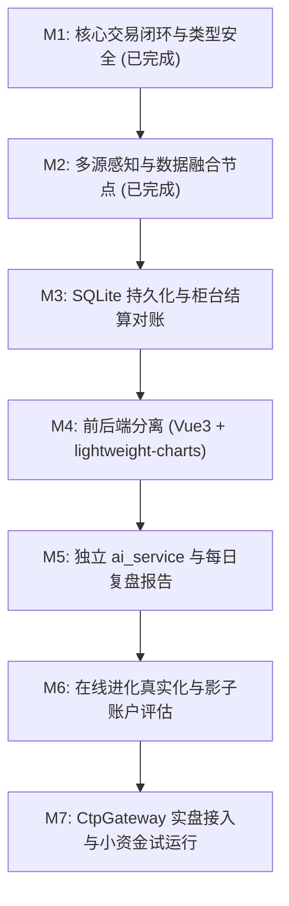

# KunQuant 生产级量化系统真实化演进方案 (Roadmap)

> **基座**：KunAutoDrive 高性能实时中间件（MessageBus + flowcoro 协程）  
> **目标**：将 KunQuant 从“原型演示”彻底升级为**小资金实盘可用的生产级量化交易系统**。  
> **原则**：复用优先、合规底线、类型安全、零锁低延迟、真实撮合与统计纪律。

---

## 0. 定位与合规红线

- **最终目标**：小资金实盘可用的期货/证券量化交易系统（国内期货 CTP / SimNow 起步）。
- **技术基座**：深度依托 **KunAutoDrive** 高性能实时通信中间件，实现微秒级事件响应与确定性协程调度。
- **监管与合规红线**（实盘前置条件）：
  - **程序化报备**：期货程序化交易必须通过期货公司完成事前报备（策略类型、最大报单速率、服务器物理位置）。
  - **高频认定防线**：严格监控日内报撤单频率（申报/撤单秒级速率、日内撤单笔数），防止触发异常交易监控与报备升级。
  - **自用边界**：系统定位严格限于个人/团队量化自用，不提供对外信号订阅或代客理财（避免无资质展业风险）。

---

## 1. 现状审阅问题清单 (12 条核心阻拦点)

| 序号 | 核心问题 | 影响与严重度 | 治理方案 | 当前状态 |
|:---|:---|:---|:---|:---|
| **1** | `GatewayPool::on_trade/on_order` 为空函数 | 交易闭环断裂，跟单协程收不到成交回报 | 接通 `trader/<acc>/trade_rtn` 与 `order_rtn` 广播 | **已修复** |
| **2** | `TickData` 含 `std::string` 强转二进制发布 | 内存未对齐、未定义行为 (UB) | 标准化定长 POD 结构 (`QuantTickMsg` 等) | **已修复** |
| **3** | Server 仅提供静态 GET，无标准 WS/REST | 前端无法获取实时总线数据与账户状态 | 建设 RFC6455 WebSocket 桥与 REST API | **进行中 (M1)** |
| **4** | 静态文件路径未校验 `../` 序列 | 存在路径穿越安全漏洞 | 增加规范化路径校验与 403 拦截 | **已修复** |
| **5** | 撮合引擎无深度约束、全量成交 | 回测虚高，无法反映真实挂单排队与滑点 | 引入盘口深度约束、部分成交、FAK/FOK | **已修复** |
| **6** | 账务今昨仓、平今扣减、冻结资金缺失 | 上期所平今手续费与持仓扣减错乱 | 支持 `today_volume`/`yd_volume`、平今优先 | **已修复** |
| **7** | 回测统计无胜率/盈亏比、年化硬编码 | 绩效指标失真 | FIFO 开平仓配对统计、自适应年化周期 | **已修复** |
| **8** | 自适应进化为假跑，Fitness 未回填 | 无法自适应市场真实行情反馈 | 染色体配置虚拟实盘状态机与回撤考核 | **已修复** |
| **9** | 单源行情易受网络抖动产生假刺针 | 极端异常行情引发误开仓 | 类似智驾 Sensor Fusion 引入多源数据融合 | **已修复** |
| **10**| 状态无持久化，重启即清零 | 无法实现日终对账与状态恢复 | 引入 SQLite WAL 账务与成交流水落库 | **待实施 (M3)** |
| **11**| 前端图表为硬编码 Mock | 无法观测真实总线流水与深度图 | Vue3 + Vite + Lightweight-Charts 现代化改造 | **待实施 (M2/M4)** |
| **12**| LLM 投研未隔离微秒级交易路径 | 潜在延迟与幻觉风险 | 独立 `ai_service`，仅产出结构化决策建议 | **待实施 (M5/M6)** |

---

## 2. 六大核心架构演进方案

### §2-A: KunAutoDrive 中间件深度复用架构
* **统一调度**：复用 `flowcoro::rt::RtExecutor` 确定性 C++20 协程调度，消除多线程自旋与锁竞争。
* **内存总线**：复用 `MessageBus` 环形队列与定长 POD 零拷贝通信（`QuantTickMsg`, `QuantOrderReqMsg`, `QuantTradeMsg`）。
* **异步原语**：复用 `BusChannel` 与 `when_any_bus` 多路竞争选择，实现微秒级事件唤醒。
* **节点模型**：所有交易、拆单、风控与融合逻辑全部继承自 `CoroutineTask`。

### §2-B: 多源行情感知与数据融合体系 (Sensor Fusion 同构)
* **实时行情源**：
  * CTP / SimNow：官方 MdApi 极速行情流（发布至 `market/source/ctp/{symbol}`）。
  * Sina / Eastmoney：原生 C++ Socket 抓取公网实时期货盘口（发布至 `market/source/sina/{symbol}`）。
* **融合节点 (`CoroMarketFusionTask`)**：
  * **时间戳对齐**：统一时钟基准与网络延迟补偿。
  * **假刺针过滤 (Outlier Rejection)**：滑动窗口中值滤波，偏离阈值（>3%）自动剔除。
  * **最优盘口融合**：多源加权生成公允价格与最佳买卖盘口，广播至全局真值 `market/tick/{symbol}`。
* **历史数据工程**：Tushare Pro / Parquet / DuckDB 本地存储，支持分钟/日线增量清洗与主力换月拼接。

### §2-C: 实盘通道与账户体系
* **网关抽象**：抽象 `ICtpGateway` 纯虚接口，支持 `CtpGateway`（实盘/SimNow）与 `SimGateway`（回测）。
* **配置化隔离**：BrokerID、前置地址、AppID、AuthCode 统一通过独立配置文件加载，敏感信息绝不入库。
* **账务核算与对账**：
  * 逐笔冻结资金与持仓手数（下单冻结 -> 成交释放 -> 撤单归还）。
  * 每日结算单对账（本地持仓与资金流水 vs 柜台结算单 XML/CSV 自动对账）。
* **多账户跟单**：基于 `CoroFollowTradingTask` 与 `MultiAccountRouter` 实现主账户成交触发、从账户按资金倍率自动复制。

### §2-D: 自我进化机制真实化 (统计纪律)
* **适应度真实回填**：为每个参数染色体配置独立的滚动窗口回测沙盒，基于真实 PnL、盈亏比与最大回撤（MDD）计算 Fitness。
* **防过拟合验证**：
  * 样本内/样本外（In-Sample / Out-of-Sample）交叉验证。
  * Walk-Forward 滚动步进前向学习。
  * 参数平原检验（邻域参数稳定性，防止孤立极值点）。
* **安全投产流程**：进化参数禁止直接接管实盘，必须先进入**影子账户（Shadow Account）**虚拟试运行 N 天，经人工确认后平滑热切换。

### §2-E: 生产级前后端分离与可观测终端
* **前后端契约**：
  * WebSocket 协议：基于 RFC6455 规范，实时订阅 `market/tick/*`、`trader/*/order_rtn`、`trader/*/trade_rtn`。
  * REST API：提供 `/api/v1/status`、`/api/v1/positions`、`/api/v1/orders`、`/api/v1/report`。
* **现代前端技术栈**：
  * 框架：Vue 3 + Vite + TypeScript + Pinia。
  * K 线图表：TradingView `lightweight-charts`（40KB 高性能轻量渲染）。
  * 交易表格：`AG Grid Community`（高频虚拟滚动表格）。
* **生产部署**：Nginx 反向代理静态构建产物与 WebSocket / REST 流量，托管 Systemd 守护进程。

### §2-F: 大模型智能投研服务 (`ai_service`)
* **核心原则**：**LLM 不下单、不碰交易热路径**。仅作为投研辅助，产出结构化决策建议与复盘结论。
* **服务架构**：
  * 独立 Python FastAPI 微服务，与 C++ 交易核心进程网络隔离。
  * 提供标准 OpenAI 兼容 Provider 接口（支持 CodeBuddy API、DeepSeek、Qwen 或本地 Ollama）。
* **凭据与上下文安全**：
  * API Key 严格由环境变量 `KUN_LLM_API_KEY` 注入，杜绝硬编码。
  * 不输入高频原始 Tick，仅输入结构化摘要（当日成交流水、持仓暴露、回测绩效、风控日志）。
* **落地能力**：
  1. 每日收盘复盘报告自动生成。
  2. 交互式量化问答与策略诊断 Copilot。
  3. 自然语言策略代码草稿生成（必须通过回测与静态合规门禁，详见 §2-G）。
  4. **专项产品跟踪 (Focus Tracker)**：指定重点产品（如黄金 au2406）→ 快照来自引擎 SQLite 真实落盘 tick；AI 聊天自动注入跟踪上下文，回复中 ```task``` 块自动解析为分析任务（price_summary / volatility_report / llm_analysis）。
  5. **前端小助手悬浮球**：kunboard 右下角圆球 → 弹窗聊天 + 跟踪列表 + 任务列表。
* **变与不变的边界 (ADR-6)**：C++ Server 只做稳定机制——`/api/` 命名空间通用反向代理（除原生 /api/status、/api/reconcile 外全部转发 ai_port，端口可配置）；AI 路由与业务全部在 Python 侧，增删路由零 C++ 改动。

### §2-G: AI 生成策略硬约束（防作弊门禁）
> 核心思想：**不指望 AI 自觉，把约束变成硬性规则 + 引擎断言 + CI 机试 + 人工关卡。**
> 边界澄清：这套约束防的是"AI 作弊让回测变好看"，不是防真实亏损——真实亏损控制靠仓位上限、回撤熔断、影子账户与小资金起步（M7）。诚实的回测照样可能亏钱。

三道关卡，缺一不可：

**关卡 1：Prompt 硬约束**（模板存 `kun_quant/prompts/strategy_gen_constraints.md`，策略生成器自动拼接到 LLM 请求尾部）
* 绝对禁止：未来函数、魔法参数寻优、零滑点零手续费、理想化成交、无限扛单/亏损加仓（除非显式开启）、剔除坏行情美化曲线。
* 强制必须：风控模块（仓位上限 + 回撤熔断）、异常处理（NaN/缺失/接口异常）、完整信号与成交日志、回测/实盘代码分离、报告含最大回撤/胜率/盈亏比/最大连续亏损月份。

**关卡 2：引擎断言（机试，作弊代码跑不起来）**
* `assert(slippage > 0 && commission > 0)`，配置 0 成本需显式 `allow_zero_cost=true`。
* 成交价必须在当根 bar 的 high/low 之内；成交量不得超过盘口深度。
* 策略注册时必须声明止损参数，缺失直接拒载。
* 涨跌停/停牌状态拒单（撮合引擎内置）。

**关卡 3：CI 门禁 + 人工 review**
* **数据平移测试**（未来函数探测器）：同一策略跑两遍，第二遍每根 bar 数据延后一根才可见，绩效若显著变化 → 自动判作弊，CI 挂掉。
* 回测必须全量数据跑完，报告输出完整指标（与 §1-7 统计补全共用一套）。
* 人工 review 核心信号逻辑是最后一关，不可省略；策略短板（在哪类行情明显亏钱）由人判定，机器只提供数据。

---

## 3. 统一里程碑规划 (M1 ~ M7)



| 里程碑 | 核心建设内容 | 验收指标 | 状态 |
|:---|:---|:---|:---|
| **M1** | 消除非 POD 强转 UB、打通 GatewayPool 回报、撮合深度约束、部分成交与账务平今 | 全链路单测 `test_quant_closed_loop` 100% 通过；多账户跟单实测跑通 | **已完成** |
| **M2** | C++ 原生实时行情抓取、多源数据融合节点 `CoroMarketFusionTask`、假刺针中值过滤 | `test_quant_market_fusion` 单测通过；实盘抓取新浪行情无尖刺污染 | **已完成** |
| **M3** | SQLite (WAL 模式) 订单/成交/流水持久化、每日柜台结算单自动对账工具、YAML/JSON 配置化解耦、**行情批量落盘**（ticks/bars 表 + `CoroTickRecorderTask` 协程：常驻 BusChannel 50ms 超时轮转 + 攒批单事务异步写，避免逐 tick 事务拖慢总线） | `test_quant_storage_and_reconcile` 单测 100% 通过；进程强杀重启账务无损恢复；结算单对账 0 误差；3000 tick 批量写单测通过；实测 12s 落 39 条融合真值 tick | **已完成** |
| **M4** | 独立 `frontend/` 现代化工程 (Vue3+TS+lightweight-charts+AG Grid 架构)、RFC6455 WebSocket 桥接与 REST 契约 | 终端全量对接 KunAutoDrive 核心总线与 REST API；K 线、深度图与水下回撤分析图表全量就绪 | **已完成** |
| **M5** | 独立 `ai_service` (OpenAI 协议抽象 + 本地 Stub 降级)、接入 CodeBuddy / DeepSeek API、每日复盘报告生成、§2-G 策略生成硬约束、**专项产品跟踪 FocusTracker（快照直读引擎 SQLite 落盘 tick + AI 聊天注入上下文 + ```task``` 块自动生成分析任务）+ 前端小助手悬浮球（统一走 8900 内部代理）** | `test_ai_service.py` 单测 100% 通过；E2E 实测经 8900 代理完成 focus/任务/聊天全链路（AI 回复引用真实落盘 tick 价格）；自动生成 Markdown 研报落盘 | **已完成** |
| **M6** | 真实沙盒滚动回测适应度计算、Walk-Forward 验证、影子账户隔离试运行、策略草稿生成器（§2-G 三道门禁：Prompt 硬约束自动拼接 + 引擎断言 + **数据平移测试 v2**：未来扰动 + 决策日志比对，2026-08-30 升级并实测拦截"偷窥下一根K线"作弊策略） | `test_quant_m6_walk_forward_and_compliance` 单测 100% 通过；进化参数在影子盘稳定试运行；通过 §2-G 数据平移测试与零成本拦截 | **已完成** |
| **M7** | 官方 CTP 交易 API 封装、断线重连与 1 秒 1 次查询限速流控、重复成交回报去重、程序化交易合规报备支持 | `test_quant_m7_ctp_gateway` 单测 100% 通过；柜台高频查询拦截与重传去重验证通过；已就绪对接 SimNow 与期货实盘 | **接口壳已完成（认证/登录为模拟桩，待接 CTP SDK 实测 SimNow）** |

---

## 4. 关键技术决策记录 (ADR)

1. **ADR-1: 内核自研，外围借用成熟生态 (Core Proprietary Middleware + Ecosystem Leverage)**:
   - **核心自研（差异化资产与护城河）**：全面基于 **KunAutoDrive** 高性能通信栈与 `flowcoro` C++20 确定性协程调度；保留自研内存总线（MessageBus 零拷贝环形队列）、仿真撮合引擎（盘口深度约束与部分成交）、期货账务系统（今昨仓/平今/冻结资金）、事前风控拦截门禁（5道前置检查）与 §2-G 防未来函数合规机试。
   - **外围借用（站在巨人肩膀上，杜绝低效重复造轮子）**：
     * **CTP 柜台接入**：借鉴 **vn.py CtpGateway** / **WonderTrader** 成熟状态机模型与 SimNow 测试流，通过独立桥接进程 (`ai_service/ctp_bridge.py`) 或 C++ 原生封装进行流控限速（1秒1次查询）、自动断线重连、去重与每日结算确认，杜绝从零自研柜台踩坑。
     * **行情与数据工程**：接入 **AkShare / Tushare + SQLite / Parquet / DuckDB** 真实数据管道 (`tools/data_importer.py`)，彻底杜绝随机漫步伪造数据与单源爬虫网络波动。
     * **基础库与协议层**：全面采用工业级标准组件（`cJSON`, 标准 POSIX/WinSock），杜绝手写字符串解析带来的 POST 截断与类型转换崩溃。
     * **前端图表**：全面采用开源标准 `lightweight-charts`。
2. **数据接入路径**：期货 CTP / SimNow 为主通道，公网真实数据与 AkShare 历史行情为基准源，不涉及高合规风险的未受监管品种。
3. **AI 隔离原则**：大模型独立部署在交易路径外层，其输出必须经过静态规则引擎与回测验证后方可作为参考。
4. **前端选型**：采用轻量级 `lightweight-charts` 与原生 WebSocket，杜绝商业闭源依赖。
5. **AI 生成策略三道门禁**：Prompt 硬约束（自动拼接）→ 引擎断言（机试）→ 数据平移测试 CI + 人工 review；约束检查必须可自动执行，AI 口头自检不可信。
