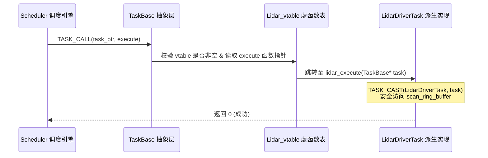

# 第 01 章：用 C 造一个对象

调度器手里只有一串 `TaskBase*`，它得挨个喊一声「该你了」。可每个任务被喊到时
要做的事都不一样：激光雷达要去串口读一圈点云，规划器要算一条轨迹。同一句呼喊
落到不同的对象身上，行为不同——这就是多态。

在 C++ 里，这件事三行代码就写完了。但前面说过，底座是纯 C11。于是问题变成：
**在 C 里，怎么造对象？**

---

## 你会先想到的两个答案

如果让你来拍板，大概会在这两条路里挑一条：

- **直接用 C++ 类**。语法舒服，代价是庞大的标准库依赖、名称修饰（name mangling）
  带来的 ABI 不稳定，以及异常栈展开这种耗时不确定的东西。想把它透明地绑给
  Rust 或 Python 更麻烦。
- **老老实实写 C**。轻、快，但没有抽象的话，模块一多就会退化成一地全局变量和裸指针。

KunAutoDrive 两条都用了：底座是 **C11 微内核抽象**，外壳是 **C++20 FlowCoro 协程**。
C 这一半之所以撑得住，是因为它把 OOP 的三种用法用 C 原样还了一遍，换来下面四个好处：

```
┌────────────────────────────────────────────────────────────────┐
│             KunAutoDrive C-OOP 核心价值                        │
├───────────────────┬────────────────────────────────────────────┤
│ 1. 内存布局完全透明 │ 每一字节的 offsetof 清晰可见，无隐藏开销 │
│ 2. 零成本抽象       │ 虚函数调用仅一次间接寻址，无虚表多重跳跃 │
│ 3. 稳固的 C ABI     │ 动态库插件热插拔无需担心编译器符号粉碎   │
│ 4. 极致的实时性     │ 杜绝 C++ RTTI 与异常栈展开的不可控开销   │
└───────────────────┴────────────────────────────────────────────┘
```

---

## 这条路能走通，靠的是 C 标准里的一条规定

在 C 里模拟继承，最容易出事的就是指针转型。而 C 标准恰好在这里给了一条明确的规定。

### 标准原文（ISO/IEC 9899:2011 §6.7.2.1）

> *"A pointer to a structure object, suitably converted, points to its initial member. There may be unnamed padding within a structure object, but not at its beginning."*
> 
> **译文**：指向结构体对象的指针，经过适当转换后，恰好指向其初始成员。结构体内部可能存在未命名的填充字节（Padding），但**绝不会出现在结构体的开头**。

换句话说：**只要把基类放在派生类的第一个成员位置，这两个指针的数值就永远相等**，转型不需要任何计算。

```
派生类 (NetworkTask) 内存布局：
┌───────────────────────────────────────────────────────────────────────────────┐
│ 0x1000: [基类 TaskBase 首成员]                                                │
│         ├── config: TaskConfig (name, priority, cpu_affinity...)              │
│         ├── state: TaskState (RUNNING, STOPPED...)                            │
│         ├── stats: TaskStats (runtime, error_count...)                        │
│         ├── mutex: pthread_mutex_t                                            │
│         ├── sm: ReflectiveStateMachine                                        │
│         └── vtable: const TaskInterface* ───► [指向全局只读段虚函数表]        │
├───────────────────────────────────────────────────────────────────────────────┤
│ 0x10A0: [派生类特有成员]                                                      │
│         ├── port: int                                                         │
│         ├── listen_fd: int                                                    │
│         └── rx_buffer: char[4096]                                             │
└───────────────────────────────────────────────────────────────────────────────┘
▲
└── (TaskBase*)ptr == (NetworkTask*)ptr == 0x1000 （指针转换零计算、零偏移）
```

---

## 三个特性，一个接一个落地

### 封装：数据放结构体，行为放函数指针表

数据继续躺在结构体里，接口则单独抽成一组函数指针。先看任务的配置与状态：

```c
/* include/task_interface.h */

// 1. 任务基础状态与统计数据封装
typedef enum {
    TASK_STATE_UNKNOWN = 0,
    TASK_STATE_INITIALIZED,
    TASK_STATE_RUNNING,
    TASK_STATE_STOPPING,
    TASK_STATE_STOPPED,
    TASK_STATE_ERROR
} TaskState;

typedef struct {
    char        name[64];
    TaskPriority priority;
    uint64_t    cpu_affinity_mask;  // CPU 亲和性掩码
    double      max_frequency_hz;   // 频率限制
} TaskConfig;
```

### 多态：一张函数指针表

会被子类重写的行为，统一声明在 `TaskInterface` 里。子类不实现的，就留 `NULL`：

```c
/* include/task_interface.h */

typedef struct TaskInterface {
    int  (*initialize)  (TaskBase* task);                    // 纯虚函数：任务初始化
    int  (*execute)     (TaskBase* task);                    // 纯虚函数：主执行步进
    int  (*cleanup)     (TaskBase* task);                    // 纯虚函数：资源释放
    bool (*health_check)(TaskBase* task);                    // 虚函数：健康检查
    void (*on_message)  (TaskBase* task, const void* msg);    // 虚函数：事件响应
} TaskInterface;
```

### 继承：把基类嵌进第一个成员

派生结构体把 `TaskBase` 整体嵌进来，就同时拿到了配置、状态机、锁和虚表指针：

```c
/* 任务基类定义 */
typedef struct TaskBase {
    TaskConfig                  config;
    TaskState                   state;
    TaskStats                   stats;
    pthread_mutex_t             mutex;
    bool                        should_stop;
    const struct TaskInterface* vtable;      // 虚函数表指针
    ReflectiveStateMachine      sm;          // 反射式状态机
    bool                        sm_enabled;
} TaskBase;

/* 派生业务类：激光雷达驱动任务 */
typedef struct {
    TaskBase base;              // 【铁律】必须是第一个成员！
    int      device_fd;
    uint32_t baud_rate;
    uint8_t  scan_ring_buffer[65536];
} LidarDriverTask;
```

---

## 别让一个空指针把车开走

最直接的写法是 `task->vtable->method(task)`。问题在于可选方法可以被留成 `NULL`，
而调用一个 `NULL` 就是段错误——在一个每秒要跑几千次的调度循环里，这种崩溃现场
几乎没法查。所以真实代码里不允许直接调，一律走宏：

```c
/* include/task_interface.h */

// 1. 安全调用有返回值的虚函数（未实现时返回默认错误码 -1）
#define TASK_CALL(task, method, ...) \
    (((task) && (task)->vtable && (task)->vtable->method) ? \
     (task)->vtable->method((TaskBase*)(task), ##__VA_ARGS__) : -1)

// 2. 安全调用无返回值的虚函数
#define TASK_CALL_VOID(task, method, ...) \
    do { \
        if ((task) && (task)->vtable && (task)->vtable->method) { \
            (task)->vtable->method((TaskBase*)(task), ##__VA_ARGS__); \
        } \
    } while (0)

// 3. 显式类型向下安全强转（Downcast）
#define TASK_CAST(DerivedType, base_ptr) ((DerivedType*)(base_ptr))
```

### 一次调用到底发生了什么



---

## 动手写一个自己的任务

规范说完了，写一个出来最快。下面是一个最小的传感器采集任务，一共四步：

```c
#include <stdio.h>
#include <stdlib.h>
#include "task_interface.h"

/* 1. 定义派生类数据结构 */
typedef struct {
    TaskBase base;          // 继承 TaskBase
    int      packet_count;
    char     sensor_ip[32];
} SensorTask;

/* 2. 实现具体的虚函数方法 */
static int sensor_initialize(TaskBase* base) {
    SensorTask* self = TASK_CAST(SensorTask, base);
    printf("[%s] 初始化网络套接字: %s\n", self->base.config.name, self->sensor_ip);
    self->packet_count = 0;
    return 0;
}

static int sensor_execute(TaskBase* base) {
    SensorTask* self = TASK_CAST(SensorTask, base);
    self->packet_count++;
    if (self->packet_count % 100 == 0) {
        printf("[%s] 累计接收数据包: %d\n", self->base.config.name, self->packet_count);
    }
    return 0;
}

static int sensor_cleanup(TaskBase* base) {
    SensorTask* self = TASK_CAST(SensorTask, base);
    printf("[%s] 释放网络套接字资源...\n", self->base.config.name);
    return 0;
}

static bool sensor_health_check(TaskBase* base) {
    SensorTask* self = TASK_CAST(SensorTask, base);
    return self->packet_count >= 0;
}

/* 3. 构造全局只读虚函数表（放于 .rodata 段） */
static const TaskInterface SENSOR_VTABLE = {
    .initialize   = sensor_initialize,
    .execute      = sensor_execute,
    .cleanup      = sensor_cleanup,
    .health_check = sensor_health_check,
    .on_message   = NULL // 可选虚函数设为 NULL
};

/* 4. 工厂函数：生命周期创建 */
TaskBase* sensor_task_create(const char* name, const char* ip) {
    SensorTask* task = (SensorTask*)calloc(1, sizeof(SensorTask));
    if (!task) return NULL;

    // 初始化基类配置与状态
    TaskConfig cfg = {0};
    snprintf(cfg.name, sizeof(cfg.name), "%s", name);
    cfg.priority = TASK_PRIORITY_HIGH;

    task_base_init(&task->base, &SENSOR_VTABLE, &cfg);
    snprintf(task->sensor_ip, sizeof(task->sensor_ip), "%s", ip);

    return &task->base; // 返回基类指针供调度器统一接管
}
```

---

## 三个真的炸过的地方

### 一、`base` 被挪出了第一个位置
```c
/* 错误示范：编译器会在 offsetof(base) 插入偏移量 */
typedef struct {
    int invalid_padding;
    TaskBase base; // 危险！(TaskBase*)ptr != (MyTask*)ptr
} BadTask;
```
这个错误编译期看不出来。等框架拿着 `base` 去 `free`、或者往下转型时，指针已经偏了；结果是某个随机位置的内存被踩坏，然后在另一个和这个 bug 毫无关系的地方崩掉。

### 二、虚表被放进了可写内存

虚表就是一组固定的函数指针，没有任何理由让它可写。放进 `.rodata` 之后，越界写或者悬空指针就没法悄悄把它改掉：
```c
/* 正确规范 */
static const TaskInterface MY_VTABLE = { ... };

/* 错误规范：每次动态分配虚表，浪费内存且易被非法篡改 */
task->vtable = malloc(sizeof(TaskInterface));
```

### 三、销毁顺序反了

释放的顺序不能反：先让子类自己清理它的资源，再拆基类，最后才把整块内存还回去。
```c
void task_destroy(TaskBase* task) {
    if (!task) return;
    
    // 1. 调用派生类的清理虚函数（关闭句柄、释放私有缓冲区）
    TASK_CALL(task, cleanup);
    
    // 2. 清理基类内部状态（互斥锁、状态机等）
    pthread_mutex_destroy(&task->mutex);
    
    // 3. 释放整块连续内存
    free(task);
}
```

---

## 留给你动手

先是一个不用写代码的问题：如果一个派生类想同时“继承”两个接口——既是个 `Task`，
又是个 `Serializable`——在纯 C 里该怎么设计？可以往 Linux 内核的 `container_of`
和链表节点嵌入那个方向想。

然后是动手的部分：跑一下 `tests/test_modules.c` 里的单元测试，盯住一个任务从
`task_base_init` 到 `TASK_CALL` 走完的整条生命周期。

```bash
./build/bin/unit_tests --filter=task_interface
```

---

下一步就有意思了：这些任务现在还是和主程序编在同一块二进制里。第 02 章要做的，
是把它们一个个变成 `.so`，让进程在跑着的时候把它们换掉。
