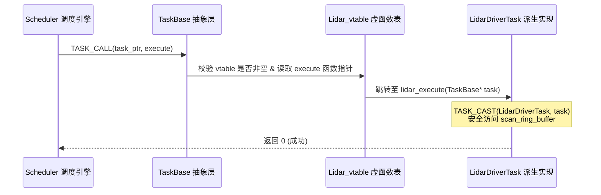

# 第 01 章：C 语言面向对象与微内核架构

> **本章导读**：
> 现代高性能自动驾驶与机器人中间件对**启动延迟、内存占用、实时确定性与 ABI 稳定性**有着严苛的要求。虽然 C++ 提供了原生的面向对象（OOP）机制，但在微内核底座（Microkernel Foundation）与跨语言 FFI 插件边界处，纯 C11 依然是性能最高、最易排错、无隐藏运行时开销（Zero Overhead）的首选语言。
>
> **KunAutoDrive** 采用纯 C11 微内核作为其底层高性能系统基石。本章将深入剖析系统如何仅凭 C11 原生语言特性，优雅且严谨地实现**封装（Encapsulation）、单继承（Single Inheritance）、多态虚表（vtable Dispatch）与运行时生命周期管理**。

---

## 1. 为什么在自动驾驶微内核中选用 C 语言 OOP？

在设计类似 Apollo CyberRT 或 ROS2 的现代中间件底座时，架构师通常面临两难选择：
- **C++ 原生类**：语法便利，但伴随着庞大的标准库依赖、名称修饰（Name Mangling）导致的 ABI 不稳定问题、异常处理（Exception Handling）带来的不确定耗时栈展开，以及难以跨语言（如 Rust / Python / Zig）透明绑定。
- **纯 C 过程式**：虽然轻量高效，但如果缺乏结构化抽象，系统模块膨胀后将沦为全局变量与裸指针的灾难。

KunAutoDrive 采用的策略是：**“C11 微内核抽象底座 + C++20 FlowCoro 协程/规控外壳”**。通过在 C 语言中模拟结构清晰的 OOP 范式，既保留了极高的抽象表达力，又拥有以下核心优势：

```
┌─────────────────────────────────────────────────────────────┐
│             KunAutoDrive C-OOP 核心价值        │
├───────────────────┬─────────────────────────────────────────┤
│ 1. 内存布局完全透明 │ 每一字节的 offsetof 清晰可见，无隐藏开销 │
│ 2. 零成本抽象       │ 虚函数调用仅一次间接寻址，无虚表多重跳跃│
│ 3. 稳固的 C ABI     │ 动态库插件热插拔无需担心编译器符号粉碎  │
│ 4. 极致的实时性     │ 杜绝 C++ RTTI 与异常栈展开的不可控开销  │
└───────────────────┴─────────────────────────────────────────┘
```

---

## 2. 内存布局与 C 标准的形式化保证

C 语言实现安全继承的核心基石，来自于 ISO C 标准对结构体首成员内存地址的硬性规定。

### 2.1 C11 标准保证（ISO/IEC 9899:2011 §6.7.2.1）

> *"A pointer to a structure object, suitably converted, points to its initial member. There may be unnamed padding within a structure object, but not at its beginning."*
> 
> **译文**：指向结构体对象的指针，经过适当转换后，恰好指向其初始成员。结构体内部可能存在未命名的填充字节（Padding），但**绝不会出现在结构体的开头**。

这意味着：**只要将基类（Parent）作为派生类（Child）的第一个成员，派生类指针与基类指针在数值上永远完全相等！**

```
派生类 (NetworkTask) 内存布局：
┌───────────────────────────────────────────────────────────────────────────────┐
│ 0x1000: [基类 TaskBase 首成员]                                                │
│         ├── config: TaskConfig (name, priority, cpu_affinity...)              │
│         ├── state: TaskState (RUNNING, STOPPED...)                            │
│         ├── stats: TaskStats (runtime, error_count...)                        │
│         ├── mutex: pthread_mutex_t                                            │
│         ├── sm: ReflectiveStateMachine                                        │
│         └── vtable: const TaskInterface* ───► [指向全局只读段虚函数表]         │
├───────────────────────────────────────────────────────────────────────────────┤
│ 0x10A0: [派生类特有成员]                                                       │
│         ├── port: int                                                         │
│         ├── listen_fd: int                                                    │
│         └── rx_buffer: char[4096]                                             │
└───────────────────────────────────────────────────────────────────────────────┘
▲
└── (TaskBase*)ptr == (NetworkTask*)ptr == 0x1000 （指针转换零计算、零偏移）
```

---

## 3. 面向对象三大特性的 C11 优雅落地

### 3.1 封装：数据与行为的边界划分

在 KunAutoDrive 中，模块数据被组织在 Typedef Struct 中，而接口规范定义为独立的函数指针集。

```c
/* include/task_interface.h */

// 1. 任务基础状态与统计数据封装
typedef enum {
    TASK_STATE_UNKNOWN = 0,
    TASK_STATE_INITIALIZED,
    TASK_STATE_RUNNING,
    TASK_STATE_STOPPING,
    TASK_STATE_STOPPED,
    TASK_STATE_ERROR
} TaskState;

typedef struct {
    char        name[64];
    TaskPriority priority;
    uint64_t    cpu_affinity_mask;  // CPU 亲和性掩码
    double      max_frequency_hz;   // 频率限制
} TaskConfig;
```

### 3.2 多态：函数指针表（vtable）模拟

KunAutoDrive 将所有可被子类重写的行为统一声明在 `TaskInterface` 虚函数表中：

```c
/* include/task_interface.h */

typedef struct TaskInterface {
    int  (*initialize)  (TaskBase* task);                    // 纯虚函数：任务初始化
    int  (*execute)     (TaskBase* task);                    // 纯虚函数：主执行步进
    int  (*cleanup)     (TaskBase* task);                    // 纯虚函数：资源释放
    bool (*health_check)(TaskBase* task);                    // 虚函数：健康检查
    void (*on_message)  (TaskBase* task, const void* msg);    // 虚函数：事件响应
} TaskInterface;
```

### 3.3 继承：结构体内联嵌入

通过内联嵌入 `TaskBase`，派生结构体不仅全量继承了基类的属性（配置、状态机、锁），还自动获得了虚表指针：

```c
/* 任务基类定义 */
typedef struct TaskBase {
    TaskConfig                  config;
    TaskState                   state;
    TaskStats                   stats;
    pthread_mutex_t             mutex;
    bool                        should_stop;
    const struct TaskInterface* vtable;      // 虚函数表指针
    ReflectiveStateMachine      sm;          // 反射式状态机
    bool                        sm_enabled;
} TaskBase;

/* 派生业务类：激光雷达驱动任务 */
typedef struct {
    TaskBase base;              // 【铁律】必须是第一个成员！
    int      device_fd;
    uint32_t baud_rate;
    uint8_t  scan_ring_buffer[65536];
} LidarDriverTask;
```

---

## 4. 虚函数多态分发机制与便利宏

直接调用 `task->vtable->method(task)` 虽然直观，但若子类未实现某个可选方法（指针为 `NULL`）会导致段错误（Segfault）。KunAutoDrive 封装了高效且安全的调用宏：

```c
/* include/task_interface.h */

// 1. 安全调用有返回值的虚函数（未实现时返回默认错误码 -1）
#define TASK_CALL(task, method, ...) \
    (((task) && (task)->vtable && (task)->vtable->method) ? \
     (task)->vtable->method((TaskBase*)(task), ##__VA_ARGS__) : -1)

// 2. 安全调用无返回值的虚函数
#define TASK_CALL_VOID(task, method, ...) \
    do { \
        if ((task) && (task)->vtable && (task)->vtable->method) { \
            (task)->vtable->method((TaskBase*)(task), ##__VA_ARGS__); \
        } \
    } while (0)

// 3. 显式类型向下安全强转（Downcast）
#define TASK_CAST(DerivedType, base_ptr) ((DerivedType*)(base_ptr))
```

### 运行时多态调用时序：



---

## 5. 真实工程实战：编写一个派生插件任务

以下演示如何基于 KunAutoDrive C-OOP 规范，从零实现一个自定义传感器采集任务。

```c
#include <stdio.h>
#include <stdlib.h>
#include "task_interface.h"

/* 1. 定义派生类数据结构 */
typedef struct {
    TaskBase base;          // 继承 TaskBase
    int      packet_count;
    char     sensor_ip[32];
} SensorTask;

/* 2. 实现具体的虚函数方法 */
static int sensor_initialize(TaskBase* base) {
    SensorTask* self = TASK_CAST(SensorTask, base);
    printf("[%s] 初始化网络套接字: %s\n", self->base.config.name, self->sensor_ip);
    self->packet_count = 0;
    return 0;
}

static int sensor_execute(TaskBase* base) {
    SensorTask* self = TASK_CAST(SensorTask, base);
    self->packet_count++;
    if (self->packet_count % 100 == 0) {
        printf("[%s] 累计接收数据包: %d\n", self->base.config.name, self->packet_count);
    }
    return 0;
}

static int sensor_cleanup(TaskBase* base) {
    SensorTask* self = TASK_CAST(SensorTask, base);
    printf("[%s] 释放网络套接字资源...\n", self->base.config.name);
    return 0;
}

static bool sensor_health_check(TaskBase* base) {
    SensorTask* self = TASK_CAST(SensorTask, base);
    return self->packet_count >= 0;
}

/* 3. 构造全局只读虚函数表（放于 .rodata 段） */
static const TaskInterface SENSOR_VTABLE = {
    .initialize   = sensor_initialize,
    .execute      = sensor_execute,
    .cleanup      = sensor_cleanup,
    .health_check = sensor_health_check,
    .on_message   = NULL // 可选虚函数设为 NULL
};

/* 4. 工厂函数：生命周期创建 */
TaskBase* sensor_task_create(const char* name, const char* ip) {
    SensorTask* task = (SensorTask*)calloc(1, sizeof(SensorTask));
    if (!task) return NULL;

    // 初始化基类配置与状态
    TaskConfig cfg = {0};
    snprintf(cfg.name, sizeof(cfg.name), "%s", name);
    cfg.priority = TASK_PRIORITY_HIGH;

    task_base_init(&task->base, &SENSOR_VTABLE, &cfg);
    snprintf(task->sensor_ip, sizeof(task->sensor_ip), "%s", ip);

    return &task->base; // 返回基类指针供调度器统一接管
}
```

---

## 6. 工业级避坑指南与最佳实践

### 避坑 1：绝对禁止让 `TaskBase` 偏离首成员
```c
/* 错误示范：编译器会在 offsetof(base) 插入偏移量 */
typedef struct {
    int invalid_padding;
    TaskBase base; // 危险！(TaskBase*)ptr != (MyTask*)ptr
} BadTask;
```
如果 `base` 不是首成员，当框架调用 `free(base)` 或向下转型时，指针值偏移将直接引发内存破坏（Memory Corruption）与段错误。

### 避坑 2：虚表必须声明为 `static const`
虚函数表包含一组固定的函数指针，应该存放在程序的只读数据段（`.rodata`），避免在运行时被意外修改造成安全漏洞或悬挂指针：
```c
/* 正确规范 */
static const TaskInterface MY_VTABLE = { ... };

/* 错误规范：每次动态分配虚表，浪费内存且易被非法篡改 */
task->vtable = malloc(sizeof(TaskInterface));
```

### 避坑 3：多态析构链条与内存释放顺序
当释放一个对象时，必须**先调用虚函数析构器释放子类资源，最后再释放对象自身内存**：
```c
void task_destroy(TaskBase* task) {
    if (!task) return;
    
    // 1. 调用派生类的清理虚函数（关闭句柄、释放私有缓冲区）
    TASK_CALL(task, cleanup);
    
    // 2. 清理基类内部状态（互斥锁、状态机等）
    pthread_mutex_destroy(&task->mutex);
    
    // 3. 释放整块连续内存
    free(task);
}
```

---

## 7. 思考题与实战验证

1. **思考题**：如果一个派生类需要“继承”多个接口（例如既是 `Task`，又是 `Serializable`），在纯 C 语言中应如何设计？（*提示：参考 Linux 内核 `container_of` 宏与链表节点嵌入机制*）。
2. **动手实验**：运行 `tests/test_modules.c` 中的单元测试，观察任务从 `task_base_init` 到 `TASK_CALL` 的完整执行生命周期：
   ```bash
   ./build/bin/unit_tests --filter=task_interface
   ```

---

*下一章预告：第 02 章将深入探讨 KunAutoDrive 如何将这些 C-OOP 任务封装为动态链接库（`.so`），并通过 `dlopen` 与微内核插件体系实现零停机热插拔。*
