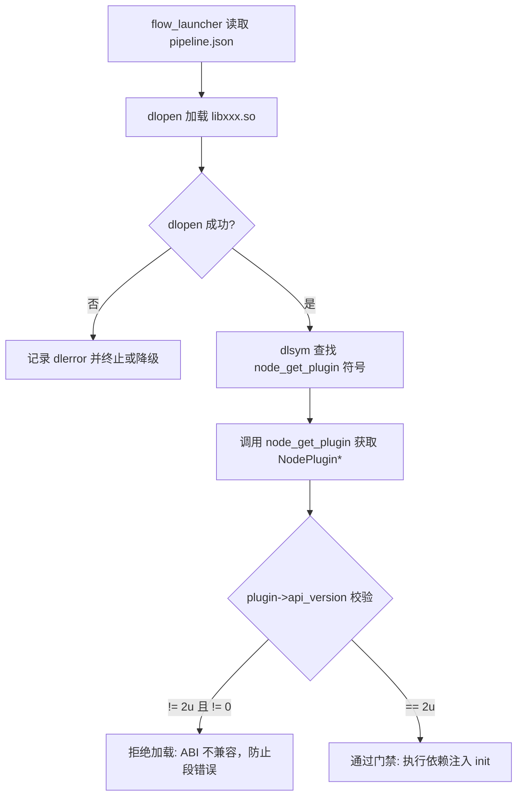
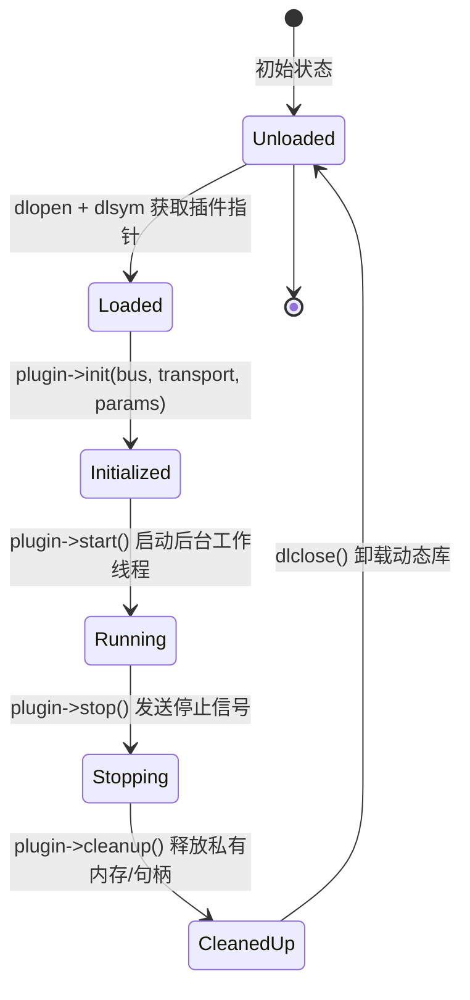

# 第 02 章：把节点拆成一块块可插拔的 .so

最省事的写法是把感知、规划、控制全塞进一个 `main.c`，编出一个大二进制。代价在于：改一个
滤波器的参数要重编整个工程，两个模块碰巧定义了同名的全局符号时链接器也未必提醒你，
问题往往拖到运行时才以最难查的方式冒出来。

这一章要回答的是，能不能让每个节点各自编成独立的 `.so`，由宿主按配置动态加载、拼装成
一台完整的车，并且保证不同版本的库凑在一起也不会把彼此的内存搅乱。顺着这个问题往下
拆，会依次碰到插件契约、ABI 门禁、依赖注入和 `dlopen` 的加载标志。

## 从单体巨石到配置驱动插件

左边是传统单体写法的样子：一个 `main.c` 里挂着全局变量，再把各个算法头文件 `#include`
进来。它的毛病都写在图里了——改一处就得整体重编，全局状态彼此交织，单测几乎无从下手。

右边是 KunAutoDrive 的做法。`flow_launcher` 读 `config/pipeline.json`，把每个节点
`dlopen` 进同一个进程，同时把总线、QoS 等设施注入进去。节点自己不持有全局设施，于是可以
独立编译、独立测试，也能在运行时被替换掉。

```
传统单体架构 (Monolith):
┌──────────────────────────────────────────────────────────┐
│  main.c ──► 全局 g_bus / g_transport                     │
│             ├── #include "perception.h"                  │
│             ├── #include "planning.h"                    │
│             └── #include "control.h"                     │
│缺陷：改一个算法重新编译整个项目；全局变量交织导致难以单测│
└──────────────────────────────────────────────────────────┘

KunAutoDrive 插件化微内核架构 (Microkernel + Plugins):
┌──────────────────────────────────────────────────────────┐
│  flow_launcher (配置驱动微内核宿主)                      │
│    │  读取 config/pipeline.json                          │
│    ├──► dlopen("libperception_node.so") ──► 注入 Bus/QoS │
│    ├──► dlopen("libplanning_node.so")   ──► 注入 Bus/QoS │
│    └──► dlopen("libcontrol_node.so")    ──► 注入 Bus/QoS │
│  优势：节点零全局变量、独立编译测试、算法插件热替换      │
└──────────────────────────────────────────────────────────┘
```

## 插件契约：NodePlugin 与 ABI 门禁

光能加载还不够，宿主还得在一个陌生的 `.so` 面前保持安全。为此 KunAutoDrive 约定了标准
结构体 `NodePlugin`，再加一枚 ABI 版本校验宏。

### NodePlugin 里有哪些字段

```c
/* include/node_plugin.h */

#define NODE_PLUGIN_API_VERSION 2u

typedef struct NodePlugin {
    /* ── 1. ABI 版本号（必须是首字段，供宿主校验） ── */
    uint32_t     api_version;    /**< 必须置为 NODE_PLUGIN_API_VERSION */

    /* ── 2. 元数据描述 ── */
    const char*  name;           /**< 节点名 (如 "fusion") */
    const char*  version;        /**< 语义版本号 (如 "1.2.0") */
    const char*  description;    /**< 节点功能描述 */
    const char** input_topics;   /**< 订阅的 topic 列表，以 NULL 结尾 */
    const char** output_topics;  /**< 发布的 topic 列表，以 NULL 结尾 */

    /* ── 3. 核心生命周期钩子（Lifecycle Hooks） ── */
    int  (*init)(MessageBus* bus, Transport* transport,
                 DiscoveryManager* discovery, Scheduler* scheduler,
                 const char* params_json);
    int  (*start)(void);
    void (*stop)(void);
    void (*cleanup)(void);

    /* ── 4. 托管任务接口 (v2 新增) ── */
    TaskBase* taskbase;
} NodePlugin;

// 每一个插件 .so 必须导出的唯一核心入口函数
NodePlugin* node_get_plugin(void);
```

结构体前半部分是元数据，后半部分是四个生命周期钩子。注意 `api_version` 被刻意摆在了
第一个字段，原因下面单独讲。

### 为什么 api_version 必须放在第一个字段

`flow_launcher` 加载一个 `.so` 时，并不知道它是用哪个版本的 SDK 编出来的。把 `api_version`
放在结构体偏移量 `0`（`offsetof == 0`）处，宿主就能在碰任何复杂字段之前，先读前 4 个字节
做一次门禁判断：



## 宿主把依赖「喂」给插件，而不是让插件自己去拿

插件内部不许出现全局设施，比如 `extern MessageBus g_bus` 这种写法。总线、传输、发现、
调度器都在 `init()` 阶段由宿主统一注入：

```c
/* 节点插件初始化签名 */
int node_init(MessageBus* bus, 
              Transport* transport,
              DiscoveryManager* discovery, 
              Scheduler* scheduler,
              const char* params_json);
```

这么设计换来两件事。一是单测变干净了：不必起一个完整进程，在测试文件里造一个
`MockMessageBus` 传给 `init()`，就能把算法逻辑单独隔离出来跑。二是同一份 `.so` 可以在
一个进程里加载成多个实例，各自持有自己的参数和状态，比如前后两个毫米波雷达处理节点
同时运行。

## 一个插件的五个生命阶段

每个插件都由 `flow_launcher` 统一管理，中间会经过下面这几个状态：



展开说，`init()` 阶段解析 `params_json`，向 `MessageBus` 注册订阅者和发布者，分配本地
内存池；`start()` 阶段拉起后台 Worker 线程，或者把协程注册到 `Scheduler`，进入事件循环；
`stop()` 阶段置 `should_stop = true`，唤醒阻塞的条件变量，再 `pthread_join` 等 Worker
退出；`cleanup()` 阶段销毁互斥锁、关掉硬件或网络套接字的文件描述符、释放堆内存；最后
`dlclose()` 卸掉代码段。

这里有个容易忽略的顺序问题：`dlclose` 必须在插件对象彻底销毁之后再调用，否则会直接
SIGSEGV。

## dlopen 的加载标志怎么选

调用 POSIX 的 `dlopen` 时，标志位选错，问题会推迟到运行时才爆出来：

```c
void* handle = dlopen(so_path, RTLD_NOW | RTLD_LOCAL);
```

`RTLD_NOW` 要求加载那一刻就把所有未决符号解析完。缺了东西（比如漏链数学库 `libm`），
`dlopen` 会当场报错，而不是等你跑到某条关键路径上才因为找不到符号而崩溃。

`RTLD_LOCAL` 管的是符号可见性：本插件导出的内部符号（例如辅助函数 `calc_crc()`）对其他
动态库不可见。如果换成 `RTLD_GLOBAL`，`planning_node.so` 和 `perception_node.so` 各自
实现了一个不同版本的同名内部函数时，后加载的插件符号会被先加载的静默覆盖，最后表现成
极难排查的内存越界和逻辑错乱。

## 从零写一个 ADAS 插件节点

下面这个示例节点把前面讲的契约完整走了一遍：

```c
/* modules/adas_nodes/example_filter_node.c */

#include <stdio.h>
#include <stdlib.h>
#include <string.h>
#include "node_plugin.h"
#include "message_bus.h"
#include "logger.h"

// 节点私有上下文数据
typedef struct {
    MessageBus* bus;
    Transport*  transport;
    int         cutoff_freq;
    bool        running;
} FilterContext;

static FilterContext g_ctx;

// 订阅消息回调
static void on_sensor_data(const char* topic, const void* msg, size_t size, void* user_data) {
    FilterContext* ctx = (FilterContext*)user_data;
    if (!ctx->running) return;
    
    // 执行滤波算法并重新发布
    // transport_publish(ctx->transport, "filtered/sensor", msg, size);
}

static int filter_init(MessageBus* bus, Transport* transport,
                       DiscoveryManager* discovery, Scheduler* scheduler,
                       const char* params_json) {
    (void)discovery; (void)scheduler;
    memset(&g_ctx, 0, sizeof(g_ctx));
    g_ctx.bus = bus;
    g_ctx.transport = transport;
    g_ctx.cutoff_freq = 50; // 默认截止频率

    LOG_INFO("FilterNode", "初始化完成, 参数: %s", params_json ? params_json : "{}");
    
    // 注册订阅
    message_bus_subscribe(bus, "raw/sensor", on_sensor_data, &g_ctx);
    return 0;
}

static int filter_start(void) {
    g_ctx.running = true;
    LOG_INFO("FilterNode", "节点开始运行");
    return 0;
}

static void filter_stop(void) {
    g_ctx.running = false;
    LOG_INFO("FilterNode", "节点停止运行");
}

static void filter_cleanup(void) {
    LOG_INFO("FilterNode", "资源释放完毕");
}

// 定义输入输出 Topic 清单
static const char* INPUTS[]  = { "raw/sensor", NULL };
static const char* OUTPUTS[] = { "filtered/sensor", NULL };

// 构造插件全局导出描述符
static NodePlugin g_plugin = {
    .api_version   = NODE_PLUGIN_API_VERSION,
    .name          = "example_filter",
    .version       = "1.0.0",
    .description   = "低通滤波示例插件",
    .input_topics  = INPUTS,
    .output_topics = OUTPUTS,
    .init          = filter_init,
    .start         = filter_start,
    .stop          = filter_stop,
    .cleanup       = filter_cleanup,
    .taskbase      = NULL
};

      "plugin_path": "lib/flowengine/plugins/my_plugin.so",
      "priority": "NORMAL",
      "auto_restart": true,
      "max_restart_count": 3,
      "depends_on": []
    }
  ]
}
```

写这类节点时有两条经验值得记住：插件内部的辅助函数一律加 `static`，别让它们污染主进程
的命名空间；`dlopen` 和 `dlsym` 之后都要检查 `dlerror()`，不要假设一定成功。

## 依赖排序与循环依赖

框架启动时会对 `depends_on` 字段做一次拓扑排序，保证被依赖的服务先起来：

```
A → B → C      启动顺序：A, B, C
     ↘ D       启动顺序：A, B, C 和 D（B 的两个依赖并行可行）
```

一旦检测到循环依赖，就直接报错退出，而不是带着一个有环的启动顺序硬往下跑。

## 参考文件

- `src/core/process_manager.c` — dlopen 加载与管理逻辑
- `src/launcher.c` — 主启动器，读取配置并依次加载插件
- `src/plugins/example_process.c` — 最简进程插件示例
- `cmake/config.json.in` — 配置文件模板
