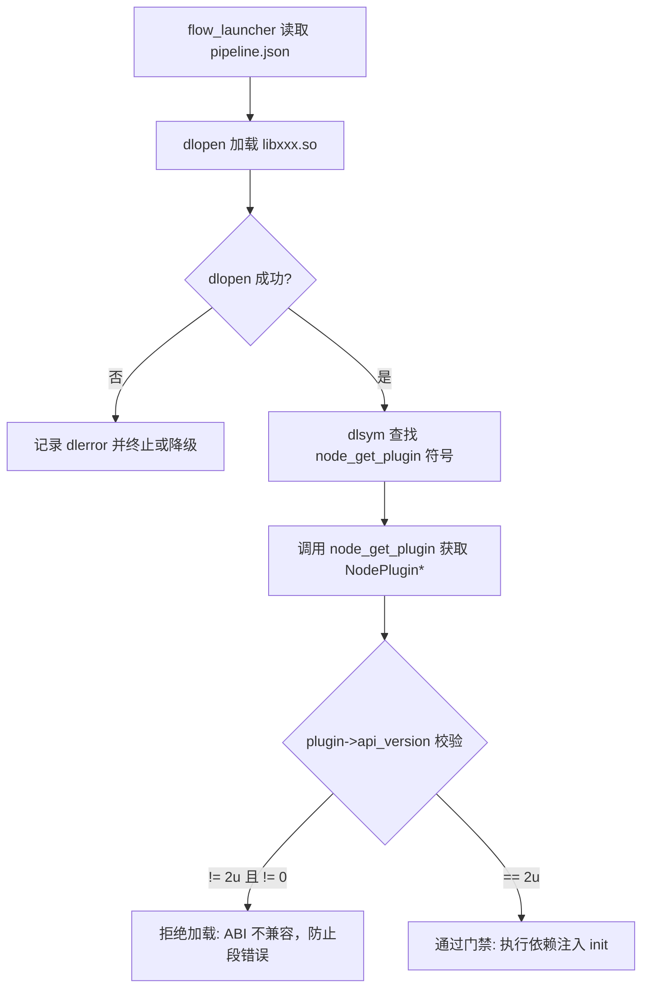
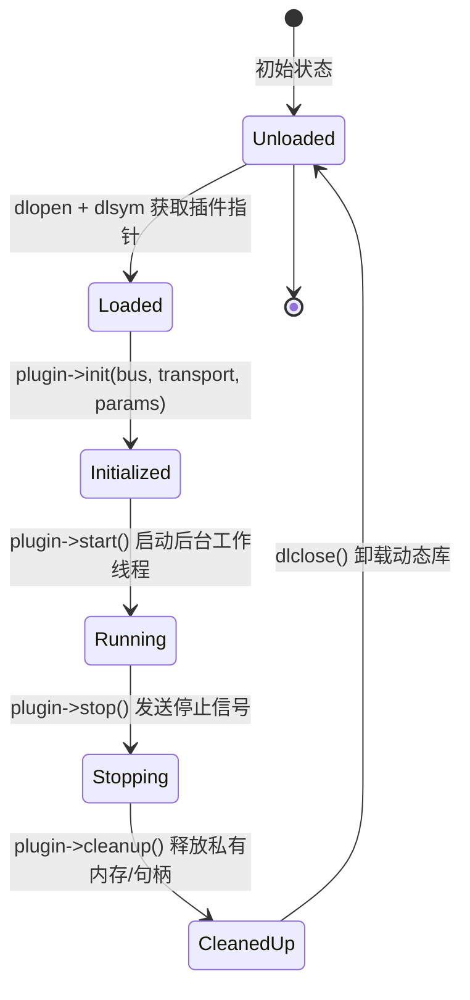

# 第 02 章：dlopen 插件化系统与微内核解耦

> **本章导读**：
> 在自动驾驶系统中，感知、规划、控制等算法模块迭代极为频繁。如果采用传统的“单一大二进制（Monolithic Binary）”编译方式，任何一个节点的参数微调或代码修改都需要全量重新编译，不仅构建耗时，而且极易导致符号冲突与全局状态污染。
>
> FlowEngine 采用基于 `dlopen` 的**微内核插件化（Plugin Architecture）**设计。每个 ADAS 节点（如 `planning_node.so`、`fusion_node.so`）均作为独立共享库动态加载，通过显式**依赖注入（Dependency Injection）**与 **ABI 版本契约门禁**，实现极高的模块解耦与热插拔能力。

---

## 1. 架构演进：从单体巨石到配置驱动插件

```
传统单体架构 (Monolith):
┌──────────────────────────────────────────────────────────┐
│  main.c ──► 全局 g_bus / g_transport                      │
│             ├── #include "perception.h"                  │
│             ├── #include "planning.h"                    │
│             └── #include "control.h"                     │
│  缺陷：改一个算法重新编译整个项目；全局变量交织导致难以单测 │
└──────────────────────────────────────────────────────────┘

FlowEngine 插件化微内核架构 (Microkernel + Plugins):
┌──────────────────────────────────────────────────────────┐
│  flow_launcher (配置驱动微内核宿主)                       │
│    │  读取 config/pipeline.json                          │
│    ├──► dlopen("libperception_node.so") ──► 注入 Bus/QoS │
│    ├──► dlopen("libplanning_node.so")   ──► 注入 Bus/QoS │
│    └──► dlopen("libcontrol_node.so")    ──► 注入 Bus/QoS │
│  优势：节点零全局变量、独立编译测试、算法插件热替换        │
└──────────────────────────────────────────────────────────┘
```

---

## 2. 插件契约与 ABI 门禁机制

为了保证动态加载的安全性，FlowEngine 定义了标准结构体 `NodePlugin` 与 ABI 校验宏。

### 2.1 节点描述符定义（include/node_plugin.h）

```c
/* include/node_plugin.h */

#define NODE_PLUGIN_API_VERSION 2u

typedef struct NodePlugin {
    /* ── 1. ABI 版本号（必须是首字段，供宿主校验） ── */
    uint32_t     api_version;    /**< 必须置为 NODE_PLUGIN_API_VERSION */

    /* ── 2. 元数据描述 ── */
    const char*  name;           /**< 节点名 (如 "fusion") */
    const char*  version;        /**< 语义版本号 (如 "1.2.0") */
    const char*  description;    /**< 节点功能描述 */
    const char** input_topics;   /**< 订阅的 topic 列表，以 NULL 结尾 */
    const char** output_topics;  /**< 发布的 topic 列表，以 NULL 结尾 */

    /* ── 3. 核心生命周期钩子（Lifecycle Hooks） ── */
    int  (*init)(MessageBus* bus, Transport* transport,
                 DiscoveryManager* discovery, Scheduler* scheduler,
                 const char* params_json);
    int  (*start)(void);
    void (*stop)(void);
    void (*cleanup)(void);

    /* ── 4. 托管任务接口 (v2 新增) ── */
    TaskBase* taskbase;
} NodePlugin;

// 每一个插件 .so 必须导出的唯一核心入口函数
NodePlugin* node_get_plugin(void);
```

### 2.2 为什么必须首置 `api_version` 字段？

当 `flow_launcher` 加载一个 `.so` 动态库时，它无法预知该库是由哪个版本的 SDK 编译的。通过将 `api_version` 放在结构体偏移量 `0` 处（`offsetof == 0`），宿主可以在解引用其他复杂字段之前，首先读取前 4 字节进行 ABI 门禁检查：



---

## 3. 依赖注入（Dependency Injection）模式

FlowEngine 插件内部**绝对禁止使用全局变量**（如 `extern MessageBus g_bus`）。所有系统基础设施在 `init()` 阶段由宿主统一注入：

```c
/* 节点插件初始化签名 */
int node_init(MessageBus* bus, 
              Transport* transport,
              DiscoveryManager* discovery, 
              Scheduler* scheduler,
              const char* params_json);
```

### 依赖注入带来的巨大收益：
1. **纯净单测**：单元测试无需启动完整进程，只需在测试文件中构造一个 `MockMessageBus` 传给 `init()` 即可隔离测试算法逻辑。
2. **多实例隔离**：同一份 `.so` 可以在同一个进程中加载为不同的实例（例如同时运行前后两个毫米波雷达处理节点），各自持有独立的参数和状态。

---

## 4. 插件全生命周期状态机

每个插件由 `flow_launcher` 统一管理其生命周期，严格遵循以下 5 个状态阶段：



1. **`init()` 阶段**：解析 `params_json` 配置，向 `MessageBus` 注册订阅者与发布者，分配本地内存池。
2. **`start()` 阶段**：创建后台 Worker 线程，或将 Coroutine 协程注册到 `Scheduler`，开始事件循环。
3. **`stop()` 阶段**：设置 `should_stop = true` 标志，唤醒阻塞的条件变量，等待 Worker 线程退出（`pthread_join`）。
4. **`cleanup()` 阶段**：销毁互斥锁、关闭硬件或网络套接字文件描述符，释放所有动态分配的堆内存。
5. **`dlclose()`**：卸载动态库代码段。

---

## 5. 符号隔离与加载标志：为什么首选 `RTLD_LOCAL`？

在调用 POSIX `dlopen` 时，加载标志的选择关乎系统的稳定性：

```c
void* handle = dlopen(so_path, RTLD_NOW | RTLD_LOCAL);
```

- **`RTLD_NOW`**：在加载瞬间立即解析所有未决符号。如果有符号缺失（比如漏链接了数学库 `libm`），在 `dlopen` 时就会明确报错，避免运行到关键代码路径时突然因为找不到符号而崩溃。
- **`RTLD_LOCAL`（极度重要）**：本插件导出的所有内部符号（例如内部辅助函数 `calc_crc()`）对其他动态库**不可见**。
  - *反例危害*：若使用 `RTLD_GLOBAL`，如果 `planning_node.so` 和 `perception_node.so` 各自实现了一个不同版本的同名内部函数，后加载的插件符号会被前者的符号静默覆盖，引发极难排查的内存越界与逻辑错乱。

---

## 6. 实战演练：编写一个标准的 ADAS 插件节点

以下是一个完整符合 FlowEngine 标准的示例节点：

```c
/* modules/adas_nodes/example_filter_node.c */

#include <stdio.h>
#include <stdlib.h>
#include <string.h>
#include "node_plugin.h"
#include "message_bus.h"
#include "logger.h"

// 节点私有上下文数据
typedef struct {
    MessageBus* bus;
    Transport*  transport;
    int         cutoff_freq;
    bool        running;
} FilterContext;

static FilterContext g_ctx;

// 订阅消息回调
static void on_sensor_data(const char* topic, const void* msg, size_t size, void* user_data) {
    FilterContext* ctx = (FilterContext*)user_data;
    if (!ctx->running) return;
    
    // 执行滤波算法并重新发布
    // transport_publish(ctx->transport, "filtered/sensor", msg, size);
}

static int filter_init(MessageBus* bus, Transport* transport,
                       DiscoveryManager* discovery, Scheduler* scheduler,
                       const char* params_json) {
    (void)discovery; (void)scheduler;
    memset(&g_ctx, 0, sizeof(g_ctx));
    g_ctx.bus = bus;
    g_ctx.transport = transport;
    g_ctx.cutoff_freq = 50; // 默认截止频率

    LOG_INFO("FilterNode", "初始化完成, 参数: %s", params_json ? params_json : "{}");
    
    // 注册订阅
    message_bus_subscribe(bus, "raw/sensor", on_sensor_data, &g_ctx);
    return 0;
}

static int filter_start(void) {
    g_ctx.running = true;
    LOG_INFO("FilterNode", "节点开始运行");
    return 0;
}

static void filter_stop(void) {
    g_ctx.running = false;
    LOG_INFO("FilterNode", "节点停止运行");
}

static void filter_cleanup(void) {
    LOG_INFO("FilterNode", "资源释放完毕");
}

// 定义输入输出 Topic 清单
static const char* INPUTS[]  = { "raw/sensor", NULL };
static const char* OUTPUTS[] = { "filtered/sensor", NULL };

// 构造插件全局导出描述符
static NodePlugin g_plugin = {
    .api_version   = NODE_PLUGIN_API_VERSION,
    .name          = "example_filter",
    .version       = "1.0.0",
    .description   = "低通滤波示例插件",
    .input_topics  = INPUTS,
    .output_topics = OUTPUTS,
    .init          = filter_init,
    .start         = filter_start,
    .stop          = filter_stop,
    .cleanup       = filter_cleanup,
    .taskbase      = NULL
};

      "plugin_path": "lib/flowengine/plugins/my_plugin.so",
      "priority": "NORMAL",
      "auto_restart": true,
      "max_restart_count": 3,
      "depends_on": []
    }
  ]
}
```

## 依赖排序（拓扑排序）

框架在启动时对 `depends_on` 字段做拓扑排序，保证依赖服务先启动：

```
A → B → C      启动顺序：A, B, C
     ↘ D       启动顺序：A, B, C 和 D（B 的两个依赖并行可行）
```

若检测到循环依赖则报错退出。

## 注意事项

1. **符号可见性** — 插件内部函数加 `static`，避免符号污染主进程命名空间。
2. **`RTLD_LOCAL`** — 插件符号不对其他插件可见，防止符号冲突。
3. **错误处理** — `dlopen` 和 `dlsym` 后必须检查 `dlerror()`。
4. **生命周期** — `dlclose` 必须在插件对象完全销毁后调用，否则会 SIGSEGV。

## 参考文件

- `src/core/process_manager.c` — dlopen 加载与管理逻辑
- `src/launcher.c` — 主启动器，读取配置并依次加载插件
- `src/plugins/example_process.c` — 最简进程插件示例
- `cmake/config.json.in` — 配置文件模板
