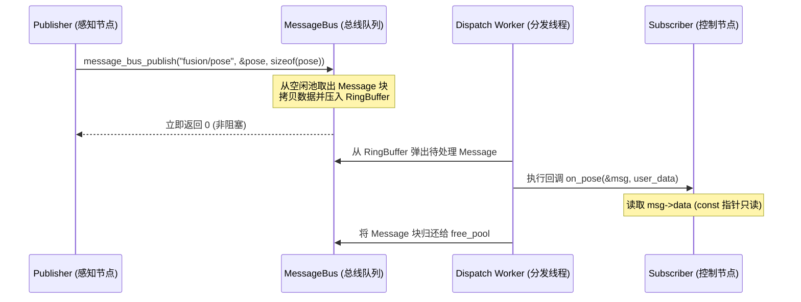

# 第 03 章：高性能进程内消息总线（Message Bus）

> **本章导读**：
> 自动驾驶系统的核心特征是**数据流驱动（Dataflow-Driven）**：激光雷达点云（10Hz/数十KB）、相机图像（30Hz）、GPS/IMU（100Hz）以及规控高频循环（50~100Hz）在同一系统内并发涌流。
>
> FlowEngine 的 `MessageBus` 是整个进程内通信的枢纽。它不仅支持标准的**发布/订阅（Pub/Sub）**与**请求/应答（Req/Reply RPC）**，还内置了**零动态分配内存池、环形缓冲队列、QoS 策略管理以及延迟/频率统计指标**。

---

## 1. 进程内通信架构全景

```
                      ┌──────────────────────────────────────────────────────────┐
                      │                   MessageBus 调度内核                    │
                      │                                                          │
  [发布者线程 A] ───► │  ┌────────────────────────────────────────────────────┐  │
  (lidar_node)        │  │ 环形无锁/互斥缓冲队列 (Ring Buffer Queue, 1024 深度)  │  │
                      │  └─────────────────────────┬──────────────────────────┘  │
  [发布者线程 B] ───► │                            │                             │
  (planning_node)     │                            ▼                             │
                      │             ┌──────────────────────────────┐             │
                      │             │    后台分发工作线程 (Worker)   │             │
                      │             └──────────────┬───────────────┘             │
                      └────────────────────────────┼─────────────────────────────┘
                                                   │ 查路由表 (Topic Entries)
                                 ┌─────────────────┴─────────────────┐
                                 ▼                                   ▼
                      [订阅回调: perception]               [订阅回调: control]
                      (直接指针传递，零拷贝)               (直接指针传递，零拷贝)
```

---

## 2. 核心消息帧结构（Message Frame）

在自动驾驶中，消息不仅包含负载（Payload），还必须附带严格的时空元数据。

```c
/* include/message_bus.h */

#define MSG_BUS_MAX_TOPIC_LEN    64
#define MSG_BUS_MAX_SENDER_LEN   64
#define MSG_BUS_MAX_DATA_SIZE    65536  // 64KB 负载（适配点云与双目深度帧）

typedef struct Message {
    char        topic[MSG_BUS_MAX_TOPIC_LEN];    /**< 话题名称，如 "sensor/lidar" */
    char        sender[MSG_BUS_MAX_SENDER_LEN];  /**< 发送节点名，如 "flowsim" */
    uint32_t    msg_id;                          /**< 单调递增消息序号 */
    MessageType type;                            /**< MSG_TYPE_PUBLISH / REQUEST / REPLY */
    uint64_t    timestamp_us;                    /**< 墙钟微秒时间戳 (CLOCK_MONOTONIC) */
    int32_t     topic_idx;                       /**< 路由加速索引（免去热路径字符串哈希） */
    uint32_t    data_size;                       /**< 有效数据长度 */

    /* ── 类型安全序列化元信息 ── */
    uint32_t    type_id;                         /**< FNV-1a 类型哈希校验码 */
    uint8_t     schema_version;                  /**< Schema 版本 */
    uint8_t     endian_marker;                   /**< 字节序标记 (0x12=LE) */
    uint8_t     _reserved[6];

    /* ── 消息数据载荷 ── */
    uint8_t     data[MSG_BUS_MAX_DATA_SIZE];     /**< 64KB 连续内存 */

    /* ── 内部空闲内存池链表指针 ── */
    struct Message* _pool_next;
} Message;
```

### 2.1 内存池优化：杜绝频繁 `malloc/free`
在 100Hz 高频消息吞吐下，频繁调用操作系统 `malloc(64KB)` 会导致严重的内存碎片和不可控的内核系统调用延迟。
FlowEngine 采用 **Free-List 内存池（Free Message Pool）**：
- 当发布消息时，从 `bus->free_pool` 弹出一个预分配好的 `Message` 块。
- 消费者在分发完成后，将指针重新归还给 `free_pool`。
- **整个生命周期 0 次动态内存分配**。

---

## 3. 发布/订阅（Pub/Sub）模式深入剖析

### 3.1 订阅者注册与匹配机制
订阅者向 `MessageBus` 注册回调函数与用户上下文指针：

```c
typedef void (*MessageCallback)(const Message* msg, void* user_data);

int message_bus_subscribe(MessageBus* bus, 
                          const char* topic, 
                          MessageCallback callback, 
                          void* user_data);
```

### 3.2 异步发布与分发时序


---

## 4. 同步请求/回复（Request/Reply RPC）模式

除 Pub/Sub 外，自动驾驶中某些操作（如状态机模式切换、参数查询、急停触发）需要同步确认（RPC）。

```c
/* 客户端发起同步请求（带超时机制） */
Message reply;
int ret = message_bus_request(bus, 
                              "service/mode_switch", 
                              "client_node",
                              &req_data, sizeof(req_data), 
                              &reply, 
                              1000 /* 超时 1000ms */);
if (ret == 0) {
    printf("RPC 成功响应, 数据大小: %u\n", reply.data_size);
} else {
    printf("RPC 超时或失败: %d\n", ret);
}
```

### RPC 底层实现原理：
1. 客户端生成唯一的 `msg_id`，在内部注册一个基于 `pthread_cond_t` 的等待句柄；
2. 服务端通过 `message_bus_register_service()` 处理请求，并返回回复消息；
3. 总线收到 `MSG_TYPE_REPLY` 时，通过 `msg_id` 命中等待句柄并调用 `pthread_cond_signal` 唤醒客户端。

---

## 5. QoS 服务质量与丢弃策略

在真实传感器涌流中，若下游处理较慢（如复杂的点云聚类耗时 80ms，而传感器以 20ms 周期输入），队列势必堆积。FlowEngine 支持针对单个 Topic 配置 QoS：

```c
typedef enum {
    QOS_POLICY_RELIABLE = 0, /**< 可靠传输：队列满时阻塞发布者 */
    QOS_POLICY_BEST_EFFORT,  /**< 尽力而为：队列满时根据策略丢弃 */
} QoSReliability;

typedef enum {
    QOS_DISCARD_OLDEST = 0,  /**< 丢弃最老数据（推荐用于感知/位姿：保证最新时效） */
    QOS_DISCARD_NEWEST       /**< 丢弃最新数据（推荐用于事件日志） */
} QoSDiscardPolicy;
```

---

## 6. 工业级避坑指南

### 避坑 1：回调函数内部绝对禁止执行耗时阻塞操作
- **危害**：分发工作线程（Dispatch Worker）是串行遍历所有订阅者的。如果某个节点的订阅回调内部执行了 `sleep()`、阻塞式网络 I/O 或耗时计算，会导致**整条总线的所有其他 Topic 分发瞬间停滞**。
- **最佳实践**：回调函数内仅做数据解析与轻量缓存（或投递到节点私有队列），耗时算法交由 Worker 线程异步执行。

### 避坑 2：禁止发布超过 `MSG_BUS_MAX_DATA_SIZE` 的数据
- 单条消息上限为 64KB。若需传输高清原始图像（如 1080P RGB 约 6MB），应使用 **IPC 共享内存通道（见第 04 章）**，在总线上仅传输内存块的 Handle/元数据指针。

---

*下一章预告：第 04 章将深入探讨跨进程通信（IPC Channel）——利用 POSIX 共享内存与 Robust Mutex 实现微秒级、崩溃自愈的零拷贝数据传输。*
