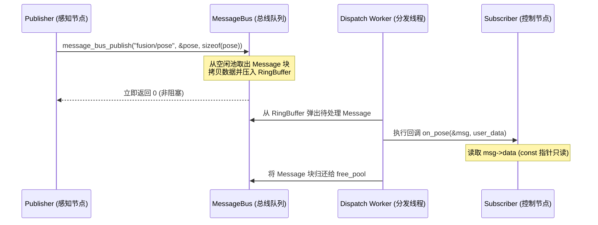

# 第 03 章：15 个节点怎么互相说话

车跑起来的时候，激光雷达 10Hz 推点云、相机 30Hz 推图像、GPS/IMU 100Hz 推位姿，规控还要
在 50~100Hz 之间来回切。这些数据不是排队进来的，而是同时涌进来，谁也不能等谁。这一章
要回答的就是：这么多节点，靠什么在同一个进程里把消息送到该去的地方。

答案就是 `MessageBus`。它是整个进程内通信的枢纽，既支持发布/订阅，也支持请求/应答，
另外还自带内存池、环形缓冲队列、QoS 策略和延迟/频率统计。

## 一张图看清总线的形状

整条链是「发布者 → 环形缓冲队列 → 后台分发线程 → 订阅回调」。注意回调拿到的是消息
指针，数据不复制：

```
                      ┌────────────────────────────────────────────────────────────┐
                      │                    MessageBus 调度内核                     │
                      │                                                            │
  [发布者线程 A] ───► │  ┌──────────────────────────────────────────────────────┐  │
  (lidar_node)        │  │ 环形无锁/互斥缓冲队列 (Ring Buffer Queue, 1024 深度) │  │
                      │  └─────────────────────────┬────────────────────────────┘  │
  [发布者线程 B] ───► │                            │                               │
  (planning_node)     │                            ▼                               │
                      │             ┌────────────────────────────────┐             │
                      │             │    后台分发工作线程 (Worker)   │             │
                      │             └──────────────┬─────────────────┘             │
                      └────────────────────────────┼───────────────────────────────┘
                                                   │ 查路由表 (Topic Entries)
                                 ┌─────────────────┴─────────────────┐
                                 ▼                                   ▼
                      [订阅回调: perception]               [订阅回调: control]
                      (直接指针传递，零拷贝)               (直接指针传递，零拷贝)
```

## 一条消息里装了什么

在这里，消息不只是一段负载，还得带上足够的时空元数据，否则下游没法判断它是什么时候、
从谁那里来的：

```c
/* include/message_bus.h */

#define MSG_BUS_MAX_TOPIC_LEN    64
#define MSG_BUS_MAX_SENDER_LEN   64
#define MSG_BUS_MAX_DATA_SIZE    65536  // 64KB 负载（适配点云与双目深度帧）

typedef struct Message {
    char        topic[MSG_BUS_MAX_TOPIC_LEN];    /**< 话题名称，如 "sensor/lidar" */
    char        sender[MSG_BUS_MAX_SENDER_LEN];  /**< 发送节点名，如 "flowsim" */
    uint32_t    msg_id;                          /**< 单调递增消息序号 */
    MessageType type;                            /**< MSG_TYPE_PUBLISH / REQUEST / REPLY */
    uint64_t    timestamp_us;                    /**< 墙钟微秒时间戳 (CLOCK_MONOTONIC) */
    int32_t     topic_idx;                       /**< 路由加速索引（免去热路径字符串哈希） */
    uint32_t    data_size;                       /**< 有效数据长度 */

    /* ── 类型安全序列化元信息 ── */
    uint32_t    type_id;                         /**< FNV-1a 类型哈希校验码 */
    uint8_t     schema_version;                  /**< Schema 版本 */
    uint8_t     endian_marker;                   /**< 字节序标记 (0x12=LE) */
    uint8_t     _reserved[6];

    /* ── 消息数据载荷 ── */
    uint8_t     data[MSG_BUS_MAX_DATA_SIZE];     /**< 64KB 连续内存 */

    /* ── 内部空闲内存池链表指针 ── */
    struct Message* _pool_next;
} Message;
```

进程内 vs 线上：`Message` 是进程内对象，`data[]` 之后的 `_loaned_data` /
`_loaned_release` / `_pool_next` 这类字段只在本机有效，绝不上 TCP。跨机由
`NetworkTransport` 发紧凑帧（固定头截到 `data[]` 之前，再接 `data_size` 长度的有效载荷），
见 [第 09 章](09_discovery.md#跨机之后交给-tcp)。

### 为什么要自己管内存池

100Hz 的频率下不停调 `malloc(64KB)`，既会造成内存碎片，也让内核系统调用的延迟变得不可控。
KunAutoDrive 用的是 Free-List 内存池：发布时从 `bus->free_pool` 弹出一个预分配好的
`Message` 块，消费者分发完成后再把指针还回去。整条生命周期里，动态内存分配次数是 0。

## 发布/订阅怎么跑起来

### 订阅者怎么做

订阅就是往 `MessageBus` 上交一个回调函数，再加一个用户上下文指针：

```c
typedef void (*MessageCallback)(const Message* msg, void* user_data);

int message_bus_subscribe(MessageBus* bus, 
                          const char* topic, 
                          MessageCallback callback, 
                          void* user_data);
```

### 发布之后发生了什么

发布方调用 `message_bus_publish` 后立刻返回，真正干活的是后台的分发线程：



## 需要同步的时候：请求/回复

有些操作等不了异步，比如状态机模式切换、参数查询、急停触发，它们要的是一次同步确认，
也就是 RPC：

```c
/* 客户端发起同步请求（带超时机制） */
Message reply;
int ret = message_bus_request(bus, 
                              "service/mode_switch", 
                              "client_node",
                              &req_data, sizeof(req_data), 
                              &reply, 
                              1000 /* 超时 1000ms */);
if (ret == 0) {
    printf("RPC 成功响应, 数据大小: %u\n", reply.data_size);
} else {
    printf("RPC 超时或失败: %d\n", ret);
}
```

底层大致是这样三步：客户端生成唯一的 `msg_id`，在内部注册一个基于 `pthread_cond_t` 的
等待句柄；服务端通过 `message_bus_register_service()` 处理请求并返回回复消息；总线收到
`MSG_TYPE_REPLY` 时按 `msg_id` 命中等待句柄，调用 `pthread_cond_signal` 把客户端唤醒。

## 队列满了怎么办：QoS 与丢弃策略

真实传感器是一直在推的，下游慢一点就会积压——比如点云聚类要花 80ms，而传感器每 20ms
就送一帧。KunAutoDrive 允许针对单个 Topic 配置 QoS：

```c
typedef enum {
    QOS_POLICY_RELIABLE = 0, /**< 可靠传输：队列满时阻塞发布者 */
    QOS_POLICY_BEST_EFFORT,  /**< 尽力而为：队列满时根据策略丢弃 */
} QoSReliability;

typedef enum {
    QOS_DISCARD_OLDEST = 0,  /**< 丢弃最老数据（推荐用于感知/位姿：保证最新时效） */
    QOS_DISCARD_NEWEST       /**< 丢弃最新数据（推荐用于事件日志） */
} QoSDiscardPolicy;
```

## 这里踩过的四个坑

回调里不能做耗时的事，这是第一个坑。分发线程是串行遍历所有订阅者的，只要某个回调内部
执行了 `sleep()`、阻塞式网络 I/O 或者一段耗时计算，整条总线上其他 Topic 的分发会一起
停住。现在的做法是：回调里只做数据解析和轻量缓存，或者把活投递到节点私有队列，重活交给
Worker 线程异步执行。

第二个坑和消息大小有关。单条消息的上限是 `MSG_BUS_MAX_DATA_SIZE`，也就是 64KB。1080P
的 RGB 原图差不多 6MB，根本放不下。跨进程通道复用同一份 `Message`（见第 04 章），单条
负载同样不能超过 64KB，也没有“只传一块共享内存 Handle”的借用接口；比 64KB 更大的
快照要在应用层切块，仪表盘 JSON 走的就是这条路。

第三个坑是队列堆积。下游慢的时候队列一定会满，此时选哪个 QoS 策略决定了故障现象长什么
样：`QOS_POLICY_RELIABLE` 会让发布者阻塞住，`QOS_POLICY_BEST_EFFORT` 则按
`QOS_DISCARD_OLDEST` 或 `QOS_DISCARD_NEWEST` 丢数据。感知和位姿通常丢最老，为的是拿到
最新一帧；事件日志反过来，丢最新，保住早先发生的那一条。

第四个坑出在内存池的归还上。消费者分发出错时容易忘记把 `Message` 指针还回 `free_pool`，
池子被一点点耗干，表现出来就是「跑得越久越卡」。还指针这一步要覆盖所有路径，包括出错
提前返回的那几条。
