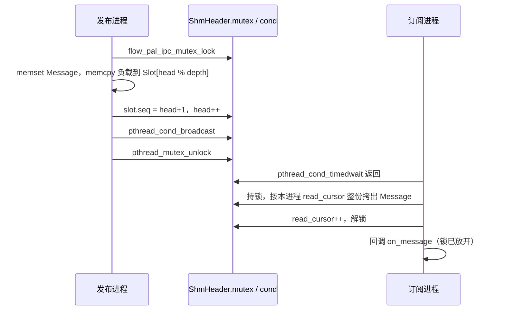

# 第 04 章：两个进程，一块内存

把一个节点放进单独的进程，是为了让它崩溃时不要把整条链路一起带走。拆开之后，激光雷达帧、
仪表盘 JSON、topic 统计就得从进程 A 交到进程 B。套接字、管道、Unix domain socket 都能做
这件事，内核会把字节从一边的用户缓冲区拷进内核，再拷到另一边。共享内存听起来像是把这件事
省掉：两个进程映射同一组物理页，谁都可以直接读。

KunAutoDrive 的跨进程通道确实建在 POSIX 共享内存上。它没有变成「零次拷贝」的借用接口。
发布端把负载 `memcpy` 进槽，读端在锁里把整份 `Message` 赋值出来，再用放在这块内存里的
互斥锁和条件变量把对方叫醒。持锁的进程被 `kill -9` 之后，锁可以交出来，槽里的字节不一定
还是一条完整的消息。

这一章按 `src/core/ipc_channel.c::ipc_channel_open:L460-L567` 的 POSIX 路径走读。Windows 在同一个文件的
`src/core/ipc_channel.c::ipc_channel_open:L168-L241` 里另有一套实现，只在末尾对照，不混进布局图。

## 它接在哪两条链之间

同进程的节点不走这里。它们用第 03 章的 `include/message_bus.h::MessageBus:L118`：回调拿到的是进程内指针，loaned
payload 可以不进 `include/message_bus.h::Message:L54-L71` 的 `data[]`（`include/message_bus.h::message_bus_publish_loaned:L153-L156`）。同机的另一个进程看不到那块堆内存，指针传过去没有意义。
跨机再往后是第 09 章的 TCP，不走这块共享内存。

三条路在 `src/core/transport.c::transport_publish:L270-L294` 里汇合：

```
同一进程   message_bus_publish          src/core/message_bus.c::message_bus_publish:L786-L979
同一台机器 ipc_channel_publish          src/core/ipc_channel.c::ipc_channel_publish:L597-L630
                                        名字由 src/core/transport.c::topic_to_ipc_name:L98-L103 换成 flow_<topic>，'/' 变成 '_'
另一台机器 NetworkTransport             src/cpp/network_transport.cpp::serialize_frame:L86-L103 写 4 字节长度前缀，见第 09 章
```

`src/core/transport.c::transport_publish:L274-L284` 总是先调用
`src/core/message_bus.c::message_bus_publish:L786-L979`。策略是
`include/transport.h::TRANSPORT_IPC:L40` 并且这条 topic 已经
`src/core/transport.c::transport_advertise:L224-L268` 过时，再调用一次
`src/core/ipc_channel.c::ipc_channel_publish:L597-L630`。
`src/core/transport.c::transport_publish_loaned:L296-L311` 只在路由仍是
`include/transport.h::ROUTE_LOCAL:L47` 时走
`include/message_bus.h::message_bus_publish_loaned:L153-L156`；只要路由离开本进程，它就
把字节交给 `src/core/transport.c::transport_publish:L308`，然后调用释放函数。借用在 IPC 边界上结束。

真正打开通道的地方还有四条，名字和深度都不一样：

| 调用方 | 通道名 | 深度 | 作用 |
|---|---|---|---|
| `src/core/transport.c::transport_advertise:L234-L238` | `src/core/transport.c::topic_to_ipc_name:L98-L103`：`flow_` + topic，`/` 换成 `_` | topic 的 QoS depth，没有则 `src/core/transport.c::TRANSPORT_DEFAULT_IPC_DEPTH:L28`（32），见 `src/core/transport.c::ipc_depth_for_topic:L86-L92` | 按 topic 扇出 |
| `src/core/topic_bridge.c::topic_bridge_start:L160` | 调用者给定 | 64 | 把一侧 `MessageBus` 镜像到另一侧 |
| `src/core/dashboard_bridge.c::dashboard_bridge_publisher_open:L52-L55` | `include/dashboard_bridge.h::DASHBOARD_BRIDGE_CHANNEL:L37`（`flow_dashboard`） | `include/dashboard_bridge.h::DASHBOARD_BRIDGE_QUEUE_DEPTH:L43`（8） | monitor_node → flowmond 的 JSON |
| `src/core/stats_bridge.c::stats_bridge_publisher_open:L19-L22` | `include/stats_bridge.h::STATS_BRIDGE_CHANNEL:L42`（`flow_stats_bridge`） | `include/stats_bridge.h::STATS_BRIDGE_QUEUE_DEPTH:L51`（8） | 总线统计 → flowmond |
| `src/core/discovery.c::discovery_create_ipc_channels:L715-L734` | `<topic>_<pub>_to_<sub>` | 调用者传入，`src/core/transport.c::transport_start:L206` 传 32 | 按发现拓扑再建一套 |

`scripts/demo.sh::MULTI_MODE:L168` 默认是 `false`，这条路径是单进程 `dlopen`，热路径在 `MessageBus` 上。仪表盘进程
`flowmond` 是这条 IPC 的常驻读者：`src/flowmond.c::dashboard_bridge_reconnect_fn:L123-L153`
反复调用 `src/core/dashboard_bridge.c::dashboard_bridge_subscriber_open:L219-L247`，连上之后 `src/core/ipc_channel.c::ipc_channel_start:L779-L785`。

`src/core/discovery.c::discovery_create_ipc_channels:L694-L751` 有两个和另外几条路不一样的行为。
`src/core/discovery.c::discovery_create_ipc_channels:L715-L718` 直接拼 topic，topic 里的 `/` 会留在共享内存对象名里。POSIX 要求 `shm_open` 的名字
是「一个前导斜杠，后面不再有斜杠」。在这台机器上对 `/sensor/lidar_shm` 调用 `shm_open`
返回 `-1`，`errno` 为 `EINVAL`（22）。`sensor/lidar` 这种 topic 在发现路径上会静默打不开。
`src/core/transport.c::topic_to_ipc_name:L98-L103` 会先把斜杠换成下划线，所以同一条 topic 两边的名字对不上。这个函数打开
通道之后没有把 `IpcChannel*` 存下来，并且对发布端也调用了 `src/core/ipc_channel.c::ipc_channel_start:L779-L785`（调用点在 `src/core/discovery.c::discovery_create_ipc_channels:L740`）。发布端的
接收线程会在自己的进程私有游标上读槽，不会把消息从环里拿走，但句柄泄漏，锁上多了一个
竞争者。

## 为什么是环形槽，而不是把页借出去

先把几条常见的路放在一起。这张表不写延迟数字：本章没有测量 TCP、UDP 或 Unix domain
socket，旧稿里的 100–500 μs、30–80 μs 没有对应的测量程序，不能留。

| 做法 | 数据怎么到对端 | 进程死掉时内核做什么 | 这条代码库里的位置 |
|---|---|---|---|
| TCP / UDP loopback、管道、`AF_UNIX` | 至少一次进内核、一次出内核 | 套接字和管道随最后一个 fd 关闭被回收 | 跨机走 `include/network_transport.h::NetworkTransport:L50`，帧由 `src/cpp/network_transport.cpp::serialize_frame:L86-L103` 发出 |
| iceoryx 那种 loan | 接收端拿到共享池里的偏移，用完归还 | 要有独立的租约协议 | 没有。进程内 loan 停在 `include/message_bus.h::message_bus_publish_loaned:L153-L156` |
| 命名信号量 + 定时轮询 | 共享内存里放数据，信号量只负责叫醒 | 信号量对象也会留在文件系统里 | `include/ipc_channel.h::ipc_channel_open:L7-L18` 仍这样写；`src/core/ipc_channel.c::ipc_channel_publish:L22-L28` 写明已经换掉 |
| 本仓库的 POSIX 通道 | 共享内存环形槽，槽内是一份完整 `include/message_bus.h::Message:L54-L83` | 名字留在 `/dev/shm`，直到某次发布端 `src/core/ipc_channel.c::ipc_channel_open:L481` 调用 `include/platform_pal.h::flow_pal_shared_memory_unlink:L200-L202` | `src/core/ipc_channel.c::ipc_channel_open:L460-L567` / `src/core/ipc_channel.c::ipc_channel_publish:L597-L630` |

换掉轮询的原因写在 `src/core/ipc_channel.c::ipc_channel_publish:L22-L28`：订阅线程曾经 `usleep(1ms)` 看 `head` 有没有
前进，多跳链路把这 1 ms 叠上去。现在发布端在写完槽之后对 process-shared 的
`pthread_cond_t` 做 `pthread_cond_broadcast`（`src/core/ipc_channel.c::ipc_channel_publish:L625-L628`）。这次有没有进入内核，取决于当时有没有
线程睡在 `pthread_cond_timedwait` 上，本章没有用 `strace` 拆开这一步。能确定的是代码
每次发布都会广播；有订阅者正等着时，它会被这次广播叫醒，单程延迟里因此含有一次唤醒。
旧稿写的「0 次上下文切换」没有测量对应。

不用 seqlock 的原因可以从临界区的长度看出来。发布端在持锁期间 `memset` 整份 `include/message_bus.h::Message:L54-L83`
（本机 `sizeof(Message)` 为 65736），再 `memcpy` 负载（`src/core/ipc_channel.c::ipc_channel_publish:L612-L620`）。读端在持锁期间把这份结构体赋值到
栈上（`src/core/ipc_channel.c::try_read_one:L677-L678`）。seqlock 适合「写的人改几个字，读的人可以重试」；这里一次临界区要搬大约 64KB，
读端重试的成本和直接在锁里拷完差不多，而且回调拿到的必须是一份不会被下一次发布覆盖的
副本。代码选了互斥锁。槽里的 `seq` 字段留着，读路径没有读它，这在崩溃一节再算。

广播环而不是单消费者队列，`src/core/ipc_channel.c::ipc_channel_publish:L11-L20` 写了动机：同一块共享内存上可以有多个订阅进程。如果读
一条就把它出队，N 个订阅者会把消息瓜分掉。现在的规则是：

- 发布端只增加 `head`，写 `head % depth` 那一格，从不因为环「满了」而阻塞（`src/core/ipc_channel.c::ipc_channel_publish:L602-L623`）。
- 每个 `src/core/ipc_channel.c::IpcChannel:L414-L427` 在自己进程的堆里放 `read_cursor`，不放进共享内存。
- 游标落后超过 `queue_depth` 时，跳到仍留在环里的最旧一条，跳过的条数累加进这个订阅者
  自己的 `drop_count`（`src/core/ipc_channel.c::try_read_one:L667-L670`，计数在 `src/core/ipc_channel.c::IpcChannel:L429-L435`）。

满不是一种错误。`include/ipc_channel.h::ipc_channel_publish:L56-L61` 写着队列满时返回 `-1`，
`src/core/ipc_channel.c::ipc_channel_publish:L597-L630` 成功返回 `0`，失败返回 `include/error_codes.h::ERR_IO:L30`（`-8`）。失败的原因
是角色不对、topic 为空，或者 `size > include/message_bus.h::MSG_BUS_MAX_DATA_SIZE:L41`（65536）。`src/ipc_demo.c::run_publisher:L65-L68`
里「队列满，跳过」那一行，按现在的返回值打不出来。

这套设计在下面几种情况会破：

- 一条负载超过 65536 字节。更大的 JSON 要自己切块，见后面的仪表盘协议。
- 订阅者处理得比发布慢，而且它在意每一条历史。环只保留最近 `queue_depth` 条。
- 发布进程在 `memset` / `memcpy` 和 `head` 自增之间被杀死。锁能恢复，那一格的字节不能。
- 新的发布端再次 `open`。它会先 `shm_unlink` 这个名字，已经映射着旧对象的订阅者收不到
  新字节。
- 通道名里还有一个 `/`。`shm_open` 直接 `EINVAL`。
- macOS。`include/platform_pal.h::FLOW_PAL_HAS_ROBUST_MUTEX:L79` 只在 Linux 上为 1。
  `include/platform_pal.h::flow_pal_ipc_sync_init:L161-L163` 在这项为 0 时不会调用 `pthread_mutexattr_setrobust`。本章的崩溃实验只在 Linux 上跑过。

## 共享内存里的字节

`src/core/ipc_channel.c::ipc_channel_open:L475` 把对象名做成 `/<channel_name>_shm`。`ch04_layout` 在 `/dev/shm/ch04_layout_shm`。
发布端用 `O_CREAT | O_RDWR`、模式 `0600`（`src/core/ipc_channel.c::ipc_channel_open:L482`），`ftruncate` 到下面这个长度，再 `mmap` 成
`MAP_SHARED`。

POSIX 路径的头和槽是 `src/core/ipc_channel.c::ShmHeader:L378-L384`、`src/core/ipc_channel.c::ShmSlot:L389-L392`。它们不是
公开头文件里的类型。`examples/ipc_channel/chapter04.c::run_layout:L217-L288` 按同样的字段复刻了一份，`layout`
子命令用真实文件的 `st_size` 核对。对不上就退出码 1。下面的偏移来自这次核对通过的输出，
glibc 2.39 的 `pthread_mutex_t` / `pthread_cond_t` 尺寸换一套 C 库会变，换平台先重跑
`examples/ipc_channel/chapter04.c::run_layout:L217-L288`。

```
sizeof(Message)          65736
sizeof(ShmHeader)          104
sizeof(ShmSlot)          65744
depth 32 的文件         2103912    = 104 + 32 × 65744
```

`include/message_bus.h::Message:L54-L83` 的负载区是内联数组，不是指针：

```
偏移    字段                         字节
0       topic[64]
64      sender[64]
128     msg_id
132     type
136     timestamp_us
144     topic_idx
148     data_size
152     type_id
156     schema_version, endian_marker, _reserved[6]
164     data[65536]
65664   _loaned_data / release 函数指针 / _pool_next
```

164 + 65536 = 65700，后面三个指针把结构体补到 65736。发布路径会把 `_loaned_*` 和
`_pool_next` 一起 `memset` 成 0。读端整份赋值时这些指针是空的。它们指向发布进程的地址
空间，本来就不能在另一个进程里解。

`ShmHeader` 在这台 glibc 上是：

```
偏移 0    pthread_mutex_t mutex     40 字节   保护 head 和槽数组
偏移 40   pthread_cond_t  cond      48 字节   发布后 broadcast
偏移 88   uint32_t queue_depth
偏移 92   uint32_t _pad
偏移 96   uint64_t head             曾经成功提交的消息条数，从 0 起
偏移 104  第一个 ShmSlot
```

没有 magic，没有 version，没有 `write_seq`，没有 `slot_count` 这个字段名，也没有
`in_critical_section`。旧稿里的 `0x464C5749`（`"FLWI"`）在 `src/core/ipc_channel.c::ShmHeader:L378-L384` 里搜不到。
`queue_depth` 被当成「头已经初始化完」的标志：发布端最后才写它（`src/core/ipc_channel.c::ipc_channel_open:L518-L522`）。订阅端若看到它和文件
大小推出来的深度不一致，这次 `src/core/ipc_channel.c::ipc_channel_open:L524-L563` 失败，调用者自己重试。`src/ipc_demo.c::run_subscriber:L81-L89` 和
`src/core/transport.c::transport_subscribe:L351-L356` 都是这么循环的。

每个槽：

```
偏移 0    uint64_t seq     提交时写成 write_index + 1；0 表示这一格还没有被提交过
偏移 8    Message  msg
```

深度 32 时，第 i 个槽从 `104 + i × 65744` 开始。第 0 格的 `data[]` 在文件偏移
104 + 8 + 164 = 276。

`head` 是 `uint64_t`。按每秒一百万条算，绕回 0 要五十万年以上。读路径用 `head - read_cursor`
的无符号减法判断落后，绕回之后这个判断会错，但正常运行到不了那里。真正的问题是 `seq`
写了却没人读，见崩溃一节。

订阅端传入的 `queue_depth` 不决定映射长度。`src/core/ipc_channel.c::ipc_channel_open:L524-L563` 对订阅者 `fstat` 文件，
用 `(st_size - sizeof(ShmHeader)) / sizeof(ShmSlot)` 覆盖本地的深度。`examples/ipc_channel/chapter04.c::run_fault_late:L373-L414` 向
深度为 8 的通道传入 4，读出来的仍是 8 条。这个参数只对发布端的 `ftruncate` 有意义。

## 发布端怎么建、怎么写

`src/core/ipc_channel.c::ipc_channel_open:L460-L567` 在发布角色下的顺序：

1. `channel_name` 为空或 `queue_depth == 0` 则返回 `NULL`（`src/core/ipc_channel.c::ipc_channel_open:L462`）。
2. `include/platform_pal.h::flow_pal_has_capability:L92-L109` 对 `FLOW_PAL_CAP_SHARED_MEMORY_IPC` 为假则 `errno = ENOTSUP`（`src/core/ipc_channel.c::ipc_channel_open:L463-L466`）。
   QNX 不在 `include/platform_pal.h::FLOW_PAL_HAS_SHARED_MEMORY_IPC:L77-L78` 里，这项为 0。
3. `include/platform_pal.h::flow_pal_shared_memory_unlink:L200-L202`，调用点在 `src/core/ipc_channel.c::ipc_channel_open:L481`。先把同名旧对象的目录项摘掉。已经 `mmap`
   着旧对象的进程仍拿着旧页；新的 `shm_open` 得到的是另一个对象。
4. `shm_open` + `ftruncate` + `mmap`（`src/core/ipc_channel.c::ipc_channel_open:L482-L498`）。
5. `memset` 整段，再 `include/platform_pal.h::flow_pal_ipc_sync_init:L151-L182`（`src/core/ipc_channel.c::ipc_channel_open:L503-L510`）。
6. 最后写 `hdr->queue_depth` 和 `hdr->head = 0`（`src/core/ipc_channel.c::ipc_channel_open:L518-L522`）。

`include/platform_pal.h::flow_pal_ipc_sync_init:L151-L182` 做的是：

- `pthread_mutexattr_setpshared(PTHREAD_PROCESS_SHARED)`（`include/platform_pal.h::flow_pal_ipc_sync_init:L160`）
- Linux 上再 `pthread_mutexattr_setrobust(PTHREAD_MUTEX_ROBUST)`（`include/platform_pal.h::flow_pal_ipc_sync_init:L161-L163`）
- 条件变量同样 `PTHREAD_PROCESS_SHARED`，时钟用 `CLOCK_MONOTONIC`（Linux 上
  `include/platform_pal.h::FLOW_PAL_HAS_MONOTONIC_COND_CLOCK:L81` 为 1；否则是 `CLOCK_REALTIME`，见 `include/platform_pal.h::flow_pal_ipc_cond_clock:L143-L149`）

互斥锁和条件变量的字节就放在共享页里，所以每个映射了这块内存的进程锁的是同一把锁。
没有 `sem_open`，也没有 `include/ipc_channel.h::ipc_channel_open:L18` 注释里的 `ipc_channel_spin`。阻塞读的公开函数是
`src/core/ipc_channel.c::ipc_channel_recv_once:L734-L756`，后台线程是 `src/core/ipc_channel.c::ipc_channel_start:L779-L785`。

`src/core/ipc_channel.c::ipc_channel_publish:L597-L630` 的临界区，成功路径：

```c
flow_pal_ipc_mutex_lock(&hdr->mutex);
memset(&slot->msg, 0, sizeof(slot->msg));
/* 填 topic、sender、type、data_size、timestamp_us */
memcpy(slot->msg.data, data, size);   /* size == 0 或 data == NULL 时跳过 */
slot->seq = idx + 1;
hdr->head = idx + 1;
pthread_cond_broadcast(&hdr->cond);
pthread_mutex_unlock(&hdr->mutex);
```

`timestamp_us` 来自 `src/core/clock_service.c::clock_now_monotonic_wall_us:L16-L20`（调用点 `src/core/ipc_channel.c::ipc_channel_publish:L618`），也就是 `CLOCK_MONOTONIC`，不受
仿真时钟注入影响。`src/core/clock_service.c::clock_now_us:L22-L34` 在回放时会被仿真时间冻住，IPC 戳如果用它，回放
进程和实时进程会对不齐。

`idx % queue_depth` 就是这次要覆盖的格子。环已经转满一圈时，这一格正是窗口里最旧的
那条：合法下标是 `[head - depth, head)`。写它的时候还没有增加 `head`，所以它仍算
「还在窗口里」。其他读者要拿同一把锁才能看，所以正常完成的发布不会把半截字节交出去。
锁在 `head` 增加之后才放开。

返回值被忽略的是 `include/platform_pal.h::flow_pal_ipc_mutex_lock:L184-L193`（调用点 `src/core/ipc_channel.c::ipc_channel_publish:L606`）。它在 `EOWNERDEAD` 时调用
`pthread_mutex_consistent` 并返回 0，调用方继续写。其他错误码（例如
`ENOTRECOVERABLE`）也没有检查，后面的 `memset` 仍会执行。

## 订阅端怎么读、怎么被叫醒

`src/core/ipc_channel.c::ipc_channel_subscribe:L634-L641` 只是在进程私有数组里登记回调，最多 `src/core/ipc_channel.c::IPC_MAX_CALLBACKS:L405`（8）个。
它不检查角色，也不碰共享内存。

读一条的函数是 `src/core/ipc_channel.c::try_read_one:L647-L682`。它在持锁时做完这些事：

1. 第一次读把游标锚住：`head > depth` 时从 `head - depth` 开始，否则从 0 开始（`src/core/ipc_channel.c::try_read_one:L657-L660`）。
   锚住之前的历史不进 `drop_count`。晚加入的订阅者会静静地从最近一个窗口看起。
2. 已经锚过、并且 `head - read_cursor > depth`（`src/core/ipc_channel.c::try_read_one:L667-L670`）：  
   `drop_count += (head - depth) - read_cursor`，然后把游标拨到 `head - depth`。
3. `read_cursor >= head`：解锁，返回 `include/error_codes.h::ERR_IO:L30`（`src/core/ipc_channel.c::try_read_one:L672-L675`）。调用者把它当成「现在没有新消息」。
4. 否则把 `slot->msg` 整份赋给输出（`src/core/ipc_channel.c::try_read_one:L677-L681` 注释写了 no torn read，前提是写端遵守上面的
   提交顺序，而且没有人在提交中途死掉），`read_cursor++`，解锁。

回调在解锁之后跑。`src/core/ipc_channel.c::ipc_channel_recv_once:L742-L746` 和后台线程 `src/core/ipc_channel.c::recv_thread_fn:L760-L777` 都是这样。
回调里可以做一点工作，不会占着这把跨进程锁。回调如果睡得很久，发布端继续覆盖旧槽，
下一次 `src/core/ipc_channel.c::try_read_one:L667-L670` 再记 `drop_count`。

没数据时的等待在 `src/core/ipc_channel.c::wait_for_data:L703-L732`。它加上同一把锁，如果游标已经落后就先拨回窗口（`src/core/ipc_channel.c::wait_for_data:L712-L717`，这里
**不加** `drop_count`），已经有数据就立刻返回。否则 `pthread_cond_timedwait`，期限是
`src/core/ipc_channel.c::IPC_RECV_WAIT_MS:L401`（50）毫秒之后。`src/core/ipc_channel.c::compute_wait_deadline:L688-L698` 用的时钟和条件变量属性一致：
Linux 上是 `src/core/clock_service.c::clock_now_monotonic_wall_us:L16-L20`。超时返回 `ETIMEDOUT` 是正常路径，用来让
`src/core/ipc_channel.c::IpcChannel:L441` 的 `recv_running` 有机会被再看一眼。



`src/core/ipc_channel.c::ipc_channel_start:L779-L785` 把 `recv_running` 设为真再 `pthread_create`。`src/core/ipc_channel.c::ipc_channel_stop:L787-L791`
把标志清掉然后 `pthread_join`。它不广播条件变量。接收线程若正睡在 `timedwait` 里，
最多再等 `src/core/ipc_channel.c::IPC_RECV_WAIT_MS:L401` 的 50 ms 才会看到标志。`src/core/ipc_channel.c::IpcChannel:L441` 的 `recv_running` 是 `volatile bool`，不是原子变量，也没有
和这条锁建立同步。`x86` 上一次对齐写最终会被另一个核看到；这不是 C 内存模型里的正式
发布。

`src/core/ipc_channel.c::ipc_channel_recv_once:L734-L756` 的 `timeout_ms == 0` 表示一直等到有消息。非 0 时，期限到了
返回 `include/error_codes.h::ERR_IO:L30`。`src/core/ipc_channel.c::wait_for_data:L703-L732` 自己的 50 ms 和这个期限是两层：调用者要 1 ms 时，
里面仍可能先睡满一次条件变量等待，再发现期限已经过了。`examples/ipc_channel/chapter04.c::run_fault_slow:L331-L371` 里用来锚游标的
那次空读，因此会花大约 50 ms，而不是 1 ms。

`src/core/ipc_channel.c::ipc_channel_get_drop_count:L795-L802` 会再拿一次共享锁，读的是进程私有的 `drop_count`（`src/core/ipc_channel.c::IpcChannel:L429-L435`）。
同机的另一个订阅者有自己的计数。它和 `MessageBus` 里按 topic 统计的 `drop_count`
是两套数：总线统计的是进程内队列，这里统计的是这个 `IpcChannel` 对象跳过的槽。

`src/core/ipc_channel.c::wait_for_data:L712-L717` 拨游标时不记账，是一处和 `src/core/ipc_channel.c::try_read_one:L667-L670` 不一致的实现。要让它生效，
发布端得在 `src/core/ipc_channel.c::try_read_one:L680` 解锁和 `src/core/ipc_channel.c::wait_for_data:L705` 加锁之间的缝里，把 `head` 推进
`depth + 1` 条以上。现在每次发布都要 `memset` 大约 64KB，这条缝比一次发布短，深度
大于 0 时很难撞上。代码仍然是错的：两条路径对同一种「落后」的处理不一样。

## 关掉之后，名字还在

`src/core/ipc_channel.c::ipc_channel_close:L571-L593` 先 `src/core/ipc_channel.c::ipc_channel_stop:L787-L791`，再 `munmap`、`close(fd)`，然后 `free`。
发布角色的分支是一段空注释（`src/core/ipc_channel.c::ipc_channel_close:L581-L590`）：不要在这里 `shm_unlink`，也不要 `pthread_mutex_destroy`。
理由写在注释里——订阅者可能还映射着，也可能正睡在条件变量上。POSIX 保证 `shm_unlink`
只摘名字，已有映射继续有效，所以就算 unlink，也清不掉正在用的人。注释接着说，残留名字
靠下一次发布端 `src/core/ipc_channel.c::ipc_channel_open:L481` 开头的 unlink 收掉。

因此：

- 正常 `src/core/ipc_channel.c::ipc_channel_close:L571-L593` 之后，`/dev/shm/<name>_shm` 仍在。`examples/ipc_channel/chapter04.c::run_fault_orphan:L443-L555` 里 inode 在 close
  前后相同。
- 所有进程都死了，名字还在，页还占着 tmpfs。没有一个「启动时扫描 `/dev/shm`」的循环。
- 只有下一次同名发布端 `src/core/ipc_channel.c::ipc_channel_open:L481`，或者别的程序直接 `shm_unlink`，名字才会消失。
  `examples/ipc_channel/chapter04.c::run_layout:L274-L282` 在核对完之后自己 `shm_unlink`，那是示例的收尾，不是库的行为。

`src/flowmond.c::dashboard_bridge_reconnect_fn:L114-L147` 仍写着「发布端会建新的共享内存
和信号量」，并在数据年龄超过 `include/monitor_server.h::IPC_RECONNECT_STALE_SEC:L10`（5 秒）之后 `sleep(1)`（`src/flowmond.c::dashboard_bridge_reconnect_fn:L140-L146`），说是等发布端 unlink。发布端 unlink 发生在下一次 `src/core/ipc_channel.c::ipc_channel_open:L481` 的
第一件事，不发生在 `src/core/ipc_channel.c::ipc_channel_close:L571-L593`。订阅者若在新发布端 `open` 之前重新连上，映射的是旧对象；
新发布端随后 unlink 并创建新对象，这个订阅者就停在旧页上，直到年龄再次超限。那 1 秒
是在跟这个窗口打赌。

## 仪表盘 JSON 怎么超过 64KB

`include/dashboard_bridge.h::DASHBOARD_BRIDGE_CHANNEL:L37` 把通道定成 `flow_dashboard`，深度是 `include/dashboard_bridge.h::DASHBOARD_BRIDGE_QUEUE_DEPTH:L43`（8），topic 名是 `include/dashboard_bridge.h::DASHBOARD_BRIDGE_TOPIC:L40`（`_dashboard`）。
一块的负载上限是 `include/dashboard_bridge.h::DASHBOARD_CHUNK_DATA_SIZE:L46`：

```c
#define DASHBOARD_CHUNK_DATA_SIZE (MSG_BUS_MAX_DATA_SIZE - 12)  /* 65524 */
```

`include/dashboard_bridge.h::DashboardChunk:L55-L60` 是 `seq`（`uint32_t`）、`idx`（`uint16_t`）、`count`（`uint16_t`），
然后 `data[65524]`。本机 `sizeof(DashboardChunk)` 为 65532，能放进一条 IPC 消息。
旧稿里的 `chunk_idx` / `chunk_total` 不是字段名。`include/dashboard_bridge.h::DASHBOARD_CHUNK_DATA_SIZE:L11-L46` 仍写「JSON 可能超过 4096 字节」，
4096 是 `include/message_bus.h::MSG_BUS_MAX_DATA_SIZE:L41` 改成 65536 之前的数字。

`src/core/dashboard_bridge.c::dashboard_bridge_publish:L62-L102`：

- `len == 0` 返回 `-1`。
- 块数 = `(len + 65524 - 1) / 65524`，再截成 `uint16_t`。
- 只有一块时 `seq = 0`，`idx = 0`，`count = 1`。接收端看到这个组合就当场交付，不进重组状态。
- 多于一块时 `seq` 取进程内原子计数加 1，从 1 起。`idx` 从 0 到 `count - 1`。
- 每块都 `src/core/ipc_channel.c::ipc_channel_publish:L597-L630` 整份 `sizeof(DashboardChunk)`（`src/core/dashboard_bridge.c::dashboard_bridge_publish:L96-L97`）。短块的尾部用 0 填满。
  所以一条很短的 JSON 仍占满一个约 64KB 的槽。

10000 字节是 1 块，200000 字节是 4 块。这是 `examples/ipc_channel/chapter04.c::run_layout:L245-L250` 打印的。
`tests/test_bridges.c::test_dashboard_bridge_multi_chunk:L605-L621` 构造的是
10000 字节，注释自己写了「所以是 single chunk」。位图重组那条路径没有被这个测试碰到。

接收端 `src/core/dashboard_bridge.c::on_raw_chunk:L106-L213`：

- `data_size < sizeof(DashboardChunk)` 的消息丢掉。
- 用「第一个 `'\0'`」决定这块的有效长度。协议因此只适合不含内嵌 NUL 的 JSON。
  中间某一块若被 0 填过，或者 JSON 里真有 NUL，长度会被截短。
- `count == 0`、`count > 64` 或 `idx >= count` 的块丢掉。64 块是
  64 × 65524 = 4193536 字节。发送端仍会把 65 到 65535 块发出去（块数先截成
  `uint16_t`），接收端整段快照都不会交付。
- 重组用 `received_mask` 的比特，不用计数器。重复的 `idx` 盖同一段内存，不能靠重复
  把缺了的中间块凑满。完成条件是低 `count` 位全 1。最后一块的有效长度单独记在
  `last_chunk_len`，所以最后一块不必最后到达。
- `idx == 0` 或 `seq` 变了，会把当前快照清掉重来。同一 `seq` 的第 0 块再来一次，
  已经收到的其他块也丢。

深度只有 `include/dashboard_bridge.h::DASHBOARD_BRIDGE_QUEUE_DEPTH:L43` 的 8。发布端在订阅者完全没读的情况下连续发出超过 8 块时，环会盖掉同一快照
前面的块，位图永远凑不齐，这一帧就消失。8 × 65524 = 524192 字节。订阅者如果跟得上，
可以一边收一边组，上限仍是接收端那 64 块。`include/dashboard_bridge.h::dashboard_bridge_publish:L86-L94` 写
「通道满了就静默丢掉」。`src/core/ipc_channel.c::ipc_channel_publish:L602-L629` 不会因为满而失败；满的表现是覆盖最旧的槽，
返回值仍是 0。调用者看到的失败只有 `include/error_codes.h::ERR_IO:L30`。

`src/flowmond.c::on_dashboard_json:L109-L112` 把组好的字符串交给 `include/monitor_server.h::monitor_server_inject_dashboard_json:L50`。文件
`/tmp/flow_topology.json` 是这条 IPC 断开时的另一条路，不是分块协议的一部分。

统计桥 `include/stats_bridge.h::StatsPacket:L71-L79` 在这台机器上是 2272 字节（`sizeof` 一次编译量出来的），装得进
一条消息，不需要分块。`include/stats_bridge.h::StatsPacket:L29` 写的「16 个 topic 时小于 2KB」比
2272 小，注释过时，功能上仍是单槽。

## 编译，然后跑通两个进程

目标 `CMakeLists.txt::ipc_chapter:L585-L586` 由 `examples/ipc_channel/chapter04.c::main:L925` 编出来，链的是
`flowengine_core`。和 `CMakeLists.txt::flow_ipc:L580-L582`（`src/ipc_demo.c::main:L105`）一样，Linux 上再链 `rt`。

```bash
cmake -S . -B build -DCMAKE_BUILD_TYPE=Release \
  -DCMAKE_C_COMPILER=gcc -DCMAKE_CXX_COMPILER=g++
cmake --build build --target ipc_chapter
```

这台环境的默认 `c++` 指向 clang，而它选中的 GCC 14 目录没有配套的 libstdc++ 头。
上面两条把编译器钉在系统的 gcc / g++ 13.3.0 上。库已经编过的话，第二条就够。

两个终端：

```bash
env -u LD_LIBRARY_PATH ./build/bin/ipc_chapter sub
env -u LD_LIBRARY_PATH ./build/bin/ipc_chapter pub
```

`env -u LD_LIBRARY_PATH` 和 `scripts/demo.sh::sanitize_ld_path:L29-L40` 清掉旧 libstdc++ 的原因相同。
发布端每秒写一条 256 字节的样本（`examples/ipc_channel/chapter04.c::run_pub:L155-L183`），共享内存对象是 `/dev/shm/ch04_walk_shm`，深度 16。
订阅端在发布端出现之前每 100 ms 重试一次 `src/core/ipc_channel.c::ipc_channel_open:L460-L567`（`examples/ipc_channel/chapter04.c::run_sub:L185-L213`）。`Ctrl+C` 之后发布端会打印：close
返回了，POSIX 路径不会在这里 `shm_unlink`。可以用 `ls /dev/shm/ch04_walk_shm` 看到
它还在。下一次 `pub` 会在 `src/core/ipc_channel.c::ipc_channel_open:L481` 里把这个名字摘掉再建。

不想开两个终端时：

```bash
env -u LD_LIBRARY_PATH ./build/bin/ipc_chapter demo
```

`examples/ipc_channel/chapter04.c::run_demo:L896-L921` 派生订阅进程和发布进程，各交换 5 条。本次运行的节选：

```
[pub] channel=ch04_demo shm=/dev/shm/ch04_demo_shm depth=16
[pub] seq=0
[sub] 已连接 ch04_demo。读游标是本进程私有的。
[sub] topic=ch04/walk seq=0 bytes=256 checksum=ok
...
[pub] close 返回。POSIX 路径不会在这里 shm_unlink。
[sub] received=5 bad=0 drop_count=0
[demo] sub_status=0 pub_status=0
```

样本的校验和盖住负载，不盖 `send_ns`。`checksum=ok` 只说明这一条在回调里还是发布端
填进去的那个图案。

`examples/ipc_channel/chapter04.c::run_layout:L217-L288` 打印 `include/message_bus.h::Message:L54-L83`、头、槽的 `sizeof` / `offsetof`，再打开深度 32 的通道，
要求 `st_size` 等于 `104 + 32 × 65744`。通过之后示例自己 `shm_unlink`，并确认
`stat` 失败。这是本章布局图的来源。

## 延迟和吞吐：只写这次量到的

测量程序是 `examples/ipc_channel/chapter04.c::run_bench_real:L756-L893`。时钟是 `CLOCK_MONOTONIC` 的纳秒。单程延迟的定义是：
发布进程在调用 `src/core/ipc_channel.c::ipc_channel_publish:L597-L630` **之前**把 `send_ns` 写进负载，订阅进程在回调
入口再读一次钟，两者相减。这段时间包括：拿锁、`memset` 整份 `include/message_bus.h::Message:L54-L83`、`memcpy`
负载、`pthread_cond_broadcast`、对端被调度到、对端再拿锁、把整份 `Message` 从槽里
赋值出来。数字描述的是这条 API 的端到端，里面含着锁、拷贝和唤醒。

发布调用耗时是包住 `src/core/ipc_channel.c::ipc_channel_publish:L597-L630` 的另一段钟，不含订阅端的拷贝。

环境，2026-09-26，一次运行，没有重复取中位数：

- Linux 6.12.94+，x86_64，KVM 虚拟机
- `/proc/cpuinfo`：`Intel(R) Xeon(R) Processor`，4 vCPU，`cpu MHz` 2400.000
- Ubuntu glibc 2.39，gcc 13.3.0，CMake `Release`（`-O2`）
- 页大小 4096
- `sizeof(Message) = 65736`

没有订阅者，预热 200 条之后取 2000 条，不限速：

| 负载 | n | min | p50 | p99 | max |
|---|---:|---:|---:|---:|---:|
| 64 B | 2000 | 1.2 μs | 1.3 μs | 1.8 μs | 48.5 μs |
| 4096 B | 2000 | 1.3 μs | 1.6 μs | 2.3 μs | 13.3 μs |
| 65536 B | 2000 | 2.7 μs | 3.4 μs | 4.9 μs | 31.0 μs |

另一进程在读。每条之间 `usleep(1000)`，预热 100 条，样本 500 条：

| 负载 | 发布调用 p50 | 单程 p50 | 单程 p99 | 单程 max |
|---|---:|---:|---:|---:|
| 64 B | 9.7 μs | 30.8 μs | 280.1 μs | 656.6 μs |
| 4096 B | 9.0 μs | 33.5 μs | 282.5 μs | 364.5 μs |
| 65536 B | 10.9 μs | 38.7 μs | 329.3 μs | 437.2 μs |

然后每个负载再不限速写 2000 条：

| 负载 | 发布循环 | 发布速率 | 订阅端在这一段收到 | 会话 `drop_count` |
|---|---:|---:|---:|---:|
| 64 B | 0.015 s | 132639 条/s | 1755 | 245 |
| 4096 B | 0.032 s | 61691 条/s | 2000 | 0 |
| 65536 B | 0.218 s | 9165 条/s | 2000（125.0 MiB 负载） | 0 |

64 字节那一档，245 = 2000 − 1755，丢的是不限速那一段，不是前面 1 ms 间隔的样本。
4096 和 65536 两档的会话丢包是 0，所以它们的单程 p99 不是环被盖掉之后的排队，而是
这台虚拟机上唤醒和调度的抖动。

这些数说明两件事。第一，没有订阅者时，64 字节发布的 p50 是 1.3 μs，65536 字节是
3.4 μs。多出来的负载拷贝在这次运行里只占大约 2 μs。把 1.3 μs 写成「传输延迟 < 2 μs」
会漏掉对端：有订阅者在读时，单程 p50 是 30.8 / 33.5 / 38.7 μs。第二，读端每次都拷
65736 字节，和负载是 64 还是 4096 关系不大。
小消息的发布端更快（13 万条/秒），读端先跟不上，环开始丢最旧的。64KB 负载的发布端
自己要 `memcpy` 64KB，速率降到大约 9 千条/秒，这次的订阅者就跟得上。

`src/core/transport.c::ipc_to_bus_relay:L323-L327` 再多一次拷贝：它把 `msg->data` 交给
`src/core/message_bus.c::message_bus_publish:L786-L937`，总线再写入自己的 `include/message_bus.h::Message:L54-L83`。跨进程进到另一个进程的回调，
负载经过「发布 memcpy、订阅整结构赋值、总线再 memcpy」三次。进程内 loan 的那条
指针不在其中。

## 可以自己做的故障实验

程序都在 `CMakeLists.txt::ipc_chapter:L585-L586` 里。它们只调用公开 API；结尾的 `shm_unlink` 是示例在收拾
自己的名字。库的 `src/core/ipc_channel.c::ipc_channel_close:L571-L593` 不做这件事。

### 慢订阅者，游标已经锚住

```bash
env -u LD_LIBRARY_PATH ./build/bin/ipc_chapter fault-slow
```

发布端深度 8。订阅端先空读一次，把 `read_cursor` 锚在 0，然后发布端连续写序号
0..99。本次输出：

```
[fault-slow] depth=8 published=100 delivered=8 drop_count=92
[fault-slow] seqs: 92 93 94 95 96 97 98 99
[fault-slow] OK
```

92 = (100 − 8) − 0。留下的是最后 8 条。这就是 `src/core/ipc_channel.c::try_read_one:L667-L670` 里
`head - read_cursor > depth` 的分支。

### 晚加入

```bash
env -u LD_LIBRARY_PATH ./build/bin/ipc_chapter fault-late
```

先写 100 条，再打开订阅端。订阅端参数写成 4，发布端建的是 8。本次输出：

```
[fault-late] requested_sub_depth=4 delivered=8 drop_count=0
[fault-late] seqs: 92 93 94 95 96 97 98 99
[fault-late] OK
```

窗口里的 8 条能读到，`drop_count` 是 0。晚加入不把「我来之前的世界」记成丢包。
只看这个计数，会把一直没跟上和刚刚才连上看成同一种健康。

### 正常退出和 kill -9 都留下名字

```bash
env -u LD_LIBRARY_PATH ./build/bin/ipc_chapter fault-orphan
```

本次节选：

```
[fault-orphan] 发布端存活时 /dev/shm/ch04_orphan_shm inode=5 size=526056
[fault-orphan] 正常 close 之后对象仍在 inode=5
[fault-orphan] close 之后旧订阅端读到 1 条 last="OLD"
[fault-orphan] 新 inode=6（与旧 不同）旧订阅端再读 0 条 last="OLD" got_new=0
[fault-orphan] 新订阅端读到 1 条 last="NEW"
[fault-orphan] kill -9 前对象存在，之后对象仍在（WIFSIGNALED=1）
[fault-orphan] OK
```

526056 = 104 + 8 × 65744，和 `examples/ipc_channel/chapter04.c::run_layout:L217-L288` 的公式一致。正常 `src/core/ipc_channel.c::ipc_channel_close:L571-L593` 不改变 inode。
新的发布端 `src/core/ipc_channel.c::ipc_channel_open:L481` 换了一个 inode，旧映射上的订阅者读不到 `"NEW"`，新打开的订阅者
可以。`kill -9` 的那个子进程是唯一映射者，死掉之后 `/dev/shm/ch04_orphan_kill_shm`
仍在。没有订阅者帮它撑着，是名字自己把对象留在 tmpfs 里。

### 持锁时被杀死

```bash
env -u LD_LIBRARY_PATH ./build/bin/ipc_chapter fault-kill
```

子进程以深度 8、负载 65536 死循环发布，每条带全缓冲区校验。父进程等对象出现后再
`SIGKILL`，然后作为一个晚加入的订阅者把窗口读完。40 次里：

```
[fault-kill] summary torn_trials=4 clean_trials=36 no_data=0 kill_fail=0
```

出现坏槽的那几次都是 `good=7 bad=1 delivered=8`。8 格里只有正在写的那一格是半截的，
其余 7 格是更早几次已经提交的。40 次都没有把后续的 `src/core/ipc_channel.c::ipc_channel_recv_once:L734-L756` 挂死：下一次
`pthread_mutex_lock` 拿到 `EOWNERDEAD`，`include/platform_pal.h::flow_pal_ipc_mutex_lock:L184-L193` 调用了
`pthread_mutex_consistent`，然后把槽里的字节当作一条正常消息拷了出来。锁恢复了，
数据没有恢复。

这次实验打的是「死后下一个加锁的人」。它没有覆盖另一种死法：订阅者已经睡在
`pthread_cond_timedwait` 里，发布者死时还拿着锁。`src/core/ipc_channel.c::wait_for_data:L726-L731` 对 `timedwait` 的
返回值只放行 `ETIMEDOUT`。`EOWNERDEAD` 会打到 stderr，然后直接
`pthread_mutex_unlock`，中间没有 `pthread_mutex_consistent`。POSIX 在这之后把这把
健壮锁标成不可恢复，再锁会得到 `ENOTRECOVERABLE`。`include/platform_pal.h::flow_pal_ipc_mutex_lock:L184-L193` 不处理
这个码，调用方也不看返回值。那条路径在源码里，本次 40 次杀进程没有走它。

## 这次不改的实现问题

下面这些都在当前源码里。本章只把它们写清楚。

1. **健壮锁不修槽。** `include/platform_pal.h::flow_pal_ipc_mutex_lock:L184-L193` 在 `EOWNERDEAD` 时只调用
   `pthread_mutex_consistent`。`examples/ipc_channel/chapter04.c::run_fault_kill:L580-L667` 40 次中有 4 次读到校验失败的负载。
   `src/core/ipc_channel.c::ShmHeader:L378-L384` 没有 `in_critical_section` 可以回滚。
2. **等在条件变量上的恢复路径没有把锁标成一致。** 见 `src/core/ipc_channel.c::wait_for_data:L726-L731` 里对
   `pthread_cond_timedwait` 的处理。
3. **`src/core/ipc_channel.c::ipc_channel_close:L571-L593` 不 `shm_unlink`，也没有启动时扫 `/dev/shm`。** 名字一直留到同名发布端
   下一次 `src/core/ipc_channel.c::ipc_channel_open:L481`。`examples/ipc_channel/chapter04.c::run_fault_orphan:L443-L555` 对正常 close 和 `kill -9` 都看到了残留。
4. **新发布端 `src/core/ipc_channel.c::ipc_channel_open:L481` 会把已经映射的订阅者留在旧对象上。** 同上，inode 从 5 变成 6
   之后旧订阅者读不到新数据。
5. **`src/core/ipc_channel.c::ShmSlot:L389-L392` 的 `seq` 不参与读。** 它在 `memcpy` 之后、`head` 之前写入（`src/core/ipc_channel.c::ipc_channel_publish:L620-L623`）。进程死在
   `memcpy` 期间时，`seq` 仍是上一圈的值，`head` 还没动，这一格却已经半新不旧。
   就算读端开始检查 `seq`，这个顺序也标不出「正在写」。
6. **`src/core/ipc_channel.c::wait_for_data:L712-L717` 拨游标时不增加 `drop_count`。** `src/core/ipc_channel.c::try_read_one:L667-L670` 会加。
7. **`include/platform_pal.h::flow_pal_ipc_mutex_lock:L184-L193` 的返回值被发布和读取忽略。** 锁没有拿到时临界区
   仍会往下走。
8. **`src/core/discovery.c::discovery_create_ipc_channels:L715-L740` 的对象名可以含 `/`，`shm_open` 返回 `EINVAL`。**
   句柄也不保存。发布端同样被 `src/core/ipc_channel.c::ipc_channel_start:L779-L785`。
9. **`src/core/dashboard_bridge.c::on_raw_chunk:L116-L147` 用第一个 NUL 当长度，深度 8 盖得掉同一快照的前几块，`count > 64` 的块
   被接收端丢掉。** `tests/test_bridges.c::test_dashboard_bridge_multi_chunk:L618-L622` 发的是 10000 字节，仍走单块路径。
10. **`src/core/ipc_channel.c::ipc_channel_stop:L787-L791` 不叫醒条件变量，`src/core/ipc_channel.c::IpcChannel:L441` 的 `recv_running` 不是原子变量。** 停止一个
    正睡在等待里的接收线程，上限大约是 `src/core/ipc_channel.c::IPC_RECV_WAIT_MS:L401`（50 ms）。

`head` 的 `uint64_t` 绕回没有单独的防护。以这条通道实际发得动的速率，绕回不是
这次能观测到的故障。读端既然不看 `seq`，绕回也不会被 `seq` 抓住。

## 用的时候会踩到的地方

头文件和若干注释还停在上一版实现上。`include/ipc_channel.h::ipc_channel_open:L7-L18` 写「命名信号量」和
`ipc_channel_spin`。`src/core/topic_bridge.c::topic_bridge_start:L1-L10` 的文件头写「SHM + semaphore」，发布失败时
`src/core/topic_bridge.c::pub_on_topic:L82` 的日志是 `ipc full`。`src/flowmond.c::dashboard_bridge_reconnect_fn:L114-L123` 的重连注释写信号量，以及「等发布端 unlink」。
`include/dashboard_bridge.h::DASHBOARD_CHUNK_DATA_SIZE:L11-L46` 把单消息上限写成 4096。以 `src/core/ipc_channel.c::ShmHeader:L378-L384` 和
`src/core/ipc_channel.c::ipc_channel_publish:L597-L630` 为准。

发布「很快」不等于对端「很快」。无订阅者时 64 字节的中位数是 1.3 μs，因为热槽上的
`memset` 便宜。对端每次仍要拷出 65736 字节。小消息把发布速率拉到每秒十多万条时，
深度 32 的环会丢，本次是 2000 条里丢 245 条。

`drop_count` 只在游标已经锚住之后增加。监控如果只在进程刚连上时读它，看到的是 0，
同时环里只剩最后 `depth` 条。要判断「从我锚住之后丢了多少」，得先成功读过一次，
再开始累计。

回调不占锁，但是回调慢会丢消息。把重组、JSON 解析、阻塞 I/O 放进
`src/core/ipc_channel.c::ipc_channel_start:L779-L785` 拉起来的 `src/core/ipc_channel.c::recv_thread_fn:L760-L777`，发布端不会堵住，环会盖掉这个订阅者还没读的槽。
仪表盘那条深度为 8 的环尤其窄：背靠背发出超过 8 × 65524 = 524192 字节时，订阅者
只要还没把前面的块读走，位图就缺块，整帧不会交付，函数仍返回 0。

第二个发布者调用 `src/core/ipc_channel.c::ipc_channel_open:L481` 同一个名字，会 unlink 第一个发布者正在写的对象。
第一个进程的指针还指着旧页，它继续 `publish` 也不会报错，新订阅者却看的是新页。
一条通道只应有一个发布进程。

订阅端的 `queue_depth` 参数不会把环改小。两边配置不一致时，以发布端 `ftruncate`
的文件大小为准。把订阅端改成 4 来「节省映射」不会生效。

macOS 上这段代码仍会 `shm_open`，但 `include/platform_pal.h::flow_pal_ipc_sync_init:L161-L163` 不会把互斥锁设成健壮。Windows 实现在
`src/core/ipc_channel.c::WinShmHeader:L47-L51`：头只有 `queue_depth` 和 `head`，同步是命名互斥体
加事件，`src/core/ipc_channel.c::win_mutex_wait_ok:L98-L100` 把 `WAIT_ABANDONED` 当成加锁成功，同样不修槽。`src/core/ipc_channel.c::ipc_channel_close:L243-L253` 关掉最后一个
句柄后名字消失，不会像 POSIX 这样在所有进程退出后仍留在 `/dev/shm`。

## 小结

跨进程通道是一块 POSIX 共享内存：104 字节的头（这台 glibc 上的互斥锁、条件变量、
深度、`head`），后面每个槽 65744 字节，槽里是序号加一份内联了 64KB 负载的 `Message`。
发布端覆盖 `head % depth`，再 `broadcast`。每个订阅进程用自己的游标读，落后超过深度
就跳到最近的窗口。这给出多订阅者扇出，也给出丢最旧消息的语义。

它没有把物理页借给读者。一次跨进另一个进程的发布，至少是两次用户态拷贝；再桥接回
当地 `MessageBus` 就是三次。没有订阅者时，64 字节发布的 p50 是 1.3 μs；有人在读时，
这次量到的单程 p50 是 30.8–38.7 μs。

`PTHREAD_MUTEX_ROBUST` 保证的是下一把锁还能加得上。`kill -9` 打在 `memcpy` 和
`head++` 之间时，窗口里最旧的那一格可以是半截的，本次 40 次里出现了 4 次。名字的
生命周期比进程长，`close` 不摘掉它。

比 64KB 更大的仪表盘 JSON 靠 `DashboardChunk` 的 `seq` / `idx` / `count` 重组，
环深 8，接收端最多认 64 块，并用第一个 NUL 判断块的长度。

## 练习

1. 只跑 `examples/ipc_channel/chapter04.c::run_bench_real:L756-L893` 的发布端一半（无订阅者）时，64 字节和 65536 字节的
   p50 差大约 2 μs。解释这个差为什么不能用来证明「负载越大，对端越慢」。再指出
   64 字节不限速那一档为什么反而出现了 `drop_count = 245`。

2. 用 `examples/ipc_channel/chapter04.c::run_layout:L245` 打印的 `include/dashboard_bridge.h::DASHBOARD_CHUNK_DATA_SIZE:L46` 算一份 600000 字节的 JSON 要几块。
   发布端在订阅者完全阻塞时一次性发出这些块，深度为 8 的环会留下哪几块？接收端的
   位图还可能凑齐吗？`src/core/dashboard_bridge.c::dashboard_bridge_publish:L62-L102` 的返回值是什么？

3. 对照 `src/core/ipc_channel.c::try_read_one:L647-L682` 和 `src/core/ipc_channel.c::wait_for_data:L703-L732`。找出哪一次拨动 `read_cursor` 不会改
   `drop_count`。用本节 solo 发布的 p50（64 字节约 1.3 μs）估计：这条缝里要塞进
   `depth + 1` 次发布才会漏计。深度降到 1 时仍然要两次发布，为什么还是难撞上？

4. 进程死在 `src/core/ipc_channel.c::ipc_channel_publish:L620` 的 `memcpy(slot->msg.data, ...)` 和 `src/core/ipc_channel.c::ipc_channel_publish:L622` 的 `slot->seq = idx + 1` 之间。此时
   `head`、`seq`、这一格的 `data[]` 各处于什么状态？解释为什么「读端如果开始比较
   `seq`」仍抓不住这次半写。要抓住它，提交标记应该写在碰负载之前还是之后？

5. `src/core/discovery.c::discovery_create_ipc_channels:L715-L718` 对 topic `sensor/lidar` 拼出来的 `shm_open`
   名字是什么？为什么 `src/core/transport.c::topic_to_ipc_name:L98-L103` 得到的是另一个字符串？
   两边都成功时，订阅者打开的是哪一个对象？

6. 从 `src/core/transport.c::transport_publish_loaned:L296-L311` 追到 `src/core/transport.c::ipc_to_bus_relay:L323-L327`。列出负载在「发布进程的
   用户缓冲」和「订阅进程里最终的 `MessageBus` 回调」之间被拷贝的每一处，并说明
   `include/message_bus.h::Message:L75` 的 `_loaned_data` 为什么不能放进 `src/core/ipc_channel.c::ShmSlot:L389-L392`。
