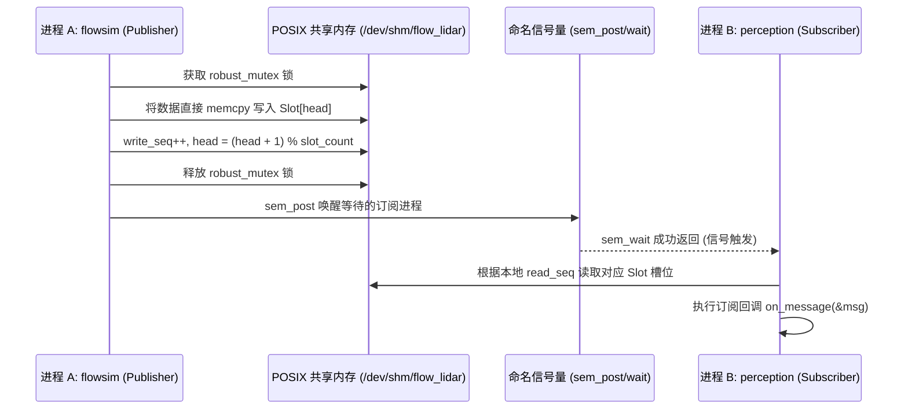

# 第 04 章：两个进程，一块内存

把功能拆进不同进程，一个进程崩了不会连累另一个，这是故障隔离的前提。但拆开之后，数据
就得来回搬。TCP Socket、Unix Domain Socket、管道，每一种都要把数据从用户态拷进内核态
再拷回来，中间还夹着上下文切换。传 100KB 的点云或图像时，这部分开销并不便宜。

这一章讲 KunAutoDrive 怎么绕开它们：用一块 POSIX 共享内存让两个进程直接读同一份物理页，
再用一把健壮互斥锁兜住「持有锁的进程突然被杀掉」这种最坏情况。

## 几种跨进程方式的代价对比

先看传输 100KB 点云或图像时，几种主流机制的差距：

| 通信机制 | 内存拷贝次数 | 上下文切换 | 传输延迟 | 崩溃恢复难度 |
| :--- | :---: | :---: | :---: | :---: |
| **TCP / UDP Loopback** | 2~4 次 (用户态⇄内核态) | 频繁 | 100 ~ 500 μs | 低 (内核自动回收套接字) |
| **Unix Domain Socket (AF_UNIX)** | 2 次 | 频繁 | 30 ~ 80 μs | 中 |
| **POSIX SHM (KunAutoDrive)** | **0 次 (直接共享物理内存页)** | **0 次 (用户态互斥锁)** | **< 2 μs** | 需 Robust Mutex 支持 |

跨机路径不走本章的 SHM，而是 `MessageBus` ↔ `NetworkTransport` ↔ TCP（紧凑线格式 +
drain 收包）。细节见 [第 09 章](09_discovery.md#跨机之后交给-tcp)。

## 共享内存里的环形缓冲区布局

当 Publisher 调用 `ipc_channel_open` 创建通道时，系统在 `/dev/shm/` 虚拟文件系统下分配
一段连续内存，再映射进进程的虚拟地址空间：

```
POSIX 共享内存物理页映射布局:
┌──────────────────────────────────────────────────────────────────────────────┐
│ 0x0000: [IpcHeader 共享内存控制头]                                           │
│         ├── magic: uint32_t (0x464C5749 "FLWI")                              │
│         ├── version: uint32_t                                                │
│         ├── robust_mutex: pthread_mutex_t (PTHREAD_MUTEX_ROBUST 进程间共享)  │
│         ├── write_seq: uint64_t (原子递增发布序号)                           │
│         ├── head: uint32_t (写入游标)                                        │
│         └── slot_count: uint32_t (队列深度，如 32)                           │
├──────────────────────────────────────────────────────────────────────────────┤
│ 0x0100: [Slot 0 消息槽位: Message (64KB)]                                    │
│         ├── msg_id, topic, timestamp_us, data_size...                        │
│         └── data: uint8_t[65536] (有效载荷)                                  │
├──────────────────────────────────────────────────────────────────────────────┤
│ 0x10100: [Slot 1 消息槽位: Message (64KB)]                                   │
│ ...                                                                          │
│ 0x1F0100: [Slot 31 消息槽位: Message (64KB)]                                 │
└──────────────────────────────────────────────────────────────────────────────┘
```

## 怎么读，怎么写

### 接口

```c
/* include/ipc_channel.h */

typedef enum {
    IPC_ROLE_PUBLISHER  = 0,   /**< 创建并写入共享内存 */
    IPC_ROLE_SUBSCRIBER = 1,   /**< 打开并读取共享内存 */
} IpcRole;

// 打开或创建 IPC 共享内存通道
IpcChannel* ipc_channel_open(const char* channel_name, 
                             IpcRole role, 
                             uint32_t queue_depth);

// 发布消息（零拷贝写入共享槽位）
int ipc_channel_publish(IpcChannel* ch, const char* topic, const char* sender,
                        const void* data, uint32_t size);

// 启动后台读取线程并注册回调
int ipc_channel_subscribe(IpcChannel* ch, MessageCallback callback, void* user_data);
int ipc_channel_start(IpcChannel* ch);
```

### 写入与读取的时序



## 进程被杀掉了，锁怎么办

多进程共享内存里最要命的一种情况是：持有互斥锁的进程在临界区里被 `kill -9` 干掉了。
普通的互斥锁不会知道这件事，它会一直保持上锁状态，其他进程就永远等在那里。

KunAutoDrive 用的是 POSIX Robust Mutex（健壮互斥锁）：

```c
/* 初始化进程间共享的健壮互斥锁 */
pthread_mutexattr_t attr;
pthread_mutexattr_init(&attr);
pthread_mutexattr_setpshared(&attr, PTHREAD_PROCESS_SHARED); // 跨进程共享
pthread_mutexattr_setrobust(&attr, PTHREAD_MUTEX_ROBUST);     // 开启崩溃健壮性
pthread_mutex_init(&header->mutex, &attr);
```

当持锁进程崩溃退出后，另一个进程再调 `pthread_mutex_lock` 时会拿到 `EOWNERDEAD` 错误码，
这时候轮到恢复逻辑上场：

```c
int rc = pthread_mutex_lock(&header->mutex);
if (rc == EOWNERDEAD) {
    LOG_WARN("IPC", "检测到持有锁的进程已异常崩溃，开始恢复共享状态...");
    
    // 1. 修复可能处于半写入状态的共享元数据
    header->in_critical_section = false;
    
    // 2. 声明互斥锁状态已恢复一致性
    pthread_mutex_consistent(&header->mutex);
    
    // 3. 正常解锁或继续执行
    pthread_mutex_unlock(&header->mutex);
}
```

## 几兆字节的 JSON 怎么搬过去

Dashboard 要传全局监控拓扑和 3D 渲染包，体积可能到好几兆。KunAutoDrive 在
`src/core/dashboard_bridge.c` 里做了一套分块重组传输协议：发送方把大 JSON 切成若干小于
64KB 的 Chunk，每块带上 `chunk_idx` 与 `chunk_total`；接收方守护进程 `flowmond` 在本地
预先分配拼装缓冲区，按序号把块拼回去，最后一帧到达时完成整体解析，再推送给前端 Web
客户端。

## 两个真出过问题的点

一个是 `/dev/shm` 的残留。`shm_open` 建出来的共享内存不随进程生命周期消失，相关进程全都
退出了，对象还留在 `/dev/shm/` 内存文件系统里。时间一长，这些残留会白白占着内存。现在
的做法是：通道关闭时由最后一个活跃角色调用 `shm_unlink()`，另外程序启动初始化时也会
扫一遍，把过期的残留 handle 清掉。

另一个是多读者广播里的慢读者。Publisher 发得比 Subscriber 读得快时，环形缓冲区会被
覆盖。KunAutoDrive 选的是 Drop-Oldest：Subscriber 发现本地读取序号 `read_seq` 已经远远
落后于 `header->write_seq - slot_count`，就自动把指针跳到最新窗口，并把落后的差值累加到
`drop_count` 遥测指标里。这样读到的是新数据，而不是一段已经被覆盖的脏数据。
