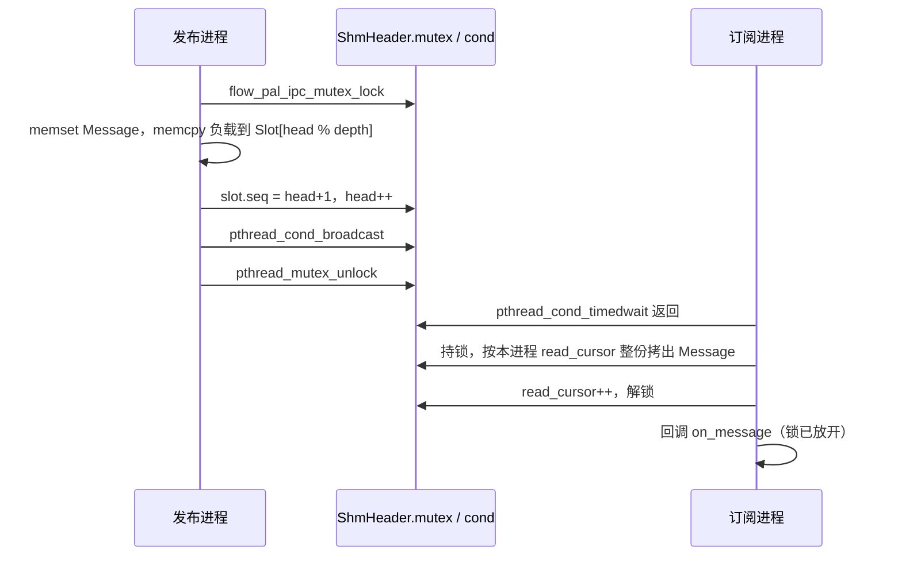

# 第 07 章：共享内存 IPC

把一个节点放进单独的进程，是为了让它崩溃时不要把整条链路一起带走。拆开之后，激光雷达帧、
仪表盘 JSON、话题（Topic）统计就得从进程 A 交到进程 B。套接字、管道、Unix domain socket
都能做这件事，内核会把字节从一边的用户缓冲区拷进内核，再拷到另一边。交不过去，拆进程就只换来隔离，换不来协作。

这一章带你看 KunAutoDrive 的做法：一块 POSIX 共享内存上的广播环。发布端把消息拷进槽里，每个订阅端按自己的进度拷出来，双方用放在同一块内存里的互斥锁和条件变量互相叫醒。你会看到它为什么仍要拷贝、慢订阅者怎样丢掉最旧的消息，以及持锁进程被 `kill -9` 之后，锁能救回来，数据却不一定。

POSIX 路径从 `ipc_channel_open` 走读（`src/core/ipc_channel.c::ipc_channel_open:L460-L567`）。

Windows 在同一个文件里另有一套实现，只在末尾对照（`src/core/ipc_channel.c::ipc_channel_open:L168-L241`）。

## 它接在哪两条链之间

同进程的节点不走这里。它们用第 05 章的 `MessageBus`：回调拿到的是进程内指针，借用出去的负载可以不进 `Message.data[]`（`include/message_bus.h::message_bus_publish_loaned:L153-L156`）。同机的另一个进程看不到那块堆内存，指针传过去没有意义。跨机再往后是第 08 章统一传输与服务发现，不走这块共享内存。

三条路在 `transport_publish` 里汇合（`src/core/transport.c::transport_publish:L270-L294`）。

```
同一进程   message_bus_publish
同一台机器 ipc_channel_publish     名字由 topic 换成 flow_<topic>，'/' 变成 '_'
另一台机器 NetworkTransport        4 字节长度前缀帧，见第 08 章
```

`transport_publish` 总是先调用 `message_bus_publish`。只有策略是 `TRANSPORT_IPC`、并且这条 Topic 已经调用过 `transport_advertise`，才再调用一次 `ipc_channel_publish`（`src/core/transport.c::transport_publish:L274-L284`）。`transport_publish_loaned` 只在路由仍是 `ROUTE_LOCAL` 时走 `message_bus_publish_loaned`；路由一旦离开本进程，它就把字节交给 `transport_publish`，然后调用释放函数（`src/core/transport.c::transport_publish_loaned:L296-L311`）。借用在进程间通信（IPC）边界上结束。

真正打开通道的地方还有五处，名字和深度都不一样：

| 调用方 | 通道名 | 深度 | 作用 |
|---|---|---|---|
| `transport_advertise`（`src/core/transport.c::transport_advertise:L234-L238`） | `topic_to_ipc_name`：`flow_` + Topic，`/` 换成 `_` | Topic 的 QoS depth，没有则 `TRANSPORT_DEFAULT_IPC_DEPTH`（32） | 按 Topic 扇出 |
| `topic_bridge_start`（`src/core/topic_bridge.c::topic_bridge_start:L151-L217`） | 调用者给定 | 64 | 把一侧 `MessageBus` 镜像到另一侧 |
| `dashboard_bridge_publisher_open`（`src/core/dashboard_bridge.c::dashboard_bridge_publisher_open:L52-L60`） | `flow_dashboard` | 8 | monitor_node → flowmond 的 JSON |
| `stats_bridge_publisher_open`（`src/core/stats_bridge.c::stats_bridge_publisher_open:L19-L27`） | `flow_stats_bridge` | 8 | 总线统计 → flowmond |
| `discovery_create_ipc_channels`（`src/core/discovery.c::discovery_create_ipc_channels:L715-L734`） | `<topic>_<pub>_to_<sub>` | 调用者传入，`transport_start` 传 32 | 按发现拓扑再建一套 |

`scripts/demo.sh` 里 `MULTI_MODE` 默认是 `false`，这条路径是单进程 `dlopen`，热路径在 `MessageBus` 上（`scripts/demo.sh::MULTI_MODE:L168`）。仪表盘进程 flowmond 是这条 IPC 的常驻读者：`dashboard_bridge_reconnect_fn` 反复调用 `dashboard_bridge_subscriber_open`，连上之后 `ipc_channel_start`（`src/flowmond.c::dashboard_bridge_reconnect_fn:L123-L153`）。

`discovery_create_ipc_channels` 有两个和另外几条路不一样的行为（`src/core/discovery.c::discovery_create_ipc_channels:L694-L751`）。通道名直接拼 Topic，Topic 里的 `/` 会留在共享内存对象名里。POSIX 要求 `shm_open` 的名字是「一个前导斜杠，后面不再有斜杠」。在这台机器上对 `/sensor/lidar_shm` 调用 `shm_open` 返回 `-1`，`errno` 为 `EINVAL`（22）。`sensor/lidar` 这种 Topic 在发现路径上会静默打不开。`topic_to_ipc_name` 会先把斜杠换成下划线，所以同一条 Topic 两边的名字对不上（`src/core/transport.c::topic_to_ipc_name:L98-L103`）。这个函数打开通道之后没有把 `IpcChannel*` 存下来，并且对发布端也调用了 `ipc_channel_start`。发布端的接收线程会在自己的进程私有游标上读槽，不会把消息从环里拿走，但句柄泄漏，锁上多了一个竞争者。

## 为什么是环形槽，而不是把页借出去

先把几条常见的路放在一起。这张表不写延迟数字：本章没有测量 TCP、UDP 或 Unix domain socket。

| 做法 | 数据怎么到对端 | 进程死掉时内核做什么 | 这条代码库里的位置 |
|---|---|---|---|
| TCP / UDP loopback、管道、`AF_UNIX` | 至少一次进内核、一次出内核 | 套接字和管道随最后一个 fd 关闭被回收 | 跨机帧由 `serialize_frame` 发出（`src/cpp/network_transport.cpp::serialize_frame:L86-L103`） |
| iceoryx 那种借用 | 接收端拿到共享池里的偏移，用完归还 | 要有独立的租约协议 | 没有。进程内借用停在 `message_bus_publish_loaned` |
| 命名信号量 + 定时轮询 | 共享内存里放数据，信号量只负责叫醒 | 信号量对象也会留在文件系统里 | 公开声明是 `ipc_channel_open`（`include/ipc_channel.h::ipc_channel_open:L47-L48`）；实现已改成条件变量 |
| 本仓库的 POSIX 通道 | 共享内存环形槽，槽内是一份完整 `Message` | 名字留在 `/dev/shm`，直到某次发布端 `open` 调用 `shm_unlink` | `ipc_channel_open` / `ipc_channel_publish`（`src/core/ipc_channel.c::ipc_channel_publish:L597-L630`） |

发布端写完槽之后对 process-shared 的 `pthread_cond_t` 做 `pthread_cond_broadcast`（`src/core/ipc_channel.c::ipc_channel_publish:L625-L628`）。订阅端在 `wait_for_data` 里用 `pthread_cond_timedwait` 等这次广播（`src/core/ipc_channel.c::wait_for_data:L703-L732`）。这次广播有没有进入内核，取决于当时有没有线程睡在等待上，本章没有用 `strace` 拆开这一步。能确定的是代码每次发布都会广播；有订阅者正等着时，它会被这次广播叫醒，单程延迟里因此含有一次唤醒。

不用顺序锁（seqlock）的原因可以从临界区的长度看出来。发布端在持锁期间 `memset` 整份 `Message`（本机 `sizeof(Message)` 为 65736），再 `memcpy` 负载（`src/core/ipc_channel.c::ipc_channel_publish:L612-L620`）。读端在持锁期间把这份结构体赋值到栈上。seqlock 适合「写的人改几个字，读的人可以重试」；这里一次临界区要搬大约 64 KB，读端重试的成本和直接在锁里拷完差不多，而且回调拿到的必须是一份不会被下一次发布覆盖的副本。代码选了互斥锁。槽里的 `seq` 字段留着，读路径没有读它，这在崩溃一节再算。

把环想成一圈信箱：发布者总往下一个信箱塞信，满一圈就覆盖最旧的；每个订阅者各拿一张「读到第几封」的纸条，落后太多就跳到还没被覆盖的最旧一封。同一块共享内存上可以有多个订阅进程。如果读一条就把它出队，N 个订阅者会把消息瓜分掉，所以读路径只前进自己的游标（`src/core/ipc_channel.c::try_read_one:L647-L682`）。现在的规则是：

- 发布端只增加 `head`，写 `head % depth` 那一格，从不因为环「满了」而阻塞。
- 每个 `IpcChannel` 对象在自己进程的堆里放 `read_cursor`，不放进共享内存。
- 游标落后超过 `queue_depth` 时，跳到仍留在环里的最旧一条，跳过的条数累加进这个订阅者自己的 `drop_count`。

满不是一种错误。头文件注释写着 `ipc_channel_publish` 在队列满时返回 `-1`，实现里成功返回 `0`，失败返回 `ERR_IO`（`-8`）（`src/core/ipc_channel.c::ipc_channel_publish:L597-L630`）。失败的原因是角色不对、Topic 为空，或者 `size > MSG_BUS_MAX_DATA_SIZE`（65536）。`run_publisher` 里「队列满，跳过」那一行，按现在的返回值打不出来（`src/ipc_demo.c::run_publisher:L65-L68`）。

这套设计在下面几种情况会破：

- 一条负载超过 65536 字节。更大的 JSON 要自己切块，见后面的仪表盘协议。
- 订阅者处理得比发布慢，而且它在意每一条历史。环只保留最近 `queue_depth` 条。
- 发布进程在 `memset` / `memcpy` 和 `head` 自增之间被杀死。锁能恢复，那一格的字节不能。
- 新的发布端再次 `open`。它会先 `shm_unlink` 这个名字，已经映射着旧对象的订阅者收不到新字节。
- 通道名里还有一个 `/`。`shm_open` 直接 `EINVAL`。
- macOS。`FLOW_PAL_HAS_ROBUST_MUTEX` 只在 Linux 上为 1，这项为 0 时初始化不会调用 `pthread_mutexattr_setrobust`（`include/platform_pal.h::flow_pal_ipc_sync_init:L161-L163`）。本章的崩溃实验只在 Linux 上跑过。

## 共享内存里的字节

`ipc_channel_open` 把对象名做成 `/<channel_name>_shm`（`src/core/ipc_channel.c::ipc_channel_open:L475`）。`ch04_layout` 在 `/dev/shm/ch04_layout_shm`。发布端用 `O_CREAT | O_RDWR`、模式 `0600`，`ftruncate` 到下面这个长度，再 `mmap` 成 `MAP_SHARED`。

POSIX 路径的头和槽是 `ShmHeader`、`ShmSlot`（`src/core/ipc_channel.c::ShmHeader:L378-L384`）。它们不是公开头文件里的类型。`run_layout` 按同样的字段复刻了一份，用真实文件的 `st_size` 核对，对不上就退出码 1（`examples/ipc_channel/chapter04.c::run_layout:L217-L292`）。下面的偏移来自这次核对通过的输出，glibc 2.39 的 `pthread_mutex_t` / `pthread_cond_t` 尺寸换一套 C 库会变，换平台先重跑 `layout`。

```
sizeof(Message)          65736
sizeof(ShmHeader)          104
sizeof(ShmSlot)          65744
depth 32 的文件         2103912    = 104 + 32 × 65744
```

`Message` 的负载区是内联数组，不是指针（`include/message_bus.h::Message:L54-L83`）：

```
偏移    字段                         字节
0       topic[64]
64      sender[64]
128     msg_id
132     type
136     timestamp_us
144     topic_idx
148     data_size
152     type_id
156     schema_version, endian_marker, _reserved[6]
164     data[65536]                  结束于 65700
65700   填充到 8 字节对齐             4
65704   _loaned_data
65712   _loaned_release
65720   _loaned_release_ctx
65728   _pool_next
65736   结构体结束
```

`data[]` 占 65536 字节，164 + 65536 = 65700。后面是 4 字节填充，然后四个指针：`_loaned_data`、`_loaned_release`、`_loaned_release_ctx`、`_pool_next`，各 8 字节，65704 + 32 = 65736。`run_layout` 用 `offsetof` 打出这四个字段。发布路径会把它们一起 `memset` 成 0。读端整份赋值时这些指针是空的。它们指向发布进程的地址空间，本来就不能在另一个进程里解。

`ShmHeader` 在这台 glibc 上是：

```
偏移 0    pthread_mutex_t mutex     40 字节   保护 head 和槽数组
偏移 40   pthread_cond_t  cond      48 字节   发布后 broadcast
偏移 88   uint32_t queue_depth
偏移 92   uint32_t _pad
偏移 96   uint64_t head             曾经成功提交的消息条数，从 0 起
偏移 104  第一个 ShmSlot
```

头里没有 magic，没有 version，没有 `write_seq`，没有 `slot_count`，也没有 `in_critical_section`。`queue_depth` 被当成「头已经初始化完」的标志：发布端最后才写它（`src/core/ipc_channel.c::ipc_channel_open:L518-L522`）。订阅端若看到它和文件大小推出来的深度不一致，这次 `open` 失败，调用者自己重试。`run_subscriber` 和 `transport_subscribe` 都是这么循环的（`src/core/transport.c::transport_subscribe:L351-L356`）。

每个槽（`src/core/ipc_channel.c::ShmSlot:L389-L392`）：

```
偏移 0    uint64_t seq     提交时写成 write_index + 1；0 表示这一格还没有被提交过
偏移 8    Message  msg
```

深度 32 时，第 i 个槽从 `104 + i × 65744` 开始。第 0 格的 `data[]` 在文件偏移 104 + 8 + 164 = 276。

`head` 是 `uint64_t`。按每秒一百万条算，绕回 0 要五十万年以上。读路径用 `head - read_cursor` 的无符号减法判断落后，绕回之后这个判断会错，但正常运行到不了那里。真正的问题是 `seq` 写了却没人读，见崩溃一节。

订阅端传入的 `queue_depth` 不决定映射长度。`ipc_channel_open` 对订阅者 `fstat` 文件，用 `(st_size - sizeof(ShmHeader)) / sizeof(ShmSlot)` 覆盖本地的深度（`src/core/ipc_channel.c::ipc_channel_open:L524-L563`）。`fault-late` 向深度为 8 的通道传入 4，读出来的仍是 8 条。这个参数只对发布端的 `ftruncate` 有意义。

## 发布端怎么建、怎么写

普通互斥锁只认「谁拿着」，不管拿着的人还活不活。健壮互斥锁（robust mutex）多记一件事：持有者死了，下一个调用 `pthread_mutex_lock` 的人照样拿到锁，同时收到 `EOWNERDEAD`，意思是「上一个主人死在临界区里，里面的数据要你自己判断」。本仓库的包装函数接着把锁标成一致并返回 0，调用方看不到这个码（`include/platform_pal.h::flow_pal_ipc_mutex_lock:L184-L193`）。

`ipc_channel_open` 在发布角色下的顺序（`src/core/ipc_channel.c::ipc_channel_open:L460-L567`）：

1. `channel_name` 为空或 `queue_depth == 0` 则返回 `NULL`。
2. `flow_pal_has_capability(FLOW_PAL_CAP_SHARED_MEMORY_IPC)` 为假则 `errno = ENOTSUP`。QNX 不在这项能力里。
3. `flow_pal_shared_memory_unlink`。先把同名旧对象的目录项摘掉。已经 `mmap` 着旧对象的进程仍拿着旧页；新的 `shm_open` 得到的是另一个对象。
4. `shm_open` + `ftruncate` + `mmap`。
5. `memset` 整段，再 `flow_pal_ipc_sync_init`。
6. 最后写 `hdr->queue_depth` 和 `hdr->head = 0`。

`flow_pal_ipc_sync_init` 把互斥锁和条件变量都设成 `PTHREAD_PROCESS_SHARED`（`include/platform_pal.h::flow_pal_ipc_sync_init:L151-L182`）。Linux 上再把互斥锁设成 `PTHREAD_MUTEX_ROBUST`，条件变量的时钟用 `CLOCK_MONOTONIC`；`FLOW_PAL_HAS_MONOTONIC_COND_CLOCK` 为 0 时用 `CLOCK_REALTIME`。互斥锁和条件变量的字节就放在共享页里，所以每个映射了这块内存的进程锁的是同一把锁。没有 `sem_open`，也没有注释里的 `ipc_channel_spin`。阻塞读的公开函数是 `ipc_channel_recv_once`，后台线程是 `ipc_channel_start`。

`ipc_channel_publish` 的临界区，成功路径如下（`src/core/ipc_channel.c::ipc_channel_publish:L597-L630`）。

```c
flow_pal_ipc_mutex_lock(&hdr->mutex);
memset(&slot->msg, 0, sizeof(slot->msg));
/* 填 topic、sender、type、data_size、timestamp_us */
memcpy(slot->msg.data, data, size);   /* size == 0 或 data == NULL 时跳过 */
slot->seq = idx + 1;
hdr->head = idx + 1;
pthread_cond_broadcast(&hdr->cond);
pthread_mutex_unlock(&hdr->mutex);
```

`timestamp_us` 来自 `clock_now_monotonic_wall_us()`，也就是 `CLOCK_MONOTONIC`，不受仿真时钟注入影响（`src/core/clock_service.c::clock_now_monotonic_wall_us:L16-L20`）。`clock_now_us()` 在回放时会被仿真时间冻住，IPC 戳如果用它，回放进程和实时进程会对不齐。

`idx % queue_depth` 就是这次要覆盖的格子。环已经转满一圈时，这一格正是窗口里最旧的那条：合法下标是 `[head - depth, head)`。写它的时候还没有增加 `head`，所以它仍算「还在窗口里」。其他读者要拿同一把锁才能看，所以正常完成的发布不会把半截字节交出去。锁在 `head` 增加之后才放开。

`flow_pal_ipc_mutex_lock` 的返回值被忽略。它在 `EOWNERDEAD` 时调用 `pthread_mutex_consistent` 并返回 0，调用方继续写。其他错误码（例如 `ENOTRECOVERABLE`）也没有检查，后面的 `memset` 仍会执行。

## 订阅端怎么读、怎么被叫醒

`ipc_channel_subscribe` 只是在进程私有数组里登记回调，最多 `IPC_MAX_CALLBACKS`（8）个（`src/core/ipc_channel.c::ipc_channel_subscribe:L634-L641`）。它不检查角色，也不碰共享内存。

读一条的函数是 `try_read_one`（`src/core/ipc_channel.c::try_read_one:L647-L682`）。它在持锁时做完这些事：

1. 第一次读把游标锚住：`head > depth` 时从 `head - depth` 开始，否则从 0 开始。锚住之前的历史不进 `drop_count`。晚加入的订阅者会静静地从最近一个窗口看起。
2. 已经锚过、并且 `head - read_cursor > depth`：`drop_count += (head - depth) - read_cursor`，然后把游标拨到 `head - depth`。
3. `read_cursor >= head`：解锁，返回 `ERR_IO`。调用者把它当成「现在没有新消息」。
4. 否则把 `slot->msg` 整份赋给输出（注释写了 no torn read，前提是写端遵守上面的提交顺序，而且没有人在提交中途死掉），`read_cursor++`，解锁。

回调在解锁之后跑。`ipc_channel_recv_once` 和后台线程 `recv_thread_fn` 都是这样（`src/core/ipc_channel.c::recv_thread_fn:L760-L777`）。回调里可以做一点工作，不会占着这把跨进程锁。回调如果睡得很久，发布端继续覆盖旧槽，下一次 `try_read_one` 再记 `drop_count`。

没数据时的等待在 `wait_for_data`（`src/core/ipc_channel.c::wait_for_data:L703-L732`）。它加上同一把锁，如果游标已经落后就先拨回窗口（这里**不加** `drop_count`），已经有数据就立刻返回。否则 `pthread_cond_timedwait`，期限是 `IPC_RECV_WAIT_MS`（50）毫秒之后。`compute_wait_deadline` 用的时钟和条件变量属性一致：Linux 上是 `clock_now_monotonic_wall_us`。超时返回 `ETIMEDOUT` 是正常路径，用来让 `recv_running` 有机会被再看一眼。



`ipc_channel_start` 把 `recv_running` 设为真再 `pthread_create`（`src/core/ipc_channel.c::ipc_channel_start:L779-L785`）。`ipc_channel_stop` 把标志清掉然后 `pthread_join`，不广播条件变量。接收线程若正睡在 `timedwait` 里，最多再等 50 ms 才会看到标志。`recv_running` 是 `volatile bool`，不是原子变量，也没有和这条锁建立同步（`src/core/ipc_channel.c::IpcChannel:L414-L442`）。`x86` 上一次对齐写最终会被另一个核看到；这不是 C 内存模型里的正式发布。

`ipc_channel_recv_once` 的 `timeout_ms == 0` 表示一直等到有消息（`src/core/ipc_channel.c::ipc_channel_recv_once:L734-L756`）。非 0 时，期限到了返回 `ERR_IO`。`wait_for_data` 自己的 50 ms 和这个期限是两层：调用者要 1 ms 时，里面仍可能先睡满一次条件变量等待，再发现期限已经过了。`fault-slow` 里用来锚游标的那次空读，因此会花大约 50 ms，而不是 1 ms。

`ipc_channel_get_drop_count` 会再拿一次共享锁，读的是进程私有的 `drop_count`（`src/core/ipc_channel.c::ipc_channel_get_drop_count:L795-L802`）。同机的另一个订阅者有自己的计数。它和 `MessageBus` 里按 Topic 统计的 `drop_count` 是两套数：总线统计的是进程内队列，这里统计的是这个 `IpcChannel` 对象跳过的槽。

`wait_for_data` 拨游标时不记账，是一处和 `try_read_one` 不一致的实现。要让它生效，发布端得在空读解锁之后、`wait_for_data` 加锁之前的缝里，把 `head` 推进 `depth + 1` 条以上；这条缝从发现没有新消息时的 `pthread_mutex_unlock` 开始（`src/core/ipc_channel.c::try_read_one:L672-L675`）。成功读完那条路径的解锁在更后面，而且那条路径已经把落后记进 `drop_count`。现在每次发布都要 `memset` 大约 64 KB，这条缝比一次发布短，深度大于 0 时很难撞上。代码仍然是错的：两条路径对同一种「落后」的处理不一样。

## 关掉之后，名字还在

`ipc_channel_close` 先 `ipc_channel_stop`，再 `munmap`、`close(fd)`，然后 `free`（`src/core/ipc_channel.c::ipc_channel_close:L571-L593`）。发布角色的分支是一段空注释：不要在这里 `shm_unlink`，也不要 `pthread_mutex_destroy`。理由写在注释里——订阅者可能还映射着，也可能正睡在条件变量上。POSIX 保证 `shm_unlink` 只摘名字，已有映射继续有效，所以就算 unlink，也清不掉正在用的人。注释接着说，残留名字靠下一次发布端 `open` 开头的 unlink 收掉。

因此：

- 正常 `close` 之后，`/dev/shm/<name>_shm` 仍在。`fault-orphan` 里 inode 在 close 前后相同。
- 所有进程都死了，名字还在，页还占着 tmpfs。没有一个「启动时扫描 `/dev/shm`」的循环。
- 只有下一次同名发布端 `open`，或者别的程序直接 `shm_unlink`，名字才会消失。`layout` 子命令在核对完之后自己 `shm_unlink`，那是示例的收尾，不是库的行为（`examples/ipc_channel/chapter04.c::run_layout:L278-L286`）。

flowmond 的 `dashboard_bridge_reconnect_fn` 在数据年龄超过 `IPC_RECONNECT_STALE_SEC`（5 秒）之后 `sleep(1)`，注释说是等发布端 unlink（`src/flowmond.c::dashboard_bridge_reconnect_fn:L123-L153`）。发布端 unlink 发生在下一次 `open` 的第一件事，不发生在 `close`。订阅者若在新发布端 `open` 之前重新连上，映射的是旧对象；新发布端随后 unlink 并创建新对象，这个订阅者就停在旧页上，直到年龄再次超限。那 1 秒是在跟这个窗口打赌。

## 仪表盘 JSON 怎么超过 64 KB

通道名是 `flow_dashboard`，深度 8，Topic 名 `_dashboard`，一块的负载上限是 `DASHBOARD_CHUNK_DATA_SIZE`（`include/dashboard_bridge.h::DASHBOARD_CHUNK_DATA_SIZE:L46`）。

```c
#define DASHBOARD_CHUNK_DATA_SIZE (MSG_BUS_MAX_DATA_SIZE - 12)  /* 65524 */
```

`DashboardChunk` 是 `seq`（`uint32_t`）、`idx`（`uint16_t`）、`count`（`uint16_t`），然后 `data[65524]`（`include/dashboard_bridge.h::DashboardChunk:L55-L60`）。本机 `sizeof(DashboardChunk)` 为 65532，能放进一条 IPC 消息。

`dashboard_bridge_publish` 的规则（`src/core/dashboard_bridge.c::dashboard_bridge_publish:L62-L102`）：

- `len == 0` 返回 `-1`。
- 块数 = `(len + 65524 - 1) / 65524`，再截成 `uint16_t`。
- 只有一块时 `seq = 0`，`idx = 0`，`count = 1`。接收端看到这个组合就当场交付，不进重组状态。
- 多于一块时 `seq` 取进程内原子计数加 1，从 1 起。`idx` 从 0 到 `count - 1`。
- 每块都 `ipc_channel_publish` 整份 `sizeof(DashboardChunk)`。短块的尾部用 0 填满。所以一条很短的 JSON 仍占满一个约 64 KB 的槽。

10000 字节是 1 块，200000 字节是 4 块。这是 `ipc_chapter layout` 打印的（`examples/ipc_channel/chapter04.c::run_layout:L249-L254`）。`test_dashboard_bridge_multi_chunk` 构造的是 10000 字节，注释自己写了「所以是 single chunk」（`tests/test_bridges.c::test_dashboard_bridge_multi_chunk:L605-L622`）。位图重组那条路径没有被这个测试碰到。

接收端 `on_raw_chunk`（`src/core/dashboard_bridge.c::on_raw_chunk:L106-L213`）：

- `data_size < sizeof(DashboardChunk)` 的消息丢掉。
- 用「第一个 `'\0'`」决定这块的有效长度。协议因此只适合不含内嵌 NUL 的 JSON。中间某一块若被 0 填过，或者 JSON 里真有 NUL，长度会被截短。
- `count == 0`、`count > 64` 或 `idx >= count` 的块丢掉。64 块是 64 × 65524 = 4193536 字节。发送端仍会把 65 到 65535 块发出去（块数先截成 `uint16_t`），接收端整段快照都不会交付。
- 重组用 `received_mask` 的比特，不用计数器。重复的 `idx` 盖同一段内存，不能靠重复把缺了的中间块凑满。完成条件是低 `count` 位全 1。最后一块的有效长度单独记在 `last_chunk_len`，所以最后一块不必最后到达。
- `idx == 0` 或 `seq` 变了，会把当前快照清掉重来。同一 `seq` 的第 0 块再来一次，已经收到的其他块也丢。

深度只有 8。发布端在订阅者完全没读的情况下连续发出超过 8 块时，环会盖掉同一快照前面的块，位图永远凑不齐，这一帧就消失。8 × 65524 = 524192 字节。订阅者如果跟得上，可以一边收一边组，上限仍是接收端那 64 块。`dashboard_bridge_publish` 的注释写「通道满了就静默丢掉」（`include/dashboard_bridge.h::dashboard_bridge_publish:L86-L94`）。`ipc_channel_publish` 不会因为满而失败；满的表现是覆盖最旧的槽，返回值仍是 0。调用者看到的失败只有 `ERR_IO`。

flowmond 收到组好的字符串后交给 `monitor_server_inject_dashboard_json`（`src/flowmond.c::on_dashboard_json:L109-L112`）。文件 `/tmp/flow_topology.json` 是这条 IPC 断开时的另一条路，不是分块协议的一部分。

统计桥 `StatsPacket` 在这台机器上是 2272 字节（`sizeof` 一次编译量出来的），装得进一条消息，不需要分块（`include/stats_bridge.h::StatsPacket:L71-L79`）。头文件注释写的「16 个 Topic 时小于 2 KB」比 2272 小，注释过时，功能上仍是单槽。

## 编译，然后跑通两个进程

书里的示例默认不进构建。打开 `FLOW_BUILD_BOOK_EXAMPLES` 之后，目标 `ipc_chapter` 由 `examples/ipc_channel/chapter04.c` 编出来，链的是 `flowengine_core`（`CMakeLists.txt::ipc_chapter:L586-L588`）。和 `flow_ipc` 一样，Linux 上再链 `rt`。

```bash
cmake -S . -B build -DCMAKE_BUILD_TYPE=Release \
  -DCMAKE_C_COMPILER=gcc -DCMAKE_CXX_COMPILER=g++ \
  -DFLOW_BUILD_BOOK_EXAMPLES=ON
cmake --build build --target ipc_chapter
```

两个终端：

```bash
env -u LD_LIBRARY_PATH ./build/bin/ipc_chapter sub
env -u LD_LIBRARY_PATH ./build/bin/ipc_chapter pub
```

`env -u LD_LIBRARY_PATH` 和 `sanitize_ld_path` 清掉旧 libstdc++ 的原因相同（`scripts/demo.sh::sanitize_ld_path:L29-L40`）。发布端每秒写一条 256 字节的样本，共享内存对象是 `/dev/shm/ch04_walk_shm`，深度 16（`examples/ipc_channel/chapter04.c::run_pub:L155-L183`）。订阅端在发布端出现之前每 100 ms 重试一次 `open`。`Ctrl+C` 之后发布端会打印：close 返回了，POSIX 路径不会在这里 `shm_unlink`。可以用 `ls /dev/shm/ch04_walk_shm` 看到它还在。下一次 `pub` 会在 `open` 里把这个名字摘掉再建。

不想开两个终端时：

```bash
env -u LD_LIBRARY_PATH ./build/bin/ipc_chapter demo
```

`demo` 派生订阅进程和发布进程，各交换 5 条（`examples/ipc_channel/chapter04.c::run_demo:L900-L925`）。本次运行的节选：

```
[pub] channel=ch04_demo shm=/dev/shm/ch04_demo_shm depth=16
[pub] seq=0
[sub] 已连接 ch04_demo。读游标是本进程私有的。
[sub] topic=ch04/walk seq=0 bytes=256 checksum=ok
...
[pub] close 返回。POSIX 路径不会在这里 shm_unlink。
[sub] received=5 bad=0 drop_count=0
[demo] sub_status=0 pub_status=0
```

样本的校验和盖住负载，不盖 `send_ns`。`checksum=ok` 只说明这一条在回调里还是发布端填进去的那个图案。

`layout` 打印 `Message`、头、槽的 `sizeof` / `offsetof`，再打开深度 32 的通道，要求 `st_size` 等于 `104 + 32 × 65744`。通过之后示例自己 `shm_unlink`，并确认 `stat` 失败。这是本章布局图的来源。

## 延迟和吞吐：只写这次量到的

测量程序是 `run_bench_real`（`examples/ipc_channel/chapter04.c::run_bench_real:L760-L898`）。时钟是 `CLOCK_MONOTONIC` 的纳秒。单程延迟的定义是：发布进程在调用 `ipc_channel_publish` **之前**把 `send_ns` 写进负载，订阅进程在回调入口再读一次钟，两者相减。这段时间包括：拿锁、`memset` 整份 `Message`、`memcpy` 负载、`pthread_cond_broadcast`、对端被调度到、对端再拿锁、把整份 `Message` 从槽里赋值出来。数字描述的是这条 API 的端到端，里面含着锁、拷贝和唤醒。

发布调用耗时是包住 `ipc_channel_publish` 的另一段钟，不含订阅端的拷贝。

本次测试环境，2026-09-26，一次运行，没有重复取中位数：

- Linux 6.12.94+，x86_64，KVM 虚拟机
- `/proc/cpuinfo`：`Intel(R) Xeon(R) Processor`，4 vCPU，`cpu MHz` 2400.000
- Ubuntu glibc 2.39，gcc 13.3.0，CMake `Release`（`-O2`）
- 页大小 4096
- `sizeof(Message) = 65736`
- 这台机器的默认 `c++` 指向 clang，而它选中的 GCC 14 目录没有配套的 libstdc++ 头，所以上面的配置把编译器钉在系统的 gcc / g++ 13.3.0

没有订阅者，预热 200 条之后取 2000 条，不限速：

| 负载 | n | min | p50 | p99 | max |
|---|---:|---:|---:|---:|---:|
| 64 B | 2000 | 1.2 μs | 1.3 μs | 1.8 μs | 48.5 μs |
| 4096 B | 2000 | 1.3 μs | 1.6 μs | 2.3 μs | 13.3 μs |
| 65536 B | 2000 | 2.7 μs | 3.4 μs | 4.9 μs | 31.0 μs |

另一进程在读。每条之间 `usleep(1000)`，预热 100 条，样本 500 条：

| 负载 | 发布调用 p50 | 单程 p50 | 单程 p99 | 单程 max |
|---|---:|---:|---:|---:|
| 64 B | 9.7 μs | 30.8 μs | 280.1 μs | 656.6 μs |
| 4096 B | 9.0 μs | 33.5 μs | 282.5 μs | 364.5 μs |
| 65536 B | 10.9 μs | 38.7 μs | 329.3 μs | 437.2 μs |

然后每个负载再不限速写 2000 条：

| 负载 | 发布循环 | 发布速率 | 订阅端在这一段收到 | 会话 `drop_count` |
|---|---:|---:|---:|---:|
| 64 B | 0.015 s | 132639 条/s | 1755 | 245 |
| 4096 B | 0.032 s | 61691 条/s | 2000 | 0 |
| 65536 B | 0.218 s | 9165 条/s | 2000（125.0 MiB 负载） | 0 |

64 字节那一档，245 = 2000 − 1755，丢的是不限速那一段，不是前面 1 ms 间隔的样本。4096 和 65536 两档的会话丢包是 0，所以它们的单程 p99 不是环被盖掉之后的排队，而是这台虚拟机上唤醒和调度的抖动。

这些数说明两件事。第一，没有订阅者时，64 字节发布的 p50 是 1.3 μs，65536 字节是 3.4 μs。多出来的负载拷贝在这次运行里只占大约 2 μs。有订阅者在读时，单程 p50 是 30.8 / 33.5 / 38.7 μs。第二，读端每次都拷 65736 字节，和负载是 64 还是 4096 关系不大。小消息的发布端更快（13 万条/秒），读端先跟不上，环开始丢最旧的。64 KB 负载的发布端自己要 `memcpy` 64 KB，速率降到大约 9 千条/秒，这次的订阅者就跟得上。

`ipc_to_bus_relay` 再多一次拷贝：它把 `msg->data` 交给 `message_bus_publish`，总线再写入自己的 `Message`（`src/core/transport.c::ipc_to_bus_relay:L323-L327`）。跨进程进到另一个进程的回调，负载经过「发布 memcpy、订阅整结构赋值、总线再 memcpy」三次。进程内借用的那条指针不在其中。

## 可以自己做的故障实验

程序都在 `ipc_chapter` 里（`CMakeLists.txt::ipc_chapter:L586-L588`）。它们只调用公开 API；结尾的 `shm_unlink` 是示例在收拾自己的名字。库的 `ipc_channel_close` 不做这件事。

### 慢订阅者，游标已经锚住

```bash
env -u LD_LIBRARY_PATH ./build/bin/ipc_chapter fault-slow
```

发布端深度 8。订阅端先空读一次，把 `read_cursor` 锚在 0，然后发布端连续写序号 0..99。本次输出：

```
[fault-slow] depth=8 published=100 delivered=8 drop_count=92
[fault-slow] seqs: 92 93 94 95 96 97 98 99
[fault-slow] OK（锚住游标后再淹没：drop_count 应等于 92，只留下最后 8 条）
```

92 = (100 − 8) − 0。留下的是最后 8 条。这就是 `try_read_one` 里 `head - read_cursor > depth` 的分支（`src/core/ipc_channel.c::try_read_one:L667-L670`）。

### 晚加入

```bash
env -u LD_LIBRARY_PATH ./build/bin/ipc_chapter fault-late
```

先写 100 条，再打开订阅端。订阅端参数写成 4，发布端建的是 8。本次输出：

```
[fault-late] requested_sub_depth=4 delivered=8 drop_count=0
[fault-late] seqs: 92 93 94 95 96 97 98 99
[fault-late] OK（晚加入：drop_count 保持 0，仍能读到最后 8 条）
```

窗口里的 8 条能读到，`drop_count` 是 0。晚加入不把「我来之前的世界」记成丢包。只看这个计数，会把一直没跟上和刚刚才连上看成同一种健康。

### 正常退出和 kill -9 都留下名字

```bash
env -u LD_LIBRARY_PATH ./build/bin/ipc_chapter fault-orphan
```

本次节选：

```
[fault-orphan] 发布端存活时 /dev/shm/ch04_orphan_shm inode=74 size=526056
[fault-orphan] 正常 close 之后对象仍在 inode=74
[fault-orphan] close 之后旧订阅端读到 1 条 last="OLD"
[fault-orphan] 新 inode=75（与旧 不同）旧订阅端再读 0 条 last="OLD" got_new=0
[fault-orphan] 新订阅端读到 1 条 last="NEW"
[fault-orphan] kill -9 前对象存在，之后对象仍在（WIFSIGNALED=1）
[fault-orphan] OK
```

526056 = 104 + 8 × 65744，和 `layout` 的公式一致。正常 `close` 不改变 inode。新的发布端 `open` 换了一个 inode，旧映射上的订阅者读不到 `"NEW"`，新打开的订阅者可以。`kill -9` 的那个子进程是唯一映射者，死掉之后 `/dev/shm/ch04_orphan_kill_shm` 仍在。没有订阅者帮它撑着，是名字自己把对象留在 tmpfs 里。

### 持锁时被杀死

```bash
env -u LD_LIBRARY_PATH ./build/bin/ipc_chapter fault-kill
```

子进程以深度 8、负载 65536 死循环发布，每条带全缓冲区校验。父进程等对象出现后再 `SIGKILL`，然后作为一个晚加入的订阅者把窗口读完。40 次里：

```
[fault-kill] summary torn_trials=1 clean_trials=39 no_data=0 kill_fail=0
```

出现坏槽的那一次是 `good=7 bad=1 delivered=8`。8 格里只有正在写的那一格是半截的，其余 7 格是更早几次已经提交的。坏槽次数随杀死落点变化，这次是 1/40。40 次都没有把后续的 `recv_once` 挂死。

示例只核对负载校验和，不看加锁的返回码（`examples/ipc_channel/chapter04.c::run_fault_kill:L648-L657`）。按源码，下一次 `pthread_mutex_lock` 若得到 `EOWNERDEAD`，`flow_pal_ipc_mutex_lock` 会调用 `pthread_mutex_consistent` 并返回 0，调用方看不到这个码，于是继续把槽里的字节当成一条正常消息拷出来（`include/platform_pal.h::flow_pal_ipc_mutex_lock:L184-L190`）。这次实验量到的是坏校验和，不是 `EOWNERDEAD` 这个返回值。锁可以恢复，数据没有恢复。

这次实验打的是「死后下一个加锁的人」。它没有覆盖另一种死法：订阅者已经睡在 `pthread_cond_timedwait` 里，发布者死时还拿着锁。`wait_for_data` 对 `timedwait` 的返回值只放行 `ETIMEDOUT`（`src/core/ipc_channel.c::wait_for_data:L726-L731`）。`EOWNERDEAD` 会打到 stderr，然后直接 `pthread_mutex_unlock`，中间没有 `pthread_mutex_consistent`。POSIX 在这之后把这把健壮锁标成不可恢复，再锁会得到 `ENOTRECOVERABLE`。`flow_pal_ipc_mutex_lock` 不处理这个码，调用方也不看返回值。那条路径在源码里，本次 40 次杀进程没有走它。

## 这次不改的实现问题

下面这些都在当前源码里。本章只把它们写清楚。

1. **健壮锁不修槽。** `flow_pal_ipc_mutex_lock` 在 `EOWNERDEAD` 时只调用 `pthread_mutex_consistent`（`include/platform_pal.h::flow_pal_ipc_mutex_lock:L184-L193`）。`fault-kill` 这次 40 次中有 1 次读到校验失败的负载；示例没有观察锁的返回码。`ShmHeader` 没有 `in_critical_section` 可以回滚。
2. **等在条件变量上的恢复路径没有把锁标成一致。** 见 `wait_for_data` 里对 `pthread_cond_timedwait` 的处理（`src/core/ipc_channel.c::wait_for_data:L726-L731`）。
3. **`close` 不 `shm_unlink`，也没有启动时扫 `/dev/shm`。** 名字一直留到同名发布端下一次 `open`（`src/core/ipc_channel.c::ipc_channel_close:L571-L593`）。`fault-orphan` 对正常 close 和 `kill -9` 都看到了残留。
4. **新发布端 `open` 会把已经映射的订阅者留在旧对象上。** 同上，这次 inode 从 74 变成 75 之后旧订阅者读不到新数据。
5. **`slot->seq` 不参与读。** 它在 `memcpy` 之后、`head` 之前写入（`src/core/ipc_channel.c::ipc_channel_publish:L620-L623`）。进程死在 `memcpy` 期间时，`seq` 仍是上一圈的值，`head` 还没动，这一格却已经半新不旧。就算读端开始检查 `seq`，这个顺序也标不出「正在写」。
6. **`wait_for_data` 拨游标时不增加 `drop_count`。** `try_read_one` 在落后时会加（`src/core/ipc_channel.c::try_read_one:L667-L670`）。
7. **`flow_pal_ipc_mutex_lock` 的返回值被发布和读取忽略。** 锁没有拿到时临界区仍会往下走。
8. **`discovery_create_ipc_channels` 的对象名可以含 `/`，`shm_open` 返回 `EINVAL`。** 句柄也不保存（`src/core/discovery.c::discovery_create_ipc_channels:L715-L740`）。发布端同样被 `ipc_channel_start`。
9. **分块接收用第一个 NUL 当长度，深度 8 盖得掉同一快照的前几块，`count > 64` 的块被接收端丢掉。** `test_dashboard_bridge_multi_chunk` 发的是 10000 字节，仍走单块路径（`tests/test_bridges.c::test_dashboard_bridge_multi_chunk:L618-L622`）。
10. **`ipc_channel_stop` 不叫醒条件变量，`recv_running` 不是原子变量。** 停止一个正睡在等待里的接收线程，上限大约是 `IPC_RECV_WAIT_MS`（50 ms）（`src/core/ipc_channel.c::ipc_channel_stop:L787-L791`）。

`head` 的 `uint64_t` 绕回没有单独的防护。以这条通道实际发得动的速率，绕回不是这次能观测到的故障。读端既然不看 `seq`，绕回也不会被 `seq` 抓住。

## 用的时候会踩到的地方

头文件注释和实现已经对不上。`ipc_channel_open` 的声明上面仍写着命名信号量和并不存在的 `ipc_channel_spin`（`include/ipc_channel.h::ipc_channel_open:L47-L48`）。`pub_on_topic` 在发布失败时打 `ipc full`（`src/core/topic_bridge.c::pub_on_topic:L59-L84`）。`topic_bridge_start` 以深度 64 打开通道（`src/core/topic_bridge.c::topic_bridge_start:L151-L217`）。flowmond 的重连注释写信号量，以及「等发布端 unlink」。`DASHBOARD_CHUNK_DATA_SIZE` 才是现在的单块上限（`include/dashboard_bridge.h::DASHBOARD_CHUNK_DATA_SIZE:L46`）。布局和发布以 `ShmHeader` 与 `ipc_channel_publish` 为准。

发布「很快」不等于对端「很快」。无订阅者时 64 字节的中位数是 1.3 μs，因为热槽上的 `memset` 便宜。对端每次仍要拷出 65736 字节。小消息把发布速率拉到每秒十多万条时，深度 32 的环会丢，本次是 2000 条里丢 245 条。

`drop_count` 只在游标已经锚住之后增加。监控如果只在进程刚连上时读它，看到的是 0，同时环里只剩最后 `depth` 条。要判断「从我锚住之后丢了多少」，得先成功读过一次，再开始累计。

回调不占锁，但是回调慢会丢消息。把重组、JSON 解析、阻塞 I/O 放进 `ipc_channel_start` 拉起来的接收线程，发布端不会堵住，环会盖掉这个订阅者还没读的槽（`src/core/ipc_channel.c::recv_thread_fn:L760-L777`）。仪表盘那条深度为 8 的环尤其窄：背靠背发出超过 8 × 65524 = 524192 字节时，订阅者只要还没把前面的块读走，位图就缺块，整帧不会交付，函数仍返回 0。

第二个发布者调用 `ipc_channel_open` 同一个名字，会 unlink 第一个发布者正在写的对象（`src/core/ipc_channel.c::ipc_channel_open:L481`）。第一个进程的指针还指着旧页，它继续 `publish` 也不会报错，新订阅者却看的是新页。一条通道只应有一个发布进程。

订阅端的 `queue_depth` 参数不会把环改小。两边配置不一致时，以发布端 `ftruncate` 的文件大小为准。把订阅端改成 4 来「节省映射」不会生效。

macOS 上这段代码仍会 `shm_open`，但不会把互斥锁设成健壮。Windows 的头只有 `queue_depth` 和 `head`（`src/core/ipc_channel.c::WinShmHeader:L47-L51`）。同步是命名互斥体加事件，`win_mutex_wait_ok` 把 `WAIT_ABANDONED` 当成加锁成功，同样不修槽（`src/core/ipc_channel.c::win_mutex_wait_ok:L98-L100`）。Windows 的 `ipc_channel_close` 关掉最后一个句柄后名字消失，不会像 POSIX 这样在所有进程退出后仍留在 `/dev/shm`（`src/core/ipc_channel.c::ipc_channel_close:L243-L253`）。

## 小结

跨进程通道是一块 POSIX 共享内存：104 字节的头（这台 glibc 上的互斥锁、条件变量、深度、`head`），后面每个槽 65744 字节，槽里是序号加一份内联了 64 KB 负载的 `Message`。发布端覆盖 `head % depth`，再 `broadcast`。每个订阅进程用自己的游标读，落后超过深度就跳到最近的窗口。这给出多订阅者扇出，也给出丢最旧消息的语义。

它没有把物理页借给读者。一次跨进另一个进程的发布，至少是两次用户态拷贝；再桥接回当地 `MessageBus` 就是三次。没有订阅者时，64 字节发布的 p50 是 1.3 μs；有人在读时，这次量到的单程 p50 是 30.8–38.7 μs。

`PTHREAD_MUTEX_ROBUST` 保证的是下一把锁还能加得上。`kill -9` 打在 `memcpy` 和 `head++` 之间时，窗口里最旧的那一格可以是半截的，这次 40 次里出现了 1 次校验失败。名字的生命周期比进程长，`close` 不摘掉它。

比 64 KB 更大的仪表盘 JSON 靠 `DashboardChunk` 的 `seq` / `idx` / `count` 重组，环深 8，接收端最多认 64 块，并用第一个 NUL 判断块的长度。

同一台机器上的两个进程，到这里已经能交换消息。换一台机器，共享内存就够不着了，那是第 08 章统一传输与服务发现要解决的事。

## 练习

1. 只跑 `run_bench_real` 的发布端一半（无订阅者）时，64 字节和 65536 字节的 p50 差大约 2 μs（`examples/ipc_channel/chapter04.c::run_bench_real:L760-L898`）。解释这个差为什么不能用来证明「负载越大，对端越慢」。再指出 64 字节不限速那一档为什么反而出现了 `drop_count = 245`。

2. 用 `layout` 打印的 `DASHBOARD_CHUNK_DATA_SIZE` 算一份 600000 字节的 JSON 要几块（`include/dashboard_bridge.h::DASHBOARD_CHUNK_DATA_SIZE:L46`）。发布端在订阅者完全阻塞时一次性发出这些块，深度为 8 的环会留下哪几块？接收端的位图还可能凑齐吗？`dashboard_bridge_publish` 的返回值是什么？

3. 对照 `try_read_one` 和 `wait_for_data`（`src/core/ipc_channel.c::try_read_one:L647-L682`）。找出哪一次拨动 `read_cursor` 不会改 `drop_count`。用本节 solo 发布的 p50（64 字节约 1.3 μs）估计：这条缝里要塞进 `depth + 1` 次发布才会漏计。深度降到 1 时仍然要两次发布，为什么还是难撞上？

4. 进程死在 `memcpy(slot->msg.data, ...)` 和 `slot->seq = idx + 1` 之间（`src/core/ipc_channel.c::ipc_channel_publish:L620-L623`）。此时 `head`、`seq`、这一格的 `data[]` 各处于什么状态？解释为什么「读端如果开始比较 `seq`」仍抓不住这次半写。要抓住它，提交标记应该写在碰负载之前还是之后？

5. `discovery_create_ipc_channels` 对 Topic `sensor/lidar` 拼出来的 `shm_open` 名字是什么（`src/core/discovery.c::discovery_create_ipc_channels:L715-L718`）？为什么 `topic_to_ipc_name` 得到的是另一个字符串？两边都成功时，订阅者打开的是哪一个对象？

6. 从 `transport_publish_loaned` 追到 `ipc_to_bus_relay`（`src/core/transport.c::transport_publish_loaned:L296-L311`）。列出负载在「发布进程的用户缓冲」和「订阅进程里最终的 `MessageBus` 回调」之间被拷贝的每一处，并说明 `_loaned_data` 为什么不能放进 `ShmSlot`。

## 勘误：本章上一版的错误说法

| 上一版说法 | 实际行为 | 源码 |
|---|---|---|
| POSIX 共享内存「0 次拷贝」 | 发布把负载 `memcpy` 进槽，读取在锁里整份赋值 | `src/core/ipc_channel.c::ipc_channel_publish:L612-L620` |
| 传输延迟 `< 2 μs`，且「0 次上下文切换」 | 无订阅者时 64 B 发布 p50 是 1.3 μs；有订阅进程时单程 p50 是 30.8–38.7 μs | `examples/ipc_channel/chapter04.c::run_bench_real:L760-L898` |
| 时序图是命名信号量 | Linux 路径是 `pthread_cond_broadcast` 和 `pthread_cond_timedwait` | `src/core/ipc_channel.c::ipc_channel_publish:L625-L628` |
| 头里有 magic `0x464C5749`、`in_critical_section` | 头是 `mutex`、`cond`、`queue_depth`、`_pad`、`head`，本机 104 字节 | `src/core/ipc_channel.c::ShmHeader:L378-L384` |
| 槽从 `0x0100` 起、每槽 64 KB | `uint64_t seq` 加整份 `Message`，本机每槽 65744 字节 | `src/core/ipc_channel.c::ShmSlot:L389-L392` |
| `close` 时 unlink，启动时扫掉过期对象 | `close` 不 unlink；下一次发布端 `open` 才摘名字 | `src/core/ipc_channel.c::ipc_channel_close:L571-L593` |
| 队列满返回 -1，并有 `ipc_channel_spin` | 成功返回 0，失败返回 `ERR_IO`；环不会因为满而拒绝 | `src/core/ipc_channel.c::ipc_channel_publish:L597-L630` |
| 分块字段 `chunk_idx` / `chunk_total`，单消息上限 4096 | 字段是 `seq` / `idx` / `count`，块负载 65524 | `include/dashboard_bridge.h::DashboardChunk:L55-L60` |
| 慢读者一律把落后记入 `drop_count` | 游标尚未锚住的晚加入不记账 | `src/core/ipc_channel.c::try_read_one:L657-L660` |
