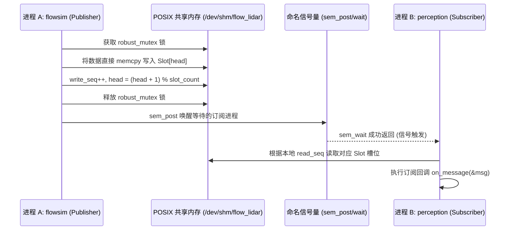

# 第 04 章：跨进程共享内存通信（POSIX SHM & IPC）

> **本章导读**：
> 在自动驾驶系统中，多进程架构（Multi-process Isolation）是实现故障隔离与高可靠性的必要手段。然而，传统的跨进程通信（如 TCP Socket、Unix Domain Socket、管道）不可避免地存在**内核态上下文切换（Context Switch）与多次内存拷贝**的性能损耗。
>
> KunAutoDrive 基于 **POSIX 共享内存（`shm_open` + `mmap`）**与**健壮互斥锁（Robust Mutex）**构建了亚微秒级延迟的 `IpcChannel`，不仅实现了大吞吐数据的零拷贝跨进程流动，还具备**进程异常崩溃自愈（Crash Resilience）**能力。

---

## 1. 为什么自动驾驶需要 POSIX 共享内存？

对比几种主流跨进程通信机制在传输 100KB 点云或图像时的性能：

| 通信机制 | 内存拷贝次数 | 上下文切换 | 传输延迟 | 崩溃恢复难度 |
| :--- | :---: | :---: | :---: | :---: |
| **TCP / UDP Loopback** | 2~4 次 (用户态⇄内核态) | 频繁 | 100 ~ 500 μs | 低 (内核自动回收套接字) |
| **Unix Domain Socket (AF_UNIX)** | 2 次 | 频繁 | 30 ~ 80 μs | 中 |
| **POSIX SHM (KunAutoDrive)** | **0 次 (直接共享物理内存页)** | **0 次 (用户态互斥锁)** | **< 2 μs** | 需 Robust Mutex 支持 |

---

## 2. 共享内存环形缓冲区内存布局

当 Publisher 调用 `ipc_channel_open` 创建通道时，系统在 `/dev/shm/` 虚拟文件系统下分配一段连续内存并映射至虚拟地址空间：

```
POSIX 共享内存物理页映射布局:
┌──────────────────────────────────────────────────────────────────────────────┐
│ 0x0000: [IpcHeader 共享内存控制头]                                            │
│         ├── magic: uint32_t (0x464C5749 "FLWI")                              │
│         ├── version: uint32_t                                                │
│         ├── robust_mutex: pthread_mutex_t (PTHREAD_MUTEX_ROBUST 进程间共享)  │
│         ├── write_seq: uint64_t (原子递增发布序号)                            │
│         ├── head: uint32_t (写入游标)                                        │
│         └── slot_count: uint32_t (队列深度，如 32)                            │
├──────────────────────────────────────────────────────────────────────────────┤
│ 0x0100: [Slot 0 消息槽位: Message (64KB)]                                    │
│         ├── msg_id, topic, timestamp_us, data_size...                        │
│         └── data: uint8_t[65536] (有效载荷)                                  │
├──────────────────────────────────────────────────────────────────────────────┤
│ 0x10100: [Slot 1 消息槽位: Message (64KB)]                                   │
│ ...                                                                          │
│ 0x1F0100: [Slot 31 消息槽位: Message (64KB)]                                  │
└──────────────────────────────────────────────────────────────────────────────┘
```

---

## 3. 核心 API 与读写时序

### 3.1 跨进程发布与订阅接口

```c
/* include/ipc_channel.h */

typedef enum {
    IPC_ROLE_PUBLISHER  = 0,   /**< 创建并写入共享内存 */
    IPC_ROLE_SUBSCRIBER = 1,   /**< 打开并读取共享内存 */
} IpcRole;

// 打开或创建 IPC 共享内存通道
IpcChannel* ipc_channel_open(const char* channel_name, 
                             IpcRole role, 
                             uint32_t queue_depth);

// 发布消息（零拷贝写入共享槽位）
int ipc_channel_publish(IpcChannel* ch, const char* topic, const char* sender,
                        const void* data, uint32_t size);

// 启动后台读取线程并注册回调
int ipc_channel_subscribe(IpcChannel* ch, MessageCallback callback, void* user_data);
int ipc_channel_start(IpcChannel* ch);
```

### 3.2 跨进程读写时序图


---

## 4. 关键技术：健壮互斥锁（Robust Mutex）与崩溃自愈

在多进程共享内存系统中，最致命的隐患是：**如果持有互斥锁的进程在临界区内突然被 `kill -9` 杀死，该互斥锁将被永久死锁！**

KunAutoDrive 采用 **POSIX Robust Mutex（健壮互斥锁）** 机制彻底解决此难题：

```c
/* 初始化进程间共享的健壮互斥锁 */
pthread_mutexattr_t attr;
pthread_mutexattr_init(&attr);
pthread_mutexattr_setpshared(&attr, PTHREAD_PROCESS_SHARED); // 跨进程共享
pthread_mutexattr_setrobust(&attr, PTHREAD_MUTEX_ROBUST);     // 开启崩溃健壮性
pthread_mutex_init(&header->mutex, &attr);
```

### 崩溃恢复处理逻辑：
当持有锁的进程崩溃退出后，另一个进程调用 `pthread_mutex_lock` 会收到 `EOWNERDEAD` 错误码：

```c
int rc = pthread_mutex_lock(&header->mutex);
if (rc == EOWNERDEAD) {
    LOG_WARN("IPC", "检测到持有锁的进程已异常崩溃，开始恢复共享状态...");
    
    // 1. 修复可能处于半写入状态的共享元数据
    header->in_critical_section = false;
    
    // 2. 声明互斥锁状态已恢复一致性
    pthread_mutex_consistent(&header->mutex);
    
    // 3. 正常解锁或继续执行
    pthread_mutex_unlock(&header->mutex);
}
```

---

## 5. 跨进程大 JSON 分块传输（Dashboard Bridge）

当传输全局监控拓扑与 3D 渲染包（可能高达数兆字节）时，KunAutoDrive 在 `src/core/dashboard_bridge.c` 中实现了**分块重组传输协议（Chunked Transfer Protocol）**：
- 发送方将大 JSON 分割为若干小于 64KB 的 Chunk，附带 `chunk_idx` 与 `chunk_total`；
- 接收方守护进程 `flowmond` 在本地预分配拼装缓冲区，按序列号组装，并在最后一帧到达时完成整体解析并推送到前端 Web 客户端。

---

## 6. 工业级避坑指南

### 避坑 1：未正确释放导致的 `/dev/shm` 内存泄漏
POSIX `shm_open` 创建的共享内存独立于进程生命周期。即使所有相关进程退出，共享内存对象仍会驻留在操作系统的 `/dev/shm/` 内存文件系统中。
- **最佳实践**：在通道关闭时由最后一个活跃角色调用 `shm_unlink()`；或在程序启动初始化时自动扫描并清理过期的残留 handle。

### 避坑 2：多读者广播场景下的慢读者（Slow Consumer）处理
当 Publisher 发布速度远快于 Subscriber 读取速度时，环形缓冲区将被覆盖。
- KunAutoDrive 采用 **Drop-Oldest（丢弃最老）** 原则：Subscriber 发现本地读取序号 `read_seq` 严重落后于 `header->write_seq - slot_count` 时，自动跳跃指针至最新窗口，并将落后的差值累加到 `drop_count` 遥测指标中，避免读取脏数据。

---

*下一章预告：第 05 章将讲解 KunAutoDrive 数据持久化核心——Bag v2 与标准 MCAP 格式的录制与回放引擎。*
