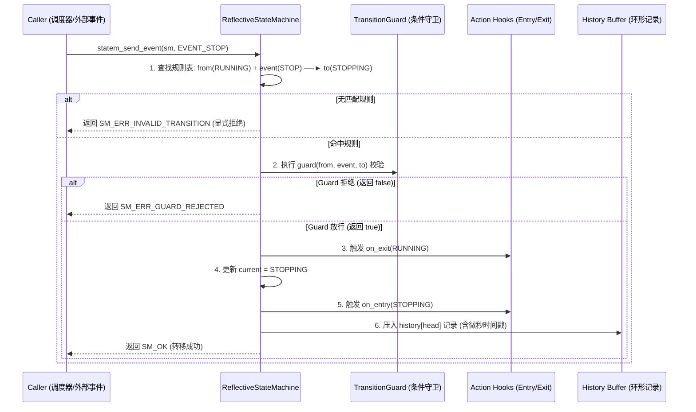

# 第 04 章：状态机把自己的转移表摊开给你看

> **v2 范式章节**（2026-09 整治后保留）。本章保留低行号密度、真技术书
> 风格，参照 `docs/book/README.md` 写作风格约束与 `docs/book/08_discovery.md`
> 范式示范。v1 行号清单版本归档于 `docs/_archive/book_v1/`。

任务节点的生命周期（`INITIALIZED` → `RUNNING` → `STOPPING`）是一个状态机，上层 ADAS 的跟车、变道、让行、掉头、紧急停车也是。用硬编码的 `switch-case` 写当然能跑，但出事之后有两个问题答不上来：当前状态下允许收哪些事件？上一次是怎么跳到这里的？

KunAutoDrive 的反射式状态机（Reflective State Machine）把转移矩阵（Transition Matrix）、Guard 守卫条件、Entry/Exit 钩子和一段环形历史都放在内存里，随时可以查。

## 先看 switch-case 会缺什么

```
传统 switch-case FSM (黑盒):
┌───────────────────────────────────────────────────────────────┐
│  switch(state) {                                              │
│    case RUNNING: if(event==STOP) state = STOPPING; break;     │
│  }                                                            │
│  痛点: 外部无法查询"当前允许接收哪些事件"；历史状态不可追溯； │
│        缺漏分支时静默失败或异常锁死。                         │
└───────────────────────────────────────────────────────────────┘

KunAutoDrive 反射式 FSM (自描述白盒):
┌──────────────────────────────────────────────────────────┐
│  ReflectiveStateMachine                                  │
│   ├── current_state: RUNNING                             │
│   ├── rules[]: [RUNNING + STOP ──(guard)──► STOPPING]    │
│   ├── history[8]: 记录最近 8 次转移 (from, event, to, ts)│
│   ├── statem_can(event): O(1) 查询当前动作是否合法       │
│   └── statem_dump_json(): 导出状态机拓扑供前端实时渲染   │
└──────────────────────────────────────────────────────────┘
```

## 结构体里装着一张能查的转移表

```c
/* include/state_machine.h */

typedef int32_t StateId;
typedef int32_t EventId;

/** 转移表中的单条规则 */
typedef struct {
    StateId     from;           /**< 源状态 */
    EventId     event;          /**< 触发事件 */
    StateId     to;             /**< 目标状态 */
    const char* description;    /**< 人类可读描述，如 "INITIALIZED + START -> RUNNING" */
    bool        is_auto;        /**< 是否自动触发 */
} TransitionRule;

/** 状态机核心结构 */
typedef struct {
    StateId                 current;
    const TransitionRule*   rules;          /**< 静态只读转移规则表 */
    uint32_t                rule_count;
    TransitionGuard         guard;          /**< 动态守卫条件回调 */
    StateAction             on_entry;       /**< 状态进入 Action */
    StateAction             on_exit;        /**< 状态退出 Action */
    TransitionDebugHook     debug_hook;     /**< 调试追踪钩子 */
    TransitionRecord        history[8];     /**< 环形历史记录缓冲 (微秒时间戳) */
    uint32_t                history_head;
    pthread_mutex_t*        mutex;          /**< 并发保护锁 */
} ReflectiveStateMachine;
```

## 一次转移要经过哪些步骤

事件和状态看起来不少，但真正走一遍转移的过程是固定的 5 步流水线：



## 定义一个 6 状态的行为决策机

下面这段代码在规划层写了一个 6 状态的行为决策机：

```c
/* 1. 定义状态与事件枚举 */
enum BehaviorState {
    BEH_STATE_CRUISE = 0,     // 巡航
    BEH_STATE_FOLLOW,         // 跟车
    BEH_STATE_CHANGE_LANE,    // 变道
    BEH_STATE_YIELD,          // 让行
    BEH_STATE_UTURN,          // 掉头
    BEH_STATE_EMERGENCY_STOP  // 紧急制动
};

enum BehaviorEvent {
    BEH_EV_OBSTACLE_AHEAD = 16,
    BEH_EV_LANE_CLEAR,
    BEH_EV_REACH_INTERSECTION,
    BEH_EV_SAFETY_ALERT
};

/* 2. 声明确定性转移规则表 (以 TRANSITION_TABLE_END 哨兵结尾) */
static const TransitionRule BEHAVIOR_RULES[] = {
    { BEH_STATE_CRUISE,    BEH_EV_OBSTACLE_AHEAD,     BEH_STATE_FOLLOW,        "巡航遇前车 -> 跟车", false },
    { BEH_STATE_FOLLOW,    BEH_EV_LANE_CLEAR,          BEH_STATE_CHANGE_LANE,   "侧向空闲 -> 变道",   false },
    { BEH_STATE_FOLLOW,    BEH_EV_REACH_INTERSECTION, BEH_STATE_UTURN,         "到达掉头口 -> 掉头", false },
    { BEH_STATE_CRUISE,    BEH_EV_SAFETY_ALERT,       BEH_STATE_EMERGENCY_STOP,"安全报警 -> 急停",   false },
    { BEH_STATE_FOLLOW,    BEH_EV_SAFETY_ALERT,       BEH_STATE_EMERGENCY_STOP,"安全报警 -> 急停",   false },
    TRANSITION_TABLE_END
};

/* 3. 运行时初始化与事件驱动 */
ReflectiveStateMachine sm;
statem_init(&sm, BEHAVIOR_RULES, BEH_STATE_CRUISE);

// 外部事件触发
int ret = statem_send_event(&sm, BEH_EV_OBSTACLE_AHEAD);
if (ret == SM_OK) {
    printf("状态机成功切换至: %s\n", statem_get_state_name(&sm, sm.current));
}
```

## 出事之后怎么问状态机

状态机自带几个在线自省函数。运维工具 `flowctl` 和 Web 仪表盘靠它们把状态拓扑取出来：

```c
// 1. 查询当前是否允许执行某事件 (O(1) 预判)
bool can_uturn = statem_can_event(&sm, BEH_EV_REACH_INTERSECTION);

// 2. 导出 JSON 格式的状态机图元 (供 FlowBoard 实时渲染)
char json_buf[4096];
statem_export_json(&sm, json_buf, sizeof(json_buf));

// 3. 打印最近 8 次转移调用栈 (排查事故与死锁)
statem_dump_history(&sm);
```

## 速查表：改状态机之前先过一遍

下面两行是 2026-08 那次掉头死锁排查之后沉淀下来的。改转移表或者写 Guard 之前，先对着看一眼。

| 检查项 | 出过什么事 | 现在怎么做 |
| --- | --- | --- |
| 转移表是否覆盖 `[State × Event]` | 2026-08 掉头死锁：某模块在「掉头中」收到「红灯」事件，转移表里没有这条规则，事件被静默拒绝，掉头指令就此锁死且不回退 | 任何 `[State × Event]` 组合，必须显式声明转移目标，或者显式拒绝并记录 ERROR 日志，不留未定义行为 |
| Guard 是不是纯函数 | Guard 一旦带上副作用，返回 `false` 时状态机不发生转移，外部变量却已经被改过，两边就此不同步 | Guard 只负责校验条件（如 `distance > 5.0m`），不在内部修改外部变量、发送消息或申请锁 |

还有一条能省时间的做法：排查状态问题时，先用 `statem_dump_history()` 把最近 8 次转移打出来（这个函数本来就是为排查事故与死锁准备的），再回头看转移表。

## "反射"到底反射了什么

先把词说清楚。"反射"（reflection）在这里不是 Java 那种运行时自省，而是**状态机在跑的同时
还持有自己的结构，并能主动把它交出来**。KunAutoDrive 把它落成了一件事：转移表是内存里的
一张普通数组，运行时既是转移的唯一依据，也是所有查询的原点。

最能说明这件事的是那张表被扫了几遍。`find_transition` 找规则时扫两遍——第一遍找 `(from,
event)` 完全匹配且非自动的规则，找不到才做第二遍，找同 `from` 的自动转移。`statem_init`
在初始化时先扫一遍数出 `static_size`。`statem_allowed_events` 每次被问就把表整个扫一遍，
边扫边去重。`statem_is_terminal` 再扫一遍看有没有出边。

```
                        ┌─────────────────────────┐
                        │   TransitionRule[]      │
                        │  (同一份 const 数组)     │
                        └────────────┬────────────┘
             ┌───────────────────────┼───────────────────────┐
             ▼                       ▼                       ▼
      驱动转移（扫）          提供自省（扫）           提供渲染（导出）
   send_event_ex:         allowed_events:          export_json →
   查表→guard→hooks       "当前能接哪些"            前端画状态图
```

**"同一张表驱动转移和自省两遍"这个说法，价值不在"省了几行代码"，在"不可能不一致"。** 自省
接口不是从转移逻辑里重新推导出来的第二套规则，它就是转移逻辑本身换个方向走了一遍。运维问
"现在能不能发 STOP"，得到的答案和真发一次会得到的答案，出自同一次表扫描。

### 另一种选择

更常见的做法是：转移逻辑里额外维护一个"当前允许事件"的运行时集合，收到事件时先查这个集合。
这样 `can_event` 是 O(1)，不用扫表。代价是这个集合必须和转移表手工保持一致——每加一条规则
就想起来更新一次集合，忘了就是"自省说行、实际不行"或者反过来。对一个正确性-critical 的
基础设施，我选 O(规则数) 的扫表：规则表是十几个条目量级，扫表成本可以忽略，而"两个真相
源"的一致性 bug 是没法靠 review 抓干净的。

代价我也认：扫表让"加规则"这件事从改一个数据结构变成改两处语义。真正的解法是让规则表成为
唯一可写入口（比如支持运行时动态追加规则），这正是这套实现里 `dynamic_rules` 那部分存在的
理由——它让"新加一条转移"这件事也不需要手抄第二份。

## guard 的代价：每个事件都要跑一遍判断

先纠正一个常见的直觉：**guard 不是每个事件都跑。** `find_transition` 先查表，压根没有匹配
规则的事件在查表那一步就返回"非法转移"了，根本走不到 guard。guard 只在"表里有这条规则、
而且确实想走"的时候才被调用一次。

所以 guard 的真实代价不是频率，是**位置**。它站在状态变更的正中间：

```
   查表命中
      │
      ▼
   guard(from, event, to)  ←── 唯一由业务代码决定"这一步能不能走"的地方
      │  返回 false
      ├──────────────────► 状态不变，返回 GUARD_REJECTED
      │                      （注意：不是非法转移，是"合法但条件不满足"）
      ▼  返回 true
   on_exit → 改 current → on_entry → 写 history
```

这个位置带来三个现实约束，都是踩出来的：

| 约束 | 违反后果 |
|---|---|
| 必须是纯函数 | 返回 false 时状态不变，但它改过的外部变量回不去，两边就此不同步 |
| 不能阻塞、不能加锁 | guard 在状态机的临界路径上，读传感器或等锁会把转移延迟直接传导到控制周期 |
| 返回 false 的语义要和"非法"区分开 | 两者都表现为"没转移"，但一个可以重试、一个重试一万次也一样 |

第三条尤其容易出错。返回 `false` 的 guard 意味着"**规则是这条规则，只是这次不行**"——调用
方等一个条件满足再试是合理的。而"非法转移"意味着"这个状态下压根没这条路"，重试是没有意义
的。这两件事在返回值上被刻意分成了两个错误码，就是为了让人能写出正确的重试逻辑。

> **作者立场**：我倾向于认为 guard 应该是"廉价且确定"的——只读几个已经算好的数。它一旦需要
> 读传感器、查数据库、或者做任何有不确定性的事，转移就从"确定的"变成"概率的"，而状态机
> 的所有自省能力（历史、拓扑导出、当前允许事件）都建立在"状态变化可预测"这个前提上。

## 非法事件策略为什么必须显式定义

`illegal_policy` 有三档，默认是"打条告警然后忽略"。

```
   收到一个当前状态不接受的事件
              │
    ┌─────────┼──────────────┐
    ▼         ▼              ▼
  WARN      REJECT      GOTO_ERROR
  日志+忽略   静默拒绝     强制进 ERROR
  状态不变    状态不变      状态改变
    │         │              │
  默认档     高频事件      故障兜底
  适合调试   适合已知噪声   适合"进了就不对"的系统
```

为什么必须显式：这三档的**副作用完全不同**。前两档状态不变，第三档会改状态。也就是说，
"我在调试时用 WARN 跑通了，换成 GOTO_ERROR 就跑不通"这种事完全可能发生，而且是设计使然，
不是 bug。

更关键的是默认档的问题：WARN 只在 `trace_enabled` 为真时才打日志。也就是说**一个不主动
开 trace 的生产环境，非法事件是完全静默的**——状态不变，函数返回错误码，如果调用方没检查
返回值，整个系统看起来一切正常，实际上那个事件被吞了。这正是第 08 章末尾讲的那类"静默失败"
的家族成员。

所以这个默认值我认为是**为了向后兼容而选的，不是为了正确而选的**。新写的状态机应该显式
设一档：生命周期类的状态机（`INITIALIZED → RUNNING → STOPPING`）我倾向 `GOTO_ERROR`——
在"掉头中"收到"红灯"这种事件，本来就意味着系统进入了不该在的状态，静默忽略只会让问题拖
到下游；而行为决策那类每帧都在收各种环境事件的状态机，我倾向 `REJECT`——事件噪声是常态，
把它升级成 ERROR 只会制造假故障。

> **作者立场**：这个默认值我不认同，但我不打算改它，因为改了会打断所有现存调用方。更合适的
> 做法是让**新建**状态机在初始化时必须显式传一档策略，把默认值变成"未配置"而不是"配置成
> WARN"——让沉默的默认值变成一声编译期的抱怨。

## 状态机、行为树、有限状态机：边界在哪

这三个词经常混着用，但它们解决的其实是三个不同的问题。

| | 有限状态机（本文这套） | 行为树 | 分层状态机 |
|---|---|---|---|
| 拓扑 | 扁平的 State × Event 表 | 树，按 tick 从根往下走 | 状态里再套子状态机 |
| 转移代价 | 一次表扫描 | 一次树遍历，可能带黑板读写 | 跨层，可能连带退出整棵子树 |
| 表达"优先级" | 要靠 guard 硬编码顺序 | 子节点顺序天然是优先级 | 要靠层与层之间的约定 |
| 表达"流程" | 很吃力 | 天然擅长 | 一般 |
| 可自省 | 表可以直接导出 | 需要额外的解释器 | 表可以导出，但语义要分层读 |

KunAutoDrive 选的是有限状态机，理由和选 17 个独立进程是同一个：**中间件的第一职责是让故障
可定位**。扁平表的一个巨大优势是，任何时刻"我在哪、能去哪、为什么没去"三个问题都能通过
一次遍历回答，不需要一个行为树解释器。行为树在"决策逻辑复杂、要表达 fallback 和并行动作"
时优势巨大，但它的代价是：**出问题时你看到的是"树走到了某个节点"，而不是"某个条件判断通过
了"**。中间件层宁可选那个更笨的。

同时也别把行为树说得太神。它的可组合性建立在"节点之间通过黑板通信"上，而黑板是个无类型
共享内存——本质上就是把所有耦合藏进了一个不带检查的地方。第 15 章讲的行为决策之所以能在
没有行为树的情况下把"巡航/跟车/变道/让行"排清楚，靠的是把优先级编码进转移表的顺序和
guard，而不是靠树的深度。

> **作者立场**：我会按"这个逻辑需要表达 fallback 链吗"来分界。需要，就上行为树或者状态机
> 里的 `is_auto` 链；不需要，只是"这一状态下该做什么"，就用有限状态机。**中间件层我反对
> 用行为树**——不是因为它不好，是因为它把"出错时最需要看清的那一层"藏起来了。

