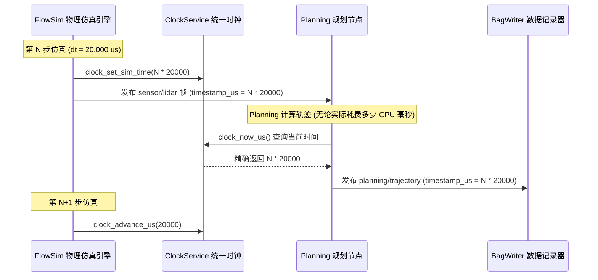

# 第 06 章：确定性统一时钟服务（Clock Service）

> **本章导读**：
> 在自动驾驶系统中，时间戳（Timestamp）是多传感器融合与控制闭环的“灵魂”。传感器采样（LiDAR 10Hz、GPS 20Hz、IMU 100Hz）如果缺乏统一且确定性的时间基准，会导致严重的**时序对齐偏差（Temporal Misalignment）**与滤波发散。
>
> FlowEngine 提供了统一的 `ClockService`，不仅严格规范了全链路 **`uint64_t timestamp_us`（微秒）** 语义，还实现了**真实物理时钟与仿真步进时钟的无缝切换**，确保仿真实验在数学上 100% 可复现。

---

## 1. 自动驾驶时钟三大维度的矛盾与统一

自动驾驶系统在不同运行模式下对时钟有着截然不同的需求：

```
                      ┌────────────────────────────────────────────────────────┐
                      │              FlowEngine 统一时钟三层源                  │
                      ├────────────────────────────────────────────────────────┤
  1. 逻辑调度时间     │  clock_now_us()                                        │
     (算法消费)       │  • 实车模式: 返回真实 CLOCK_MONOTONIC 单调时间          │
                      │  • 仿真模式: 返回由仿真器步进驱动的逻辑时钟 (如 +20ms)   │
                      ├────────────────────────────────────────────────────────┤
  2. 真实性能测量     │  clock_now_monotonic_wall_us()                         │
     (QoS/延迟统计)   │  • 永远返回真实的 CLOCK_MONOTONIC 墙钟物理微秒          │
                      │  • 确保在仿真模式下仍能精准计算算法真实执行耗时与 p99   │
                      ├────────────────────────────────────────────────────────┤
  3. 全球绝对时间     │  clock_now_realtime_us()                               │
     (日志/GNSS 对时) │  • 返回基于 Unix Epoch 的 CLOCK_REALTIME 微秒时间戳     │
                      │  • 供训练样本采集、跨机授时与全球绝对时间同步          │
                      └────────────────────────────────────────────────────────┘
```

---

## 2. 全链路微秒语义规范（`timestamp_us`）

In FlowEngine 中，所有数据结构（`Message`、`Pose`、`LidarFrame`、`ImuData`）必须遵守以下时间戳铁律：

1. **类型统一**：必须为 `uint64_t`，单位严格为**微秒（μs）**，禁止出现秒（`double`）或毫秒（`ms`）的混用。
2. **GNSS 采集时刻优先（Acquisition Time Priority）**：
   - 传感器数据的时间戳应为**物理光电/电磁脉冲触发的采集瞬间**，而非主机 CPU 收到串口数据的时刻；
   - GPS 驱动解析 NMEA 语句时，自动将 UTC 年月日时分秒转换为主机 Epoch 微秒时间戳。
3. **防溢出保证**：`uint64_t` 微秒数支持连续运行超过 **58 万年**，杜绝 32 位时间戳溢出回滚（Y2038 问题）。

---

## 3. 确定性仿真时钟步进机制（Deterministic Stepping）

在离线仿真模式下，计算机的计算速度可能比真实世界更快（如 1 秒算完 10 秒的物理仿真）或更慢（如加载重型神经网络时单帧耗时 200ms）。
如果依赖真实系统时钟，仿真结果将随着 CPU 负载波动而失去可复现性！



---

## 4. 解决“仿真时钟污染”：双轨测量设计

在过去，很多自动驾驶框架在仿真回放时直接把全局单调时钟劫持为录制时间。这导致了一个致命缺陷：
- 在同一个仿真 tick 内，发布与消费处于同一逻辑时刻，计算出的传输延迟 `latency = now - msg_ts` **恒为 0**！
- 跨 tick 处理时，延迟又突然跃升为 20ms 的整数倍。这使 **Topic 统计（p50/p99 延迟监控）彻底失效**。

FlowEngine 通过引入 `clock_now_monotonic_wall_us()` 解决此痛点：
- **算法决策逻辑** 消费 `clock_now_us()`（保证确定性）；
- **总线 QoS / 遥测系统** 消费 `clock_now_monotonic_wall_us()`（保证真实物理时延统计的准确性）。

---

## 5. 核心 API 参考

```c
/* include/clock_service.h */

#include "clock_service.h"

/* 1. 算法日常获取时间 */
uint64_t now_us = clock_now_us();

/* 2. 仿真引擎控制时间推进 */
clock_set_sim_mode(true);           // 开启仿真模式
clock_set_step_us(20000);           // 设置步长为 20ms (50Hz)
clock_set_sim_time(1700000000000ULL);

while (sim_running) {
    physics_step(0.02);
    clock_advance_us(20000);        // 推进 20ms
}
clock_set_sim_mode(false);          // 仿真结束，切回物理时钟

/* 3. 测量代码块纯净物理耗时 */
uint64_t t_start = clock_now_monotonic_wall_us();
run_heavy_algorithm();
uint64_t cost_us = clock_now_monotonic_wall_us() - t_start;
```

---

## 6. 工业级避坑指南

### 避坑 1：严禁直接调用 `gettimeofday()` 或 `clock_gettime()`
- 散落在各个节点的裸 `clock_gettime()` 会导致节点在进入 Bag 回放或仿真模式时，依然读取真实墙钟，造成卡尔曼滤波的预测时间步长 `dt` 错乱甚至产生负数。必须统一调用 `clock_now_us()`。

### 避坑 2：时钟回拨与负时间步长（Negative dt）保护
- 当从 Bag 文件中 Seek 跳转或多传感器对时时，可能出现后到达的数据时间戳小于当前时钟的情况。滤波算法（如 EKF）必须增加硬保护：
  ```c
  int64_t dt_us = (int64_t)(msg->timestamp_us - last_ts_us);
  if (dt_us <= 0 || dt_us > 1000000) { // 异常跳变或负时间
      LOG_WARN("EKF", "检测到时间戳回拨或异常跳跃 dt=%ld us, 重置局部时钟", dt_us);
      last_ts_us = msg->timestamp_us;
      return;
  }
  ```

---

*下一章预告：第 07 章将深入探讨 FlowEngine 的数据契约基石——零反射类型安全序列化层（Serializer & IDL Codegen）。*
