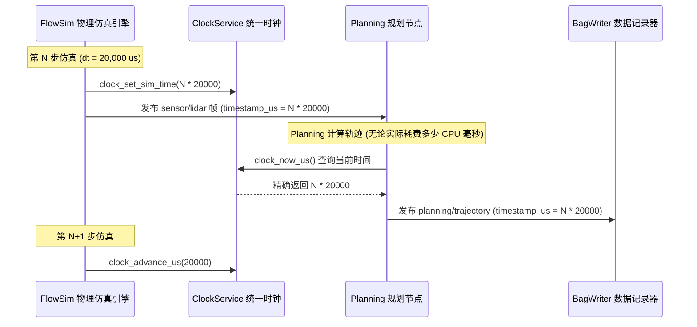

# 第 06 章：仿真时钟和物理时钟，到底该听谁的？

LiDAR 跑 10 Hz，GPS 跑 20 Hz，IMU 跑 100 Hz。它们各自给自己打上时间戳，再一起送进同一个滤波器。只要其中任何一个的时间戳站的不是同一条时间轴，融合结果就会开始漂——这是**时序对齐偏差（Temporal Misalignment）**与滤波发散最常见的起点。

更麻烦的是仿真。同一个 `ClockService` 要同时满足两件互相拉扯的需求：算法要的是一条完全确定、可以复现的逻辑时间线，而 QoS 和延迟统计要的是真实物理世界里的耗时。KunAutoDrive 的做法是让两者并存，各自有各自的来源。

## 一秒钟在系统里有三种含义

`ClockService` 按用途把时间拆成三种，给三个入口：

```
                      ┌────────────────────────────────────────────────────────┐
                      │              KunAutoDrive 统一时钟三层源               │
                      ├────────────────────────────────────────────────────────┤
  1. 逻辑调度时间     │  clock_now_us()                                        │
     (算法消费)       │  • 实车模式: 返回真实 CLOCK_MONOTONIC 单调时间         │
                      │  • 仿真模式: 返回由仿真器步进驱动的逻辑时钟 (如 +20ms) │
                      ├────────────────────────────────────────────────────────┤
  2. 真实性能测量     │  clock_now_monotonic_wall_us()                         │
     (QoS/延迟统计)   │  • 永远返回真实的 CLOCK_MONOTONIC 墙钟物理微秒         │
                      │  • 确保在仿真模式下仍能精准计算算法真实执行耗时与 p99  │
                      ├────────────────────────────────────────────────────────┤
  3. 全球绝对时间     │  clock_now_realtime_us()                               │
     (日志/GNSS 对时) │  • 返回基于 Unix Epoch 的 CLOCK_REALTIME 微秒时间戳    │
                      │  • 供训练样本采集、跨机授时与全球绝对时间同步          │
                      └────────────────────────────────────────────────────────┘
```

这三个入口混用的时候不会当场报错，往往要等到某条曲线上出现说不通的抖动才被发现。

## 时间戳的约定：uint64_t、微秒、采集那一瞬间

KunAutoDrive 里所有数据结构（`Message`、`Pose`、`LidarFrame`、`ImuData`）都遵守同一套时间戳约定：

1. 类型统一：必须为 `uint64_t`，单位严格为微秒（μs），禁止出现秒（`double`）或毫秒（`ms`）的混用。
2. GNSS 采集时刻优先（Acquisition Time Priority）：
   - 传感器数据的时间戳应为物理光电/电磁脉冲触发的采集瞬间，而非主机 CPU 收到串口数据的时刻；
   - GPS 驱动解析 NMEA 语句时，自动将 UTC 年月日时分秒转换为主机 Epoch 微秒时间戳。
3. 防溢出保证：`uint64_t` 微秒数支持连续运行超过 58 万年，杜绝 32 位时间戳溢出回滚（Y2038 问题）。

## 仿真里的时间不跟着 CPU 跑

离线仿真时，计算机的计算速度可能比真实世界更快（如 1 秒算完 10 秒的物理仿真），也可能更慢（如加载重型神经网络时单帧耗时 200ms）。如果这时候还去问真实系统时钟，仿真结果就会随着 CPU 负载波动而失去可复现性。



仿真的推进权因此完全在仿真器手上：每一步由 `clock_set_sim_time()` 设定当前逻辑时刻，算完再 `clock_advance_us()` 往前走一步。规划节点无论实际消耗了多少 CPU 毫秒，查到的都是同一个 N * 20000。

## 为什么仿真里算出来的延迟全是 0

很多框架在仿真回放时直接把全局单调时钟劫持为录制时间，后果很具体：

- 在同一个仿真 tick 内，发布与消费处于同一逻辑时刻，计算出的传输延迟 `latency = now - msg_ts` 恒为 0；
- 跨 tick 处理时，延迟又突然跃升为 20ms 的整数倍，Topic 统计（p50/p99 延迟监控）随之失效。

KunAutoDrive 的解法是让两条测量轨道并存：

- 算法决策逻辑消费 `clock_now_us()`，保证确定性；
- 总线 QoS / 遥测系统消费 `clock_now_monotonic_wall_us()`，保证真实物理时延统计的准确性。

## 平时会用到的几个调用

```c
/* include/clock_service.h */

#include "clock_service.h"

/* 1. 算法日常获取时间 */
uint64_t now_us = clock_now_us();

/* 2. 仿真引擎控制时间推进 */
clock_set_sim_mode(true);           // 开启仿真模式
clock_set_step_us(20000);           // 设置步长为 20ms (50Hz)
clock_set_sim_time(1700000000000ULL);

while (sim_running) {
    physics_step(0.02);
    clock_advance_us(20000);        // 推进 20ms
}
clock_set_sim_mode(false);          // 仿真结束，切回物理时钟

/* 3. 测量代码块纯净物理耗时 */
uint64_t t_start = clock_now_monotonic_wall_us();
run_heavy_algorithm();
uint64_t cost_us = clock_now_monotonic_wall_us() - t_start;
```

## 三个真的踩过的坑

### 节点绕过 ClockService 自己去读墙钟

现象是 Bag 回放时卡尔曼滤波的预测时间步长 `dt` 忽大忽小，还出现过负数。查下来，是各个节点里散落的裸 `clock_gettime()`——进入 Bag 回放或仿真模式后，它们读到的仍然是真实墙钟。改法很直接：所有取时间的地方统一调用 `clock_now_us()`。

### 时间戳回拨，把 dt 喂成了负值

从 Bag 文件 Seek 跳转，或者多传感器对时的时候，后到达的数据时间戳有可能小于当前时钟。这种数据在交给滤波算法（如 EKF）之前，必须有一道硬保护：

  ```c
  int64_t dt_us = (int64_t)(msg->timestamp_us - last_ts_us);
  if (dt_us <= 0 || dt_us > 1000000) { // 异常跳变或负时间
      LOG_WARN("EKF", "检测到时间戳回拨或异常跳跃 dt=%ld us, 重置局部时钟", dt_us);
      last_ts_us = msg->timestamp_us;
      return;
  }
  ```

这一章的代码不多，规矩却很硬：取时间只留 `ClockService` 一个入口。绕过它，系统不会立刻报错，只会在某次回放里给你一条看不懂的曲线。
