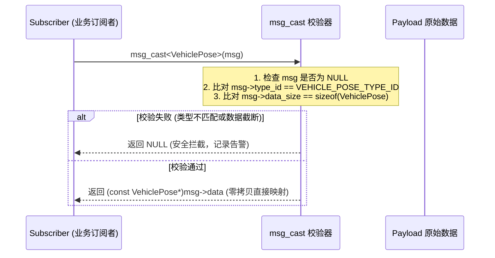

# 第 07 章：把类型错误挡在编译期

消息层里最危险的一行代码，是那个谁都不想写的强制转换。发布者发的是 `ImuData`，订阅者要是照着 `GpsData` 去解引用，内存会越界，而编译器一句话都不会说。

传统方案不是没有：Google Protobuf 和 ROS2 CDR 都能把类型管住。但在嵌入式与微内核环境里，它们显得厚重，还伴着多次内存拷贝。KunAutoDrive 想同时要到另外两样东西——零反射、亚纳秒级的开销，以及编译期与运行时都成立的类型安全。

## 别人是怎么做的

三种方案放在一起，差别主要在拷贝次数和对运行时的依赖：

| 序列化方案 | 内存拷贝开销 | 反射与运行时依赖 | 跨语言能力 | 动态类型安全 |
| :--- | :---: | :---: | :---: | :---: |
| **Google Protobuf** | 2~3 次 (对象⇄Buffer) | 高 (重型 C++ 运行时) | 极强 | 强 (类型严格) |
| **ROS2 CDR (FastDDS)** | 1~2 次 | 中 (依赖 Dynamic Types) | 强 | 强 |
| **KunAutoDrive 零反射 IDL** | **0 次 (直接内联内存映射)** | **0 (纯宏 + FNV-1a Hash)** | 强 (C/C++/Python/JS) | **绝对安全 (ID 校验)** |

表里那个 0 次拷贝不是省掉一次 `memcpy`，而是根本没打算把消息搬进另一块缓冲区：消息体就在总线上那块内存里，谁要用谁直接映射过去。

## 类型 ID 是算出来的，不是分配出去的

KunAutoDrive 把消息类型名称（如 `"sensor/LidarFrame"`）过一遍 FNV-1a 哈希算法，在编译期得到一个确定性的 `uint32_t type_id`：

```c
/* 算法定义：初始基准值 2166136261，乘数 16777619 */
#define FNV1A_INIT  0x811c9dc5u
#define FNV1A_PRIME 0x01000193u

static inline uint32_t fnv1a_hash(const uint8_t* data, size_t len) {
    uint32_t hash = FNV1A_INIT;
    for (size_t i = 0; i < len; i++) {
        hash = (hash ^ data[i]) * FNV1A_PRIME;
    }
    return hash;
}
```

每个由 IDL 生成的消息头文件里，这个 ID 是硬编码进去的：
```c
#define LIDAR_FRAME_TYPE_NAME "sensor/LidarFrame"
#define LIDAR_FRAME_TYPE_ID   0x9A4F2C18u
```

## 从一份 IDL 生成头文件和 JSON 序列化器

结构体布局、类型 ID、序列化函数都不手写。KunAutoDrive 用声明式 IDL（`msg/adas_msgs.msg`）描述消息，再由 Python 生成器 `tools/msg_codegen.py` 自动产出 C 头文件与 JSON 序列化器。

### IDL 长什么样

```
# msg/adas_msgs.msg
struct VehiclePose {
    uint64  timestamp_us
    float64 x
    float64 y
    float64 z
    float32 yaw
    float32 speed
}
```

### 生成流水线

```bash
python3 tools/msg_codegen.py msg/adas_msgs.msg build/gen/adas_msgs_gen.h
```

生成物里有四样东西：
1. C 内存对齐结构体：带确切的字节 padding；
2. C++ 模板特化：绑定 `type_id`；
3. JSON 序列化/反序列化函数：供 Web 仪表盘与日志导出使用；
4. 二进制打包与校验函数。

## msg_cast：只接收校验过的指针

订阅者收到 `const Message* msg` 之后直接强转，是最省事也最容易出事的一步。项目里只留一个入口——`msg_cast` 访问器：



### C++ 版本

```cpp
/* include/serializer.h */
template<typename T>
inline const T* msg_cast(const Message* msg) {
    if (!msg) return nullptr;
    if (msg->type_id != TypeTraits<T>::type_id) {
        LOG_ERROR("Serializer", "类型不匹配: 期望 0x%08X, 实际 0x%08X", 
                  TypeTraits<T>::type_id, msg->type_id);
        return nullptr;
    }
    if (msg->data_size < sizeof(T)) {
        LOG_ERROR("Serializer", "数据截断: 期望 >= %zu, 实际 %u", sizeof(T), msg->data_size);
        return nullptr;
    }
    return reinterpret_cast<const T*>(msg->data);
}
```

### C 版本

```c
/* include/serializer.h */
const void* msg_cast_c(const Message* msg, uint32_t expected_type_id, size_t expected_size) {
    if (!msg || msg->type_id != expected_type_id || msg->data_size < expected_size) {
        return NULL;
    }
    return (const void*)msg->data;
}

#define MSG_CAST(Type, msg) \
    ((const Type*)msg_cast_c((msg), Type##_TYPE_ID, sizeof(Type)))
```

## 跨机传输时谁来做字节序翻转

x86 主机和 ARM/DSP 边缘计算盒之间要传二进制数据，字节序得由数据自己说清楚。`Message` 结构里内嵌了 `endian_marker`：

- `0x12`：小端模式（Little-Endian，主流 x86/ARM）；
- `0x21`：大端模式（Big-Endian）；
- 读取端发现 `msg->endian_marker` 与本地架构相反时，自动对浮点数与整型做 `bswap` 字节序翻转。

## 这两处我们都返工过

### 同一份数据算出两个 CRC

现象是回放校验突然对不上：同一批有效数据，CRC 每次都不一样。原因在 C 结构体字段之间的填充对齐字节（Padding）——它们可能躺着栈上的残留随机值，直接 `memcpy` 发出去，这些字节也跟着上了线。除了校验对不上，它们还可能带出栈内存里的敏感内容。改法是在构造结构体之前显式清零：`memset(&obj, 0, sizeof(obj))`。

### 追加字段之后，老节点读到了垃圾

往已有消息里加字段，最省事的做法是直接插在中间，代价是旧字段的 `offsetof` 全变了。这一层的规矩是：必须递增 `schema_version`（如从 `v1` 升级至 `v2`）；新字段只能追加在结构体末尾，严禁在中间插入；接收端根据 `msg->schema_version` 决定是否解引用尾部新增字段。新老节点混跑时的向后兼容（Backward Compatibility）就靠这三条撑着。

到这里，消息在总线上的样子就定下来了：类型 ID 对得上，字节序说得清，字段怎么排布也写在 IDL 里。

