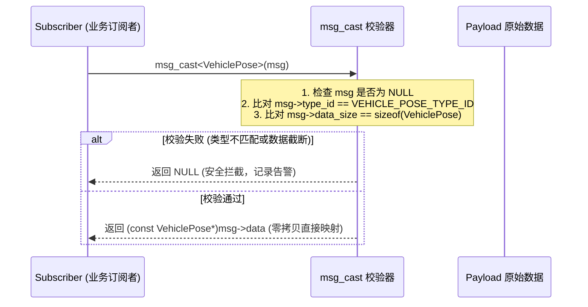

# 第 07 章：零反射类型安全序列化层（Serializer & IDL）

> **本章导读**：
> 在底层的 C/C++ 消息传输中，最危险的隐患莫过于“裸指针强制转换（`void*` Cast）”。如果发布者发送了 `ImuData`，而订阅者误按 `GpsData` 解引用，将直接引发内存越界与灾难性控制失误。然而，传统的序列化方案（如 Google Protobuf / ROS2 CDR）在嵌入式与微内核环境中又显得过于厚重且伴随多次内存拷贝。
>
> KunAutoDrive 设计了一套**零反射、亚纳秒级开销的类型安全序列化层**：通过 **FNV-1a 编译期哈希 Type ID**、**IDL 代码生成器（`msg_codegen.py`）** 与 **`msg_cast<T>` 访问器**，在保证极致零拷贝性能的同时，实现了绝对的编译期与运行时类型安全。

---

## 1. 自动驾驶序列化方案的技术选型与权衡

| 序列化方案 | 内存拷贝开销 | 反射与运行时依赖 | 跨语言能力 | 动态类型安全 |
| :--- | :---: | :---: | :---: | :---: |
| **Google Protobuf** | 2~3 次 (对象⇄Buffer) | 高 (重型 C++ 运行时) | 极强 | 强 (类型严格) |
| **ROS2 CDR (FastDDS)** | 1~2 次 | 中 (依赖 Dynamic Types) | 强 | 强 |
| **KunAutoDrive 零反射 IDL** | **0 次 (直接内联内存映射)** | **0 (纯宏 + FNV-1a Hash)** | 强 (C/C++/Python/JS) | **绝对安全 (ID 校验)** |

---

## 2. 核心原理：FNV-1a 32 位类型哈希

KunAutoDrive 将消息类型名称（如 `"sensor/LidarFrame"`）通过 **FNV-1a 哈希算法** 在编译期映射为一个确定性的 `uint32_t type_id`：

```c
/* 算法定义：初始基准值 2166136261，乘数 16777619 */
#define FNV1A_INIT  0x811c9dc5u
#define FNV1A_PRIME 0x01000193u

static inline uint32_t fnv1a_hash(const uint8_t* data, size_t len) {
    uint32_t hash = FNV1A_INIT;
    for (size_t i = 0; i < len; i++) {
        hash = (hash ^ data[i]) * FNV1A_PRIME;
    }
    return hash;
}
```

每个通过 IDL 生成的消息头文件中，均硬编码该类型的唯一 ID：
```c
#define LIDAR_FRAME_TYPE_NAME "sensor/LidarFrame"
#define LIDAR_FRAME_TYPE_ID   0x9A4F2C18u
```

---

## 3. IDL 消息定义与自动化代码生成

KunAutoDrive 采用声明式 IDL 格式（`msg/flow_types.msg`），通过 Python 代码生成器 `tools/msg_codegen.py` 自动产出 C 头文件与 JSON 序列化器。

### 3.1 IDL 语法示例
```
# msg/flow_types.msg
struct VehiclePose {
    uint64  timestamp_us
    float64 x
    float64 y
    float64 z
    float32 yaw
    float32 speed
}
```

### 3.2 自动化流水线
```bash
python3 tools/msg_codegen.py msg/flow_types.msg msg/generated/flow_types.h
```

生成的代码包含：
1. **C 内存对齐结构体**：带确切的字节 padding；
2. **C++ 模板特化**：绑定 `type_id`；
3. **JSON 序列化/反序列化函数**：供 Web 仪表盘与日志导出使用；
4. **二进制打包与校验函数**。

---

## 4. 类型安全转换器：`msg_cast` 机制

当订阅者收到 `const Message* msg` 时，严禁直接强转，必须通过 `msg_cast` 访问器：



### 4.1 C++ 优雅模板实现
```cpp
/* include/serializer.h */
template<typename T>
inline const T* msg_cast(const Message* msg) {
    if (!msg) return nullptr;
    if (msg->type_id != TypeTraits<T>::type_id) {
        LOG_ERROR("Serializer", "类型不匹配: 期望 0x%08X, 实际 0x%08X", 
                  TypeTraits<T>::type_id, msg->type_id);
        return nullptr;
    }
    if (msg->data_size < sizeof(T)) {
        LOG_ERROR("Serializer", "数据截断: 期望 >= %zu, 实际 %u", sizeof(T), msg->data_size);
        return nullptr;
    }
    return reinterpret_cast<const T*>(msg->data);
}
```

### 4.2 C 语言版本实现
```c
/* include/serializer.h */
const void* msg_cast_c(const Message* msg, uint32_t expected_type_id, size_t expected_size) {
    if (!msg || msg->type_id != expected_type_id || msg->data_size < expected_size) {
        return NULL;
    }
    return (const void*)msg->data;
}

#define MSG_CAST(Type, msg) \
    ((const Type*)msg_cast_c((msg), Type##_TYPE_ID, sizeof(Type)))
```

---

## 5. 跨平台大小端检测（Endian Marker）

为了支持在 x86 主机与 ARM/DSP 边缘计算盒之间跨平台传输二进制数据，`Message` 结构内嵌 `endian_marker`：
- **`0x12`**：小端模式（Little-Endian，主流 x86/ARM）；
- **`0x21`**：大端模式（Big-Endian）；
- 当读取端发现 `msg->endian_marker` 与本地架构相反时，自动触发针对浮点数与整型的 `bswap` 字节序翻转。

---

## 6. 工业级避坑指南

### 避坑 1：结构体 Padding 未初始化引发传输脏数据
在 C 语言中，结构体字段间的填充对齐字节（Padding）可能包含栈上的残留随机值。直接 `memcpy` 发送会导致：
- 相同的有效数据，计算出不同的 MD5 / CRC；
- 泄露栈内存中的敏感信息。
- **最佳实践**：构造结构体前必须显式 `memset(&obj, 0, sizeof(obj))` 清零。

### 避坑 2：Schema 升级时的“向后兼容（Backward Compatibility）”规范
当向已有消息追加新字段时：
- 必须递增 `schema_version`（如从 `v1` 升级至 `v2`）；
- 新字段**只能追加在结构体末尾**，严禁在中间插入字段破坏旧字段的 `offsetof`；
- 接收端应根据 `msg->schema_version` 决定是否解引用尾部新增字段。

---

*第一卷完结。下一章将进入【第二卷：执行流与高级调度】，深入探讨反射式有限状态机（Reflective State Machine）的设计与实现。*

