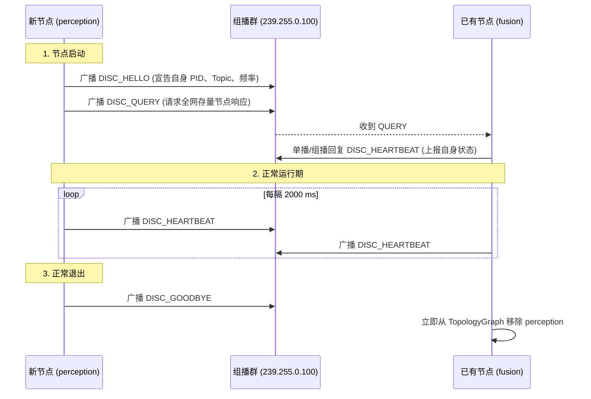

# 第 08 章：没有中心节点之后

> **v2 范式章节**（2026-09 整治后保留）。本章保留低行号密度、真技术书
> 风格，参照 `docs/book/README.md` 写作风格约束。是全书的 v2 范式标杆章。
> v1 行号清单版本归档于 `docs/_archive/book_v1/`。

第一代机器人系统（如 ROS 1）里有一个中心化的 Master 节点（`roscore`），它既是注册中心，也是整个系统的单点故障源（SPOF）：它一退出，所有节点之间的通信就彻底瘫痪了。

KunAutoDrive 借鉴了 DDS RTPS 的去中心化思路，在微内核层实现了一个基于 UDP 组播信标（Multicast Beacon）的轻量级服务发现协议 `DiscoveryManager`。每个 ADAS 节点启动时自己宣告 Pub/Sub 能力，各自拼出同一张拓扑图（Topology Graph），节点异常离线时再毫秒级地把它摘掉。

两种架构摆在一起看最清楚：

```
中心化架构 (如 ROS 1 roscore):
┌──────────────┐         ┌──────────────┐
│perception   │ ──注册─►│ roscore (单点)│ ◄──注册── [control]
└──────────────┘         └──────┬───────┘
                                │ (一旦宕机，全网瘫痪)
                                ▼

去中心化组播对等架构 (KunAutoDrive Discovery):
┌─────────────────────────────────────────────────────────────┐
│  UDP Multicast Group (239.255.0.100:5500)                   │
│                                                             │
│  [perception] ──HELLO/BEACON广播──► [fusion] ──► [control]  │
│  (任何单个节点崩溃，其他节点通过 10s 心跳超时自动剔除并重组)│
└─────────────────────────────────────────────────────────────┘
```

单点没了之后，发现这件事就落到每个进程自己身上。

## 一条信标报文里装了什么

所有节点都监听并广播到同一个标准组播地址 `239.255.0.100:5500`。信标报文采用定长与变长结合的高紧凑二进制格式：

```
组播信标二进制报文格式:
┌──────────────────────────────────────────────────────────────────────────────┐
│ [Beacon Header: 80 字节]                                                     │
│   ├── magic: char[4] = "DISC" (0x44, 0x49, 0x53, 0x43)                       │
│   ├── version: uint8_t = 1                                                   │
│   ├── msg_type: uint8_t (0=HELLO, 1=HEARTBEAT, 2=GOODBYE, 3=QUERY)           │
│   ├── name: char[64] (节点名称，如 "planning_node")                          │
│   ├── pid: uint32_t (进程 ID)                                                │
│   ├── capabilities: uint8_t (CAP_PUBLISHER | CAP_SUBSCRIBER | CAP_SERVICE)   │
│   └── topic_count: uint16_t (宣告的 Topic 数量)                              │
├──────────────────────────────────────────────────────────────────────────────┤
│ [Topic Adverts 列表: topic_count × 76 字节]                                  │
│   ├── topic: char[64] (如 "sensor/lidar")                                    │
│   ├── type_id: uint32_t (FNV-1a 类型校验码)                                  │
│   ├── capabilities: uint8_t (角色掩码)                                       │
│   └── frequency_hz: double (预期发布频率，如 10.0 Hz)                        │
├──────────────────────────────────────────────────────────────────────────────┤
│ [Footer: 10 字节]                                                            │
│   ├── ipv4_address: uint32_t | unicast_port: uint16_t                        │
│   └── crc32: uint32_t (报文完整性校验)                                       │
└──────────────────────────────────────────────────────────────────────────────┘
```

## HELLO、QUERY、HEARTBEAT、GOODBYE

四条消息覆盖了一个节点从上线到退出的完整过程：



## 拓扑图：谁和谁能对上

`DiscoveryManager` 维护着全局拓扑图 `TopologyGraph`，内部用一张二维关联矩阵算出 Pub/Sub 与依赖的匹配关系：

```c
/* include/discovery.h */

typedef struct {
    uint32_t node_count;
    NodeInfo nodes[DISC_MAX_NODES];
    uint8_t  relation[DISC_MAX_NODES][DISC_MAX_NODES];
    /* relation 标志位: 
     * 0x01 = Pub/Sub 主题完全匹配
     * 0x02 = Service/Client 服务调用匹配
     * 0x04 = Explicit Depends 显式依赖关系
     */
} TopologyGraph;
```

### 等依赖节点全部上线

启动复杂 Pipeline 时，规划节点通常必须等感知和融合节点完全上线才能开始计算。KunAutoDrive 为此提供了一个确定性等待 API：

```c
const char* required_nodes[] = { "perception_node", "fusion_node" };
// 阻塞等待所需依赖节点上线，超时 30000ms
int ret = discovery_wait_for_deps(dm, required_nodes, 2, 30000);
if (ret != 0) {
    LOG_FATAL("Discovery", "依赖节点未在 30s 内上线，终止启动");
}
```

## 顺手把跨进程通道也建起来

当服务发现看到本地有两个进程分别声明了同一 Topic 的 `CAP_PUBLISHER` 与 `CAP_SUBSCRIBER`，`DiscoveryManager` 会直接替它们把 POSIX 共享内存通道建好：

```c
// 自动为所有匹配的跨进程 Pub/Sub 建立深度为 32 的共享内存环形通道
int channel_count = discovery_create_ipc_channels(dm, 32);
LOG_INFO("Discovery", "自动建立跨进程 IPC 管道数量: %d", channel_count);
```

## 跨机之后交给 TCP

Discovery 的 `unicast_port` / IPv4 只解决「找到谁」。真正跨机搬消息的是 `NetworkTransport`（`include/network_transport.h` / `src/cpp/network_transport.cpp`），分层和前面保持一致：

```
Node A local MessageBus
        ↕ bridge（按 topic）
   NetworkTransport  ──TCP──  NetworkTransport
        ↕ message_bus_publish（入站，带 @net: 防环）
Node B local MessageBus
```

统一入口仍是上层 `Transport`（`TRANSPORT_AUTO`）：同进程走 Bus，同机跨进程走 SHM IPC，跨机才落到本层 TCP。`TRANSPORT_DDS` 仅为预留，不是 FastDDS。

### 线格式

长度前缀帧：`[uint32 BE length][payload N bytes]`。

| 版本 | 何时 | payload |
|------|------|---------|
| **v1 compact（当前发送）** | 默认出站 | `offsetof(Message, data)` 固定头 + `data_size` 有效载荷。典型小消息约 **232 B** 级，而不是整颗 `sizeof(Message)`（~64KB） |
| **v0 legacy（仍可收）** | 混部旧节点 | `N == sizeof(Message)` 时按整结构体解码 |

两种 `N` 不碰撞：compact 的 `N` 恒小于 `sizeof(Message)`。解码只取 topic / sender / `data_size` 与载荷，再 `message_bus_publish` 进对端本地 Bus；loaned 指针字段不在线上。

### 收发的节奏

三处细节决定了这条链路实际的吞吐：

- TCP_NODELAY：小帧不攒 Nagle。
- Drain 收包：对端非阻塞 `recv` 打到 `EAGAIN`（64KB 缓冲）；空闲约 `200 µs` 再轮询，避免旧实现「小缓冲 + 长 sleep」把吞吐钉死在个位数 msg/s。
- 解锁再发布：在 `peers_mutex` 下只做 drain/解帧；批量入站消息在释放锁之后再 `message_bus_publish`，避免 Bus 回调重入 bridge 自死锁。

### 基准数据

量级用 `./build/bin/benchmark_tcp`（127.0.0.1 loopback）实测。WSL 上 #97 之后约为 ~29k msg/s、串行 ping p50 ~274 µs（修复前约 ~12 msg/s / ~90 ms）。进程内 Bus 的数字见 MessageBus 基准，不要和 TCP 混比。

## 集群一扩容，心跳就先堵上了

节点数量小的时候一切正常，扩到 50+ 之后开始出现莫名的丢心跳。原因是大家同时上线并发送 `DISC_QUERY`，所有节点又在同一毫秒响应，组播流量瞬间堆出一个尖峰。现在的做法是响应的 `QUERY` 各自带上 `0 ~ 200ms` 的随机退避抖动时间（Jitter），把这一波流量摊开。

## 心跳发进了 docker0

另一个现场问题是节点全在跑，实体局域网里的设备却收不到心跳。主机上有多个网络接口（`eth0`、`wlan0`、`docker0`）时，系统默认可能把组播报文从 Docker 虚拟桥接网卡送出去。办法是在 `pipeline.json` 里显式指定 `multicast_interface`，再在 `setsockopt(IP_MULTICAST_IF)` 中绑定正确的 IP 地址。

## 2s 和 10s：为什么超时是心跳的 5 倍

这两个数字不是各自拍脑袋定的，它们是一条**故障检测延迟与误判率的交换曲线**上的两个点。

```
  心跳周期 H = 2s          超时 T = 10s = 5H

  节点崩溃
    │
    ├─ 0 ────── H ────── 2H ────── ... ────── 5H ──▶ 判死
    │  还活着   丢了1     丢了2            丢了5
    └─ 故障发生的瞬间 ──────────────────────────────▶ 最坏多等 5 个周期
```

关键是"**连续丢了 5 个心跳**"这件事需要多少次才可能发生：

| 超时/心跳比 | 误判概率 | 故障发现延迟 |
|---|---|---|
| 1（等于心跳周期） | 高——一次网络抖动、一次进程被调度器抢占就足以判死 | 最好 |
| 2 | 中——需要连续两次 | 2s |
| **5（本仓库的选择）** | 低——要连续 5 次，偶发抖动不会误判 | 最坏 10s |
| 10+ | 极低 | 明显变慢，救不了场 |

选 5 不是因为 5 有什么魔力，而是因为它同时满足两件事：

**第一，它把"偶发丢包"和"真死了"区分开。** 进程被 CPU 抢走、GC 卡一下、网卡队列满一下，
都会导致一两个心跳没出去。这些在 17 个进程同时跑、每个进程还有若干工作线程的机器上是
**必然发生**的。如果超时等于 2 个心跳，你会看到拓扑图在闪烁，节点反复"上线—掉线—上线"，
而 build_ipc_channels 这种依赖拓扑的动作就会反复重建。

**第二，10s 的绝对值本身是可接受的。** 这一点依赖下游怎么用超时。第 08 章前面讲的
`discovery_wait_for_deps` 用的是 30s 量级的等待，比 10s 长得多——**等待上线的容忍度必须大于
判定掉线的容忍度**，否则会出现"我还在等你上线，你已经把我判定为死"这种荒谬的竞态。这两个
数字不共享一个常量，是有意的。

再补一个容易被忽略的实现细节：**超时检查搭在心跳发送线程里，每发完一次心跳才扫一遍。**
所以实际检测延迟不是精确的 10s，而是"10s 到 12s 之间"——阈值判定和扫描粒度之间有一个
最多一个心跳周期的量化误差。这不是 bug，是把扫描绑在已有的周期性工作上、不另开一个定时线程
的正常代价。在一个 17 进程的仿真栈里少一个线程是值得的。

> **作者立场**：5 倍这个比值我会当成一条经验规则保留——**任何周期性保活协议，超时至少要是
> 周期的 3 倍，最好 5 倍**。低于 3 倍你在噪声里挣扎，高于 10 倍你只是让故障发现变慢，而后者
> 往往还能靠"重启整个栈"兜底，前者兜不住。

## 心跳为什么发进了 docker0（补全）

这一节值得展开，因为它是"配置看起来对、功能就是不通"的典型。

**先说清楚症状。** 主机上 17 个进程全在跑，进程内互相看得见彼此，但局域网里另一台机器上跑
着的一台设备——用 `tcpdump` 抓 `239.255.0.100:5500`——**一条包都没有**。而抓包在 lo 上是有的。

原因在多网卡主机上。组播报文的出口网卡由 `IP_MULTICAST_IF` 决定。不设它时，内核按路由表
选默认出口。默认路由表里排第一的往往是 `docker0`——Docker 一装就建这张虚拟桥接网卡，而它
的路由优先级往往高于物理网卡。结果是所有组播包都被送进 Docker 的虚拟网桥，那边的实体设备
根本收不到。

修法是把出口显式绑到物理网卡对应的 IP 上。这在 `pipeline.json` 里通过
`multicast_interface` 配置，配合 `setsockopt(IP_MULTICAST_IF)` 绑到具体 IP。

> 一处我要老实说明：我读到的 `discovery.c` 里，出口设置是**硬编码成 loopback** 的
> （`IP_MULTICAST_IF` 绑 `127.0.0.1`，绑不上才退回 `INADDR_ANY`），并没有从配置读
> `multicast_interface` 的代码路径。这说明要么这段配置还没接上，要么是在别处覆盖的。
> **按我读到的代码判断，跨机组播发现其实是关着的**——见下一节。

## 组播在跨机场景的局限

上面那条线索指向一个更根本的问题。这套发现的 socket 配置里有一行：

```
   IP_MULTICAST_TTL = 1
```

**TTL=1 意味着组播报文不跨路由器。** 同一个交换机下的多台机器能互相看见；一旦跨网段，
包就没了。

这在开发期是**优点**：TTL=1 加上 loopback 绑定，组播被严格限制在本机，不会因为有人在同一
个局域网里跑了两份 FlowEngine 就互相发现、互相污染拓扑。你甚至能同时开两个 demo 而它们
不知道对方存在。

但它划出了一条硬边界：**当前这套配置只解决"同一台机器上的进程之间互相发现"**。真正跨机的
发现能力，这一版没有。跨机搬数据的那条路是存在的（`NetworkTransport` 的 TCP，见本章前
面那节），但"谁在哪个 IP 的哪个端口"这件事得靠别的手段给——写死在配置里、或者人告诉它。
这中间的差别是：组播是"喊一嗓子大家自己应答"，配置是"我挨家挨户敲门"。

| | 组播发现 | 配置指定对端 |
|---|---|---|
| 新节点上线 | 自动应答，零配置 | 要有人改配置并重启 |
| 节点崩溃 | 心跳超时自动剔除 | 也要靠超时 |
| 网络隔离的机器 | 看不见（TTL=1） | 只要 IP 可达就看得见 |
| 节点数量上去 | 组播流量尖峰（第 8 章那个案例） | 流量恒定 |
| 跨子网 | 不可达 | 可达 |

**另一种选择**是上 DDS 那种带 SPLE（组播发现协议）+ UDP 单播发现的标准方案——它有租约
（lease）机制、有内置的跨子网配置，代价是多了一套协议栈和几十 MB 依赖。KunAutoDrive 在
开发期仿真栈上选了"20 行组播 + 一张位矩阵"，这个交换在当前规模下是划算的。

> **作者立场**：我不认为组播是"真车方案"。真车上节点跨子网、需要的是租约续期而不是心跳
> 超时、需要对接一个已经存在的 DDS 生态时，应该直接上 DDS 而不是把这一层越写越厚。这一层
> 真正的价值是**教学价值**——它把"没有中心节点之后，节点怎么找到彼此"这件事的成本摊开
> 给你看，而 DDS 把这些成本藏进了一个配置文件里。

## 去中心化不等于没有一致性问题

去掉中心节点，消除的是**单点故障**。它不消除一致性——只是把一致性问题从"中心节点挂了怎么办"
换成了另一组更难的问题。

看拓扑图的数据结构就明白了。每个节点维护的 `TopologyGraph` 里，关系是一个
`DISC_MAX_NODES × DISC_MAX_NODES` 的二维位矩阵，每一位表示"这两个节点之间有 Pub/Sub 匹配"。
这个矩阵是这样长出来的：

```
   收到节点 B 的信标（topic 列表已解析）
        │
        ├─ 按 (name, pid) 找 B 在 slots[] 里的位置
        │     找到 → 复用槽位，刷新心跳时间戳
        │     没找到 → 找一个空槽位放进去
        │
        └─ 双向扫：slots[] 里每个已有节点 A × B 的 topic 列表
                     同一个 topic 名 + A 是 PUB + B 是 SUB
                        → relation[A][B] |= 0x01

   节点 B 崩溃
        │
        └─ alive = false      ← 只改这一个标志位
           relation[A][B] 仍然是 0x01
           B 的槽位仍然占着
```

三个问题，每个都很实际：

**一、`relation` 矩阵只置位不清零。** 节点死了，它和别人的匹配关系还留在矩阵里。
`create_ipc_channels` 遍历这张矩阵建通道——**已死节点的 IPC 通道不会被回收**。在 17 个静态
节点上这无所谓，在有动态上下线的部署里这是一条慢慢泄漏的路径。正确的做法是判死时反向清位
（把 `relation[*][B]` 和 `relation[B][*]` 都清掉），代价是多一次矩阵扫描。

**二、`alive` 只是标志位，节点槽位不回收。** 判死的动作是打一个标记而不是删除节点。拓扑图
里的节点数只增不减，最多到 `DISC_MAX_NODES`（64）就再也装不下新节点——而满了之后的处理是
**静默丢弃**新节点（收到信标发现没槽位了，直接返回，连日志都没有）。这是一个会随时间推移
最终锁死的上限。重启 launcher 能解决，但没人在第 40 个节点被静默丢弃时会想到这个。

**三、"全局拓扑"这个词在这里是虚的。** 每个进程有自己的一份，一致性是**最终**的，靠心跳
慢慢收敛。正常状态下它们会一致，因为它们看到的信标是同一批。但在收敛窗口里——比如一个
节点刚启动、一个节点刚被判死——不同进程对"现在有哪些节点活着"的回答是不同的。这个不一致
是**设计上的必然**，不是缺陷：任何去中心化方案都只能在"立即一致"和"不要中心节点"里选一个。

值得肯定的是这一版选了"**不追求立即一致，但让不一致的后果可控**"：`wait_for_deps` 给
30s 等待窗口（覆盖任何合理的收敛时间），`create_ipc_channels` 在建通道前拿的是**自己这份**
拓扑（而不是去问别人"你觉得有哪些节点"）。也就是说，**没有节点依赖"别人对它的看法"来
做决策**。这是把一致性问题彻底降级成"我对你知道多少"而不是"我们是否一致"的聪明取舍。

> **作者立场**：我认为这一章最值得学的不是组播协议本身，是那个取舍——**接受最终一致，
> 但让每个节点只信自己那一份**。绝大多数"去中心化"的失败不是因为没人广播，而是因为某个
> 组件必须依赖"全局一致的视图"才能工作。一旦有了这样一个组件，去中心化就退化成了"分布式
> 单点"，而且比真的中心节点更难查。

