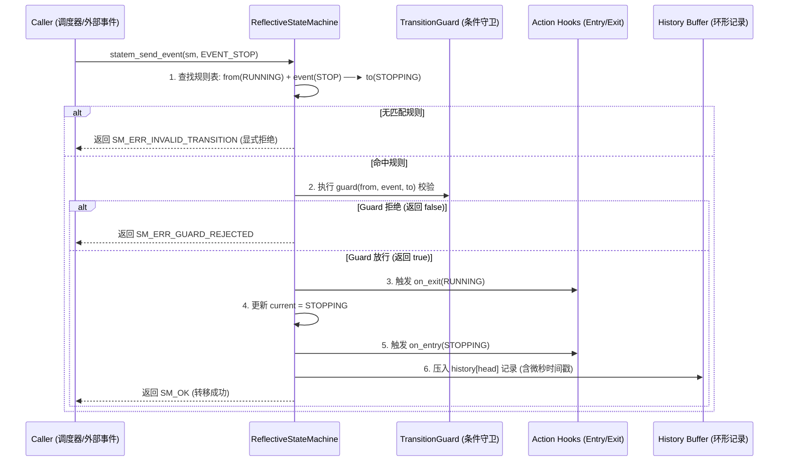

# 第 08 章：反射式状态机（Reflective State Machine）

> **本章导读**：
> 无论是底层任务节点的生命周期管控（`INITIALIZED` → `RUNNING` → `STOPPING`），还是上层 ADAS 复杂行为决策（跟车、变道、让行、掉头、紧急停车），有限状态机（FSM）都是控制逻辑的定海神针。
>
> 传统的硬编码 `switch-case` 状态机存在“黑盒不可见、难以排错、死锁后无法追溯”的致命痛点。KunAutoDrive 设计了**反射式状态机（Reflective State Machine）**：它不仅驱动状态流转，还在内存中完整自描述其**转移矩阵（Transition Matrix）、Guard 守卫条件、Entry/Exit 钩子与环形历史追踪器**，实现完全透明的白盒内省。

---

## 1. 传统 FSM vs 反射式 FSM 架构对比

```
传统 switch-case FSM (黑盒):
┌──────────────────────────────────────────────────────────┐
│  switch(state) {                                         │
│    case RUNNING: if(event==STOP) state = STOPPING; break;│
│  }                                                       │
│  痛点: 外部无法查询"当前允许接收哪些事件"；历史状态不可追溯； │
│        缺漏分支时静默失败或异常锁死。                    │
└──────────────────────────────────────────────────────────┘

KunAutoDrive 反射式 FSM (自描述白盒):
┌──────────────────────────────────────────────────────────┐
│  ReflectiveStateMachine                                  │
│   ├── current_state: RUNNING                             │
│   ├── rules[]: [RUNNING + STOP ──(guard)──► STOPPING]    │
│   ├── history[8]: 记录最近 8 次转移 (from, event, to, ts)│
│   ├── statem_can(event): O(1) 查询当前动作是否合法      │
│   └── statem_dump_json(): 导出状态机拓扑供前端实时渲染   │
└──────────────────────────────────────────────────────────┘
```

---

## 2. 核心数据结构与转移矩阵

```c
/* include/state_machine.h */

typedef int32_t StateId;
typedef int32_t EventId;

/** 转移表中的单条规则 */
typedef struct {
    StateId     from;           /**< 源状态 */
    EventId     event;          /**< 触发事件 */
    StateId     to;             /**< 目标状态 */
    const char* description;    /**< 人类可读描述，如 "INITIALIZED + START -> RUNNING" */
    bool        is_auto;        /**< 是否自动触发 */
} TransitionRule;

/** 状态机核心结构 */
typedef struct {
    StateId                 current;
    const TransitionRule*   rules;          /**< 静态只读转移规则表 */
    uint32_t                rule_count;
    TransitionGuard         guard;          /**< 动态守卫条件回调 */
    StateAction             on_entry;       /**< 状态进入 Action */
    StateAction             on_exit;        /**< 状态退出 Action */
    TransitionDebugHook     debug_hook;     /**< 调试追踪钩子 */
    TransitionRecord        history[8];     /**< 环形历史记录缓冲 (微秒时间戳) */
    uint32_t                history_head;
    pthread_mutex_t*        mutex;          /**< 并发保护锁 */
} ReflectiveStateMachine;
```

---

## 3. 状态流转时序与 Guard / Action 钩子链

一次完整的状态转移经历严格的 5 步流水线：



---

## 4. 实战：构建 ADAS 行为决策状态机（Behavior FSM）

以下代码演示如何在自动驾驶规划层定义一个 8 状态的行为决策机：

```c
/* 1. 定义状态与事件枚举 */
enum BehaviorState {
    BEH_STATE_CRUISE = 0,     // 巡航
    BEH_STATE_FOLLOW,         // 跟车
    BEH_STATE_CHANGE_LANE,    // 变道
    BEH_STATE_YIELD,          // 让行
    BEH_STATE_UTURN,          // 掉头
    BEH_STATE_EMERGENCY_STOP  // 紧急制动
};

enum BehaviorEvent {
    BEH_EV_OBSTACLE_AHEAD = 16,
    BEH_EV_LANE_CLEAR,
    BEH_EV_REACH_INTERSECTION,
    BEH_EV_SAFETY_ALERT
};

/* 2. 声明确定性转移规则表 (以 TRANSITION_TABLE_END 哨兵结尾) */
static const TransitionRule BEHAVIOR_RULES[] = {
    { BEH_STATE_CRUISE,    BEH_EV_OBSTACLE_AHEAD,     BEH_STATE_FOLLOW,        "巡航遇前车 -> 跟车", false },
    { BEH_STATE_FOLLOW,    BEH_EV_LANE_CLEAR,          BEH_STATE_CHANGE_LANE,   "侧向空闲 -> 变道",   false },
    { BEH_STATE_FOLLOW,    BEH_EV_REACH_INTERSECTION, BEH_STATE_UTURN,         "到达掉头口 -> 掉头", false },
    { BEH_STATE_CRUISE,    BEH_EV_SAFETY_ALERT,       BEH_STATE_EMERGENCY_STOP,"安全报警 -> 急停",   false },
    { BEH_STATE_FOLLOW,    BEH_EV_SAFETY_ALERT,       BEH_STATE_EMERGENCY_STOP,"安全报警 -> 急停",   false },
    TRANSITION_TABLE_END
};

/* 3. 运行时初始化与事件驱动 */
ReflectiveStateMachine sm;
statem_init(&sm, BEHAVIOR_RULES, BEH_STATE_CRUISE);

// 外部事件触发
int ret = statem_send_event(&sm, BEH_EV_OBSTACLE_AHEAD);
if (ret == SM_OK) {
    printf("状态机成功切换至: %s\n", statem_get_state_name(&sm, sm.current));
}
```

---

## 5. 运行时反射与可观测性 API

KunAutoDrive 提供了强大的在线自省函数，使得运维工具 `flowctl` 和 Web 仪表盘能一键提取状态拓扑：

```c
// 1. 查询当前是否允许执行某事件 (O(1) 预判)
bool can_uturn = statem_can_event(&sm, BEH_EV_REACH_INTERSECTION);

// 2. 导出 JSON 格式的状态机图元 (供 FlowBoard 实时渲染)
char json_buf[4096];
statem_export_json(&sm, json_buf, sizeof(json_buf));

// 3. 打印最近 8 次转移调用栈 (排查事故与死锁)
statem_dump_history(&sm);
```

---

## 6. 工业级避坑指南（2026-08 架构教训沉淀）

### 避坑 1：状态转移表必须“显式完全覆盖（Explicit Exhaustion）”
- **教训**：在 2026-08 掉头死锁排查中发现，某模块在“掉头中”接收到“红灯”事件，因转移表中缺少该条规则而被静默拒绝，导致掉头指令被锁死且不回退。
- **铁律**：状态机的转移矩阵表中，任何 `[State × Event]` 组合必须**显式声明转移目标，或显式拒绝并记录 ERROR 日志**，杜绝未定义行为。

### 避坑 2：Guard 守卫函数必须是“纯函数（Pure Function）”
- Guard 函数只负责校验条件（如 `distance > 5.0m`），**绝对禁止在 Guard 内部修改外部变量、发送消息或申请锁**。因为当 Guard 返回 `false` 时，状态机不会发生转移，若 Guard 有副作用将导致状态不同步。

---

*下一章预告：第 09 章将深入探讨去中心化服务发现（Discovery）——UDP 广播心跳与节点拓扑自愈机制。*
