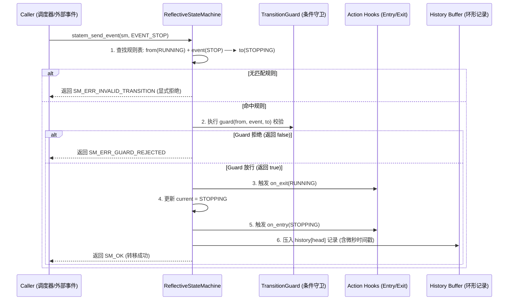

# 第 08 章：状态机把自己的转移表摊开给你看

任务节点的生命周期（`INITIALIZED` → `RUNNING` → `STOPPING`）是一个状态机，上层 ADAS 的跟车、变道、让行、掉头、紧急停车也是。用硬编码的 `switch-case` 写当然能跑，但出事之后有两个问题答不上来：当前状态下允许收哪些事件？上一次是怎么跳到这里的？

KunAutoDrive 的反射式状态机（Reflective State Machine）把转移矩阵（Transition Matrix）、Guard 守卫条件、Entry/Exit 钩子和一段环形历史都放在内存里，随时可以查。

## 先看 switch-case 会缺什么

```
传统 switch-case FSM (黑盒):
┌───────────────────────────────────────────────────────────────┐
│  switch(state) {                                              │
│    case RUNNING: if(event==STOP) state = STOPPING; break;     │
│  }                                                            │
│  痛点: 外部无法查询"当前允许接收哪些事件"；历史状态不可追溯； │
│        缺漏分支时静默失败或异常锁死。                         │
└───────────────────────────────────────────────────────────────┘

KunAutoDrive 反射式 FSM (自描述白盒):
┌──────────────────────────────────────────────────────────┐
│  ReflectiveStateMachine                                  │
│   ├── current_state: RUNNING                             │
│   ├── rules[]: [RUNNING + STOP ──(guard)──► STOPPING]    │
│   ├── history[8]: 记录最近 8 次转移 (from, event, to, ts)│
│   ├── statem_can(event): O(1) 查询当前动作是否合法       │
│   └── statem_dump_json(): 导出状态机拓扑供前端实时渲染   │
└──────────────────────────────────────────────────────────┘
```

## 结构体里装着一张能查的转移表

```c
/* include/state_machine.h */

typedef int32_t StateId;
typedef int32_t EventId;

/** 转移表中的单条规则 */
typedef struct {
    StateId     from;           /**< 源状态 */
    EventId     event;          /**< 触发事件 */
    StateId     to;             /**< 目标状态 */
    const char* description;    /**< 人类可读描述，如 "INITIALIZED + START -> RUNNING" */
    bool        is_auto;        /**< 是否自动触发 */
} TransitionRule;

/** 状态机核心结构 */
typedef struct {
    StateId                 current;
    const TransitionRule*   rules;          /**< 静态只读转移规则表 */
    uint32_t                rule_count;
    TransitionGuard         guard;          /**< 动态守卫条件回调 */
    StateAction             on_entry;       /**< 状态进入 Action */
    StateAction             on_exit;        /**< 状态退出 Action */
    TransitionDebugHook     debug_hook;     /**< 调试追踪钩子 */
    TransitionRecord        history[8];     /**< 环形历史记录缓冲 (微秒时间戳) */
    uint32_t                history_head;
    pthread_mutex_t*        mutex;          /**< 并发保护锁 */
} ReflectiveStateMachine;
```

## 一次转移要经过哪些步骤

事件和状态看起来不少，但真正走一遍转移的过程是固定的 5 步流水线：



## 定义一个 8 状态的行为决策机

下面这段代码在规划层写了一个 8 状态的行为决策机：

```c
/* 1. 定义状态与事件枚举 */
enum BehaviorState {
    BEH_STATE_CRUISE = 0,     // 巡航
    BEH_STATE_FOLLOW,         // 跟车
    BEH_STATE_CHANGE_LANE,    // 变道
    BEH_STATE_YIELD,          // 让行
    BEH_STATE_UTURN,          // 掉头
    BEH_STATE_EMERGENCY_STOP  // 紧急制动
};

enum BehaviorEvent {
    BEH_EV_OBSTACLE_AHEAD = 16,
    BEH_EV_LANE_CLEAR,
    BEH_EV_REACH_INTERSECTION,
    BEH_EV_SAFETY_ALERT
};

/* 2. 声明确定性转移规则表 (以 TRANSITION_TABLE_END 哨兵结尾) */
static const TransitionRule BEHAVIOR_RULES[] = {
    { BEH_STATE_CRUISE,    BEH_EV_OBSTACLE_AHEAD,     BEH_STATE_FOLLOW,        "巡航遇前车 -> 跟车", false },
    { BEH_STATE_FOLLOW,    BEH_EV_LANE_CLEAR,          BEH_STATE_CHANGE_LANE,   "侧向空闲 -> 变道",   false },
    { BEH_STATE_FOLLOW,    BEH_EV_REACH_INTERSECTION, BEH_STATE_UTURN,         "到达掉头口 -> 掉头", false },
    { BEH_STATE_CRUISE,    BEH_EV_SAFETY_ALERT,       BEH_STATE_EMERGENCY_STOP,"安全报警 -> 急停",   false },
    { BEH_STATE_FOLLOW,    BEH_EV_SAFETY_ALERT,       BEH_STATE_EMERGENCY_STOP,"安全报警 -> 急停",   false },
    TRANSITION_TABLE_END
};

/* 3. 运行时初始化与事件驱动 */
ReflectiveStateMachine sm;
statem_init(&sm, BEHAVIOR_RULES, BEH_STATE_CRUISE);

// 外部事件触发
int ret = statem_send_event(&sm, BEH_EV_OBSTACLE_AHEAD);
if (ret == SM_OK) {
    printf("状态机成功切换至: %s\n", statem_get_state_name(&sm, sm.current));
}
```

## 出事之后怎么问状态机

状态机自带几个在线自省函数。运维工具 `flowctl` 和 Web 仪表盘靠它们把状态拓扑取出来：

```c
// 1. 查询当前是否允许执行某事件 (O(1) 预判)
bool can_uturn = statem_can_event(&sm, BEH_EV_REACH_INTERSECTION);

// 2. 导出 JSON 格式的状态机图元 (供 FlowBoard 实时渲染)
char json_buf[4096];
statem_export_json(&sm, json_buf, sizeof(json_buf));

// 3. 打印最近 8 次转移调用栈 (排查事故与死锁)
statem_dump_history(&sm);
```

## 速查表：改状态机之前先过一遍

下面两行是 2026-08 那次掉头死锁排查之后沉淀下来的。改转移表或者写 Guard 之前，先对着看一眼。

| 检查项 | 出过什么事 | 现在怎么做 |
| --- | --- | --- |
| 转移表是否覆盖 `[State × Event]` | 2026-08 掉头死锁：某模块在「掉头中」收到「红灯」事件，转移表里没有这条规则，事件被静默拒绝，掉头指令就此锁死且不回退 | 任何 `[State × Event]` 组合，必须显式声明转移目标，或者显式拒绝并记录 ERROR 日志，不留未定义行为 |
| Guard 是不是纯函数 | Guard 一旦带上副作用，返回 `false` 时状态机不发生转移，外部变量却已经被改过，两边就此不同步 | Guard 只负责校验条件（如 `distance > 5.0m`），不在内部修改外部变量、发送消息或申请锁 |

还有一条能省时间的做法：排查状态问题时，先用 `statem_dump_history()` 把最近 8 次转移打出来（这个函数本来就是为排查事故与死锁准备的），再回头看转移表。
