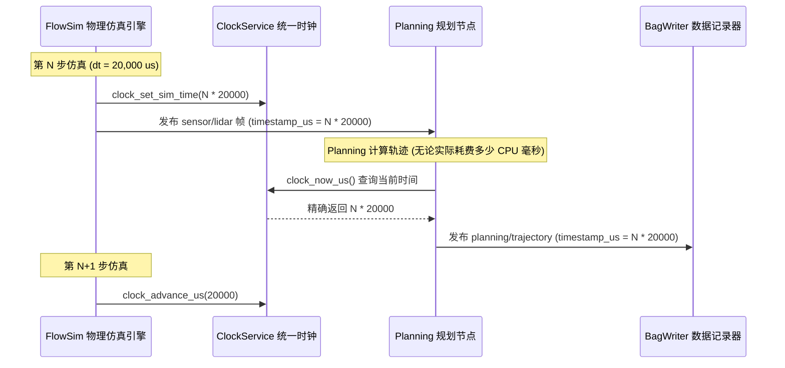

# 第 09 章：仿真时钟和物理时钟，到底该听谁的？

> **v2 范式章节**（2026-09 整治后保留）。本章保留低行号密度、真技术书
> 风格，参照 `docs/book/README.md` 写作风格约束与 `docs/book/08_discovery.md`
> 范式示范。v1 行号清单版本归档于 `docs/_archive/book_v1/`。

LiDAR 跑 10 Hz，GPS 跑 20 Hz，IMU 跑 100 Hz。它们各自给自己打上时间戳，再一起送进同一个滤波器。只要其中任何一个的时间戳站的不是同一条时间轴，融合结果就会开始漂——这是**时序对齐偏差（Temporal Misalignment）**与滤波发散最常见的起点。

更麻烦的是仿真。同一个 `ClockService` 要同时满足两件互相拉扯的需求：算法要的是一条完全确定、可以复现的逻辑时间线，而 QoS 和延迟统计要的是真实物理世界里的耗时。KunAutoDrive 的做法是让两者并存，各自有各自的来源。

## 一秒钟在系统里有三种含义

`ClockService` 按用途把时间拆成三种，给三个入口：

```
                      ┌────────────────────────────────────────────────────────┐
                      │              KunAutoDrive 统一时钟三层源               │
                      ├────────────────────────────────────────────────────────┤
  1. 逻辑调度时间     │  clock_now_us()                                        │
     (算法消费)       │  • 实车模式: 返回真实 CLOCK_MONOTONIC 单调时间         │
                      │  • 仿真模式: 返回由仿真器步进驱动的逻辑时钟 (如 +20ms) │
                      ├────────────────────────────────────────────────────────┤
  2. 真实性能测量     │  clock_now_monotonic_wall_us()                         │
     (QoS/延迟统计)   │  • 永远返回真实的 CLOCK_MONOTONIC 墙钟物理微秒         │
                      │  • 确保在仿真模式下仍能精准计算算法真实执行耗时与 p99  │
                      ├────────────────────────────────────────────────────────┤
  3. 全球绝对时间     │  clock_now_realtime_us()                               │
     (日志/GNSS 对时) │  • 返回基于 Unix Epoch 的 CLOCK_REALTIME 微秒时间戳    │
                      │  • 供训练样本采集、跨机授时与全球绝对时间同步          │
                      └────────────────────────────────────────────────────────┘
```

这三个入口混用的时候不会当场报错，往往要等到某条曲线上出现说不通的抖动才被发现。

## 时间戳的约定：uint64_t、微秒、采集那一瞬间

KunAutoDrive 里所有数据结构（`Message`、`Pose`、`LidarFrame`、`ImuData`）都遵守同一套时间戳约定：

1. 类型统一：必须为 `uint64_t`，单位严格为微秒（μs），禁止出现秒（`double`）或毫秒（`ms`）的混用。
2. GNSS 采集时刻优先（Acquisition Time Priority）：
   - 传感器数据的时间戳应为物理光电/电磁脉冲触发的采集瞬间，而非主机 CPU 收到串口数据的时刻；
   - GPS 驱动解析 NMEA 语句时，自动将 UTC 年月日时分秒转换为主机 Epoch 微秒时间戳。
3. 防溢出保证：`uint64_t` 微秒数支持连续运行超过 58 万年，杜绝 32 位时间戳溢出回滚（Y2038 问题）。

## 仿真里的时间不跟着 CPU 跑

离线仿真时，计算机的计算速度可能比真实世界更快（如 1 秒算完 10 秒的物理仿真），也可能更慢（如加载重型神经网络时单帧耗时 200ms）。如果这时候还去问真实系统时钟，仿真结果就会随着 CPU 负载波动而失去可复现性。



仿真的推进权因此完全在仿真器手上：每一步由 `clock_set_sim_time()` 设定当前逻辑时刻，算完再 `clock_advance_us()` 往前走一步。规划节点无论实际消耗了多少 CPU 毫秒，查到的都是同一个 N * 20000。

## 为什么仿真里算出来的延迟全是 0

很多框架在仿真回放时直接把全局单调时钟劫持为录制时间，后果很具体：

- 在同一个仿真 tick 内，发布与消费处于同一逻辑时刻，计算出的传输延迟 `latency = now - msg_ts` 恒为 0；
- 跨 tick 处理时，延迟又突然跃升为 20ms 的整数倍，Topic 统计（p50/p99 延迟监控）随之失效。

KunAutoDrive 的解法是让两条测量轨道并存：

- 算法决策逻辑消费 `clock_now_us()`，保证确定性；
- 总线 QoS / 遥测系统消费 `clock_now_monotonic_wall_us()`，保证真实物理时延统计的准确性。

## 平时会用到的几个调用

```c
/* include/clock_service.h */

#include "clock_service.h"

/* 1. 算法日常获取时间 */
uint64_t now_us = clock_now_us();

/* 2. 仿真引擎控制时间推进 */
clock_set_sim_mode(true);           // 开启仿真模式
clock_set_step_us(20000);           // 设置步长为 20ms (50Hz)
clock_set_sim_time(1700000000000ULL);

while (sim_running) {
    physics_step(0.02);
    clock_advance_us(20000);        // 推进 20ms
}
clock_set_sim_mode(false);          // 仿真结束，切回物理时钟

/* 3. 测量代码块纯净物理耗时 */
uint64_t t_start = clock_now_monotonic_wall_us();
run_heavy_algorithm();
uint64_t cost_us = clock_now_monotonic_wall_us() - t_start;
```

## 三个真的踩过的坑

### 节点绕过 ClockService 自己去读墙钟

现象是 Bag 回放时卡尔曼滤波的预测时间步长 `dt` 忽大忽小，还出现过负数。查下来，是各个节点里散落的裸 `clock_gettime()`——进入 Bag 回放或仿真模式后，它们读到的仍然是真实墙钟。改法很直接：所有取时间的地方统一调用 `clock_now_us()`。

### 时间戳回拨，把 dt 喂成了负值

从 Bag 文件 Seek 跳转，或者多传感器对时的时候，后到达的数据时间戳有可能小于当前时钟。这种数据在交给滤波算法（如 EKF）之前，必须有一道硬保护：

  ```c
  int64_t dt_us = (int64_t)(msg->timestamp_us - last_ts_us);
  if (dt_us <= 0 || dt_us > 1000000) { // 异常跳变或负时间
      LOG_WARN("EKF", "检测到时间戳回拨或异常跳跃 dt=%ld us, 重置局部时钟", dt_us);
      last_ts_us = msg->timestamp_us;
      return;
  }
  ```

这一章的代码不多，规矩却很硬：取时间只留 `ClockService` 一个入口。绕过它，系统不会立刻报错，只会在某次回放里给你一条看不懂的曲线。

---

## 三、三个入口到底被谁调用（一张对照表）

前面讲了三个入口的语义，但真正决定后果的是「谁在用哪个」。这张表是我从代码里逐个 grep
出来的，它比任何设计文档都更能解释你看到的怪现象：

| 消费者 | 用的是哪个时钟 | 混用的后果 |
|---|---|---|
| 算法节点（planning / control / fusion 的 `run()`） | `clock_now_us()` | 仿真里确定性成立，真车里等于单调钟 |
| 总线给消息打的时间戳 | `clock_now_monotonic_wall_us()` | **仿真模式下打的仍然是墙钟** |
| 总线的消息寿命 / 延迟统计（`age_ms`、p50/p99） | `clock_now_monotonic_wall_us()` | 不受仿真污染，这是有意的 |
| 调度器的 `RateControl` 门控 | `clock_now_us()` | 仿真里限频跟着逻辑时钟走 |
| flowrec 的轮转窗口 / pre-post buffer 计时 | `clock_now_us()` | 与录制进去的消息时间戳不同源 |
| 训练样本、仪表盘时间戳 | `clock_now_realtime_us()` | 唯一需要跨机对齐的地方 |

第二行是这一节最值得停下来的地方。总线在 `publish` 里给每条消息盖的时间戳，取的是
**物理墙钟单调时间**，不是仿真逻辑时钟。

后果是这样的：仿真跑到第 3000 个 tick（逻辑时间 60 秒），`sensor/lidar` 这条消息上带的
`timestamp_us` 却是这个进程启动后 12.4 秒的墙钟。而 flowrec 判断「轮转窗口到了没」「post
buffer 结束没」用的是 `clock_now_us()`，也就是 60 秒逻辑时间。**两个时间在同一段代码里
相差 47.6 秒，而且越跑越远。**

这不会让 flowrec 崩溃——它只会让「按大小轮转」这种基于字节数的判断照常工作，而
「按时间轮转」和 post-buffer 在长仿真里明显偏晚。要不要统一，是一个真实的设计决策，
我在文末给立场。

> **踩坑记录**：第一次接 flowrec 的时候，我按「录制里存的就是仿真时间」的直觉去比对
> `flowrec/status` 里的时间戳和 bag 里 `ts` 的差值，两个数怎么都对不上。查了半天才发现
> 一个是逻辑时钟一个是墙钟。**这个坑不在代码里，在文档里也没写。**

## 四、`clock_set_sim_time` 和 `clock_advance_us` 的区别不是「一个绝对一个相对」

看名字像是这样，但实现上有一处不对称，值得单独说：

```
clock_set_sim_time(t)     →  g_sim_time = t            无条件写入
clock_advance_us(dt)      →  if (sim_mode) g_sim_time += dt    有条件累加
```

也就是说，**即使当前不在仿真模式，`clock_set_sim_time()` 也会照样改写逻辑时钟的值**，
只是 `clock_now_us()` 不会去读它。头文件里写的是「仅在 sim_mode=true 时生效」，实现上
这个前提是靠调用方自己保证的，函数自己不检查。

这个差别在实践中是有意义的：

- `clock_advance_us()` 是**仿真主循环的心跳**。它带条件判断，是安全的：真车模式下调它
  就是个空操作，不会污染任何东西。
- `clock_set_sim_time()` 是**绝对定位**。Bag 回放的逐帧注入必须用它——因为回放的时间戳
  可能因为「多线程录制导致相邻记录轻微倒挂」而不单调（源码注释里实测到倒挂可达 300 微秒、
  数百处），这时候没法用累加，只能直接设。

> **这就是为什么 bag 回放不能简单换成 `clock_advance_us(gap)`**：回放端遇到倒挂时 gap 会变成
> 一个巨大的无符号数（详见第 12 章那一节的下溢讨论）。绝对赋值天然免疫这个问题，累加不免疫。

另一个不对称在步长上。`clock_set_step_us()` 写进去的步长，在退出仿真时**不会被清零**。
头文件说「非仿真模式下返回 0」，实现是直接返回存的值。于是这么写是安全的：

```c
clock_set_sim_mode(false);
uint64_t step = clock_get_step_us();   /* 拿到的还是上一次的步长，不是 0 */
```

如果你按注释的承诺去写 `if (clock_get_step_us() == 0) { /* 认为是真车 */ }`，判断会永远
不成立。**头文件的承诺和实现不一致，这是我在这一章里唯一一处「文档说了但代码没做」的地方。**

> **作者立场**：我倾向于认为 `clock_set_sim_time()` 应该也加一句 `if (g_sim_mode)`，让两个
> 写接口的语义对称。理由是：无条件写入在任何「忘了先开仿真模式就调它」的场景下，都会
> 留下一颗定时炸弹——逻辑时钟停在某个陈旧值上，等哪天有人调 `clock_set_sim_mode(true)`
> 而忘了设时间，整个系统会从 1970 年开始跑。
> 另一派意见是：Bag 回放正是「先 set 再 set_mode」这种顺序错误的受害者，加了检查会
> 打断它。**我不确定哪种更好，所以现在没改。**

## 五、时钟回退和跳变具体怎么把滤波器喂坏

第 14 章讲 EKF 时留了一条尾巴：定位周期里有个写死的 `dt`。这一节把那个尾巴的根因讲清楚。

`dt` 是拿「本帧时间戳 − 上一帧时间戳」算出来的，两个时间戳一旦不是严格单调递增，
`dt` 就会出问题。三个具体的坑：

**坑一：uint64 下溢。** `uint64_t dt = now - last;` 这种写法在 `now < last` 时不会得到
负数，而是得到一个接近 2^64 的巨大正数。这个数喂给积分器，车会瞬间被推到几百公里外，
而且因为滤波器本身不会崩，日志上看起来只是一次「位置突变」。

**坑二：`last == 0` 的哨兵值撞车。** 调度器的限频逻辑里，`last_run_us == 0` 被当成
「还没跑过，第一次直接放行」。但仿真时钟**就是从 0 开始的**。于是在仿真模式下的第一帧，
`now` 恰好是 0，这条特判永远成立——紧接着把它当成「上次执行时间」写回去，后面每一帧
都要等 `now - 0 >= period` 才放行。限频在仿真里从第一帧起就在生效，看起来没问题；
但如果哪条路径把时钟重置回 0（比如切场景时重新 `clock_set_sim_time(0)`），限频会突然
失效一整个周期。

**坑三：跨时钟做差。** 这是最隐蔽的一个。消息上的时间戳来自墙钟，而节点的定时器来自
逻辑时钟，把它们相减得到的是「墙钟流逝时间 + 逻辑时钟回退量」的混合物。第 14 章说的
「负载高时速度被系统性低估」，本质就是这类混合的差值。

不管哪一类，正确的处理都是同一道门：**进入积分器之前先验证 `dt` 在一个合理区间内，
不在就丢弃这一帧测量（或重置局部时钟），而不是硬着头皮算下去。**

## 六、为什么仿真时钟不能快进

「让仿真跑快一点」这件事的诱惑非常大：一段 60 秒的场景，占 4 分钟墙钟，谁都想按快进键。
我把这个诱惑和它的代价列在这里：

| 做法 | 表面收益 | 真实代价 |
|---|---|---|
| 把 `clock_advance_us` 的步长调大 | 场景 10 秒跑完 | 节点看到的物理间隔变了，msg 里的 dt、QoS 的寿命检查、定时器的实际触发全部跟着变 |
| 回放时 `speed = 4.0` | 同一段 bag 四倍速 | 消息间隔按 1/4 压缩，控制回路看到的输入变成 4 倍速，可能追尾 |
| 干脆不让逻辑时钟动，全用墙钟 | 跑得快 | 同一个场景跑两遍结果不同，「可复现」彻底没了 |

第三行是关键。**仿真时钟的价值不在于「让算法知道现在几点」，而在于「让两次跑同一个
场景得到逐位相同的结果」。** 一旦你把时钟从「可复现的逻辑刻度」退化成「真实的物理流逝」，
你就失去了整个仿真基础设施的地基——bag 回放、失败复现、算法 A/B 对比，全都建立在
「同一条时间轴上跑两遍」这个前提上。

快进唯一安全的做法是**在业务之外加速**：多个场景并行跑、同一场景跑多组参数、或者只在
「跑完之后的评分阶段」加速。这些都不碰时间轴。

> **作者立场**：我明确反对在时钟层面做快进。但我要承认，在 wall-clock 意义上提高
> 仿真吞吐是真实需求，而它的正确解法是**并发**（多场景多进程）而不是**加速**（单场景
> 缩短时长）。这也是为什么这一层要留一个不受仿真污染的墙钟入口——你总得能测出
> 「这次仿真到底占了多少 CPU 秒」。

