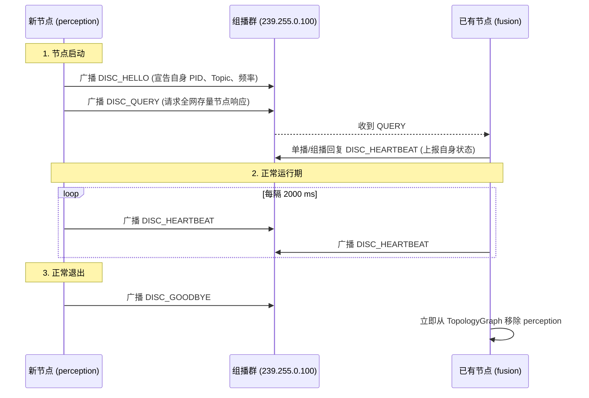

# 第 09 章：去中心化服务发现与拓扑管理（Discovery & Topology）

> **本章导读**：
> 在第一代机器人系统（如 ROS 1）中，中心化的 Master 节点（`roscore`）是整个系统的单点故障源（SPOF）。一旦 Master 异常退出，所有节点之间的通信将彻底陷入瘫痪。
>
> KunAutoDrive 借鉴了 DDS RTPS 的去中心化思想，在微内核层实现了基于 **UDP 组播信标（Multicast Beacon）**的轻量级服务发现协议 `DiscoveryManager`。每个 ADAS 节点在启动时自动宣告自身的 Pub/Sub 能力，动态构建**全网拓扑图（Topology Graph）**，并在节点异常离线时触发毫秒级拓扑自愈。

---

## 1. 中心化 vs 去中心化发现机制

```
中心化架构 (如 ROS 1 roscore):
┌──────────────┐         ┌──────────────┐
│ perception   │ ──注册─►│ roscore (单点)│ ◄──注册── [control]
└──────────────┘         └──────┬───────┘
                                │ (一旦宕机，全网瘫痪)
                                ▼

去中心化组播对等架构 (KunAutoDrive Discovery):
┌─────────────────────────────────────────────────────────────┐
│  UDP Multicast Group (239.255.0.100:5500)                   │
│                                                             │
│  [perception] ──HELLO/BEACON广播──► [fusion] ──► [control]  │
│  (任何单个节点崩溃，其他节点通过 10s 心跳超时自动剔除并重组)   │
└─────────────────────────────────────────────────────────────┘
```

---

## 2. 组播信标协议与报文帧结构

所有节点监听并广播至标准组播地址 `239.255.0.100:5500`。信标报文采用定长与变长结合的高紧凑二进制格式：

```
组播信标二进制报文格式:
┌──────────────────────────────────────────────────────────────────────────────┐
│ [Beacon Header: 80 字节]                                                     │
│   ├── magic: char[4] = "DISC" (0x44, 0x49, 0x53, 0x43)                       │
│   ├── version: uint8_t = 1                                                   │
│   ├── msg_type: uint8_t (0=HELLO, 1=HEARTBEAT, 2=GOODBYE, 3=QUERY)           │
│   ├── name: char[64] (节点名称，如 "planning_node")                          │
│   ├── pid: uint32_t (进程 ID)                                                │
│   ├── capabilities: uint8_t (CAP_PUBLISHER | CAP_SUBSCRIBER | CAP_SERVICE)   │
│   └── topic_count: uint16_t (宣告的 Topic 数量)                               │
├──────────────────────────────────────────────────────────────────────────────┤
│ [Topic Adverts 列表: topic_count × 76 字节]                                  │
│   ├── topic: char[64] (如 "sensor/lidar")                                    │
│   ├── type_id: uint32_t (FNV-1a 类型校验码)                                  │
│   ├── capabilities: uint8_t (角色掩码)                                       │
│   └── frequency_hz: double (预期发布频率，如 10.0 Hz)                        │
├──────────────────────────────────────────────────────────────────────────────┤
│ [Footer: 10 字节]                                                            │
│   ├── ipv4_address: uint32_t | unicast_port: uint16_t                        │
│   └── crc32: uint32_t (报文完整性校验)                                       │
└──────────────────────────────────────────────────────────────────────────────┘
```

---

## 3. 四大信标消息交互时序



---

## 4. 全网拓扑图与关联矩阵（Topology Matrix）

`DiscoveryManager` 维护着全局拓扑图 `TopologyGraph`，其内部利用二维关联矩阵计算 Pub/Sub 与依赖匹配关系：

```c
/* include/discovery.h */

typedef struct {
    uint32_t node_count;
    NodeInfo nodes[DISC_MAX_NODES];
    uint8_t  relation[DISC_MAX_NODES][DISC_MAX_NODES];
    /* relation 标志位: 
     * 0x01 = Pub/Sub 主题完全匹配
     * 0x02 = Service/Client 服务调用匹配
     * 0x04 = Explicit Depends 显式依赖关系
     */
} TopologyGraph;
```

### 4.1 自动依赖同步与等待（Dependency Sync）
在启动复杂的 Pipeline 时，规划节点通常必须等待感知和融合节点完全上线后才能启动计算。KunAutoDrive 提供了确定性等待 API：

```c
const char* required_nodes[] = { "perception_node", "fusion_node" };
// 阻塞等待所需依赖节点上线，超时 30000ms
int ret = discovery_wait_for_deps(dm, required_nodes, 2, 30000);
if (ret != 0) {
    LOG_FATAL("Discovery", "依赖节点未在 30s 内上线，终止启动");
}
```

---

## 5. 自动构建跨进程 IPC 通道

当服务发现检测到本地有两个进程分别声明了同一 Topic 的 `CAP_PUBLISHER` 与 `CAP_SUBSCRIBER` 时，`DiscoveryManager` 可以自动建立 POSIX 共享内存通道：

```c
// 自动为所有匹配的跨进程 Pub/Sub 建立深度为 32 的共享内存环形通道
int channel_count = discovery_create_ipc_channels(dm, 32);
LOG_INFO("Discovery", "自动建立跨进程 IPC 管道数量: %d", channel_count);
```

---

## 6. 跨机 TCP NetworkTransport 与紧凑线格式

Discovery 的 `unicast_port` / IPv4 只解决「找到谁」；真正跨机搬消息的是 `NetworkTransport`（`include/network_transport.h` / `src/cpp/network_transport.cpp`）。分层保持不变：

```
Node A local MessageBus
        ↕ bridge（按 topic）
   NetworkTransport  ──TCP──  NetworkTransport
        ↕ message_bus_publish（入站，带 @net: 防环）
Node B local MessageBus
```

统一入口仍是上层 `Transport`（`TRANSPORT_AUTO`）：同进程走 Bus，同机跨进程走 SHM IPC，跨机才落到本层 TCP。`TRANSPORT_DDS` 仅为预留，不是 FastDDS。

### 6.1 线格式（#97）

长度前缀帧：`[uint32 BE length][payload N bytes]`。

| 版本 | 何时 | payload |
|------|------|---------|
| **v1 compact（当前发送）** | 默认出站 | `offsetof(Message, data)` 固定头 + `data_size` 有效载荷。典型小消息约 **232 B** 级，而不是整颗 `sizeof(Message)`（~64KB） |
| **v0 legacy（仍可收）** | 混部旧节点 | `N == sizeof(Message)` 时按整结构体解码 |

两种 `N` 不碰撞：compact 的 `N` 恒小于 `sizeof(Message)`。解码只取 topic / sender / `data_size` 与载荷，再 `message_bus_publish` 进对端本地 Bus；loaned 指针字段不在线上。

### 6.2 收发包节奏

- **TCP_NODELAY**：小帧不攒 Nagle。
- **Drain 收包**：对端非阻塞 `recv` 打到 `EAGAIN`（64KB 缓冲）；空闲约 `200 µs` 再轮询，避免旧实现「小缓冲 + 长 sleep」把吞吐钉死在个位数 msg/s。
- **解锁再发布**：在 `peers_mutex` 下只做 drain/解帧；批量入站消息在**释放锁之后**再 `message_bus_publish`，避免 Bus 回调重入 bridge 自死锁。

### 6.3 基准与验证

`./build/bin/benchmark_tcp`（127.0.0.1 loopback）。WSL 上 #97 后量级约为 **~29k msg/s**、串行 ping p50 **~274 µs**（修复前约 ~12 msg/s / ~90 ms）。进程内 Bus 数字见 MessageBus 基准，勿与 TCP 混比。

---

## 7. 工业级避坑指南

### 避坑 1：组播风暴（Multicast Storm）与抖动抑制
- **隐患**：当集群中 50+ 个节点同时上线并发送 `DISC_QUERY` 时，所有节点如果在同一毫秒响应，会造成突发性网络拥塞。
- **解决方案**：响应 `QUERY` 时，各节点引入 `0 ~ 200ms` 的随机退避抖动时间（Jitter），平滑网络流量。

### 避坑 2：多网卡与虚拟网卡（Loopback / Docker）绑定错误
- **隐患**：主机若存在多个网络接口（如 `eth0`、`wlan0`、`docker0`），系统默认可能将组播报文发送至 Docker 虚拟桥接网卡，导致实体局域网中的其他设备无法收到心跳。
- **解决方案**：在 `pipeline.json` 中显式指定 `multicast_interface`，并在 `setsockopt(IP_MULTICAST_IF)` 中绑定正确的 IP 地址。

---

*下一章预告：第 10 章将进入 KunAutoDrive 的异步性能巅峰——基于 C++20 原生协程的 FlowCoro 调度框架。*
