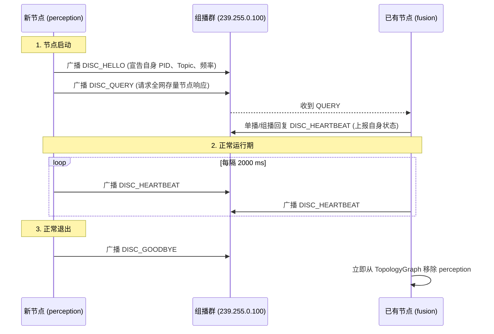

# 第 09 章：没有中心节点之后

第一代机器人系统（如 ROS 1）里有一个中心化的 Master 节点（`roscore`），它既是注册中心，也是整个系统的单点故障源（SPOF）：它一退出，所有节点之间的通信就彻底瘫痪了。

KunAutoDrive 借鉴了 DDS RTPS 的去中心化思路，在微内核层实现了一个基于 UDP 组播信标（Multicast Beacon）的轻量级服务发现协议 `DiscoveryManager`。每个 ADAS 节点启动时自己宣告 Pub/Sub 能力，各自拼出同一张拓扑图（Topology Graph），节点异常离线时再毫秒级地把它摘掉。

两种架构摆在一起看最清楚：

```
中心化架构 (如 ROS 1 roscore):
┌──────────────┐         ┌──────────────┐
│perception   │ ──注册─►│ roscore (单点)│ ◄──注册── [control]
└──────────────┘         └──────┬───────┘
                                │ (一旦宕机，全网瘫痪)
                                ▼

去中心化组播对等架构 (KunAutoDrive Discovery):
┌─────────────────────────────────────────────────────────────┐
│  UDP Multicast Group (239.255.0.100:5500)                   │
│                                                             │
│  [perception] ──HELLO/BEACON广播──► [fusion] ──► [control]  │
│  (任何单个节点崩溃，其他节点通过 10s 心跳超时自动剔除并重组)│
└─────────────────────────────────────────────────────────────┘
```

单点没了之后，发现这件事就落到每个进程自己身上。

## 一条信标报文里装了什么

所有节点都监听并广播到同一个标准组播地址 `239.255.0.100:5500`。信标报文采用定长与变长结合的高紧凑二进制格式：

```
组播信标二进制报文格式:
┌──────────────────────────────────────────────────────────────────────────────┐
│ [Beacon Header: 80 字节]                                                     │
│   ├── magic: char[4] = "DISC" (0x44, 0x49, 0x53, 0x43)                       │
│   ├── version: uint8_t = 1                                                   │
│   ├── msg_type: uint8_t (0=HELLO, 1=HEARTBEAT, 2=GOODBYE, 3=QUERY)           │
│   ├── name: char[64] (节点名称，如 "planning_node")                          │
│   ├── pid: uint32_t (进程 ID)                                                │
│   ├── capabilities: uint8_t (CAP_PUBLISHER | CAP_SUBSCRIBER | CAP_SERVICE)   │
│   └── topic_count: uint16_t (宣告的 Topic 数量)                              │
├──────────────────────────────────────────────────────────────────────────────┤
│ [Topic Adverts 列表: topic_count × 76 字节]                                  │
│   ├── topic: char[64] (如 "sensor/lidar")                                    │
│   ├── type_id: uint32_t (FNV-1a 类型校验码)                                  │
│   ├── capabilities: uint8_t (角色掩码)                                       │
│   └── frequency_hz: double (预期发布频率，如 10.0 Hz)                        │
├──────────────────────────────────────────────────────────────────────────────┤
│ [Footer: 10 字节]                                                            │
│   ├── ipv4_address: uint32_t | unicast_port: uint16_t                        │
│   └── crc32: uint32_t (报文完整性校验)                                       │
└──────────────────────────────────────────────────────────────────────────────┘
```

## HELLO、QUERY、HEARTBEAT、GOODBYE

四条消息覆盖了一个节点从上线到退出的完整过程：



## 拓扑图：谁和谁能对上

`DiscoveryManager` 维护着全局拓扑图 `TopologyGraph`，内部用一张二维关联矩阵算出 Pub/Sub 与依赖的匹配关系：

```c
/* include/discovery.h */

typedef struct {
    uint32_t node_count;
    NodeInfo nodes[DISC_MAX_NODES];
    uint8_t  relation[DISC_MAX_NODES][DISC_MAX_NODES];
    /* relation 标志位: 
     * 0x01 = Pub/Sub 主题完全匹配
     * 0x02 = Service/Client 服务调用匹配
     * 0x04 = Explicit Depends 显式依赖关系
     */
} TopologyGraph;
```

### 等依赖节点全部上线

启动复杂 Pipeline 时，规划节点通常必须等感知和融合节点完全上线才能开始计算。KunAutoDrive 为此提供了一个确定性等待 API：

```c
const char* required_nodes[] = { "perception_node", "fusion_node" };
// 阻塞等待所需依赖节点上线，超时 30000ms
int ret = discovery_wait_for_deps(dm, required_nodes, 2, 30000);
if (ret != 0) {
    LOG_FATAL("Discovery", "依赖节点未在 30s 内上线，终止启动");
}
```

## 顺手把跨进程通道也建起来

当服务发现看到本地有两个进程分别声明了同一 Topic 的 `CAP_PUBLISHER` 与 `CAP_SUBSCRIBER`，`DiscoveryManager` 会直接替它们把 POSIX 共享内存通道建好：

```c
// 自动为所有匹配的跨进程 Pub/Sub 建立深度为 32 的共享内存环形通道
int channel_count = discovery_create_ipc_channels(dm, 32);
LOG_INFO("Discovery", "自动建立跨进程 IPC 管道数量: %d", channel_count);
```

## 跨机之后交给 TCP

Discovery 的 `unicast_port` / IPv4 只解决「找到谁」。真正跨机搬消息的是 `NetworkTransport`（`include/network_transport.h` / `src/cpp/network_transport.cpp`），分层和前面保持一致：

```
Node A local MessageBus
        ↕ bridge（按 topic）
   NetworkTransport  ──TCP──  NetworkTransport
        ↕ message_bus_publish（入站，带 @net: 防环）
Node B local MessageBus
```

统一入口仍是上层 `Transport`（`TRANSPORT_AUTO`）：同进程走 Bus，同机跨进程走 SHM IPC，跨机才落到本层 TCP。`TRANSPORT_DDS` 仅为预留，不是 FastDDS。

### 线格式

长度前缀帧：`[uint32 BE length][payload N bytes]`。

| 版本 | 何时 | payload |
|------|------|---------|
| **v1 compact（当前发送）** | 默认出站 | `offsetof(Message, data)` 固定头 + `data_size` 有效载荷。典型小消息约 **232 B** 级，而不是整颗 `sizeof(Message)`（~64KB） |
| **v0 legacy（仍可收）** | 混部旧节点 | `N == sizeof(Message)` 时按整结构体解码 |

两种 `N` 不碰撞：compact 的 `N` 恒小于 `sizeof(Message)`。解码只取 topic / sender / `data_size` 与载荷，再 `message_bus_publish` 进对端本地 Bus；loaned 指针字段不在线上。

### 收发的节奏

三处细节决定了这条链路实际的吞吐：

- TCP_NODELAY：小帧不攒 Nagle。
- Drain 收包：对端非阻塞 `recv` 打到 `EAGAIN`（64KB 缓冲）；空闲约 `200 µs` 再轮询，避免旧实现「小缓冲 + 长 sleep」把吞吐钉死在个位数 msg/s。
- 解锁再发布：在 `peers_mutex` 下只做 drain/解帧；批量入站消息在释放锁之后再 `message_bus_publish`，避免 Bus 回调重入 bridge 自死锁。

### 基准数据

量级用 `./build/bin/benchmark_tcp`（127.0.0.1 loopback）实测。WSL 上 #97 之后约为 ~29k msg/s、串行 ping p50 ~274 µs（修复前约 ~12 msg/s / ~90 ms）。进程内 Bus 的数字见 MessageBus 基准，不要和 TCP 混比。

## 集群一扩容，心跳就先堵上了

节点数量小的时候一切正常，扩到 50+ 之后开始出现莫名的丢心跳。原因是大家同时上线并发送 `DISC_QUERY`，所有节点又在同一毫秒响应，组播流量瞬间堆出一个尖峰。现在的做法是响应的 `QUERY` 各自带上 `0 ~ 200ms` 的随机退避抖动时间（Jitter），把这一波流量摊开。

## 心跳发进了 docker0

另一个现场问题是节点全在跑，实体局域网里的设备却收不到心跳。主机上有多个网络接口（`eth0`、`wlan0`、`docker0`）时，系统默认可能把组播报文从 Docker 虚拟桥接网卡送出去。办法是在 `pipeline.json` 里显式指定 `multicast_interface`，再在 `setsockopt(IP_MULTICAST_IF)` 中绑定正确的 IP 地址。
