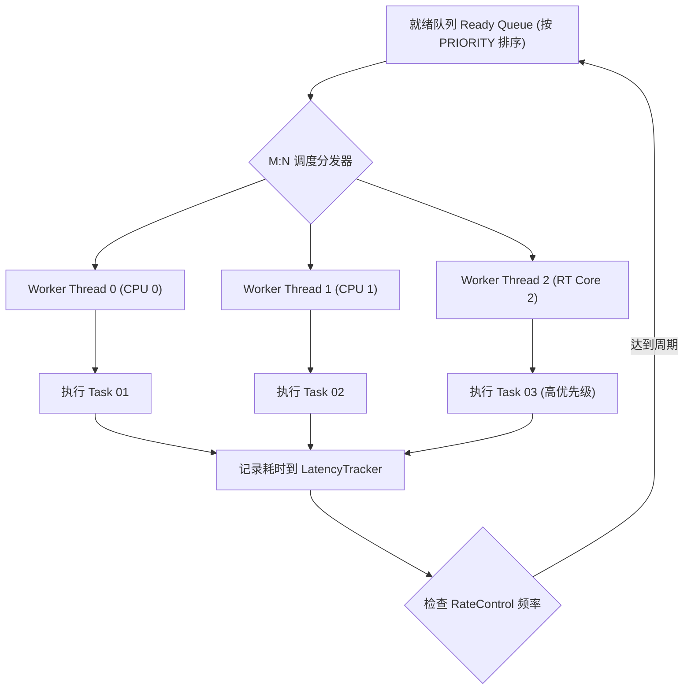

# 第 11 章：谁先跑，跑在哪颗核上

自动驾驶的算法任务不是一堆平级的函数，它们之间有硬性先后：相机采集和激光雷达预处理都做完了，多模态前融合才有输入；融合定位出了结果，局部路径规划和速度规划才能并发启动。

如果每个节点各起一个线程轮询，你付出的是线程上下文切换的开销，换来的却是一个没有顺序保证的执行环境。Choreo 混合调度器把两件事拼在一起：经典的 FIFO 优先级队列，加上有向无环图依赖调度。在此之上还能配 CPU 核心亲和性、频率限制（RateControl）、资源配额（ResourceQuota）和微秒级延迟追踪（LatencyTracker）。

## 先把依赖关系画成一张图

调度器眼里的 pipeline 长这样，每个框是一个注册进来的任务，箭头是声明出来的依赖：

```
自动驾驶 Pipeline DAG 调度拓扑图:
                     ┌───────────────────┐
                     │ 01. lidar_driver  │ (10Hz)
                     └─────────┬─────────┘
                               │
                               ▼
┌───────────────────┐┌───────────────────┐
│ 02. gnss_driver   ││ 03. lidar_cluster │ (DBSCAN 聚类)
└─────────┬─────────┘└─────────┬─────────┘
          │                    │
          ▼                    ▼
┌────────────────────────────────────────┐
│ 04. sensor_fusion (EKF 融合定位与跟踪) │
└───────────────────┬────────────────────┘
                    │
                    ▼
┌────────────────────────────────────────┐
│ 05. planning_node (Frenet 轨迹规划)    │
└───────────────────┬────────────────────┘
                    │
                    ▼
┌────────────────────────────────────────┐
│ 06. control_node (Stanley/MPC 跟踪控制)│
└────────────────────────────────────────┘
```

## 控频、延迟统计和资源配额

调度器要管的不只是顺序，还有「一个任务每秒最多跑几次」「最近这段延迟抖成什么样」「这次执行花了多少 CPU、跑过多少次、占了多少内存」。这三件事在头文件里是三个结构体：

```c
/* include/scheduler.h */

// 1. 频率控制器（防止高频传感器跑满 CPU）
typedef struct {
    uint64_t  period_us;        /**< 最小执行间隔（微秒） */
    uint64_t  last_run_us;      /**< 上次执行时间戳 (CLOCK_MONOTONIC) */
    double    max_frequency_hz; /**< 频率上限，如 50.0 Hz */
} RateControl;

// 2. 延迟追踪器（环形缓冲计算 P50 / P99 抖动）
#define LATENCY_BUFFER_SIZE 1024

typedef struct {
    uint64_t  recent[LATENCY_BUFFER_SIZE];  /**< 1024 样本环形缓冲 */
    uint32_t  head;
    uint32_t  count;
    uint64_t  sample_total;
    uint64_t  sample_count;
    uint64_t  min_us;
    uint64_t  max_us;
} LatencyTracker;

// 3. 资源配额与超额熔断
typedef struct {
    uint64_t  max_cpu_time_us;      /**< 单次执行最大 CPU 时间（超时则告警） */
    uint64_t  max_execution_count;  /**< 最大执行次数 */
    size_t    max_memory_bytes;     /**< 最大堆内存配额 */
} ResourceQuota;
```

## 把关键任务钉在某些核上

在 Linux RT 实时内核上，跨核迁移意味着 L1/L2 缓存全部作废，还随时可能被别的线程抢占。所以关键任务可以硬绑到指定的核心上，通常是拿 `isolcpus` 内核启动参数隔离出来的那几颗：

```c
/* 绑定规划节点到 CPU Core 2 与 Core 3 */
uint32_t cpu_mask = (1 << 2) | (1 << 3);
scheduler_set_affinity(sched, planning_task_id, cpu_mask);
```

### 掩码是怎么翻译成 cpu_set_t 的

绑定最终落到 `pthread_setaffinity_np`，中间的翻译工作就是把掩码一位一位搬进 `cpu_set_t`：

```c
cpu_set_t cpuset;
CPU_ZERO(&cpuset);
for (int i = 0; i < 32; i++) {
    if (cpu_mask & (1 << i)) {
        CPU_SET(i, &cpuset);
    }
}
pthread_setaffinity_np(worker_thread, sizeof(cpu_set_t), &cpuset);
```

## 协程和线程的多路复用

底层是一个预分配的 Worker 线程池，多个异步任务和协程被多路复用到这些线程上执行：



## 注册两个任务，配好 QoS

一段可以照着抄的最小例子：建调度器，注册 `sensor_fusion` 和 `planning_node`，给它们配优先级、CPU 亲和性与 50Hz 控频，声明 planning 依赖 fusion，跑 10 秒后把延迟统计打出来。

```c
#include "scheduler.h"

int main(void) {
    // 1. 创建调度器
    SchedulerConfig cfg = {
        .worker_count   = 4,
        .enable_dag     = true,
        .enable_metrics = true
    };
    Scheduler* sched = scheduler_create(&cfg);

    // 2. 注册规控核心任务
    int fusion_id = scheduler_register_task(sched, fusion_task, "sensor_fusion");
    int plan_id   = scheduler_register_task(sched, plan_task,   "planning_node");

    // 3. 配置优先级、CPU 亲和性与 50Hz 控频
    scheduler_set_params(sched, fusion_id, TASK_PRIORITY_HIGH, 0x04 /* CPU 2 */, 50.0);
    scheduler_set_params(sched, plan_id,   TASK_PRIORITY_REALTIME, 0x08 /* CPU 3 */, 50.0);

    // 4. 声明依赖关系：planning 依赖 fusion
    scheduler_add_dependency(sched, plan_id, fusion_id);

    // 5. 启动调度循环
    scheduler_start(sched);

    // ... 运行 10 秒 ...
    sleep(10);

    // 6. 获取延迟统计
    LatencyStats stats = scheduler_get_task_latency(sched, plan_id);
    printf("Planning 延迟指标: Avg=%lu us, P50=%lu us, P99=%lu us\n",
           stats.avg_us, stats.p50_us, stats.p99_us);

    // 7. 停止与销毁
    scheduler_stop(sched);
    scheduler_destroy(sched);
    return 0;
}
```

## 两个真的卡死过的地方

### DAG 里出现了环

改动一处配置，把依赖写成 `A -> B -> C -> A`，然后整条 pipeline 就再也不动了：就绪队列永远等不到一个入度为 0 的任务，所有节点安静地待在那儿。

现在这种错误在配置阶段就会被拦下来——`scheduler_add_dependency` 每插一条依赖边，都会先跑一遍环路检测（Tarjan 算法或者 Kahn 拓扑排序那套），发现有向环立即报错、拒绝这次配置。

### 日志任务把线程池吃光了

这一类故障的现象往往不是 CPU 忙，而是控制链路的延迟莫名其妙地变差：低优先级的日志落盘任务占满了 Worker 线程池里所有的工作线程，高优先级的急停和控制任务排在后面，拿不到线程。

改法有两条路：给 `TASK_PRIORITY_REALTIME` 预留独占的 Worker 线程，或者干脆用实时内核的调度策略 `SCHED_FIFO / SCHED_RR`。

到这里第二卷就结束了：节点之间能通信，也有了统一的时钟和可控的调度顺序。
