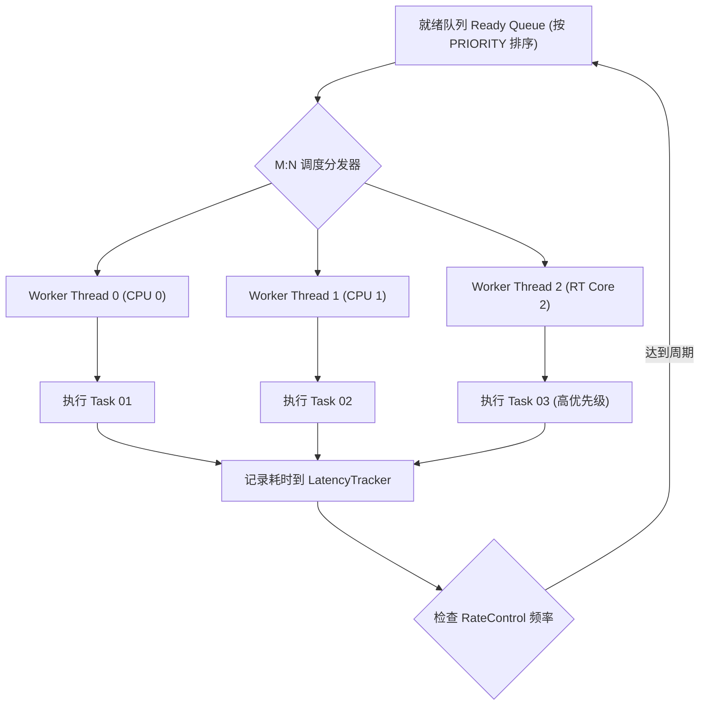

# 第 11 章：谁先跑，跑在哪颗核上

> **v2 范式章节**（2026-09 整治后保留）。本章保留低行号密度、真技术书
> 风格，参照 `docs/book/README.md` 写作风格约束与 `docs/book/08_discovery.md`
> 范式示范。v1 行号清单版本归档于 `docs/_archive/book_v1/`。

自动驾驶的算法任务不是一堆平级的函数，它们之间有硬性先后：相机采集和激光雷达预处理都做完了，多模态前融合才有输入；融合定位出了结果，局部路径规划和速度规划才能并发启动。

如果每个节点各起一个线程轮询，你付出的是线程上下文切换的开销，换来的却是一个没有顺序保证的执行环境。Choreo 混合调度器把两件事拼在一起：经典的 FIFO 优先级队列，加上有向无环图依赖调度。在此之上还能配 CPU 核心亲和性、频率限制（RateControl）、资源配额（ResourceQuota）和微秒级延迟追踪（LatencyTracker）。

## 先把依赖关系画成一张图

调度器眼里的 pipeline 长这样，每个框是一个注册进来的任务，箭头是声明出来的依赖：

```
自动驾驶 Pipeline DAG 调度拓扑图:
                     ┌───────────────────┐
                     │ 01. lidar_driver  │ (10Hz)
                     └─────────┬─────────┘
                               │
                               ▼
┌───────────────────┐┌───────────────────┐
│ 02. gnss_driver   ││ 03. lidar_cluster │ (DBSCAN 聚类)
└─────────┬─────────┘└─────────┬─────────┘
          │                    │
          ▼                    ▼
┌────────────────────────────────────────┐
│ 04. sensor_fusion (EKF 融合定位与跟踪) │
└───────────────────┬────────────────────┘
                    │
                    ▼
┌────────────────────────────────────────┐
│ 05. planning_node (Frenet 轨迹规划)    │
└───────────────────┬────────────────────┘
                    │
                    ▼
┌────────────────────────────────────────┐
│ 06. control_node (Stanley/MPC 跟踪控制)│
└────────────────────────────────────────┘
```

## 控频、延迟统计和资源配额

调度器要管的不只是顺序，还有「一个任务每秒最多跑几次」「最近这段延迟抖成什么样」「这次执行花了多少 CPU、跑过多少次、占了多少内存」。这三件事在头文件里是三个结构体：

```c
/* include/scheduler.h */

// 1. 频率控制器（防止高频传感器跑满 CPU）
typedef struct {
    uint64_t  period_us;        /**< 最小执行间隔（微秒） */
    uint64_t  last_run_us;      /**< 上次执行时间戳 (CLOCK_MONOTONIC) */
    double    max_frequency_hz; /**< 频率上限，如 50.0 Hz */
} RateControl;

// 2. 延迟追踪器（环形缓冲计算 P50 / P99 抖动）
#define LATENCY_BUFFER_SIZE 1024

typedef struct {
    uint64_t  recent[LATENCY_BUFFER_SIZE];  /**< 1024 样本环形缓冲 */
    uint32_t  head;
    uint32_t  count;
    uint64_t  sample_total;
    uint64_t  sample_count;
    uint64_t  min_us;
    uint64_t  max_us;
} LatencyTracker;

// 3. 资源配额与超额熔断
typedef struct {
    uint64_t  max_cpu_time_us;      /**< 单次执行最大 CPU 时间（超时则告警） */
    uint64_t  max_execution_count;  /**< 最大执行次数 */
    size_t    max_memory_bytes;     /**< 最大堆内存配额 */
} ResourceQuota;
```

## 把关键任务钉在某些核上

在 Linux RT 实时内核上，跨核迁移意味着 L1/L2 缓存全部作废，还随时可能被别的线程抢占。所以关键任务可以硬绑到指定的核心上，通常是拿 `isolcpus` 内核启动参数隔离出来的那几颗：

```c
/* 绑定规划节点到 CPU Core 2 与 Core 3 */
uint32_t cpu_mask = (1 << 2) | (1 << 3);
scheduler_set_affinity(sched, planning_task_id, cpu_mask);
```

### 掩码是怎么翻译成 cpu_set_t 的

绑定最终落到 `pthread_setaffinity_np`，中间的翻译工作就是把掩码一位一位搬进 `cpu_set_t`：

```c
cpu_set_t cpuset;
CPU_ZERO(&cpuset);
for (int i = 0; i < 32; i++) {
    if (cpu_mask & (1 << i)) {
        CPU_SET(i, &cpuset);
    }
}
pthread_setaffinity_np(worker_thread, sizeof(cpu_set_t), &cpuset);
```

## 协程和线程的多路复用

底层是一个预分配的 Worker 线程池，多个异步任务和协程被多路复用到这些线程上执行：


```mermaid
flowchart TD
    A["就绪队列 Ready Queue (按 PRIORITY 排序)"] --> B{M:N 调度分发器}
    B --> C["Worker Thread 0 (CPU 0)"]
    B --> D["Worker Thread 1 (CPU 1)"]
    B --> E["Worker Thread 2 (RT Core 2)"]
    
    C --> F[执行 Task 01]
    D --> G[执行 Task 02]
    E --> H["执行 Task 03 (高优先级)"]
    
    F --> I[记录耗时到 LatencyTracker]
    G --> I
    H --> I
    I --> J{检查 RateControl 频率}
    J -- 达到周期 --> A
```

## 注册两个任务，配好 QoS

一段可以照着抄的最小例子：建调度器，注册 `sensor_fusion` 和 `planning_node`，给它们配优先级、CPU 亲和性与 50Hz 控频，声明 planning 依赖 fusion，跑 10 秒后把延迟统计打出来。

```c
#include "scheduler.h"

int main(void) {
    // 1. 创建调度器
    SchedulerConfig cfg = {
        .worker_count   = 4,
        .enable_dag     = true,
        .enable_metrics = true
    };
    Scheduler* sched = scheduler_create(&cfg);

    // 2. 注册规控核心任务
    int fusion_id = scheduler_register_task(sched, fusion_task, "sensor_fusion");
    int plan_id   = scheduler_register_task(sched, plan_task,   "planning_node");

    // 3. 配置优先级、CPU 亲和性与 50Hz 控频
    scheduler_set_params(sched, fusion_id, TASK_PRIORITY_HIGH, 0x04 /* CPU 2 */, 50.0);
    scheduler_set_params(sched, plan_id,   TASK_PRIORITY_REALTIME, 0x08 /* CPU 3 */, 50.0);

    // 4. 声明依赖关系：planning 依赖 fusion
    scheduler_add_dependency(sched, plan_id, fusion_id);

    // 5. 启动调度循环
    scheduler_start(sched);

    // ... 运行 10 秒 ...
    sleep(10);

    // 6. 获取延迟统计
    LatencyStats stats = scheduler_get_task_latency(sched, plan_id);
    printf("Planning 延迟指标: Avg=%lu us, P50=%lu us, P99=%lu us\n",
           stats.avg_us, stats.p50_us, stats.p99_us);

    // 7. 停止与销毁
    scheduler_stop(sched);
    scheduler_destroy(sched);
    return 0;
}
```

## 两个真的卡死过的地方

### DAG 里出现了环

改动一处配置，把依赖写成 `A -> B -> C -> A`，然后整条 pipeline 就再也不动了：就绪队列永远等不到一个入度为 0 的任务，所有节点安静地待在那儿。

现在这种错误在配置阶段就会被拦下来——`scheduler_add_dependency` 每插一条依赖边，都会先跑一遍环路检测（Tarjan 算法或者 Kahn 拓扑排序那套），发现有向环立即报错、拒绝这次配置。

### 日志任务把线程池吃光了

这一类故障的现象往往不是 CPU 忙，而是控制链路的延迟莫名其妙地变差：低优先级的日志落盘任务占满了 Worker 线程池里所有的工作线程，高优先级的急停和控制任务排在后面，拿不到线程。

改法有两条路：给 `TASK_PRIORITY_REALTIME` 预留独占的 Worker 线程，或者干脆用实时内核的调度策略 `SCHED_FIFO / SCHED_RR`。

到这里第二部分就结束了：节点之间能通信，也有了统一的时钟和可控的调度顺序。

---

## 三、两种模式：轮询与数据流，各自有各的死法

`SchedulerMode` 只有两个取值。头文件里给它们的注释是一句话，但真正有意思的是它们
**各自会在什么地方出问题**。

### CLASSIC：每个 Worker 扫一遍所有任务

Worker 线程的主循环是这样一个三重扫描：优先级从 CRITICAL 扫到 LOW，每个优先级带内
从轮转起点扫所有任务，命中 active 的就检查配额、检查是否要 sheds、检查限频，最后用
一次 CAS 抢占执行权。

```
  worker 线程 k（起点 = k mod 任务数）
  for prio in [CRITICAL, HIGH, NORMAL, LOW]:
      for j in 0..n:  e = entries[(start+j) % n]
          ├─ 不是这个优先级？          → skip
          ├─ 配额超了？                → quota_denied_count++，skip
          ├─ 上一拍超预算待 sheds？    → 跳过一次本次派发
          ├─ 距上次不到 period？      → skip
          └─ CAS 抢占成功？            → 执行（此时放开 mutex）
  一圈下来没有任何任务跑过 → sleep 1ms
```

**这个设计的优点是简单**：没有依赖关系，没有拓扑序，任务之间完全独立，加一个任务
不影响任何其他任务。**它的缺点是它本质上是轮询**——所有任务在没有消息的时候也在
被扫，1 毫秒一轮的空转是纯粹的浪费。

### CHOREO：topic 上有消息才唤醒

注册触发关系后，任务在自己的 `execute()` 里 `scheduler_choreo_wait()` 阻塞，直到上游
publish 触发它。没有消息时它不占 CPU，也没有轮询开销。

**它的优点是省电和低延迟**：数据一来立刻唤醒。**它的代价是把调度权交给了数据**——
一旦某个上游 topic 不发了，下游就永远不会被唤醒，而且不会有任何错误上报。统计里
会看到 `wait_timeouts` 在涨（如果设了超时），或者什么都不涨（如果没设）。

### 各自的死法

| | CLASSIC | CHOREO |
|---|---|---|
| 典型故障 | 系统空转，CPU 满载但没干活 | 某个 topic 断了，下游静默饿死 |
| 为什么难发现 | 看起来"在跑"，只是没进度 | 连"在跑"的证据都没有 |
| 排查抓手 | `dispatch_count` 在涨，节点就是不出货 | `triggers_fired` 不涨 |
| 更适合 | 周期固定、彼此独立的任务 | 明确的上下游数据流 |

> **默认是 CHOREO。** 配置解析里有一条硬编码的默认值：即使 pipeline 里**完全不写**
> `scheduler.mode`，配置层也会填成 choreo。这个决定是带注释的——曾经有一次改动让
> 缺省值悄悄退回 classic，于是所有节点从数据驱动变成了轮询，行为差异大到排查了半天。
> **默认值本身就是一种决策，而且必须显式写出来。**

## 四、绑核绑到哪颗核，是一个负载均衡问题

前面讲了绑核的机制（掩码翻译成 `cpu_set_t` 交给 pthread 属性）。这一节讲一个更容易
被忽略的问题：**掩码本身怎么选**。

代码里接受三种写法，配置层都支持：核号数组、位掩码数字、`"0-3"` 这样的区间串。
三种写法最后都归一成一个 64 位掩码。

**关键的坑：绑核是在任务启动时一次性应用的。** 掩码通过 `pthread_attr` 交给
`pthread_create`，创建之后就固定了。这带来两个后果：

1. **配置里写错了不会报错，只会静默地绑到错的核上。** 而且因为调度是"哪颗核空闲去哪
   颗"，绑错的效果往往表现为"性能莫名其妙差一点"而不是"跑不起来"。
2. **绑核和优先级是两套机制，它们用同一个 API 但作用于不同层。** 优先级在
   `SCHED_FIFO`（需要 root，否则静默退回 `SCHED_OTHER`），绑核在 `cpu_affinity`。
   两者都不成功时代码只打一行日志——**而且这行日志说"policy=FIFO"，
   不管 `pthread_attr_setschedpolicy` 实际有没有成功**。

### 绑到哪颗核的取舍

绑核的真实收益是缓存局部性（热数据留在 L1/L2）和抖动确定性（不被别的核抢走）。
代价是绑错了就是硬性的性能损失。所以选择规则可以写成一张表：

```
  目标：控制回路（control）
    → 独占一颗 isolcpus 隔离出来的核
    → 理由：抖动比吞吐重要。控制回路丢一拍的代价远大于
      它占用一颗核的代价

  目标：重算法（感知大模型）
    → 绑到**多核**，不要绑到单核
    → 理由：它自己会开内部线程池，绑到一颗核上会和内部
      线程互相抢。绑核对它几乎没有收益

  目标：偶发任务（日志、导出、可视化）
    → 完全不绑
    → 理由：它跑在哪都无所谓，但一旦绑到控制核上，
      它的每一次磁盘 IO 停顿都会算在控制核头上
```

> **我不确定**：我没有做过隔离核配置下的定量对比。上面的规则更多是推理 + 事故复盘，
> 不是测量结论。**要做对这件事，需要的实验是：隔离核 vs 不隔离核，各跑一次 60 分钟
> 场景，比较控制回路的 P99 延迟。** 这个实验一直没做，所以这部分结论我标为待验证。

## 五、限频与绑核冲突时谁优先：一个明确的答案

这一节回答一个具体的机制问题。在 classic 模式的一次派发里，四个门是**按固定顺序**
过的，这个顺序就是答案：

```
  1. 配额检查   →  资源超了，这一拍不派发
  2. 预算 sheds →  上一拍超预算，LOW 优先级跳过一次
  3. 限频检查   →  距上次不到 period，跳过
  4. CAS 抢占   →  抢到了才执行
```

**限频在绑核之后生效。** 也就是说：绑核不改变你被限频的次数，只改变你被放行之后在
哪颗核上跑。两者不冲突，因为它们约束的是不同的维度——一个是**时间**（多久跑一次），
一个是**空间**（在哪跑）。

真正需要注意的是第三层的一个副作用：

- 限频是用 `clock_now_us()` 判断的（见第 09 章）。
- 在**仿真模式**下，这是逻辑时钟。所以仿真里的限频节奏和真车不一致——真车上 20 赫兹
  的节点每 50 毫秒放一次；仿真里如果场景跑得比逻辑时间慢，逻辑时钟推进得慢，
  同一个节点的限频窗口就被拉长了。

这不是 bug（仿真里你本来就不该假设墙钟节奏），但它意味着**一个参数在仿真里调出来的
频率，真车上不一定对**。第 09 章那条"msg 时间戳用墙钟、限频用逻辑时钟"的分歧，
在这里会再咬一次。

## 六、过载时的取舍：不抢占，只丢低优先级

调度器有一个执行预算机制，用来在任务长期超时时保护系统。头文件里把它叫
"observational"（可观测的），这个措辞很诚实，值得展开：

**它不能在回调执行中途打断它。** 因为回调可能正在修改共享状态，中途抢占会留下
半个更新。超支是在回调**返回之后**才被记账的。

它能做的是**下一次派发**：如果一个任务超出了预算，并且它的优先级是 LOW，那么它的
**下一次**派发会被跳过。优先级更高的任务永远不会被这个机制丢弃——它们的超时只会被
记录，不会被处置。

这个设计的取舍是这样的：

| 方案 | 保护力度 | 代价 |
|---|---|---|
| 抢占式（回调中途打断） | 强 | 共享状态可能不一致，需要回调自己可重入 |
| 丢弃下一次派发（现在的做法） | 中 | 超支的那一拍仍然超了，损失已经发生 |
| 预留独占 worker 线程 | 强 | 核心数被静态切分，弹性丧失 |

**为什么选中间那个？** 因为它的前提假设是「超支任务的正确性不依赖于它的每一拍都
按时跑」——日志、导出、诊断这类任务，丢一帧的代价是可接受的。而控制任务属于
"不能丢"，所以它被排除在这个机制之外。

> **作者立场**：我认为这是三种方案里最保守但也最诚实的一种。它的弱点很明显——如果
> 一个 LOW 优先级任务单次执行就要 3 秒，而控制回路的周期是 20 毫秒，那么"丢下一次
> 派发"这个缓解措施在时间尺度上根本不生效。要覆盖这种任务，只有预留独占线程或者
> 把它挪到别的进程里。**换句话说，预算机制解决的是"轻度超支"，不是"架构错了"。**
>
> 更深一层的观察是：这个仓库里"过载"最常见的真实来源不是 CPU 算不过来，而是
> **某个节点停止发数据**（见第 15 章那个空障碍列表的案例）。那种过载用预算机制
> 完全抓不住，得靠活性门禁。**两类过载，两套机制，不该指望一套解决全部。**

