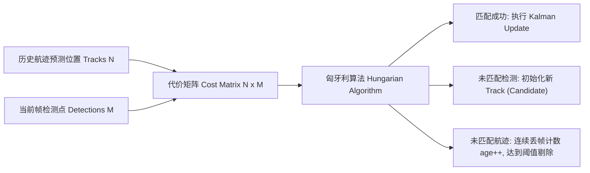

# 第 12 章：从一帧点云里认出前面那辆车

激光雷达一秒钟吐出成千上万个离散的三维空间点。把这么多稀疏的点直接丢给规划器，规划器的算力会当场见底——它想知道的其实是「前面 30 米有一辆车，速度 2 m/s」，而不是几十万个坐标。

所以感知前端必须替它做完两件事。空间聚类把离散点聚成一个个独立的目标实体，给出包围盒；时序追踪负责跨帧把这些实体对上号，为同一个障碍物分配稳定的全局 ID，并估计出精确的速度矢量。KunAutoDrive 用的是 DBSCAN 密度聚类，加一个基于匈牙利算法匹配的扩展卡尔曼滤波追踪器。

## 一帧点云要走过的工序

```
                     ┌────────────────────────────────────────────────────────┐
                     │              sensor/lidar (原始三维点云帧)             │
                     └──────────────────────────┬─────────────────────────────┘
                                                │
                                                ▼
                     ┌────────────────────────────────────────────────────────┐
                     │      1. 地面点滤除与 ROI 空间截取 (PassThrough Filter) │
                     └──────────────────────────┬─────────────────────────────┘
                                                │
                                                ▼
                     ┌────────────────────────────────────────────────────────┐
                     │      2. DBSCAN 空间密度聚类与 3D Bounding Box 拟合     │
                     └──────────────────────────┬─────────────────────────────┘
                                                │ 得到当前帧检测列表 (Detections)
                                                ▼
                     ┌────────────────────────────────────────────────────────┐
                     │      3. 目标追踪器 (KalmanTracker & Hungarian Matcher) │
                     │         ├── 状态传播: X(k|k-1) = F * X(k-1)            │
                     │         ├── 距离代价矩阵构建 (Mahalanobis / Euclidean) │
                     │         ├── 匈牙利算法最优二分图匹配 (KM Matcher)      │
                     │         └── 状态更新与协方差收敛                       │
                     └──────────────────────────┬─────────────────────────────┘
                                                │
                                                ▼
                     ┌────────────────────────────────────────────────────────┐
                     │ perception/tracked_objects (全局 TrackID / 动态/静态)  │
                     └────────────────────────────────────────────────────────┘
```

## DBSCAN：不用事先说有几个簇

DBSCAN (Density-Based Spatial Clustering of Applications with Noise) 不需要预先指定簇数量 $K$，能把稀疏噪点剔掉，也能拟合出任意几何形状的障碍物。

它只有两个参数，但这两个参数基本决定了聚类的成败：邻域半径 $\epsilon$ (Epsilon)，即两点之间可视为同一簇的最大欧氏距离，通常取 $0.5 \sim 0.8\text{ m}$；核心点阈值 $\text{MinPts}$，即半径 $\epsilon$ 范围内至少包含的点数，通常取 $3 \sim 5$。

### 聚类完之后拟合包围盒

```c
// 聚类完成后拟合 3D AABB / OBB 边界框
typedef struct {
    double center_x, center_y, center_z;
    double length, width, height;
    double yaw;
    uint32_t point_count;
} BoundingBox;
```

## 卡尔曼追踪器在追什么

追踪器的活是在时间序列上维护一组航迹（Tracks），估计目标的绝对位置 $(x, y)$ 与绝对速度 $(v_x, v_y)$。运动学模型选的是最简单的恒定速度（CV, Constant Velocity）模型：

$$X = \begin{bmatrix} x \\ y \\ v_x \\ v_y \end{bmatrix}, \quad F = \begin{bmatrix} 1 & 0 & \Delta t & 0 \\ 0 & 1 & 0 & \Delta t \\ 0 & 0 & 1 & 0 \\ 0 & 0 & 0 & 1 \end{bmatrix}, \quad H = \begin{bmatrix} 1 & 0 & 0 & 0 \\ 0 & 1 & 0 & 0 \end{bmatrix}$$

### 预测一步，再修正一步

时间预测把上一时刻的状态按模型往前推：

   $$\hat{X}_{k|k-1} = F \hat{X}_{k-1|k-1}$$
   $$P_{k|k-1} = F P_{k-1|k-1} F^T + Q$$

测量更新再拿当前帧的观测去修正它：

   $$K_k = P_{k|k-1} H^T (H P_{k|k-1} H^T + R)^{-1}$$
   $$\hat{X}_{k|k} = \hat{X}_{k|k-1} + K_k (Z_k - H \hat{X}_{k|k-1})$$
   $$P_{k|k} = (I - K_k H) P_{k|k-1}$$

## 帧与帧之间怎么对上号

测量更新之前还有一步：把当前帧检测到的 $M$ 个目标和内存里存着的 $N$ 条存量航迹一一配对。这一步配错了，ID 就会乱。



## 这辆车是停着的，还是在动

规划器对静态障碍物（路桩、路沿、违停车辆）和动态障碍物（对向来车、变道行人）的避让策略完全不一样，所以每条航迹还得带一个动静标签。`modules/adas_nodes/object_tracker_node.c` 里是一个基于速度积分的时序分类器：

```c
#define STATIC_SPEED_THRESHOLD 0.5f   /* m/s 以下视为低速候选 */
#define STATIC_FRAMES_MIN      20u    /* 连续 20 帧 (1.0s) 低速才判定为真静态 */

if (hypot(track->vx, track->vy) < STATIC_SPEED_THRESHOLD) {
    static_counter[track_id]++;
    if (static_counter[track_id] >= STATIC_FRAMES_MIN) {
        track->is_static = true;
    }
} else {
    static_counter[track_id] = 0;
    track->is_static = false;
}
```

它不看你此刻多慢，只看你慢了多久：速度低于 0.5 m/s 就累加计数，连续 20 帧（1.0s）都慢才判为真静态；中间只要速度起来一次，计数清零，标签立刻翻回动态。

## 两次在路测里翻过车

### 本车转弯时，路边静止的障碍物「横着走」

现象：本车在高速转弯时，明明停着不动的障碍物在雷达坐标系里冒出了横向速度，被追踪器当成了动态目标。原因是本车坐标系自己在旋转。

改法是在卡尔曼预测步之前，先从定位模块 `vehicle/state` 里读出角速度 $\omega_z$，对测量点坐标做刚体坐标变换，把动系速度逆补偿掉。

### 并排两辆车，ID 换了个个儿

现象：两辆车在十字路口并排行驶、短暂互相遮挡之后，Track ID 偶尔会互换，规划器看到的就是「旁边那辆突然变道了」。原因是匹配只用了欧氏距离。

改法是把代价矩阵换成马氏距离（Mahalanobis Distance），再把几何尺寸的长宽比（Aspect Ratio）一起加权进去，多特征共同决定配对结果。
