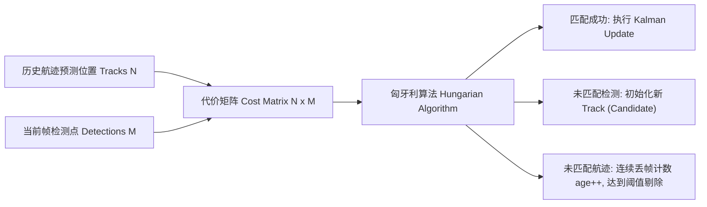

# 第 13 章：从一帧点云里认出前面那辆车

> **v2 范式章节**（2026-09 整治后保留）。本章保留低行号密度、真技术书
> 风格，参照 `docs/book/README.md` 写作风格约束与 `docs/book/08_discovery.md`
> 范式示范。v1 行号清单版本归档于 `docs/_archive/book_v1/`。

激光雷达一秒钟吐出成千上万个离散的三维空间点。把这么多稀疏的点直接丢给规划器，规划器的算力会当场见底——它想知道的其实是「前面 30 米有一辆车，速度 2 m/s」，而不是几十万个坐标。

所以感知前端必须替它做完两件事。空间聚类把离散点聚成一个个独立的目标实体，给出包围盒；时序追踪负责跨帧把这些实体对上号，为同一个障碍物分配稳定的全局 ID，并估计出精确的速度矢量。KunAutoDrive 用的是 DBSCAN 密度聚类，加一个基于匈牙利算法匹配的扩展卡尔曼滤波追踪器。

## 一帧点云要走过的工序

```
                     ┌────────────────────────────────────────────────────────┐
                     │              sensor/lidar (原始三维点云帧)             │
                     └──────────────────────────┬─────────────────────────────┘
                                                │
                                                ▼
                     ┌────────────────────────────────────────────────────────┐
                     │      1. 地面点滤除与 ROI 空间截取 (PassThrough Filter) │
                     └──────────────────────────┬─────────────────────────────┘
                                                │
                                                ▼
                     ┌────────────────────────────────────────────────────────┐
                     │      2. DBSCAN 空间密度聚类与 3D Bounding Box 拟合     │
                     └──────────────────────────┬─────────────────────────────┘
                                                │ 得到当前帧检测列表 (Detections)
                                                ▼
                     ┌────────────────────────────────────────────────────────┐
                     │      3. 目标追踪器 (KalmanTracker & Hungarian Matcher) │
                     │         ├── 状态传播: X(k|k-1) = F * X(k-1)            │
                     │         ├── 距离代价矩阵构建 (Mahalanobis / Euclidean) │
                     │         ├── 匈牙利算法最优二分图匹配 (KM Matcher)      │
                     │         └── 状态更新与协方差收敛                       │
                     └──────────────────────────┬─────────────────────────────┘
                                                │
                                                ▼
                     ┌────────────────────────────────────────────────────────┐
                     │ perception/tracked_objects (全局 TrackID / 动态/静态)  │
                     └────────────────────────────────────────────────────────┘
```

## DBSCAN：不用事先说有几个簇

DBSCAN (Density-Based Spatial Clustering of Applications with Noise) 不需要预先指定簇数量 $K$，能把稀疏噪点剔掉，也能拟合出任意几何形状的障碍物。

它只有两个参数，但这两个参数基本决定了聚类的成败：邻域半径 $\epsilon$ (Epsilon)，即两点之间可视为同一簇的最大欧氏距离，通常取 $0.5 \sim 0.8\text{ m}$；核心点阈值 $\text{MinPts}$，即半径 $\epsilon$ 范围内至少包含的点数，通常取 $3 \sim 5$。

### 聚类完之后拟合包围盒

```c
// 聚类完成后拟合 3D AABB / OBB 边界框
typedef struct {
    double center_x, center_y, center_z;
    double length, width, height;
    double yaw;
    uint32_t point_count;
} BoundingBox;
```

## 卡尔曼追踪器在追什么

追踪器的活是在时间序列上维护一组航迹（Tracks），估计目标的绝对位置 $(x, y)$ 与绝对速度 $(v_x, v_y)$。运动学模型选的是最简单的恒定速度（CV, Constant Velocity）模型：

$$X = \begin{bmatrix} x \\ y \\ v_x \\ v_y \end{bmatrix}, \quad F = \begin{bmatrix} 1 & 0 & \Delta t & 0 \\ 0 & 1 & 0 & \Delta t \\ 0 & 0 & 1 & 0 \\ 0 & 0 & 0 & 1 \end{bmatrix}, \quad H = \begin{bmatrix} 1 & 0 & 0 & 0 \\ 0 & 1 & 0 & 0 \end{bmatrix}$$

### 预测一步，再修正一步

时间预测把上一时刻的状态按模型往前推：

   $$\hat{X}_{k|k-1} = F \hat{X}_{k-1|k-1}$$
   $$P_{k|k-1} = F P_{k-1|k-1} F^T + Q$$

测量更新再拿当前帧的观测去修正它：

   $$K_k = P_{k|k-1} H^T (H P_{k|k-1} H^T + R)^{-1}$$
   $$\hat{X}_{k|k} = \hat{X}_{k|k-1} + K_k (Z_k - H \hat{X}_{k|k-1})$$
   $$P_{k|k} = (I - K_k H) P_{k|k-1}$$

## 帧与帧之间怎么对上号

测量更新之前还有一步：把当前帧检测到的 $M$ 个目标和内存里存着的 $N$ 条存量航迹一一配对。这一步配错了，ID 就会乱。



## 这辆车是停着的，还是在动

规划器对静态障碍物（路桩、路沿、违停车辆）和动态障碍物（对向来车、变道行人）的避让策略完全不一样，所以每条航迹还得带一个动静标签。`modules/adas_nodes/object_tracker_node.c` 里是一个基于速度积分的时序分类器：

```c
#define STATIC_SPEED_THRESHOLD 0.5f   /* m/s 以下视为低速候选 */
#define STATIC_FRAMES_MIN      20u    /* 连续 20 帧 (1.0s) 低速才判定为真静态 */

if (hypot(track->vx, track->vy) < STATIC_SPEED_THRESHOLD) {
    static_counter[track_id]++;
    if (static_counter[track_id] >= STATIC_FRAMES_MIN) {
        track->is_static = true;
    }
} else {
    static_counter[track_id] = 0;
    track->is_static = false;
}
```

它不看你此刻多慢，只看你慢了多久：速度低于 0.5 m/s 就累加计数，连续 20 帧（1.0s）都慢才判为真静态；中间只要速度起来一次，计数清零，标签立刻翻回动态。

## 两次在路测里翻过车

### 本车转弯时，路边静止的障碍物「横着走」

现象：本车在高速转弯时，明明停着不动的障碍物在雷达坐标系里冒出了横向速度，被追踪器当成了动态目标。原因是本车坐标系自己在旋转。

改法是在卡尔曼预测步之前，先从定位模块 `vehicle/state` 里读出角速度 $\omega_z$，对测量点坐标做刚体坐标变换，把动系速度逆补偿掉。

### 并排两辆车，ID 换了个个儿

现象：两辆车在十字路口并排行驶、短暂互相遮挡之后，Track ID 偶尔会互换，规划器看到的就是「旁边那辆突然变道了」。原因是匹配只用了欧氏距离。

改法是把代价矩阵换成马氏距离（Mahalanobis Distance），再把几何尺寸的长宽比（Aspect Ratio）一起加权进去，多特征共同决定配对结果。

## 为什么先滤地面，再聚类

流水线里 DBSCAN 之前有一道"地面点滤除与 ROI 空间截取"。这两步不是可选的预处理，
而是**为了让聚类算法的两个参数能同时满足互相矛盾的要求**。

地面点如果不清掉，柏油路面上每一个激光回波都会成为一个"簇"——不是一辆车，
而是一整条路的路面被识别成障碍物。更糟的是，路面上的点密度高，会把相邻的
真实障碍物**连成一簇**：护栏和地面连在一起，得到的包围盒跨越几米。

而 ROI 截取（只保留关注高度和距离范围内的点）解决的是密度问题。远处的东西点少，
用同一个 $\text{MinPts}$ 要么把远处的车丢掉，要么被近处的噪点绑架。

> **换个角度**：这两道预处理，本质上是把"我要在一张巨大的稀疏地图上找车"
> 变成"我要在一张已经清理过的小地图上找车"。**缩小问题规模比调参数更有效**——
> 同样的 $\epsilon$ 和 $\text{MinPts}$，作用在预处理后的数据上要宽容得多。

这也解释了为什么感知前端普遍有"预处理比算法更重要"的经验：**聚类算法对输入
分布的敏感度，远高于我们对它的期待**。

## 动静标签会翻来覆去

那个"连续 20 帧低速才判静态"的时序分类器，逻辑上很干净，实际用起来有个
恼人的特性：**它对"恰好起步"和"恰好停车"这两件事的反应是慢的**。

一辆车从静止开始起步，头一两帧速度还低于 0.5 m/s，计数从 19 开始累加——但只要
速度过阈值，计数立刻清零，标签瞬间翻回"动态"。没问题。

反过来更麻烦：一辆车在红灯前停下，速度降到 0，但**因为惯性，测出来的速度是
逐渐衰减的**。从 2 m/s 衰减到 0.5 m/s 需要一两秒，这期间计数在累加。也就是说
**标签切换比物理停车晚了整整一个减速过程**。

后果是：红灯前停车时，这辆车的前几帧还被标成"动态"。如果规划器对动态障碍物的
避让策略比对静态的更保守（这是通常的选择），那这几帧里会有一段不必要的减速。

> 另一种做法是用加速度而非速度判断（"正在减速且速度趋零"才判静态），响应更快，
> 但在坡道上会因为重力分量产生误判。**速度阈值 + 时间确认**是在这两者之间
> 的折中，代价就是上面说的滞后。我保留了它，但认为这个滞后值得你知情。

## 感知输出的消费者不止规划

`perception/tracked_objects` 这条话题上除了障碍物，还带着动静标签和 TrackID。
但这些字段的消费者不只规划器：

- 行为决策（第 15 章）用它判断"旁边那辆车在动"来决定能不能变道
- 规划器用它决定避让策略和变道可行性
- 评估器（第 23 章）用 TrackID 的稳定性做场景回归的比对基准
- 可视化（第 22 章）用动静标签上颜色——在 3D 视图里一眼看出哪个障碍物是动的

这意味着**改 TrackID 的分配策略会同时影响四个地方**，其中三个你不会在调试时
想到。尤其评估器：如果它用 TrackID 做前后帧比对，ID 策略一变，回归基线就全废了。

> **作者立场**：感知接口字段的"消费者数量"是个隐式契约，代码里看不出来。
> 我倾向于在接口定义处显式写上"TrackID 必须跨帧稳定"这样的约束，
> 而不是等到某个评估器的基线莫名其妙失效时再回头查。

## 三个参数，两个都调不动

DBSCAN 的 $\\epsilon$ 和 $\\text{MinPts}$ 是这一章里最被低估的旋钮。它们的相互作用
让调参过程显得很不讲道理：

**把 $\\epsilon$ 调小**，点云被切碎——一辆车被分成十几个簇，规划器看到前方突然
出现一片"小障碍物"，然后开始躲。**把 $\\epsilon$ 调大**，相邻两辆车被并成一个簇，
前车和旁边那辆车共享一个 ID，于是"旁边那辆突然变道"这个幽灵 bug 以另一种形式回来。

$\\text{MinPts}$ 更隐蔽。调高它可以滤掉雨雾噪点，代价是**远处的车因为点少被整簇丢掉**。
而远处恰恰是超车决策最需要看得清的地方。

> **我不确定当前默认值对不对**。仓库里默认是 0.5~0.8 m / 3~5 点，
> 但这组值是在哪种传感器、哪种分辨率下调出来的，我没有找到对应的实验记录。
> 如果你要动它，**先跑第 23 章的场景回归**，不要凭感觉调——这两个参数的后果
> 跨越感知和规划两层，肉眼在 3D 视图里很难看出差别。

## 为什么这里用 KF 而不是 EKF

追踪器用的是**线性**卡尔曼滤波，状态是 $[x, y, v_x, v_y]$，转移矩阵是常速模型。
从传感器角度看这个选择是对的：点云聚类出来的目标位置在雷达坐标系里已经是直观的
$x$、$y$，运动模型也不需要曲率——目标不是一辆遵守自行车模型的车，它是一个可能
在任意方向上匀速平移的点。

如果换成 EKF，你得先回答"非线性在哪"这个问题。而在这个状态定义下，答案是
**没有**——加 EKF 只会引入雅可比计算和线性化误差，换不来任何精度。

这个判断和第 14 章形成对照：那里的自车运动**确实**有非线性（横摆角速度进入位置
积分），所以必须 EKF；这里的目标运动没有。**用不用 EKF 取决于运动模型本身弯不弯，
不取决于"这是个滤波器"。**

## ID 稳定性为什么比精度更重要

追踪器有一个容易被忽略的目标：**同一个物理目标，全生命周期内 ID 不变**。

这不是为了好看。规划器里大量逻辑建立在"这个 ID 我认识"之上——跟车要持续跟踪
同一个 ID 才能维持时距，变道要判断"我要变到的那辆车是谁"。一旦 ID 互换，
规划器看到的是"前车突然消失、新车突然出现"，行为就会突变。

所以 ID 交换的代价比位置误差大得多。位置错了车偏一点，ID 错了车可能突然刹车
或者变道。这也是为什么代价函数里要引入马氏距离和长宽比——**宁可匹配稍差，
也不要匹配错对象**。

> **作者立场**：这一条是我在整个感知栈里最认同的设计取舍。很多实现会把跟踪
> 精确率当第一指标，但下游真正需要的是 ID 的**时间连续性**。一个位置差 0.3 m
> 但 ID 稳定的航迹，比一个位置精确但 ID 跳变的航迹有用得多。

---

**相关章节**：[第 14 章 定位融合](14_sensor_fusion.md)（本章追的是别人的车，
那一章追的是自己；两处都用了卡尔曼族，状态定义和理由却完全不同）·
[第 16 章 Frenet 轨迹规划](16_trajectory_planning.md)（动静标签在这里被消费）·
[第 23 章 验证关卡](23_demo_evaluator.md)（调 DBSCAN 参数前先跑它的场景回归）
