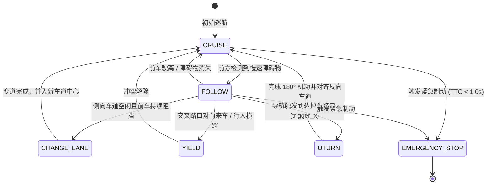

# 第 14 章：离散行为决策状态机（Behavior Planner & NOA）

> **本章导读**：
> 自动驾驶规划系统通常遵循“分层分级（Hierarchical）”架构：上层**行为决策（Behavior Decision）**负责解决离散的宏观策略问题（“现在应该跟车还是变道？是在路口让行还是执行掉头？”），下层**轨迹生成（Trajectory Generation）**负责解决连续的时空曲线拟合与动态避障。
>
> FlowEngine 设计了支持多场景模式演进的分层行为决策机（Behavior FSM），并在真实 ADAS Pipeline 中打通了 **导航驱动的 NOA 主动变道（Navigation on Autopilot）** 与 **8 状态驾驶模式仲裁**。

---

## 1. 驾驶模式分层状态机体系（NA ➔ NOA）

FlowEngine 定义了 5 个驾驶模式能级（Mode Ladder），并由仲裁器（Mode Transition Guard）根据传感器与场景就绪条件自动晋级或安全降级：

```
驾驶模式能级阶梯:
  [NA (Manual Drive)]      手控模式
          │ (条件满足: 传感器在线)
          ▼
  [ACC (Cruise Control)]   自适应巡航 (纵向控速与跟车)
          │ (条件满足: 融合定位收敛)
          ▼
  [CP (City Pilot)]        城市巡航 (车道内横向居中保持)
          │ (条件满足: 持续高车速 3s)
          ▼
  [NP (Navigation Pilot)]  高速领航 (被动避障与超车)
          │ (条件满足: 场景已加载 route 导航路径)
          ▼
  [NOA (Full Autopilot)]   全场景领航 (导航驱动的主动出入匝道与变道)
```

---

## 2. 8 状态微观行为决策机（Micro-Behavior FSM）

在任何一个高级模式（如 NP / NOA）内部，决策器实时运行 8 状态转移矩阵：



---

## 3. NOA 主动变道与安全变道校验（Safety Corridor）

与仅由前车阻挡触发的“被动超车”不同，NOA（全自动领航）由高精地图或场景 `route[]` 中的导航事件主动触发：

```c
/* modules/adas_nodes/planning_node.cpp 决策逻辑 */
void evaluate_noa_navigation(PlanningContext* ctx) {
    if (ctx->current_mode == MODE_NOA) {
        // 1. 检查当前车辆 X 坐标是否到达导航路网变道触发点
        RouteStep* step = get_active_route_step(ctx->route, ctx->ego_pose.x);
        if (step && step->target_lane != ctx->current_lane) {
            // 2. 发起安全变道评估
            if (is_lane_rear_safe(ctx, step->target_lane) && 
                !has_pedestrian_risk(ctx, step->target_lane)) {
                LOG_INFO("Planning", "NOA 导航触发主动变道: 目标车道 %d", step->target_lane);
                ctx->behavior_state = BEH_STATE_CHANGE_LANE;
                ctx->target_lane = step->target_lane;
            } else {
                LOG_WARN("Planning", "目标车道后方有高速逼近车辆，推迟变道");
            }
        }
    }
}
```

---

## 4. 后方来车安全间距模型（RSS Safety Distance）

在变道决策时，系统必须评估目标车道后方来车（Rear Vehicle）的碰撞风险，基于责任敏感安全模型（RSS）：

$$d_{\text{safe}} = v_{\text{rear}} \cdot \rho + \frac{1}{2} a_{\text{max\_acc}} \cdot \rho^2 + \frac{(v_{\text{rear}} + \rho \cdot a_{\text{max\_acc}})^2}{2 b_{\text{min\_brake}}} - \frac{v_{\text{ego}}^2}{2 b_{\text{max\_brake}}}$$

其中：
- $\rho$ 为驾驶员或系统的反应时间（通常取 $0.5 \sim 1.0\text{ s}$）；
- $b_{\text{min\_brake}}$ 为后车保守制动减速度；
- $b_{\text{max\_brake}}$ 为自车紧急制动最大减速度。

---

## 5. 工业级避坑指南

### 避坑 1：变道乒乓振荡（Lane-Changing Ping-Pong）
- **现象**：当左车道前车慢，系统切换到右车道；刚切到右车道，发现右车道也在减速，又立即切回左车道，车辆在两条车道之间频繁画龙。
- **解决方案**：引入**变道冷却定时器（Cooldown Timer）**——一旦变道完成，强制维持当前车道至少 $5.0\text{ s}$，期间禁止再次发起变道（除非紧急避障）。

### 避坑 2：状态机死锁与掉头无法回退（2026-08 Postmortem）
- 在狭窄路口掉头未完成时，如果前方突现静态障碍物，系统若直接切入 STOP 且清除了掉头状态，会导致车辆斜插在路中无法继续掉头也无法后退。
- **解决方案**：采用独立的 `ManeuverTracker` 特殊机动控制器管理复合动作，主状态机只监控机动进度，机动失败时触发倒车解脱流程。

---

*下一章预告：第 15 章将讲解轨迹生成核心——Frenet 坐标系映射与 ST 图速度规划。*
