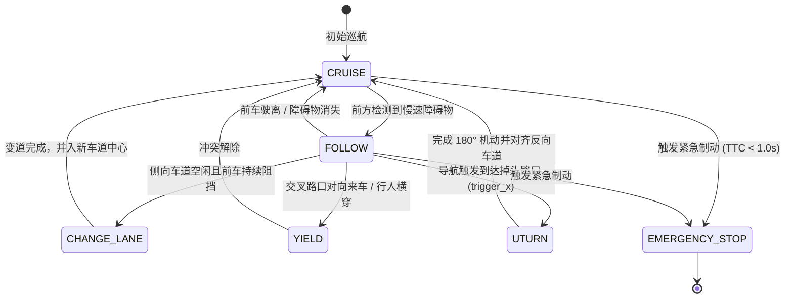

# 第 14 章：这一脚，是跟车还是变道

前面有辆车挡住你了。你脚搭在刹车上，脑子里其实同时转着两个问题——走不走，和往哪走。前者是离散的：跟车、变道、让行、掉头，选项就那么多；后者才是连续的，一旦决定变道，方向盘得画出一条平滑的曲线过去。自动驾驶把这两件事拆成上下两层，上层只管「选哪一个」，下层才管「怎么走过去」。这一章讲上层：KunAutoDrive 怎么从手控一路晋级到全场景领航，又怎么在几百毫秒里定下「现在该做哪一件」。

## 从手控到领航：驾驶模式能级

它把这些能力排成了 5 级台阶（Mode Ladder），每一级往上都得先满足一组前置条件；条件一旦不再成立，仲裁器（Mode Transition Guard）会把车安全降回下一级：

```
驾驶模式能级阶梯:
  [NA (Manual Drive)]      手控模式
          │ (条件满足: 传感器在线)
          ▼
  [ACC (Cruise Control)]   自适应巡航 (纵向控速与跟车)
          │ (条件满足: 融合定位收敛)
          ▼
  [CP (City Pilot)]        城市巡航 (车道内横向居中保持)
          │ (条件满足: 持续高车速 3s)
          ▼
  [NP (Navigation Pilot)]  高速领航 (被动避障与超车)
          │ (条件满足: 场景已加载 route 导航路径)
          ▼
  [NOA (Full Autopilot)]   全场景领航 (导航驱动的主动出入匝道与变道)
```

## 只要还在高级模式里，决策器就一直在选

车挂在 NP 或 NOA 这类高级模式里的时候，决策器其实一直在跑一个 8 状态转移矩阵，瞬时从 8 个候选行为里挑出一个作为当前动作：



## 导航说要变道，安全校验替我把关

前车挡路才动，那叫被动超车；NOA（全自动领航）不一样，它是被高精地图或场景 `route[]` 里的导航事件推着走的——导航说前面该出匝道，变道就得提前发起。可导航只负责提要求，它不管安全；真正把动作发出去之前，还得再过一道校验：

```c
/* modules/adas_nodes/planning_node.cpp 决策逻辑 */
void evaluate_noa_navigation(PlanningContext* ctx) {
    if (ctx->current_mode == MODE_NOA) {
        // 1. 检查当前车辆 X 坐标是否到达导航路网变道触发点
        RouteStep* step = get_active_route_step(ctx->route, ctx->ego_pose.x);
        if (step && step->target_lane != ctx->current_lane) {
            // 2. 发起安全变道评估
            if (is_lane_rear_safe(ctx, step->target_lane) && 
                !has_pedestrian_risk(ctx, step->target_lane)) {
                LOG_INFO("Planning", "NOA 导航触发主动变道: 目标车道 %d", step->target_lane);
                ctx->behavior_state = BEH_STATE_CHANGE_LANE;
                ctx->target_lane = step->target_lane;
            } else {
                LOG_WARN("Planning", "目标车道后方有高速逼近车辆，推迟变道");
            }
        }
    }
}
```

## 目标车道后面那辆车，离多远才算安全

决定变道的那一瞬间，最容易被漏掉的是目标车道后方那辆车，它可能正以你没察觉到的速度逼近。KunAutoDrive 用责任敏感安全模型（RSS）估这份碰撞风险，算的是后车与自车之间要留出多大的最小安全间距：

$$d_{\text{safe}} = v_{\text{rear}} \cdot \rho + \frac{1}{2} a_{\text{max\_acc}} \cdot \rho^2 + \frac{(v_{\text{rear}} + \rho \cdot a_{\text{max\_acc}})^2}{2 b_{\text{min\_brake}}} - \frac{v_{\text{ego}}^2}{2 b_{\text{max\_brake}}}$$

其中 $\rho$ 是驾驶员或系统的反应时间，一般取 $0.5 \sim 1.0\text{ s}$；$b_{\text{min\_brake}}$ 是后车保守制动减速度，$b_{\text{max\_brake}}$ 则是自车紧急制动能给出的最大减速度。

## 变道和掉头，各踩过一次坑

有一次翻回放录像，车在两条道之间来回画龙：左车道前车慢，它切到右车道；刚进去发现右车道也在减速，又想切回左。两条道半斤八两，决策就在中间反复横跳。问题出在没给变道加「冷却」——变道完成之后，本就该强制在当前车道待够 $5.0\text{ s}$ 再谈下一次，除非遇上紧急避障。补上变道冷却定时器（Cooldown Timer）之后，画龙才停下来。

另一次出在掉头上（2026-08 的事后复盘）。狭窄路口掉头做到一半，前方突然冒出静态障碍物；要是这会儿直接切进 STOP 并把掉头状态清掉，车就斜插在路中间，既掉不回去也退不了。后来给这类复合动作单开了 `ManeuverTracker` 特殊机动控制器来管掉头的全过程，主状态机只盯机动进度；机动一旦失败，就触发倒车解脱流程。
