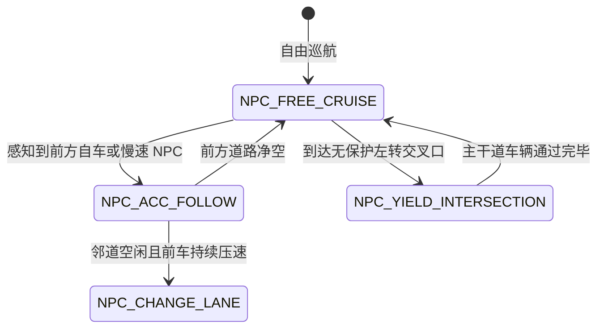

# 第 18 章：FlowSim 场景设计与路网仿真（FlowSim & OpenDRIVE）

> **本章导读**：
> 自动驾驶算法在实车上路之前，必须在仿真环境中经历数百万公里的虚拟测试。高保真度的仿真器不仅要模拟车辆动力学，还要能生成包含多车道、交叉路口、匝道汇入以及具备智能交互行为的交通流（NPC Actors）。
>
> KunAutoDrive 内置了自主研发的离散动力学轻量级仿真器 **FlowSim**。本章深入讲解 **多 Edge 路网拓扑建模、Junction 连接道、NPC 交互状态机以及与 OpenDRIVE 标准高精地图格式的转换桥接**。

---

## 1. FlowSim 场景 DSL 数据模型

KunAutoDrive 的场景由声明式 JSON 文件（如 `scenarios/city_to_highway_full.json`）定义，包含四大核心要素：

```json
{
  "ego": {
    "x": 10.0, "y": -1.75, "heading": 0.0, 
    "init_speed": 8.0, "target_speed": 13.89 
  },
  "road_network": {
    "edges": [ ... ],
    "junctions": [ ... ],
    "cross_roads": [ ... ]
  },
  "actors": [
    {
      "id": 1, "segment_id": 0, "type": "car", 
      "s": 80.0, "l": -5.25, "vx": 3.0, 
      "len": 4.6, "wid": 2.0, "behavior": "follow"
    }
  ]
}
```

---

## 2. 多 Edge 路网拓扑与主 Route 链构建

在现实道路中，道路由多条线段、圆弧与缓和曲线（Spiral）顺次连接。

```
主 Route 拓扑链 (Route Chain):
┌──────────────┐     ┌──────────────┐     ┌──────────────┐     ┌──────────────┐
│ Edge 0: 城区 │ ──► │ Edge 1: 路口 │ ──► │ Edge 2: 匝道 │ ──► │ Edge 3: 高速 │
│ (urban, 80m) │     │ (inter, 30m) │     │ (curve, 60m) │     │ (hwy, 200m)  │
└──────────────┘     └──────────────┘     └──────────────┘     └──────────────┘
```

### 2.1 端点平滑与航向连续性校验
`Route::build()` 在加载场景时，自动校验相邻 Edge 的端点几何距离 $\Delta d < 0.01\text{ m}$ 与切线航向角跳变 $\Delta \psi < 0.05\text{ rad}$。若发现曲率不连续（G1/C2 不连续），自动插入过渡三次样条曲线。

### 2.2 edge.type 语义与 3D 渲染分支绑定
在场景配置文件中，`edge.type` 决定了仿真物理引擎的摩擦力系数与前端 Three.js 的 3D 模型渲染分支：

| edge.type | 物理属性 | 渲染视图模型 (View) | 注意事项 |
| :--- | :--- | :--- | :--- |
| `highway` | 摩擦系数 $\mu=0.9$，标准高速 | RoadView 平路 Ribbon + 虚线车道 | 最通用的默认基准 |
| `urban` | 摩擦系数 $\mu=0.8$，城市道路 | RoadView + StreetlightView + 护栏 | 包含人行横道标线 |
| `viaduct_highway` | 高架路面 (z=7.0m) | ViaductView 抬高桥面 + 混凝土桥墩 | 必须显式配置 elevation_profile |
| `ramp_curve` | 缓和曲线弯道 | RoadView 弯道曲面 Ribbon | 限制最高车速 $\le 40\text{ km/h}$ |
| `cross_road` | 十字路口区域 | RoadView 交叉口多边形 | 支持配置信号灯相位 |

---

## 3. NPC 交通流交互智能（NPC AI & Behavior）

FlowSim 中的交通参与者（NPC Vehicles / Pedestrians）不仅是简单的匀速点，而是运行着轻量级行为状态机的智能体：



---

## 4. OpenDRIVE 标准高精地图双向转换桥接

为了复用工业界标准的 OpenDRIVE（`.xodr`）高精地图，KunAutoDrive 在 `modules/adas_nodes/flowsim/esmini_stub.cpp` 中实现了转换桥接层：
- 解析 OpenDRIVE 的 `<planView>` 中的 Line、Spiral、Arc 几何原语；
- 将 `<laneSection>` 的车道宽度多项式采样为 KunAutoDrive 的 `RoadNetwork::Edge`；
- 将 `<junction>` 拓扑解析为内部交叉路口拓扑矩阵。

---

## 5. 工业级避坑指南

### 避坑 1：平路场景误标 `viaduct_highway` 导致 NPC 视觉沉降
- **现象**：在前端 3D 仪表盘中，红绿灯或行人悬浮在空中或掉落到路面下方 7 米。
- **原因**：`viaduct_highway` 会强制启用高架桥抬高渲染逻辑。平路场景**严禁**标记此类型，必须使用 `highway` 或 `urban`。

### 避坑 2：Junction Connecting Road 上的 NPC 投影漂移
- 放置在非主路线（如匝道汇入支路）上的 NPC，若跨越两个 Edge 的重叠连接区，最近邻投影算法可能会将其误投影到主线上，导致 NPC 瞬移。
- **解决方案**：为支路 NPC 显式指定 `segment_id` 与局部 `s_offset`，禁止全局暴力最近邻搜索。

---

*下一章预告：第 19 章将深入探讨端到端自动驾驶学习闭环（E2E Learning Loop 与 DAgger 训练）。*
