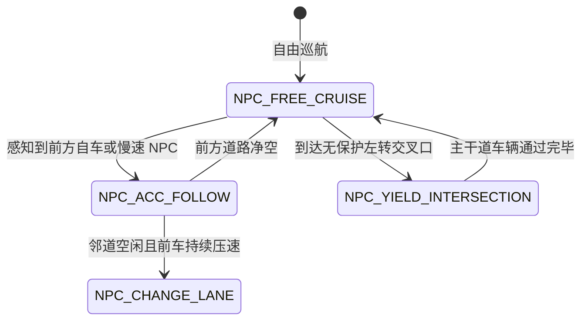

# 第 18 章：给算法造一个能反复练车的世界

算法在上真车之前，得先在仿真里跑够里程。可要造出这样一个世界并不轻松：它既要能摆出多车道、交叉路口和匝道汇入，还得让路上那些 NPC 车和人看起来像真的在开车。这一章讲 FlowSim 怎么用一份 JSON 把场景描述清楚，路网怎么从一条直线拼成完整主路线，以及它怎么和工业界的 OpenDRIVE 地图对接。

## 一个场景文件里写了什么

一份场景就是一份声明式 JSON，比如 `scenarios/city_to_highway_full.json`。自车从哪起步、路网长什么样、路上有哪些 NPC，都在这一个文件里写清楚：

```json
{
  "ego": {
    "x": 10.0, "y": -1.75, "heading": 0.0, 
    "init_speed": 8.0, "target_speed": 13.89 
  },
  "road_network": {
    "edges": [ ... ],
    "junctions": [ ... ],
    "cross_roads": [ ... ]
  },
  "actors": [
    {
      "id": 1, "segment_id": 0, "type": "car", 
      "s": 80.0, "l": -5.25, "vx": 3.0, 
      "len": 4.6, "wid": 2.0, "behavior": "follow"
    }
  ]
}
```

## 路网不是一条直线：多条 Edge 拼成主 Route

现实里的路不会一直笔直，它由好几段线段、圆弧和缓和曲线顺次接起来。

```
主 Route 拓扑链 (Route Chain):
┌──────────────┐     ┌──────────────┐     ┌──────────────┐     ┌──────────────┐
│ Edge 0: 城区 │ ──► │ Edge 1: 路口 │ ──► │ Edge 2: 匝道 │ ──► │ Edge 3: 高速 │
│ (urban, 80m) │     │ (inter, 30m) │     │ (curve, 60m) │     │ (hwy, 200m)  │
└──────────────┘     └──────────────┘     └──────────────┘     └──────────────┘
```

### 相邻路段的接缝怎么接平

加载场景时，`Route::build()` 会主动检查相邻 Edge 的端点几何距离 $\Delta d < 0.01\text{ m}$ 和切线航向角跳变 $\Delta \psi < 0.05\text{ rad}$。一旦发现曲率不连续（G1/C2 不连续），它会自动插一段过渡三次样条曲线把缝补上。

### edge.type 一变，物理和渲染都跟着变

场景配置里的 `edge.type` 不只是一个标签，它同时决定仿真物理引擎取多大的摩擦系数、以及前端 Three.js 走哪条渲染分支：

| edge.type | 物理属性 | 渲染视图模型 (View) | 注意事项 |
| :--- | :--- | :--- | :--- |
| `highway` | 摩擦系数 $\mu=0.9$，标准高速 | RoadView 平路 Ribbon + 虚线车道 | 最通用的默认基准 |
| `urban` | 摩擦系数 $\mu=0.8$，城市道路 | RoadView + StreetlightView + 护栏 | 包含人行横道标线 |
| `viaduct_highway` | 高架路面 (z=7.0m) | ViaductView 抬高桥面 + 混凝土桥墩 | 必须显式配置 elevation_profile |
| `ramp_curve` | 缓和曲线弯道 | RoadView 弯道曲面 Ribbon | 限制最高车速 $\le 40\text{ km/h}$ |
| `cross_road` | 十字路口区域 | RoadView 交叉口多边形 | 支持配置信号灯相位 |

## NPC 不是匀速滑动的点

FlowSim 里的交通参与者，不管是车还是行人，都不是匀速滑动的点，它们各自跑着一个轻量的行为状态机：



## 接住现成的 OpenDRIVE 地图

现实项目里，高精地图往往已经是 OpenDRIVE（`.xodr`）格式，为了不重造一遍，KunAutoDrive 在 `modules/adas_nodes/flowsim/esmini_stub.cpp` 里做了一层转换桥接：解析 `<planView>` 里的 Line、Spiral、Arc 几何原语，把 `<laneSection>` 的车道宽度多项式采样成自己的 `RoadNetwork::Edge`，再把 `<junction>` 拓扑翻译成内部的交叉路口拓扑矩阵。

## 两个真的踩过的坑

第一次是有人把一段平路场景标成了 `viaduct_highway`。现象是 3D 仪表盘里的红绿灯和行人要么悬在半空，要么掉到路面下方 7 米。查了一阵才反应过来，这个类型会强制走高架桥的抬高渲染逻辑，平路场景得老老实实写 `highway` 或 `urban`。

第二次出在匝道汇入的支路上。放在非主路线上的 NPC，一旦跨过两个 Edge 重叠的连接区，最近邻投影有时会把它误投到主线上，画面里就看着它瞬移。后来不再用全局暴力最近邻搜索，改成给支路 NPC 显式指定 `segment_id` 和局部 `s_offset`。
