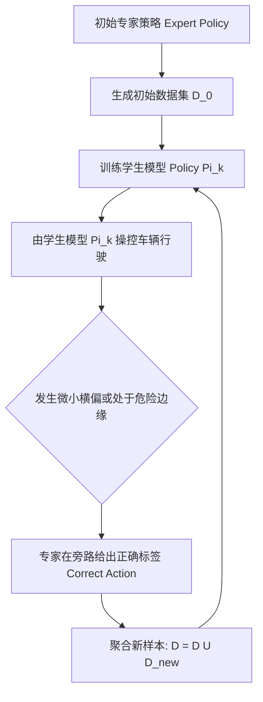

# 第 19 章：让模型学会开车，再决定敢不敢让它上路

规则写得再细，也总会被长尾场景追上：不规则的施工路障、交警临时打的手势，落到模块化流水线里就是补丁一层压一层。把模仿学习接进规控 pipeline 是这几年常见的一条出路，难的是把采数据、训模型、评模型、再上线串成一个闭环，还得保证放出去的模型不会在上车那一刻突然反向打方向盘。这章讲 KunAutoDrive 的这套端到端学习闭环是怎么搭起来的。

## 闭环长什么样：从采数据到自动上线

```
  ┌─────────────────────────────────────────────────────────────┐
  │                 1. Expert 运行与数据采集                    │
  │  scripts/demo.sh ──► data_recorder_node 落盘原始轨迹        │
  │                      (/tmp/flow_train_samples.jsonl)        │
  └──────────────────────────────┬──────────────────────────────┘
                                 │
                                 ▼
  ┌─────────────────────────────────────────────────────────────┐
  │                 2. 版本化数据集导出 (v3 特征工程)           │
  │  export_e2e_dataset.py ──► datasets/v3_highway_2026/        │
  │  (59 维特征 / 5 帧滑动窗口 = 295 维输入, 5 维控制输出)      │
  └──────────────────────────────┬──────────────────────────────┘
                                 │
                                 ▼
  ┌─────────────────────────────────────────────────────────────┐
  │                 3. 模型训练与多后端编译                     │
  │  tools/train_e2e/torch_train.py  / temporal_train.py        │
  │  产出: model.onnx + manifest.json + tiny-MLP 紧凑权重       │
  └──────────────────────────────┬──────────────────────────────┘
                                 │
                                 ▼
  ┌─────────────────────────────────────────────────────────────┐
  │                 4. 影子旁路评估与准入门禁 (Promote Gate)    │
  │  - 离线回放对比: 均方误差 MSE < 0.05, 变道准确率 > 98%      │
  │  - 在线影子模式 (Shadow Mode): 旁路推理, 统计干预差异率     │
  │  - 通过门禁: 自动部署至 C/C++ 实时 runtime (inference_node) │
  └─────────────────────────────────────────────────────────────┘
```

## 59 维特征里装了些什么

特征工程最容易含糊其辞，所以 KunAutoDrive 在 `tools/train_e2e/feature_schema.py` 里把 v3 特征体系（59 维/帧）冻死了：

| 维度区间 | 物理含义 | 关键字段举例 |
| :--- | :--- | :--- |
| **0 ~ 5 (6维)** | 自车运动学状态 | $v_x, v_y, a_x, \omega_z$, 当前横向偏移 $d$, 航向偏差 $e_\psi$ |
| **6 ~ 17 (12维)** | 感知与融合统计 | 障碍物总数、最近前车距离、最近前车速度、TTC、左/右车道占用率 |
| **18 ~ 37 (20维)** | 目标物体网格占用 | 前方 $100\text{ m}$ 范围内沿道路坐标网格的障碍物占用概率（$20$ 采样点） |
| **38 ~ 48 (11维)** | 道路参考线几何特征 | 未来 $10\text{ m}, 20\text{ m}, 30\text{ m}, 50\text{ m}, 80\text{ m}$ 处的曲率 $\kappa$ 与坡度 |
| **49 ~ 58 (10维)** | 场景全局上下文 | 导航目标车道 `route_lane`、限速值、红绿灯相位（红/黄/绿）、天气能见度 |

### 五帧滑动窗口

模型输入不是单帧，而是连续 5 帧历史特征串起来：

$$\text{Input Dim} = 59 \times 5 = 295 \text{ 维}$$

### 模型最终吐出的五个量

$$\text{Output} = [\text{throttle } (0 \sim 1), \text{ brake } (0 \sim 1), \text{ steer } (-1 \sim 1), \text{ lane\_change } (-1, 0, 1), \text{ confidence } (0 \sim 1)]$$

## 纯离线模仿会跑偏，DAgger 怎么补救

如果只用离线的专家数据训模型，会碰上一个绕不开的问题：分布偏移。模型只要在某个微小误差下偏离了专家轨迹，就会掉进训练时从没见过的状态空间（OOD），误差一路滚雪球，最后冲出车道。

KunAutoDrive 用的是 DAgger（Dataset Aggregation）迭代流水线：



## 上线前必须过的那道门

新训出来的模型 `model_v4.onnx` 想成为实车主控，得先无条件通过 `demo_evaluator.py` 的回归流水线：

```bash
# 运行一站式模型评估与门禁准入
python3 tools/train_demo_model.py \
  --eval-artifact models/v3_highway_onnx \
  --scenarios scenarios/city_to_highway_full.json,scenarios/zhongkai_road_full.json \
  --strict-promote
```

### 卡住的四条硬指标

通过之前，有四条一条都不能破：全部标准回归场景里碰撞次数必须严格为 0；车身越出车道物理边界的距离也必须为 0；规划平滑度要求加加速度方差 $\sigma_{\text{jerk}} < 1.5\text{ m/s}^3$；最后是延迟，C++ 推理节点 `inference_node.cpp` 里单帧推理必须压到 2.0 ms 以内。

## 差点让车反向打方向盘的两个 bug

第一个很隐蔽：Python 训练脚本里用的是 `math.atan2(y, x)`，而 C++ 节点里变量顺序被写反成了 `atan2(x, y)`。离线评估时 loss 小得看不出来，等实车上线，方向盘直接反着打。现在的做法是让 `msg_codegen.py` 生成一份跨语言共用的特征提取器，再用单测断言 Python 和 C++ 的输出在 $10^{-6}$ 的浮点容差内完全一致。

第二个出在输出端：网络回归连续值时，会同时吐出 `throttle = 0.6` 和 `brake = 0.5` 这种自相矛盾的组合。控制节点在下发指令前要做一次油门刹车互锁，只要 `brake > 0.05`，就把 `throttle` 强制清零。
