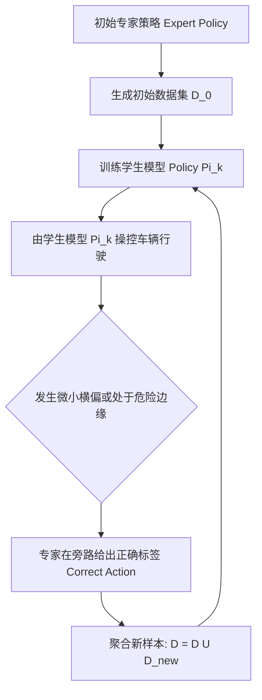

# 第 19 章：端到端学习闭环与模型准入（E2E Learning Loop & DAgger）

> **本章导读**：
> 传统的模块化自动驾驶（规则感知 ➔ 规则规划 ➔ 规则控制）在面对复杂的长尾 Corner Case（如不规则施工路障、非标交通手势）时容易陷入“补丁堆积”的维护困境。将端到端模仿学习（Imitation Learning）与强化学习（RL）引入规控 Pipeline 是当下的技术趋势。
>
> FlowEngine 构建了完整的 **端到端学习闭环（E2E Learning Loop）**：包含 **Expert 数据采集录制、v3 59 维时序特征工程、tiny-MLP / PyTorch 模型训练、数据集聚合（DAgger）、ONNX 影子旁路评估（Shadow Mode）以及严格的自动化 Promote 准入门禁**。

---

## 1. 端到端闭环架构全景

```
  ┌─────────────────────────────────────────────────────────────┐
  │                 1. Expert 运行与数据采集                    │
  │  scripts/demo.sh ──► data_recorder_node 落盘原始轨迹        │
  │                      (/tmp/flow_train_samples.jsonl)        │
  └──────────────────────────────┬──────────────────────────────┘
                                 │
                                 ▼
  ┌─────────────────────────────────────────────────────────────┐
  │                 2. 版本化数据集导出 (v3 特征工程)           │
  │  export_e2e_dataset.py ──► datasets/v3_highway_2026/        │
  │  (59 维特征 / 5 帧滑动窗口 = 295 维输入, 5 维控制输出)       │
  └──────────────────────────────┬──────────────────────────────┘
                                 │
                                 ▼
  ┌─────────────────────────────────────────────────────────────┐
  │                 3. 模型训练与多后端编译                      │
  │  tools/train_e2e/torch_train.py  / temporal_train.py        │
  │  产出: model.onnx + manifest.json + tiny-MLP 紧凑权重       │
  └──────────────────────────────┬──────────────────────────────┘
                                 │
                                 ▼
  ┌─────────────────────────────────────────────────────────────┐
  │                 4. 影子旁路评估与准入门禁 (Promote Gate)     │
  │  - 离线回放对比: 均方误差 MSE < 0.05, 变道准确率 > 98%       │
  │  - 在线影子模式 (Shadow Mode): 旁路推理, 统计干预差异率     │
  │  - 通过门禁: 自动部署至 C/C++ 实时 runtime (inference_node)│
  └─────────────────────────────────────────────────────────────┘
```

---

## 2. v3 特征工程体系规范

为了消除特征工程的模糊性，FlowEngine 在 `tools/train_e2e/feature_schema.py` 中严格冻结了 **v3 特征体系（59 维/帧）**：

| 维度区间 | 物理含义 | 关键字段举例 |
| :--- | :--- | :--- |
| **0 ~ 5 (6维)** | 自车运动学状态 | $v_x, v_y, a_x, \omega_z$, 当前横向偏移 $d$, 航向偏差 $e_\psi$ |
| **6 ~ 17 (12维)** | 感知与融合统计 | 障碍物总数、最近前车距离、最近前车速度、TTC、左/右车道占用率 |
| **18 ~ 37 (20维)** | 目标物体网格占用 | 前方 $100\text{ m}$ 范围内沿道路坐标网格的障碍物占用概率（$20$ 采样点） |
| **38 ~ 48 (11维)** | 道路参考线几何特征 | 未来 $10\text{ m}, 20\text{ m}, 30\text{ m}, 50\text{ m}, 80\text{ m}$ 处的曲率 $\kappa$ 与坡度 |
| **49 ~ 58 (10维)** | 场景全局上下文 | 导航目标车道 `route_lane`、限速值、红绿灯相位（红/黄/绿）、天气能见度 |

### 2.1 时序滑动窗口（Temporal Window）
模型输入采用连续 5 帧的历史特征串联：
$$\text{Input Dim} = 59 \times 5 = 295 \text{ 维}$$

### 2.2 控制输出空间（5 维）
$$\text{Output} = [\text{throttle } (0 \sim 1), \text{ brake } (0 \sim 1), \text{ steer } (-1 \sim 1), \text{ lane\_change } (-1, 0, 1), \text{ confidence } (0 \sim 1)]$$

---

## 3. DAgger 在线聚合对抗训练（Dataset Aggregation）

纯离线模仿学习存在**分布偏移（Distribution Shift）**的固有缺陷：模型一旦在某个微小误差下偏离专家轨迹，就会陷入未见过的状态空间（OOD），导致误差指数级累积并最终冲出车道。

FlowEngine 实现了 **DAgger（Dataset Aggregation）** 迭代流水线：



---

## 4. 自动化模型准入门禁（Promote Gate）

在将新训练的模型 `model_v4.onnx` 部署为实车主控模型之前，必须无条件通过 `demo_evaluator.py` 的回归流水线：

```bash
# 运行一站式模型评估与门禁准入
python3 tools/train_demo_model.py \
  --eval-artifact models/v3_highway_onnx \
  --scenarios scenarios/city_to_highway_full.json,scenarios/zhongkai_road_full.json \
  --strict-promote
```

### 硬性准入指标：
1. **0 碰撞（Zero Collisions）**：在全部标准回归场景中碰撞发生次数严格为 0；
2. **0 越界（Zero Road Departures）**：车身超出车道物理边界距离为 0；
3. **规划平滑度 Jerk 达标**：加加速度方差 $\sigma_{\text{jerk}} < 1.5\text{ m/s}^3$；
4. **推理延迟门禁**：在 C++ 推理节点 `inference_node.cpp` 中单帧推理耗时 $< 2.0\text{ ms}$。

---

## 5. 工业级避坑指南

### 避坑 1：特征计算在训练（Python）与推理（C++）端的微妙差异
- **血泪教训**：Python 训练脚本中使用了 `math.atan2(y, x)`，而 C++ 端节点中变量顺序误写为 `atan2(x, y)`，导致模型离线评估 loss 极小，实车上线瞬间反向打方向盘。
- **解决方案**：统一通过 `msg_codegen.py` 生成跨语言的特征提取器共享库，并由单测断言 Python 与 C++ 输出在浮点容差 $10^{-6}$ 内完全一致。

### 避坑 2：制动与油门同时输出（Pedal Conflict）
- 神经网络在回归连续值时，可能同时预测出 `throttle = 0.6` 与 `brake = 0.5`。
- **底盘仲裁规则**：控制节点在下发指令前必须执行**油门刹车互锁（Interlock）**——只要 `brake > 0.05`，强制将 `throttle` 置为 0。

---

*下一章预告：第 20 章将讲解可视化与系统内省——flowmond 守护进程与 Three.js 3D 数字孪生前端。*
