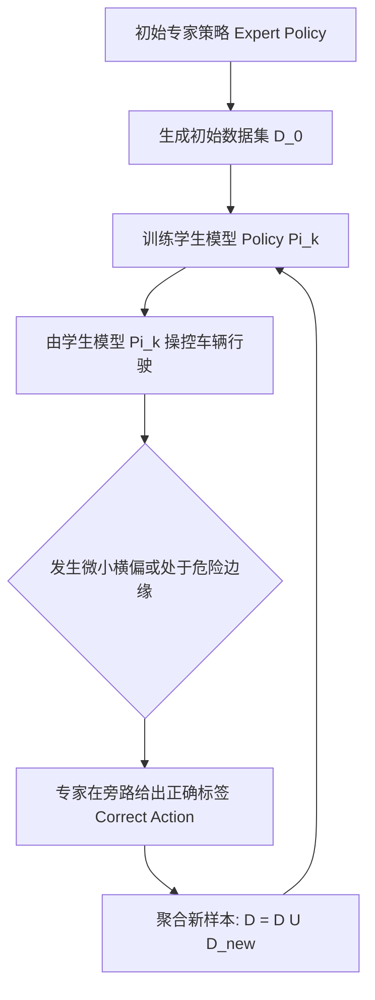

# 第 24 章：让模型学会开车，再决定敢不敢让它上路

> **v2 范式章节**（2026-09 整治后保留）。本章保留低行号密度、真技术书
> 风格，参照 `docs/book/README.md` 写作风格约束与 `docs/book/08_discovery.md`
> 范式示范。v1 行号清单版本归档于 `docs/_archive/book_v1/`。

规则写得再细，也总会被长尾场景追上：不规则的施工路障、交警临时打的手势，落到模块化流水线里就是补丁一层压一层。把模仿学习接进规控 pipeline 是这几年常见的一条出路，难的是把采数据、训模型、评模型、再上线串成一个闭环，还得保证放出去的模型不会在上车那一刻突然反向打方向盘。这章讲 KunAutoDrive 的这套端到端学习闭环是怎么搭起来的。

## 闭环长什么样：从采数据到自动上线

```
  ┌─────────────────────────────────────────────────────────────┐
  │                 1. Expert 运行与数据采集                    │
  │  scripts/demo.sh ──► data_recorder_node 落盘原始轨迹        │
  │                      (/tmp/flow_train_samples.jsonl)        │
  └──────────────────────────────┬──────────────────────────────┘
                                 │
                                 ▼
  ┌─────────────────────────────────────────────────────────────┐
  │                 2. 版本化数据集导出 (v3 特征工程)           │
  │  export_e2e_dataset.py ──► datasets/v3_highway_2026/        │
  │  (59 维特征 / 5 帧滑动窗口 = 295 维输入, 5 维控制输出)      │
  └──────────────────────────────┬──────────────────────────────┘
                                 │
                                 ▼
  ┌─────────────────────────────────────────────────────────────┐
  │                 3. 模型训练与多后端编译                     │
  │  tools/train_e2e/torch_train.py  / temporal_train.py        │
  │  产出: model.onnx + manifest.json + tiny-MLP 紧凑权重       │
  └──────────────────────────────┬──────────────────────────────┘
                                 │
                                 ▼
  ┌─────────────────────────────────────────────────────────────┐
  │                 4. 影子旁路评估与准入门禁 (Promote Gate)    │
  │  - 离线回放对比: 均方误差 MSE < 0.05, 变道准确率 > 98%      │
  │  - 在线影子模式 (Shadow Mode): 旁路推理, 统计干预差异率     │
  │  - 通过门禁: 自动部署至 C/C++ 实时 runtime (inference_node) │
  └─────────────────────────────────────────────────────────────┘
```

## 59 维特征里装了些什么

特征工程最容易含糊其辞，所以 KunAutoDrive 在 `tools/train_e2e/feature_schema.py` 里把 v3 特征体系（59 维/帧）冻死了：

| 维度区间 | 物理含义 | 关键字段举例 |
| :--- | :--- | :--- |
| **0 ~ 5 (6维)** | 自车运动学状态 | $v_x, v_y, a_x, \omega_z$, 当前横向偏移 $d$, 航向偏差 $e_\psi$ |
| **6 ~ 17 (12维)** | 感知与融合统计 | 障碍物总数、最近前车距离、最近前车速度、TTC、左/右车道占用率 |
| **18 ~ 37 (20维)** | 目标物体网格占用 | 前方 $100\text{ m}$ 范围内沿道路坐标网格的障碍物占用概率（$20$ 采样点） |
| **38 ~ 48 (11维)** | 道路参考线几何特征 | 未来 $10\text{ m}, 20\text{ m}, 30\text{ m}, 50\text{ m}, 80\text{ m}$ 处的曲率 $\kappa$ 与坡度 |
| **49 ~ 58 (10维)** | 场景全局上下文 | 导航目标车道 `route_lane`、限速值、红绿灯相位（红/黄/绿）、天气能见度 |

### 五帧滑动窗口

模型输入不是单帧，而是连续 5 帧历史特征串起来：

$$\text{Input Dim} = 59 \times 5 = 295 \text{ 维}$$

### 模型最终吐出的五个量

$$\text{Output} = [\text{throttle } (0 \sim 1), \text{ brake } (0 \sim 1), \text{ steer } (-1 \sim 1), \text{ lane\_change } (-1, 0, 1), \text{ confidence } (0 \sim 1)]$$

## 纯离线模仿会跑偏，DAgger 怎么补救

如果只用离线的专家数据训模型，会碰上一个绕不开的问题：分布偏移。模型只要在某个微小误差下偏离了专家轨迹，就会掉进训练时从没见过的状态空间（OOD），误差一路滚雪球，最后冲出车道。

KunAutoDrive 用的是 DAgger（Dataset Aggregation）迭代流水线：



## 上线前必须过的那道门

新训出来的模型 `model_v4.onnx` 想成为实车主控，得先无条件通过 `demo_evaluator.py` 的回归流水线：

```bash
# 运行一站式模型评估与门禁准入
python3 tools/train_demo_model.py \
  --eval-artifact models/v3_highway_onnx \
  --scenarios scenarios/city_to_highway_full.json,scenarios/zhongkai_road_full.json \
  --strict-promote
```

### 卡住的四条硬指标

通过之前，有四条一条都不能破：全部标准回归场景里碰撞次数必须严格为 0；车身越出车道物理边界的距离也必须为 0；规划平滑度要求加加速度方差 $\sigma_{\text{jerk}} < 1.5\text{ m/s}^3$；最后是延迟，C++ 推理节点 `inference_node.cpp` 里单帧推理必须压到 2.0 ms 以内。

## 差点让车反向打方向盘的两个 bug

第一个很隐蔽：Python 训练脚本里用的是 `math.atan2(y, x)`，而 C++ 节点里变量顺序被写反成了 `atan2(x, y)`。离线评估时 loss 小得看不出来，等实车上线，方向盘直接反着打。现在的做法是让 `msg_codegen.py` 生成一份跨语言共用的特征提取器，再用单测断言 Python 和 C++ 的输出在 $10^{-6}$ 的浮点容差内完全一致。

第二个出在输出端：网络回归连续值时，会同时吐出 `throttle = 0.6` 和 `brake = 0.5` 这种自相矛盾的组合。控制节点在下发指令前要做一次油门刹车互锁，只要 `brake > 0.05`，就把 `throttle` 强制清零。

## 影子推理：先看着，别动手

默认 pipeline 里 `inference` 进程**已经在跑**了，但它推的油门刹车不参与控制。
这是整个闭环里最重要的一条设计，也是最容易被误解的一条。

模型是学出来的，它有合理的概率**在某帧输出一个离谱值**。如果直接接管控制，
从"发现模型变差"到"车撞上"之间的反应时间只有几十毫秒——没有人能在这么短的时间里
判断该不该切换。所以影子模式让模型跑完整条数据链、记录它会做什么，但不执行。

于是你有了一个**可以慢慢看的对照**：同一条路上，规则控制器怎么走的，模型想怎么走的，
两者差多少。这个差值就是你的评估指标，也是"敢不敢让它上车"的唯一依据。

代价是影子推理白烧一份算力。这个取舍我认为是对的——**在确定性系统里，
"先观察再接管"比"直接接管再回滚"安全一个数量级**。

> 影子模式和"模型只做建议、规则做执行"是两回事。前者模型输出被完全丢弃，
> 后者模型输出进仲裁器（第 18 章）。仓库里 `inference` 节点是前者。

## 门禁为什么必须允许人工 override

第 23 章讲过"能硬失败的做成门禁"。但模型准入门禁**不能**这么做。

区别在于指标的噪声。L0 门禁检查的是"有没有写 `extern g_bus`"——零噪声，
二值答案，所以能硬失败。模型门禁检查的是"碰撞次数为 0"、"Jerk 方差 < 1.5"——
这些是**统计量**，跑同一个模型两次结果也不会完全一致（仿真里有随机性、
有调度抖动）。

对有噪声的指标设硬阈值，结果就是**门禁随机失败**。人遇到随机失败会做两件事：
要么重跑直到通过，要么加 `--force`。加 `--force` 之后门禁就废了。

所以这里的正确做法是：
- 阈值定得**宽松到能容纳正常波动**（不是刚好够通过）
- 保留人工 override 的口子，但要求填写理由
- 把每次 override 记下来，定期复盘——**这个记录比门禁本身更有价值**

> **作者立场**：一个从不被 override 的门禁，和一个总被 override 的门禁，
> 我更愿意要后者。前者可能是因为阈值定得恰好合适，也可能是因为没人认真跑。
> 后者至少诚实地告诉你"这个指标过不去"。**诚实的红灯比沉默的绿灯好。**

## 特征提取为什么是跨语言契约

那个 `atan2` 参数写反的 bug，暴露了一件更深的事：特征提取发生在**两个地方**。

训练时是 Python，回放和上车时是 C++。这两份实现必须**逐位一致**，否则模型学到的是
Python 的语义，跑起来却按 C++ 的语义推理——训练和部署之间的分布偏移，来源不是
物理世界，而是代码本身。

仓库的应对是让 `msg_codegen.py` 生成一份共享的特征提取器，再用单测断言两边在
$10^{-6}$ 容差内一致。这是正确的方向，但要注意 $10^{-6}$ 只是**浮点容差**，
不是**语义容差**：真正的风险不是最后一位不一样，而是某个字段顺序写反了
（`atan2(y,x)` vs `atan2(x,y)`），那会得到完全不同但都很"精确"的结果。

所以光有浮点容差断言不够，还需要**逐字段的语义断言**——喂一个已知输入，
检查每个特征分量的物理含义符合预期（比如"自车直行时，横向偏移特征应该接近 0"）。

> 这一条我认为是当前闭环里最薄的一环。容差测试能抓住溢出和精度退化，
> 抓不住参数顺序错误。

## 闭环真正的成本不在训练

训练一个 tiny-MLP 在 CPU 上几分钟就完事。但把一个模型从"能跑"推到"敢上车"，
下面这些才是真正花时间的地方：

| 阶段 | 占比 | 说明 |
|---|---|---|
| 采数据 | 大头 | 要跑够多的场景，且覆盖要修的边界情况 |
| 特征对齐 | 容易被低估 | Python/C++ 双实现，每次改动都要重新验证 |
| 影子评估 | 大头 | 差值指标跑出来，还要人工判断"这个差值能不能接受" |
| 门禁与上线 | 小 | 相对机械 |

**"覆盖要修的边界情况"这一条没有捷径**。DAgger 能缓解分布偏移，但它需要有人
**先想出**该去采什么场景。闭环能自动发现"模型在哪表现差"，但发现不了
"你压根没想到这类场景"。

> 这一条和第 21 章的判断一致：结构化表示 + 独立验证用于安全，端到端用于策略。
> 端到端模型吃掉的恰恰是那些"你没想到"的长尾——而这恰恰是它自己无法告诉你答案的。

## 循环之外：模型的年龄

闭环里有一个很少被显式管理的东西——**模型在车上跑了多久**。

一个模型可能在今天的表现很好，但它每天都在接收新的影子推理数据，而 OTA 通道
（第 4 步）随时可能推一个新版本上去。问题是：**推上去的模型比在线上跑的那个
更好吗？** 你怎么知道？

影子评估只能告诉你"新模型相对规则控制器的差值"，但线上跑的是**旧模型**。
新模型在离线评估里赢了 5%，不代表它在线上的实际表现更好——因为线上真实数据的
分布和仿真场景的分布不一样，而这一点你在离线评估里测不到。

要拿到这个答案，唯一的办法是**让两个模型同时跑影子，比它们俩**，
而不是都跟规则控制器比。这是一个"模型的 A/B"问题，而当前闭环里
模型的 A/B 和模型的验证是同一个动作。

> **我不确定这里的做法是对的**。我倾向于认为规则控制器应该被视为"影子"而不是
> "真理"——它自己也会犯错（跟着前车一直跟到堵死），模型可能在某些场景真的比它好。
> 但只要规则控制器还掌握着安全否决权（第 18 章），"跟规则比"就是安全的默认。

## 停止条件：什么时候该放弃模仿学习

这一章通篇在讲怎么把模仿学习做通，但有个反向的问题更值得回答：
**什么时候该承认这条路走不通？**

我认为有三个信号，出现任意一个就该停下来重新想：

**一、模型学不会"规则也做错"的场景。** 模仿学习的定义决定了它只能学会专家的行为。
专家做错的地方（比如反应过度保守），模型会忠实复制这些错误。你可以用 DAgger
让专家在模型的状态上纠正——但那要求专家比模型强，而在一个模块化流水线里，
"专家"就是那堆规则，你的专家的上限就是规则的上限。

**二、需要的数据量超出你的采集能力。** 长尾场景要靠采集补，而"你没想到的场景"
永远采不全。数据需求是无底洞，而仿真场景的编写是有成本的。

**三、无法解释模型为什么这么做。** 这不是纯工程顾虑，是安全工程的基本要求。
如果模型在某个场景输出的动作你无法归因，那么当它在真实路上出现你没见过这种行为时，
你**没有手段判断它是否危险**。规则系统可以论证，神经网络通常不行。

> 这三条不是"别用神经网络"，是"别把它放在没有护栏的位置"。
> 当前仓库的架构——模型做影子或建议，规则掌握否决权——本质上是
> **在承认这些信号可能同时成立的前提下做的防御**。

## 回滚：闭环里最该先设计的事

最后一个工程细节，而且是最容易被放到最后做的。

模型上线后要能回滚。回滚的难点从来不是"把旧文件拷回去"——OTA 机制能做。
难点是**你怎么知道要回滚**，以及**回滚期间的模型输出从哪来**。

前者需要在线的模型质量监控，而这一层目前是缺的：影子模式记录了差值，
但没有人定义"差值涨到多少触发告警"。上面那个"模型的年龄"问题也属于这一类。

后者的答案在当前架构里已经有了——**规则控制器一直在跑**。模型失效时，
仲裁层（第 18 章）降级到规则。这是一个很舒服的性质：**你的兜底方案不是临时
加的，它一直在那里**。

代价是你必须接受"两条控制路径长期并存"带来的复杂度：两份代码要同步演进、
两个状态空间要对齐、调试时不知道是哪一条在控制。而这条复杂度，是设计时
就该认下来的账，不是上线后才发现的。

---

**相关章节**：[第 18 章 安全包络与降级](18_safety_envelope.md)（仲裁规则在这层挡着，
也是回滚的落点）· [第 23 章 验证关卡](23_demo_evaluator.md)（门禁的统计噪声问题
在那里展开）· [第 12 章 Bag 录制](12_bag_recording.md)（采数据的落地形式）·
[第 21 章 VLA 与世界模型](21_vla_world_model_frontier.md)（行业在这条路上走到哪了）
