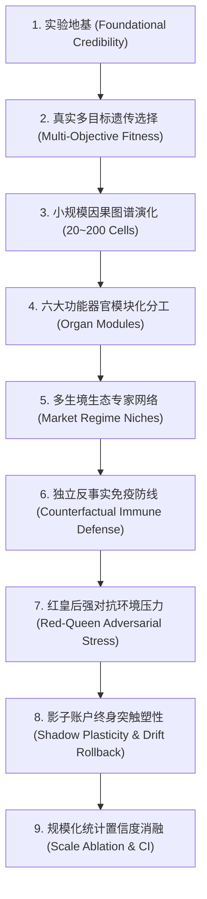

# 量化交易形态发生计算生命体演化路线图规范 (Quantitative Cellular Evolution Roadmap)

> **最高指导哲学**：
> 量化交易生命体的进化目标不是“赚得最多”，而是“在真实交易摩擦、制度约束与市场分布漂移下保持高韧性存活，且每一个收益驱动与风险规避行为都具备严格的因果可追溯性”。
> 演化进阶总路径：**先可信 $\to$ 再有效 $\to$ 后复杂 $\to$ 最后扩规模**。

---

## 1. 演化进阶九大里程碑体系 (The 9 Evolutionary Milestones)

---

### 里程碑 1：可信实验地基 (Foundational Credibility First)
* **数据链严格后复权**：采用整段累计后复权（Cumulative Backward Ratio Adjustment），消除换月断点跳空；
* **交易执行契约**：$T$ 日收盘计算特征 $\to T+1$ 日以【开盘价 + 方向性不利滑点】撮合成交；
* **逐笔 FIFO Lot 记账**：增仓保留独立进场成本，减仓先进先出结算已实现盈亏，严禁抹除浮动盈亏；
* **组合级保证金硬风控**：$\sum \text{Margin}_{\text{used}} \le \text{Total Equity} \times 85\%$；
* **期末强制清盘结算**：回测结束日强制市价平仓清盘，净值口径 100% 对应已实现提取现金。

---

### 里程碑 2：真实多目标遗传选择 (Multi-Objective Evolutionary Selection)
* **样本隔离**：严格固定 2005~2015 为样本内（In-Sample）演化训练集，2016~2026 样本外仅允许冻结单次只读评估；
* **多目标适应度函数（Multi-Objective Fitness）**：
  $$\mathcal{F}(G) = w_1 \cdot \text{Sortino} + w_2 \cdot \text{Calmar} - w_3 \cdot \text{MaxDD} - w_4 \cdot \text{Turnover} - w_5 \cdot \text{CVaR}_{95\%} - w_6 \cdot \text{CostRatio}$$
* 严禁单以净利润为适应度目标，强制惩罚高换手摩擦、长尾回撤与极端下行尾部风险。

---

### 里程碑 3：小规模因果图谱先行 (20 ~ 200 Cells Interpretable Graph)
* 拒绝直接引入百万无监督随机 Reservoir；
* 先在 **20 ~ 200 个可解释功能细胞** 上验证：
  1. 结构突变（Mitosis / Rewiring / Apoptosis）相较于双 EMA、纯随机图及买入持有策略具备可测量的统计显著超额（$p < 0.01$）；
  2. 满足因果承重硬门禁：敲除演化产生的新增关键节点必导致性能劣化（Deficit $> 0$）。

---

### 里程碑 4：功能器官模块化分工 (Organ-Level Modular Encoding)
将细胞图谱划分为六大正交功能器官：
1. **感知器官 (Sensory Column)**：多周期价格动量、微观盘口价差与订单流不平衡度；
2. **状态记忆器官 (Working Memory Column)**：长短期动力学极限环与非线性衰减积分器；
3. **趋势器官 (Trend Column)**：多频带 EMA 剪刀差与方向性强度计算；
4. **波动器官 (Volatility Column)**：ATR 真实波幅、Garman-Klass 高频波动率测定；
5. **执行器官 (Execution Column)**：施密特双阈值迟滞（Schmitt Hysteresis）与开平仓比例映射；
6. **风险器官 (Risk/Immune Column)**：肥尾偏度检测、闪崩熔断与仓位硬压制。
* **图契约保证**：风险器官的输出到终末执行器的有向路径必须在拓扑上**永久连通、不可被变异算法绕过**。

---

### 里程碑 5：多生境生态专家网络 (Market Regime Niches)
* 避免单张网络在所有市场环境中“硬拟合”；
* 构建 4 大宏观生境分工：
  * **单边大牛熊生境 (Trend Niche)**：追求高盈亏比长线持仓；
  * **窄幅震荡生境 (Oscillation Niche)**：施密特高迟滞过滤，严格防摩擦空仓；
  * **高波流动性枯竭生境 (Crisis Niche)**：硬锁闸与低仓位防守；
  * **结构分化生境 (Cross-Section Niche)**：截面强弱对冲；
* 由低频宏观状态机细胞（Regime Router）动态调配各器官子网络的激活权重。

---

### 里程碑 6：独立反事实免疫防线 (Counterfactual Immune Defense)
* **独立性原则**：免疫风险层的适应度与收益生成层完全解耦，严禁通过追求高收益诱导关闭免疫锁闸；
* **反事实对账指标**：
  * 记录每次免疫触发时的：`[持仓状态, 预期损失, 实际避免损失, 反事实假设对照收益]`；
  * 只有在触发后市场确实发生非线性下挫时，才计为“有效免疫拦截”。

---

### 里程碑 7：红皇后强对抗环境压力 (Red-Queen Adversarial Stress)
* 在代际演化中注入环境红皇后对抗算子：
  1. **摩擦倍增**：随机将手续费和滑点上调至 $2\times \sim 3\times$；
  2. **时钟抖动**：注入随机 $1\sim 2$ 根 Bar 的执行延迟与缺 Bar 扰动；
  3. **极端肥尾**：在训练集中人工插入历史极值闪崩与跳空序列；
* 只有在多重对抗压力集下仍能保持正向 Calmar 的个体，才具备晋级 Elite 的资格。

---

### 里程碑 8：影子账户终身突触塑性 (Shadow Account Lifelong Plasticity)
* **工作态与发育态严格隔离**：
  * 实盘执行图拓扑完全冻结（Zero-GC / 零在线拓扑改写）；
  * 在影子账户（Shadow Account）中允许 Hebbian 突触权重的缓慢塑性微调；
* **安全沙盒机制**：
  * 设定权重变化预算（$\Delta W \le \epsilon$）；
  * 部署分布漂移检测器与自动回滚断点，严禁在线学习改写核心风控路径。

---

### 里程碑 9：规模化统计置信度消融 (Scale Ablation & CI Verification)
* 只有在上述 1~8 阶段全部打通后，才逐步推进规模阶梯消融：
  $$\text{Scale Tiers: } 20 \text{ Cells} \to 200 \text{ Cells} \to 2,000 \text{ Cells} \to 20,000 \text{ Cells} \to 1,000,000 \text{ Cells}$$
* **统计显著性判定**：
  * 规模提升必须伴随样本外指标（Sortino / Calmar / CVaR / 胜率）的统计置信区间改善（Bootstrap 检验 $p < 0.05$）；
  * 若仅有显存占用与算力吞吐的增加而无风险调整收益提升，严格归类为“高并发算力微基准”，不归类为“智能涌现”。

---

## 2. 核心架构契约与代码落地对照表

| 规范模块 | 核心文件位置 | 状态与落实动作 |
| :--- | :--- | :--- |
| **可信回测与 FIFO 记账** | `tools/run_rigorous_institutional_backtest.cpp` | ✅ 已实装并推送到 main |
| **CI 自动化 30 年防回归门禁** | `tests/test_quant_historical_gate.cpp` | ✅ 已实装并推送到 main |
| **GPU 张量化 Reservoir 基准** | `tools/run_rigorous_million_quant_backtest.py` | ✅ 已实装并推送到 main (59MB Checkpoint) |
| **多器官模块化图谱基因组** | `kun_quant/include/kun/cellular/cellular_genome.hpp` | 🔄 规划按六大器官重构 |
| **多生境专家生态系统** | `kun_quant/include/kun/cellular/ecosystem_biosphere.hpp` | 🔄 规划接入市场 Regime 路由器 |
| **学术论文依据规范** | `docs/morphogenetic_cellular_evolution_paper.*` | ✅ 已完成双语对齐与实证数据固化 |
